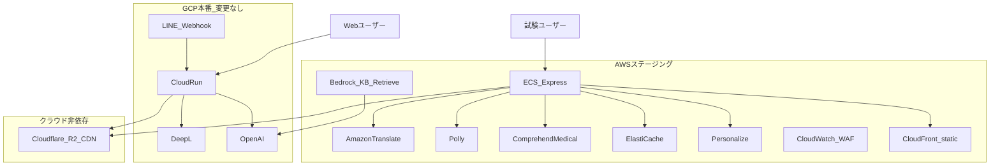
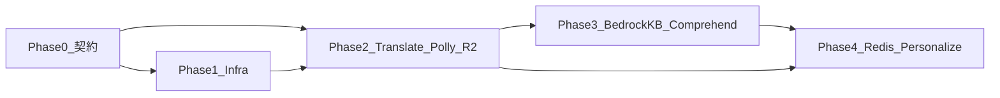

# AWS / Cloudflare 一括改善計画

## 基本方針

| 原則 | 内容 |
|------|------|
| GCP 本番 | [cloudbuild.yaml](cloudbuild.yaml) / Cloud Run は **env 未設定 = 現状維持**（DeepL / OpenAI / Web Speech API） |
| LINE | GCP 上のまま。**LINE 専用 AWS 改修は行わない**（画像 URL 差し替えのみ Cloudflare 共通 URL） |
| AWS 試験 | [docs/ops/AWS_CODEPIPELINE.md](docs/ops/AWS_CODEPIPELINE.md) の ECS Express のみユーザー向け AWS 機能を ON |
| 画像 | **Rekognition は採用しない**。Cloudflare R2 + CDN（アカウントあり・カスタムドメイン可） |
| Bedrock | **A案**: KB Retrieve のみ + 既存 OpenAI 生成（[concierge_llm.py](src/services/concierge_llm.py)） |
| 期限 | フェーズ順のみ（期限なし） |

### 環境分離パターン（GCP 影響ゼロの要）

新規フラグは **すべて default=OFF / default=legacy**。AWS ECS タスク定義と [scripts/setup-aws-ecs-secrets.sh](scripts/setup-aws-ecs-secrets.sh) にのみ設定する。

```python
# 新規 config/aws_features.py（案）
TRANSLATION_PROVIDER=deepl          # aws のみ translate
CONCIERGE_RAG_PROVIDER=local        # aws のみ bedrock_kb
TTS_PROVIDER=webspeech              # aws のみ polly
COMPREHEND_MEDICAL_ENABLED=false    # aws のみ true
REDIS_URL=                          # aws のみ ElastiCache URL
MEDICINE_IMAGE_CDN_BASE=https://images.yutok.dev/otc/  # 両環境共通（Cloudflare・設定済みインフラ）
PERSONALIZE_CAMPAIGN_ARN=           # aws Phase 4
```

GCP Cloud Run に上記を **一切追加しない** ことで本番挙動を固定する。

---

## インフラ進捗（2026-07-23 更新）

### Cloudflare R2 — インフラ完了（ACTIVE 確認済み）

| 項目 | 値 / 状態 |
|------|-----------|
| バケット名 | `medicine-recommend-otc-images` |
| リージョン | Asia-Pacific (APAC) |
| Custom Domain | `https://images.yutok.dev` — **Active**（Access: Enabled, TLS 1.0+） |
| 公開 URL 規則 | `https://images.yutok.dev/otc/{jan_or_slug}.webp` |
| S3 API（アップロード用・ユーザー向け不可） | `https://2a1ac0678cd0b207ca4fa5681a9a0690.r2.cloudflarestorage.com/medicine-recommend-otc-images` |
| Public Development URL | Disabled（Custom Domain 使用のため不要） |

**検証（2026-07-23）**

```bash
curl -sI https://images.yutok.dev/
# → HTTP/1.1 404, Server: cloudflare, CF-RAY: ...-NRT（TLS・CDN 正常、バケット空）

curl -sI https://images.yutok.dev/otc/test.webp
# → HTTP/1.1 404, cf-cache-status: MISS（オブジェクト未アップロード — インフラは OK）
```

**残タスク（Phase 2c）**

1. R2 **CORS Policy** — ダッシュボード設定済み想定（未設定なら [CLOUDFLARE_R2_IMAGES.md](../docs/ops/CLOUDFLARE_R2_IMAGES.md)）
2. テスト画像 — **200 確認済み**（`otc/test.png`, `otc/test.webp`）
3. env `MEDICINE_IMAGE_CDN_BASE` — **ローカル .env / ECS 対応済み**
4. アプリ URL 解決 — **コード対応済み** + カード `onerror` プレースホルダー

### AWS — ステージング進捗（2026-07-23 18:00 JST 更新）

| 項目 | 状態 |
|------|------|
| ECS Express | ACTIVE（デプロイ commit: `28485df` — **AWS 機能コード未含有**） |
| **Secrets Manager** | 7 件 `primaryContainer.secrets` 移行済み |
| CloudWatch Logs | `/ecs/medicine-recommend` + awslogs |
| **WAF** | ALB アタッチ済み |
| **CloudFront** | Deployed / static CSS **200** |
| **STATIC_CDN_BASE_URL** | ECS 反映済み |
| S3 static / KB ソース | **再同期済み**（2026-07-23） |
| ElastiCache Serverless | available + REDIS_URL 反映済み |
| Personalize | tracker ACTIVE / **campaign 未作成**（イベント蓄積待ち） |
| **Bedrock KB** | KB `4PEWLBZGTH` ACTIVE / data source `IPDLE0HKNM` |
| **Bedrock ingestion** | **🛑 Titan Embed 429 — クォータ未 provisioning** |
| Phase 2 env | translate / polly / MEDICINE_IMAGE_CDN_BASE 済 |
| Phase 3 env | bedrock_kb / BEDROCK_KB_ID / COMPREHEND 済（ECS 再反映 2026-07-23） |

#### Bedrock クォータ（Step 1 セルフサービス — 実施済み）

| QuotaCode | 内容 | 申請値 | ステータス |
|-----------|------|--------|-----------|
| L-8EA73537 | Claude Sonnet 4.5 cross-region TPM | 1,000,000 | **CASE_OPENED**（ユーザー申請） |
| L-CCA5DF70 | Claude Haiku 4.5 cross-region RPM | 10,000 | **CASE_OPENED**（本セッション追加） |

Titan Embed v2 on-demand → Service Quotas に**エントリなし**（Support または JST 09:00 以降の自然 provisioning 待ち）

#### 🛑 停止中（外部依存）

| ブロッカー | 影響 | 次アクション |
|-----------|------|-------------|
| Titan Embed 429 | KB ingestion / RAG 空 | 明日 JST 09:00 再テスト → ダメなら Support |
| **GitHub 未 push** | ECS が `bedrock_kb_retrieve.py` 等を**未実行** | main push → CodePipeline |
| Quota CASE_OPENED | Claude 生成 LLM 未使用可能 | AWS 承認待ち |
| Personalize データ不足 | rerank 不可（tracking のみ） | ステージング利用で蓄積 |

#### ✅ ローカル完了（未デプロイ）

- AWS 関連 pytest **30 passed**
- スクリプト: express-secrets, bedrock KB, cloudfront, waf, elasticache, personalize, quota docs
- GCP 本番 `/health` OK / R2 test.webp **200**

---

## 全体アーキテクチャ



---

## Phase 0: 契約・ドキュメント・基盤（全フェーズの前提）

**目的**: 以降の実装が GCP を触らずに進むための SSOT を作る。

### タスク

1. **機能フラグ SSOT** — [config/aws_features.py](config/aws_features.py) を新規作成（`config/llm_flags.py` と同様の `_flag()` パターン）
2. **env 契約** — [.env.example](.env.example) に AWS/Cloudflare 変数を追加（コメントで「GCP 本番では未設定」と明記）
3. **ドキュメント更新**
   - [docs/medicine.md](docs/medicine.md): ECS=ステージング表記修正、Rekognition 削除、Cloudflare R2 追加、本計画へのリンク
   - 新規 [docs/ops/AWS_FEATURES_ROLLOUT.md](docs/ops/AWS_FEATURES_ROLLOUT.md): フェーズ・env 一覧・ロールバック手順
   - 新規 [docs/ops/CLOUDFLARE_R2_IMAGES.md](docs/ops/CLOUDFLARE_R2_IMAGES.md): R2 バケット・CDN ドメイン・アップロード手順
4. **依存関係** — [requirements-prod.txt](requirements-prod.txt) に `boto3`, `redis`（ElastiCache 用）を追加
5. **Secrets 拡張** — [scripts/setup-aws-ecs-secrets.sh](scripts/setup-aws-ecs-secrets.sh) を拡張し、Translate / Bedrock / Polly / Comprehend / Redis / Personalize 用シークレットと env を ECS タスク定義へ注入

### 完了条件

- GCP デプロイ設定（Cloud Build / Cloud Run env）に **新 env が 0 件**
- `pytest` 全通過（default=OFF のため既存テスト無変更）

---

## Phase 1: インフラ安定化（Secrets / CloudWatch / WAF / CloudFront）

**ユーザー効果**: 間接（安定・高速なステージング）。GCP 影響なし。

| サービス | 作業 |
|----------|------|
| **Secrets Manager** | 既存 4 キーに加え AWS 機能用キーを prefix `medicine-recommend/aws-staging/*` で追加 |
| **CloudWatch Logs** | ECS タスク定義で log driver 明示、Log Group `/ecs/medicine-recommend`、保持 30 日 |
| **CloudWatch Alarms** | `/health` 5xx、ECS CPU > 80%、Pipeline 失敗 |
| **AWS WAF** | ALB に Web ACL アタッチ（Rate limit + AWSManagedRulesCommonRuleSet）。新規 [scripts/setup-aws-waf.sh](scripts/setup-aws-waf.sh) |
| **CloudFront** | `static/` を S3 オリジン + CloudFront（または ALB パス `/static/*`）。env `STATIC_CDN_BASE_URL` を AWS のみ設定 |

### アプリ改修（小）

- [main.py](main.py): `STATIC_CDN_BASE_URL` が設定時、Jinja テンプレートへ `cdn_base` を渡す（未設定時は従来 `/static`）
- [templates/](templates/) 内の static 参照を `cdn_base` 対応（AWS ステージングのみ効く）

### 完了条件

- `curl https://aws.medicine.yutok.dev/health` → 200
- WAF 有効化後も正常トラフィック通過
- GCP `medicine.yutok.dev` の `/health` 変化なし

---

## Phase 2: ユーザー向け Web 改善（Translate / Polly / Cloudflare 画像）

**対象**: AWS Web のみ（`aws.medicine.yutok.dev`）。LINE・GCP 本番は触らない。

### 2a. Amazon Translate（GCP=DeepL 維持）

**改修箇所**: [src/core/translation_service.py](src/core/translation_service.py)（主経路）、必要なら [src/services/translation_wrapper.py](src/services/translation_wrapper.py) を統合

```
translate_medicine_recommendation()
  if TRANSLATION_PROVIDER == "translate":  # AWS only
    → boto3 translate_text (HTML tag 保持は post-process)
  else:
    → 既存 DeepL（現状のまま）
```

- キャッシュ: 既存メモリ LRU を維持（Phase 3 で Redis へ移行）
- ログ: 既存 `log_translation_detail` に `provider=deepl|translate` を追加
- テスト: [tests/](tests/) に provider モックの unit test 追加

### 2b. Amazon Polly（TTS）

**改修箇所**:

- 新規 [src/services/polly_tts.py](src/services/polly_tts.py) + [main.py](main.py) `POST /api/tts`（`TTS_PROVIDER=polly` 時のみ有効、否则 404）
- [static/js/main.js](static/js/main.js): `window.__TTS_PROVIDER__`（テンプレート注入）で Polly API / Web Speech API を分岐
- [static/js/ui/tts_builder.js](static/js/ui/tts_builder.js): 変更なし（テキスト組み立て再利用）

Polly パラメータ: Neural 日本語 ` Mizuki` / 英 `Joanna` 等、既存言語 4 対応。

### 2c. Cloudflare R2 + CDN（医薬品画像・GCP/AWS 共通）

**インフラ** — **完了（2026-07-23）**（詳細は「インフラ進捗」セクション）:

- [x] R2 バケット `medicine-recommend-otc-images`（APAC）
- [x] Custom Domain `images.yutok.dev` — Active
- [ ] CORS Policy（Web チャット用）
- [ ] テストオブジェクト `otc/test.webp` アップロード
- [ ] [docs/ops/CLOUDFLARE_R2_IMAGES.md](docs/ops/CLOUDFLARE_R2_IMAGES.md) 作成（Phase 0）

**アプリ改修**（未着手）:

- env `MEDICINE_IMAGE_CDN_BASE` — **GCP 本番にも設定可**（クラウド非依存のため GCP 影響は「画像が表示される」_positive のみ）
- [static/js/ui/medicine_mapper.js](static/js/ui/medicine_mapper.js): `resolveImageUrl()` で CDN base + product id
- [src/handlers/line/flex_messages.py](src/handlers/line/flex_messages.py): `resolve_medicine_hero_url()` — `image_url` 未設定時 CDN パターンで解決（**URL 文字列のみ**、LINE ロジック変更最小）
- データ: OTC CSV / 推奨 payload に `product_image_url` または JAN から CDN URL 生成ルールを [src/services/recommendation_client_payload.py](src/services/recommendation_client_payload.py) で統一

**Rekognition**: 本計画では **採用しない**（配信は R2、OCR が将来必要なら Textract を別 issue）。

### 完了条件

- AWS ステージング: 英語 UI で Translate 経由の応答、Polly 読み上げ動作
- GCP 本番: DeepL + Web Speech API のまま
- 両環境: R2 URL 付き OTC カードでプレースホルダー以外の画像表示
- CDN: `curl -sI https://images.yutok.dev/otc/{id}.webp` → **200**（現状 404 はオブジェクト未配置のみ）

---

## Phase 3: AI 拡張（Bedrock KB RAG + Comprehend Medical）

### 3a. Bedrock Knowledge Bases（RAG のみ）

**インフラ**:

- S3 バケット `medicine-recommend-kb-source`
- 同期対象:
  - [docs/concierge/](docs/concierge/) / [docs/public/](docs/public/)（Concierge 用 md）
  - [src/content/concierge_knowledge.ja.json](src/content/concierge_knowledge.ja.json)（JSON も ingest）
- Bedrock KB + OpenSearch Serverless（または S3 Vectors）データソース
- 新規 [scripts/sync-concierge-kb-to-s3.sh](scripts/sync-concierge-kb.sh) + CodePipeline post_build hook または EventBridge 週次同期

**アプリ改修**（中規模・Concierge 限定）:

- 新規 [src/services/bedrock_kb_retrieve.py](src/services/bedrock_kb_retrieve.py): `retrieve(query, top_k)` → chunks + sources
- [src/agents/concierge_agent.py](src/agents/concierge_agent.py) または [src/services/concierge_llm.py](src/services/concierge_llm.py): `CONCIERGE_RAG_PROVIDER=bedrock_kb` 時、system prompt に retrieved context を注入（**OpenAI 生成は維持**）
- 既存 [src/content/concierge_docs.py](src/content/concierge_docs.py) の intent→doc 直読みは **フォールバック**として残す（KB 障害時）
- ログ: `kb_retrieve_ms`, `chunk_count`, `source_uris` を structured log へ

**監視**（Bedrock 全体置換より軽量）:

- CloudWatch: Bedrock Retrieve エラー率、レイテンシ P95
- Alarm: KB ingestion job FAILED
- **不要**: モデル token コスト（生成は OpenAI の既存 [budget_guard.py](src/services/budget_guard.py)）

**OpenAI 大規模置換は行わない** — [llm_client.py](src/core/llm_client.py) は Phase 3 では触らない。

### 3b. Amazon Comprehend Medical

**用途 1 — AWS Web 症状 NLU 補助**（LINE 経路除外）:

- 新規 [src/services/comprehend_medical.py](src/services/comprehend_medical.py)
- [src/core/nlu_service.py](src/core/nlu_service.py) または Physical 推奨前: `COMPREHEND_MEDICAL_ENABLED=true` かつ **Web セッションのみ**（`session_id` が `line:` で始まらない）で entity 抽出結果をルール NLU へマージ
- 低 confidence 時は既存ルールのみ（安全側）

**用途 2 — ログ分析**:

- 新規 [scripts/analyze_comprehend_logs.py](scripts/analyze_comprehend_logs.py): S3 / CloudWatch エクスポート jsonl から症状エンティティ集計
- [docs/ops/](docs/ops/) に GCP ログ分析スキルと並ぶ Runbook を記載

### 完了条件

- AWS: 「Cloud Run とは？」等の Concierge 質問で KB 引用付き回答
- AWS: Web 症状入力で Comprehend ログが出力
- GCP / LINE: 挙動変化なし

---

## Phase 4: スケール・パーソナライズ（ElastiCache / Personalize）

### 4a. ElastiCache (Redis)

**用途**（LINE 去重は対象外 — [line_dedup.py](src/handlers/line/line_dedup.py) は GCP/LINE 側のまま）:

- Translate 結果キャッシュ（プロセス跨ぎ）
- Bedrock KB retrieve 結果キャッシュ（query hash, TTL 10分）
- 一般セッション read-through（Optional、Neon 負荷軽減）

**改修**:

- 新規 [src/services/redis_cache.py](src/services/redis_cache.py): `REDIS_URL` 未設定時は no-op（GCP デフォルト）
- [src/core/translation_service.py](src/core/translation_service.py): キャッシュ backend 抽象化

**インフラ**: ElastiCache Serverless または `cache.t4g.micro`（VPC + ECS セキュリティグループ）

### 4b. Amazon Personalize

**現実的スコープ**（β データ少を考慮し最小構成）:

- **ユースケース**: OTC 候補の**表示順**最適化（ルールスコアは維持、順序のみ Personalize rerank）
- **イベント設計**:
  - `user_id` = 匿名 session hash
  - `item_id` = OTC product id
  - events: `view`, `select`（カードクリック）、`recommend`（表示）
- 新規 [src/services/personalize_ranker.py](src/services/personalize_ranker.py): `PERSONALIZE_CAMPAIGN_ARN` 設定時のみ rerank
- フック: [src/services/recommendation_client_payload.py](src/services/recommendation_client_payload.py) で top-N 確定後に順序入替
- **Web AWS のみ**（LINE 除外）

**データ要件**: 最低数百イベント必要 → ステージングでイベント蓄積期間を Runbook に明記。冷スタート時はルール順フォールバック。

### 完了条件

- AWS: Redis 有効時 Translate 2 回目が高速化
- AWS: Personalize キャンペーン ACTIVE 後、同一入力で順序が学習データに応じて変化（A/B ログで確認）
- GCP: Redis / Personalize 未使用

---

## テスト・検証戦略

| 層 | 内容 |
|----|------|
| Unit | `config/aws_features.py`、Translate provider 切替、KB retrieve モック、Polly API モック |
| Contract | Concierge intent + RAG 注入後も [tests/concierge/](tests/concierge/) スナップショット互換 |
| Integration | 既存 [.cursor/skills/local-v2-chat-test/](.cursor/skills/local-v2-chat-test/) を **AWS env ファイル**で別実行 |
| Manual | AWS ステージング checklist（Translate / Polly / KB / 画像 / WAF） |
| GCP 回帰 | Cloud Run dev へデプロイ後、DeepL・LINE webhook smoke（env 未設定確認） |

---

## ロールバック

各機能は env 1 行で OFF:

```
TRANSLATION_PROVIDER=deepl
CONCIERGE_RAG_PROVIDER=local
TTS_PROVIDER=webspeech
COMPREHEND_MEDICAL_ENABLED=false
REDIS_URL=
PERSONALIZE_CAMPAIGN_ARN=
```

→ ECS タスク定義更新 + `force-new-deployment`（[scripts/tune-aws-ecs-performance.sh](scripts/tune-aws-ecs-performance.sh) パターン）。

---

## フェーズ依存関係



Phase 2 の Cloudflare R2 **インフラ**は Phase 0/1 と並行して **完了**。アプリ連携（CORS・env・コード）は Phase 0 完了後に着手。GCP 本番にも `MEDICINE_IMAGE_CDN_BASE` 設定可。

---

## 主要ファイル一覧（新規・変更）

| 種別 | パス |
|------|------|
| 新規 | `config/aws_features.py`, `src/services/bedrock_kb_retrieve.py`, `src/services/polly_tts.py`, `src/services/comprehend_medical.py`, `src/services/redis_cache.py`, `src/services/personalize_ranker.py` |
| 変更 | `src/core/translation_service.py`, `src/agents/concierge_agent.py`, `src/core/nlu_service.py`, `static/js/main.js`, `static/js/ui/medicine_mapper.js`, `scripts/setup-aws-ecs-secrets.sh`, `.env.example`, `docs/medicine.md` |
| 新規 ops | `docs/ops/AWS_FEATURES_ROLLOUT.md`, `docs/ops/CLOUDFLARE_R2_IMAGES.md`, `scripts/setup-aws-waf.sh`, `scripts/sync-concierge-kb-to-s3.sh` |

---

## リスクと mitigations

| リスク | 対策 |
|--------|------|
| GCP へ env 漏洩 | Cloud Build / Cloud Run 設定レビュー checklist（Phase 0） |
| Bedrock KB コスト | Retrieve のみ + top_k 制限 + Redis キャッシュ |
| Personalize データ不足 | ルール順フォールバック + ステージング限定 |
| 企業 AWS 貸与終了 | ユーザー向け資産（画像）は Cloudflare、AWS 機能はステージング限定で移植容易 |
| Comprehend 誤抽出 | Web のみ・低 confidence 無視・ルール NLU 優先 |
