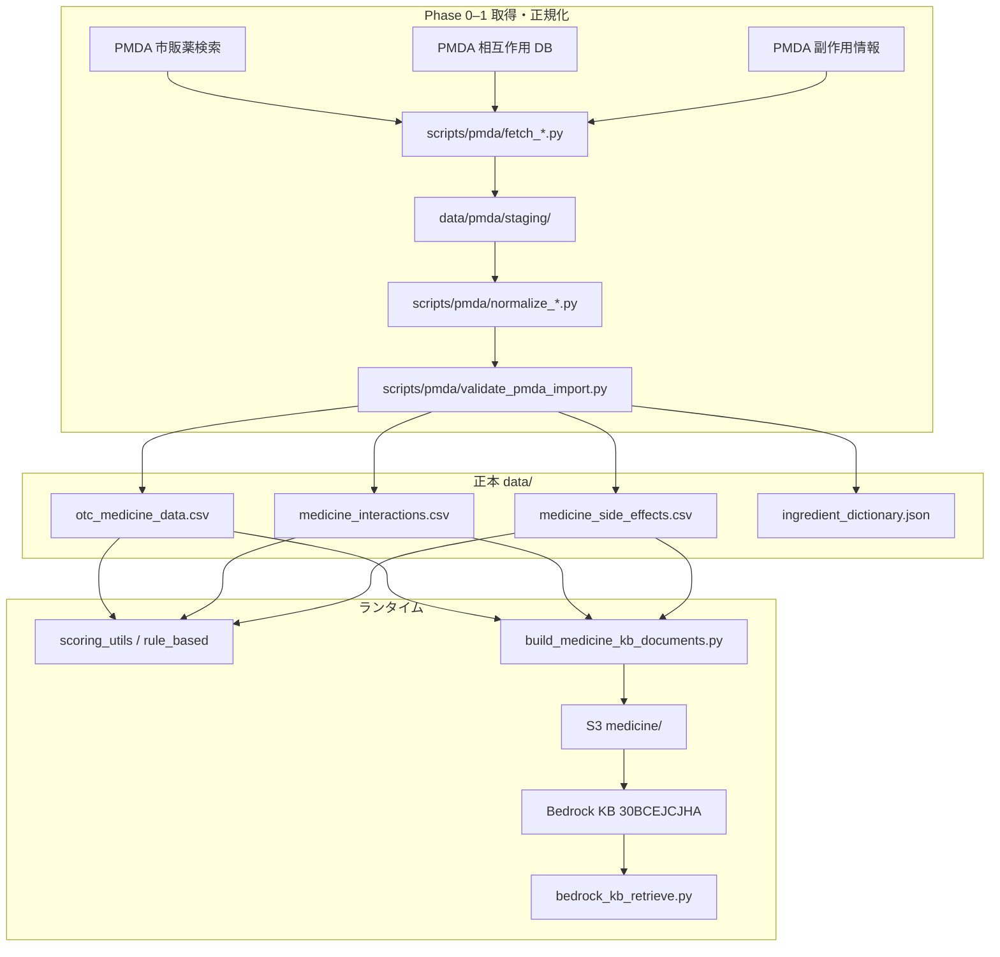

# PMDA 医薬品データベース構築計画

## 目的

PMDA 公的情報（市販薬検索・医薬品医療機器総合情報・相互作用 DB・副作用情報）を **アプリの正本データ** として取り込み、以下の精度を向上させる。

| 層 | 効果 |
|----|------|
| **推奨・安全スコア** | `scoring_utils.py` が CSV 直読み — 相互作用・副作用の網羅性向上 |
| **Ask / 説明 RAG** | `build_medicine_kb_documents.py` → Bedrock KB — retrieve 精度向上 |
| **高リスク表示** | Phase 2 dual_kb の「CSV 直引き優先」と整合 |

### 変更してはいけない原則

- 推奨ランキングの主権は **rule_based + scoring_utils**（RAG で順位を変えない）
- **data/*.csv がランタイム正本**（Neon PostgreSQL に医薬品カタログは移さない）
- KB 空 / 取得失敗時は CSV フォールバック
- GCP 本番は env 未設定 = レガシー維持

---

## ユーザー確認済みの設計判断

| 項目 | 決定 |
|------|------|
| **格納先** | `data/*.csv` 正本 + Bedrock KB 再生成（`csv_and_kb`） |
| **相互作用範囲** | **OTC カタログ成分 + よくある処方薬**（`otc_plus_common_rx`） |
| **品質確認** | **自動取り込み + staging / eval / golden で検証**（医療有資格者レビューなし） |
| **優先順位** | **3 ソース並行** — 先に共通パイプライン基盤を作る |
| **取得方式** | **未定** — 本 Plan でハイブリッド推奨（下記 ADR） |

---

## 現状ギャップ

| ファイル | 現行件数 | PMDA 出典（docs 記載） | ギャップ |
|----------|----------|------------------------|----------|
| `data/otc_medicine_data.csv` | **7,494 品目** | 市販薬検索 | 更新日不明・差分管理なし |
| `data/medicine_interactions.csv` | **82 行** | 相互作用 DB | **大幅不足** |
| `data/medicine_side_effects.csv` | **50 行** | 副作用情報 | **大幅不足** |
| `data/ingredient_dictionary.json` | **10 成分**（漢方中心） | — | 正規化が弱い |

**読み込み箇所:**

- 相互作用: `scoring_utils.calculate_interaction_risk_score`, `check_drug_interactions`
- 副作用: `scoring_utils.load_side_effects_data`
- カタログ: `medicine_data.py` → rule_based 推奨全体

**既存連携（dual_kb Plan）:**

- `scripts/build_medicine_kb_documents.py` — CSV → `build/medicine/` MD + metadata
- `scripts/eval_medicine_kb.py` + `tests/fixtures/medicine_kb_eval.yaml` — 20 問 eval
- `scripts/sync-medicine-kb-to-s3.sh` — S3 → Bedrock ingestion

---

## アーキテクチャ



---

## 取得方式 ADR（推奨: ハイブリッド）

PMDA は **一括ダウンロード API を提供していない**。方式比較:

| 方式 | メリット | デメリット | 推奨用途 |
|------|----------|------------|----------|
| **A. 手動エクスポート** | 利用規約リスク最小 | 更新コスト大・ヒューマンエラー | 初回ベースライン・OTC 差分確認 |
| **B. スクリプト取得（HTML/API 相当）** | 自動化・再現性 | サイト変更で壊れる・**利用規約要確認** | 相互作用・副作用の定期更新 |
| **C. ハイブリッド（推奨）** | 安全と自動化のバランス | 実装が 2 系統 | **本 Plan 採用** |

### 推奨ハイブリッド詳細

| ソース | 初回 | 定期更新 |
|--------|------|----------|
| **市販薬** | 既存 CSV を baseline。PMDA 市販薬検索で **差分サンプル照合**（100 品目） | 月次: 変更疑い品目のみ fetch → merge |
| **相互作用** | PMDA 相互作用 DB から **OTC 成分 × common_rx リスト** を fetch | 月次: スクリプト再実行 |
| **副作用** | PMDA 副作用情報から **OTC カタログ成分** を fetch | 月次: スクリプト再実行 |

**実装前必須:** PMDA / info.pmda サイトの利用規約・robots.txt を確認し、`docs/ops/PMDA_DATA_IMPORT.md` に記録。

**禁止:** 利用規約違反の大量スクレイピング、OpenFDA 等の海外 DB を PMDA 代替として混在 ingest。

---

## 相互作用の対象範囲（otc_plus_common_rx）

### OTC 成分（自動抽出）

`otc_medicine_data.csv` の `成分` 列からユニーク成分を抽出 → `data/pmda/otc_ingredients.json`

### 常用処方薬リスト（手動 + 拡張可能）

`data/pmda/common_rx_medications.json` — 初版候補:

```json
[
  "ワーファリン", "リチウム", "メトトレキサート", "アスピリン",
  "ACE阻害薬", "ARB", "テオフィリン", "シクロスポリン",
  "フェニトイン", "カルバマゼピン", "ジゴキシン", "インスリン",
  "SSRI", "MAO阻害薬", "ベンゾジアゼピン系", "降圧薬"
]
```

### ペア生成ルール

- ペア `(OTC成分, common_rx)` および `(OTC成分A, OTC成分B)` で PMDA を検索
- **全組み合わせ爆発を避ける:** OTC×OTC は `medicine_interactions.csv` 既存 + PMDA 明示ペアのみ
- 目標規模: **500〜2,000 行**（現 82 行から 10〜25 倍。全 PMDA ペアは取らない）

### CSV スキーマ（現行維持）

```csv
成分A,成分B,相互作用レベル,説明
```

追加列（任意・後方互換）:

```csv
...,出典,pmda_updated_at,interaction_id
```

---

## 副作用 CSV スキーマ（現行維持 + 拡張）

現行:

```csv
成分名,副作用レベル,副作用症状,禁忌条件
```

目標: **200〜500 行**（OTC 主要成分 + PMDA 副作用 DB）

---

## 市販薬 CSV 更新方針

### 更新対象列（PMDA 市販薬検索と照合）

| 列 | 更新 |
|----|------|
| 製品名, メーカー名, 分類, 医薬品の種類 | 差分時更新 |
| 効能効果, 用法用量, 年齢制限, 成分 | **優先更新** |
| 禁止物質あり, 競技会区分, 条件 | 差分時更新 |

### merge ルール

1. **主キー:** `製品名` + `メーカー名`（正規化 NFKC 後）
2. PMDA にのみ存在 → **追加**
3. ローカルのみ → `deprecated` フラグ列を将来追加検討（初版は `log/analysis/pmda_orphan_products.json` に記録）
4. フィールド不一致 → PMDA 優先（[medicine-recommendation-advisor](.cursor/skills/medicine-recommendation-advisor/SKILL.md) 方針）

### manifest

`data/pmda/manifest.json`:

```json
{
  "otc_medicine_data": {"last_import": "ISO8601", "row_count": 7494, "source": "PMDA OTC Search"},
  "medicine_interactions": {"last_import": "...", "row_count": 0, "pair_policy": "otc_plus_common_rx"},
  "medicine_side_effects": {"last_import": "...", "row_count": 0}
}
```

---

## 実装フェーズ

### Phase 0 — パイプライン基盤（2–3 日）

**目的:** 3 ソース共通の fetch → normalize → validate → merge

**新規ディレクトリ:**

```
scripts/pmda/
  __init__.py
  fetch_otc.py          # 市販薬（差分・単品 fetch）
  fetch_interactions.py # 相互作用
  fetch_side_effects.py # 副作用
  normalize.py          # 成分正規化・レベル mapping
  validate_pmda_import.py
  merge_into_csv.py     # staging → data/*.csv
  run_pmda_import.py    # オーケストレータ
data/pmda/
  staging/              # 生 JSON/HTML パース結果
  otc_ingredients.json
  common_rx_medications.json
  manifest.json
docs/ops/
  PMDA_DATA_IMPORT.md   # 出典・利用規約・手順
```

**normalize ルール:**

| PMDA 表現 | CSV `相互作用レベル` / `副作用レベル` |
|-----------|--------------------------------------|
| 併用禁忌 / 重大 | 高 |
| 併用注意 / 注意 | 中 |
| 情報なし / 軽度 | 低 |

**validate チェック:**

- 必須列欠損 0
- 成分名空行 0
- 重複ペア（A-B と B-A）の統一
- `ingredient_dictionary.json` への canonical 名登録（新成分のみ）
- golden regression: `tests/integration/test_golden_regression.py` pass
- 推奨順位 golden **回帰なし**

**完了条件:** `run_pmda_import.py --dry-run` が 3 ソース分パース成功

---

### Phase 1a — 相互作用（並行・2–3 日）

1. `common_rx_medications.json` 初版作成
2. `fetch_interactions.py` — OTC 成分 × common_rx を PMDA 検索
3. `medicine_interactions.csv` 82 → **500+ 行** 目標
4. `tests/fixtures/medicine_kb_eval.yaml` 相互作用 5 問 — min_score 維持
5. `log/analysis/pmda_interactions_import_YYYYMMDD.json`

---

### Phase 1b — 副作用（並行・2–3 日）

1. `fetch_side_effects.py` — OTC 成分一覧を PMDA 副作用 DB で検索
2. `medicine_side_effects.csv` 50 → **200+ 行** 目標
3. eval 副作用 3 問 pass

---

### Phase 1c — 市販薬カタログ（並行・3–5 日）

1. 既存 7,494 品目の **manifest baseline** 記録
2. PMDA 市販薬検索との **差分検出**（新規・変更・削除候補）
3. 初回: 変更疑い品目から優先 merge（全件 fetch は Phase 3）
4. `log/analysis/pmda_otc_diff_YYYYMMDD.json`

**注意:** 全 7,494 件の初回フル fetch は **レート制限・時間** のため Phase 1c では差分優先。フル同期は Phase 3 自動化で。

---

### Phase 2 — KB 反映（1–2 日）

1. `python scripts/build_medicine_kb_documents.py`
2. `./scripts/sync-medicine-kb-to-s3.sh`
3. Bedrock data source `0ZCBZWSQ7N` re-ingest（15–30 分）
4. `AWS_PROFILE=admin python scripts/eval_medicine_kb.py`
5. 20 問 **80%+ score >= 0.5**（dual_kb Acceptance 維持）

**KB ドキュメント増加見込み:**

| 種別 | 現行 | PMDA 後 |
|------|------|---------|
| products | 7,494 | 7,494±差分 |
| interactions | ~82 MD | **500+ MD** |
| side_effects | ~50 MD | **200+ MD** |

---

### Phase 3 — 運用自動化（2–3 日）

1. `run_pmda_import.py` を CodePipeline post_build または月次 cron 化（**失敗 warn**）
2. import 後: merge → build KB → sync → ingestion（dual_kb Phase 5 と統合検討）
3. `data/DATA_CATALOG.md` / `docs/public/会社向け概要書類.md` 件数更新
4. 利用規約再確認のリマインダー（四半期）

---

## 品質担保（医療者レビューなし — ユーザー決定）

| ゲート | 内容 |
|--------|------|
| **validate_pmda_import.py** | スキーマ・重複・空行 |
| **pytest** | `test_golden_regression`, `test_bedrock_kb_retrieve`, scoring 関連 |
| **eval_medicine_kb.py** | 20 問 retrieve スコア |
| **staging 手動 smoke** | 相互作用 3 問・副作用 2 問・推奨 5 ケース |
| **rollback** | import 前 CSV を `data/pmda/backups/YYYYMMDD/` に退避 |

**リスク明示:** 自動取り込みのみのため、PMDA パース誤りが本番に入る可能性あり。`manifest.json` + backup でロールバック可能にする。

---

## dual_kb Plan との関係

| dual_kb Phase | PMDA Plan との関係 |
|---------------|-------------------|
| Phase 0（完了） | eval harness 流用 |
| Phase 1（進行中） | **PMDA CSV 更新後に build + re-ingest を再実行** |
| Phase 2 | 高リスク CSV 直引き — **拡充された interactions CSV が効く** |
| Phase 3 PubChem | **PMDA 完了後** — 同義語不足分のみ（優先度下げ） |
| Phase 5 自動化 | PMDA Phase 3 と統合 |

**推奨実行順:**

1. dual_kb Phase 1 完了（現 CSV で MD 化の仕組み確立）
2. **PMDA Phase 0 基盤**
3. **PMDA Phase 1a/1b/1c 並行**
4. **PMDA Phase 2 KB re-ingest**
5. dual_kb Phase 2（SSE 等）— 厚い CSV/KB の上で接続拡大

---

## 成功基準（Acceptance）

| 指標 | 目標 |
|------|------|
| `medicine_interactions.csv` | **500+ 行**、既存 82 行の全ペアを包含 |
| `medicine_side_effects.csv` | **200+ 行** |
| `otc_medicine_data.csv` | 差分 merge 完了、manifest 記録 |
| eval 20 問 | **80%+** score >= 0.5 |
| golden regression | **pass 維持** |
| 推奨順位 golden | **回帰なし** |
| staging Ask 相互作用 | KB URI + CSV 高リスク警告が一致 |

---

## 未決事項・追加確認（実装開始前）

以下は Phase 0 で調査し `PMDA_DATA_IMPORT.md` に結論を記載:

1. **PMDA 相互作用 DB / 副作用情報の具体的 URL・検索パラメータ** — HTML 構造の安定性
2. **市販薬検索の 1 品目 fetch 方法** — 製品 ID の有無
3. **利用規約上、自動取得の許容範囲** — 不可なら手動 CSV 中継にフォールバック
4. **初回 OTC フル sync の GO** — 7,494 件 fetch の実行タイミング（Phase 1c 差分 vs Phase 3 フル）

---

## エージェント vs ユーザー

### エージェント

- Phase 0–2 のスクリプト・テスト・merge・KB rebuild
- `PMDA_DATA_IMPORT.md` ドラフト
- eval / golden 実行と `log/analysis/` 記録

### ユーザー

| タイミング | 作業 |
|------------|------|
| Phase 0 後 | 利用規約確認結果の GO/NO-GO |
| Phase 1 re-ingest 後 | ingestion COMPLETE 待ち（15–30 分） |
| 初回 OTC フル sync | 実行 GO（レート・時間） |
| コミット・push | 明示指示まで禁止 |

---

## 報告フォーマット

```
PMDA Phase X 完了
- 変更: data/medicine_interactions.csv (82→N), ...
- eval: 20問中 M 問 score>=0.5
- golden: pass/fail
- 未解決: （利用規約等）
- 次: Phase Y
```

---

## 必読参照

| 用途 | パス |
|------|------|
| データカタログ | [data/DATA_CATALOG.md](data/DATA_CATALOG.md) |
| スコアリング | [src/core/scoring_utils.py](src/core/scoring_utils.py) |
| KB 生成 | [scripts/build_medicine_kb_documents.py](scripts/build_medicine_kb_documents.py) |
| KB eval | [scripts/eval_medicine_kb.py](scripts/eval_medicine_kb.py) |
| dual_kb Plan | [.cursor/plans/dual_kb_rag_improvement_43dfe290.plan.md](.cursor/plans/dual_kb_rag_improvement_43dfe290.plan.md) |
| PMDA リンク | [docs/public/医薬品相談先.md](docs/public/医薬品相談先.md) |
| 評価方針 | [.cursor/skills/medicine-recommendation-advisor/SKILL.md](.cursor/skills/medicine-recommendation-advisor/SKILL.md) |
