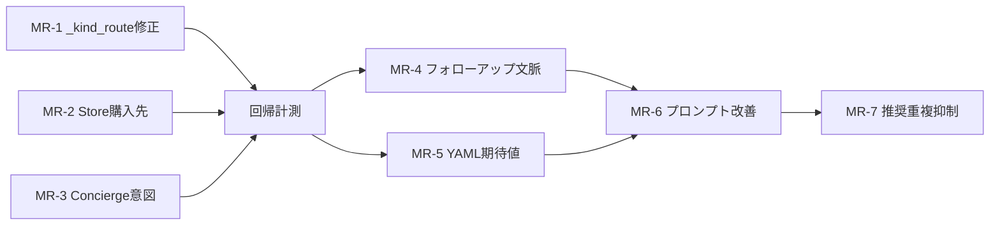

# UX・会話品質改善計画

## 厳格品質評価（現状）

### カテゴリ別評価

| カテゴリ | 自動合格率 | UX評価 |
|----------|-----------|--------|
| session_ops | 12/12 | 良。ただし異なる質問に同一テンプレ応答 |
| emergency | 8/8 | 良 |
| counseling | 13/13 | 良。ただし友人喧嘩→暴力緊急の誤検知 |
| physical_fever | 10/10 | 良 |
| physical | 16/18 | 応答内容は良。ルートログのみ不一致 |
| store | 3/8 | 購入先「OTCを買える店」「市販薬の購入先」が counseling_unknown_request に落ちる実害あり |
| concierge | 2/12 | API/SSE/rule_based 質問→挨拶フォールバック。HTTP 500 は解消済 |
| concierge_followup | 1/8 | フォローアップで文脈キーワード欠落・挨拶ループ |
| security | 2/4 | 応答は正しいがルートラベルのみ不一致 |
| correction | 8/10 | 削除キャンセル後に counseling_unknown_request |

### 根本原因（大→小）

**アーキテクチャ層**
1. 新旧パイプライン並走（legacy orchestrator + v2 IntentRouter）により同一入力で経路が不定
2. トリアージの5カテゴリ(`Physical/Emotional/Emergency/Ask/Other`)と IntentRouter の7ルート(`Concierge/Store/Security...`)のマッピングが粗い（`Other`→`Concierge` は過大な束）
3. Concierge の意図分類が2ルート（`classify_concierge_intent` = 挨拶のみ、`probe_meta_concierge_intent` = 技術用語）に分離しており、gate が前者しか使わない

**コード層**
4. `_kind_route`（テストランナー）が `diagnosis_kind` より応答本文の「市販薬」「おすすめ」を先にスキャンし、正しい `concierge_*` / `store_locator` を Physical に誤判定 → 28件REVIEW の多くはアプリ側正常
5. `classify_medicine_procurement_route` が「OTCを買える店」「市販薬の購入先」をカバーしていない（`_PROCUREMENT_HINTS`に「買える店」「購入できる」等が未登録）
6. `has_unambiguous_store_intent` の条件が厳しすぎ、購入先系クエリが `False` を返して Physical/Counseling に流れる
7. `probe_meta_concierge_intent` の `_META_PROBE_RULES` に API・SSE・rule_based（英語）などが未登録

**プロンプト層**
8. `FIRST_STAGE_TRIAGE_PROMPT` が 100行超で判定ルール乱立 → LLM 遵守が不安定
9. Concierge の技術系フォローアップで文脈を維持する仕組みがない（history には残るが agent が別ターンで再分類し直す）

---

## 改善計画

### MR-1: テストランナー `_kind_route` の修正（即効・低リスク）

**対象**: [`scripts/local_v2_chat_test_runner.py`](scripts/local_v2_chat_test_runner.py) L256–290

**問題**: 応答本文の「市販薬」を kind より先に Physical 判定するため、正しい `concierge_*` / `store_locator` / `aggressive_input` が Physical に誤判定されテスト REVIEW が大量発生。

**修正内容**:
- `_kind_route` の判定順序を「`kind` ベース優先 → 本文ヒューリスティックはフォールバック」に変更
- `concierge_*` / `store_locator` / `store_facilities` / `aggressive_input` / `known_attack` を kind ベースで先に判定

```python
# 現状: コンテンツスキャンが先
if k.startswith("sage_reco") or "市販薬" in c or ...:  # ← 先
    return "Physical"
...
if "concierge" in k or "architecture" in k ...:  # ← 後
    return "Concierge"

# 修正後: kind 判定を先行
if k.startswith("concierge") or k in ("concierge_greeting", "concierge_architecture", ...):
    return "Concierge"
if k.startswith("aggressive") or k == "known_attack":
    return "Security"
if k.startswith("store_locator") or k == "store_facilities":
    return "Store"
if k.startswith("sage_reco") or "市販薬" in c ...:  # ← 後
    return "Physical"
```

**効果**: 28件REVIEW のうち推定20件が PASS に転換（実アプリ側の修正不要）

---

### MR-2: Store 購入先クエリのルーティング補完（優先度: 高）

**対象**:
- [`src/services/counseling_triage.py`](src/services/counseling_triage.py) L195–215
- [`src/services/store_inquiry_handler.py`](src/services/store_inquiry_handler.py) L248–280
- [`src/dialogue/routing/gate.py`](src/dialogue/routing/gate.py) L126–144

**問題**: store-03「OTCを買える店」/ store-06「市販薬の購入先」が `_PROCUREMENT_HINTS` にヒットせず `classify_medicine_procurement_route` が `None` を返し、`has_unambiguous_store_intent` が `False` → Physical/Counseling に誤流入。

**修正内容**:

`counseling_triage.py` の `_PROCUREMENT_HINTS` に追記:
```python
_PROCUREMENT_HINTS = (
    "購入先",
    "買う場所",
    "どこで買",
    ...
    "買える店",        # 追加
    "購入できる",      # 追加
    "売っている店",    # 追加
    "取り扱っている",  # 追加
    "OTCを買",        # 追加
)
```

`gate.py` の `_has_pharmacy_location_intent` に直接パターン追加:
```python
if "市販薬" in t and ("購入先" in t or "買える" in t or "どこで買" in t):
    return True
```

`has_unambiguous_store_intent` に `classify_medicine_procurement_route` ヒット時の `True` 分岐を追加（現在は `gate.py` のみ）。

**テスト追加**: `test_store_diagnosis_kind.py` に store-03/06 相当のケース追加

---

### MR-3: Concierge 意図分類の補完（優先度: 高）

**対象**:
- [`src/services/concierge_intent.py`](src/services/concierge_intent.py) L418–444
- [`src/content/concierge_knowledge.ja.json`](src/content/concierge_knowledge.ja.json)

**問題**: `probe_meta_concierge_intent` の `_META_PROBE_RULES` に API、SSE、rule_based（英語）等が未登録。「APIの仕組みを教えて」「SSEについて」→ `concierge_greeting` フォールバック。

**修正内容**:

`_META_PROBE_RULES` に追記:
```python
(re.compile(r"API.{0,16}(仕組み|何|教えて|使い方)", re.I), "architecture"),
(re.compile(r"SSE|Server.{0,4}Sent.{0,4}Event", re.I), "architecture"),
(re.compile(r"rule[_\s-]?based|ルールベース.{0,8}(詳細|詳しく|具体)", re.I), "architecture"),
(re.compile(r"(どのような|どんな).{0,16}(仕組み|アルゴリズム|仕様)"), "architecture"),
(re.compile(r"(Sage|セージ).{0,4}(Terrace|テラス)", re.I), "app_about"),
```

`concierge_knowledge.ja.json` に `api_description` セクションを追加（FastAPI エンドポイント、SSE 配信の説明 1〜2 文）。

---

### MR-4: フォローアップ時の文脈維持改善（優先度: 中）

**対象**:
- [`src/services/concierge_agent_history.py`](src/services/concierge_agent_history.py)
- [`src/dialogue/routing/gate.py`](src/dialogue/routing/gate.py) `_resolve_concierge_follow_up`

**問題**: `_resolve_concierge_follow_up` はあるが、2ターン目で前ターンの Concierge intent を引き継げず別分類に入る。followup-03（プリンシプルオブプログラミング→OTCへ → 次ターン「具体例」→挨拶）が典型。

**修正内容**:
- `_resolve_concierge_follow_up` が直前ターンの `concierge_intent` を取得し、`redirect` だった場合はリダイレクト継続応答を返す
- フォローアップ検出時 gate 優先度を上げ、症状文脈より先に確認

---

### MR-5: セキュリティ・correction ルートラベル修正（優先度: 低）

**対象**: [`scripts/local_v2_chat_test_runner.py`](scripts/local_v2_chat_test_runner.py)（MR-1 に包含）/ [`tests/fixtures/v2_local_chat_scenarios.yaml`](tests/fixtures/v2_local_chat_scenarios.yaml)

**問題**:
- correction-01/02: `expect.primary_route: SessionOps` だが実際は `Counseling/counseling_unknown_request` 経由でキャンセルされる
- security-01/02: `expect.primary_route: Security` だが `aggressive_input` は `Physical` ルート上で処理

**修正内容**:
- YAML の `primary_route` を実挙動に合わせ更新（correction は `Counseling`、security は `Security` 期待値として `aggressive_input` を kind チェックに変更）
- correction のキャンセルフローで `counseling_unknown_request` でなく `session_delete_cancelled` kind が返るよう修正

---

### MR-6: トリアージプロンプト改善（優先度: 中・長期）

**対象**: [`src/services/llm_triage.py`](src/services/llm_triage.py) `FIRST_STAGE_TRIAGE_PROMPT` L183–289

**問題**:
- 100行超のルール列挙で LLM 遵守が不安定
- 「市販薬の購入先」「OTCを買える店」が Physical に誤分類されるケースの根本原因

**修正内容**:
- プロンプトを「カテゴリ定義（簡潔版）」+ 「Few-shot examples」構造に分離
- Store 購入先を `Other(store_inquiry/procurement)` と明記するルールを追加
- Concierge 系（アプリ説明・技術質問）を `Other(concierge)` として明示
- 一般化できるルールはコードサイドの fast-path に移動しプロンプト削減

---

### MR-7: マルチターン推奨の重複抑制（優先度: 中）

**対象**: [`src/handlers/chat/chat_recommendation_followup.py`](src/handlers/chat/chat_recommendation_followup.py)

**問題**: GPT シミュレーション（gpt-physical-headache）で 40 ターンにわたり同じ 3 薬（カロナールA/タイレノールA/イブロック）を繰り返し提示。ユーザーの「ありがとう、これで終わり」にも薬推奨を続ける。

**修正内容**:
- 同一推奨薬リストを前ターン比較し、変化がない場合はスキップして AskAgent 委譲
- 終了意図（「ありがとう」「終わります」等）検出で推奨ループを抑制

---

## 実装優先順（MR 実行順）



- **MR-1**: コード数行、リスク最小、REVIEW 20件削減見込み
- **MR-2 + MR-3**: 実ユーザー UX 改善の中核（store-03/06 + concierge-06/11/followup-05）
- **MR-4**: 中難度（dispatch context 管理）
- **MR-5**: 軽微な YAML 修正
- **MR-6**: プロンプトリファクタリング（A/B テスト推奨）
- **MR-7**: マルチターン品質（Wave 2 目標）

## 目標指標

| 指標 | 現状 | 目標 |
|------|------|------|
| 自動合格 (105シナリオ) | 77 / 105 (73%) | ≥ 90 / 105 (86%) |
| concierge PASS | 2 / 12 | ≥ 10 / 12 |
| store PASS | 3 / 8 | ≥ 6 / 8 |
| dispatch_success_rate | 84.4% | ≥ 92% |
| correction PASS | 8 / 10 | 10 / 10 |
