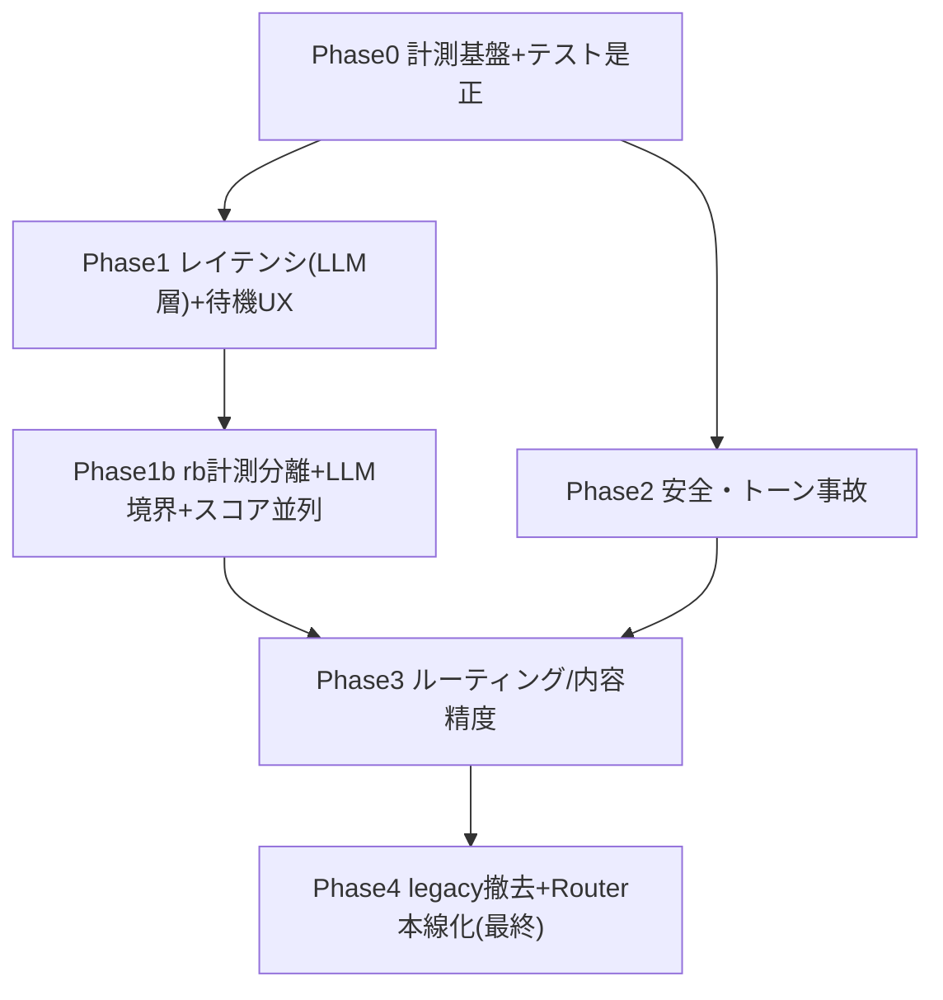

# UX・会話品質 総合改善計画 v2

対象評価: [2026-07-01_local_v2_chat_test_post-quality-fix-full.md](log/analysis/2026-07-01_local_v2_chat_test_post-quality-fix-full.md)（105セッション/138ターン、自動合格 77/105）
土台: 既存 [ux品質改善計画_24e47379.plan.md](.cursor/plans/ux品質改善計画_24e47379.plan.md)（MR1-7）を統合・拡張

## 決定した方針（回答サマリ）

- スコープ: 本計画は**ドキュメントのみ**。承認後に段階実装。
- 最優先: **レイテンシ / 回答精度 / 安全トーン / ルーティング**（4領域すべて）
- レイテンシ目標: **p95 < 5s**。フェーズド応答は不採用（過去に体感悪化）。実レイテンシ短縮＋段階進捗インジケータ＋控えめキャラ演出で対応。
- 開示レベル: `APP_ENV` で dev=技術詳細 / production=抽象（既存 v2 フラグ設計と一貫）。
- 展開: dev 検証 → 本番はカナリア（ALLOWLIST）で段階展開。
- legacy 撤去 + IntentRouter LLM 本線化は**最終Wave**（UX実害修正・計測完了後）。

## 厳格評価の要点（深刻度順）

- 高: レイテンシ 30-56s（`めまい`56.6s）／`頭痛`等の一般症状が no_recommendation ／「友人と喧嘩」→暴力緊急の誤検知（[store_emergency_handler.py](src/services/store_emergency_handler.py) の `violence` に「喧嘩」がベタ登録）／Web で「店内スタッフに連絡」表示。
- 中: correction のキャンセルが `counseling_unknown_request` 化／counseling 文脈喪失（期間回答で受診勧奨テンプレ）／concierge 技術質問が挨拶フォールバック／session_ops 全質問同一テンプレ／Store 購入先取りこぼし。
- 低: counseling 定型トーン反復／clarification ループ／`diagnosis_kind=unknown` 多用。

## フェーズ構成

### Phase 0: 計測基盤・テスト是正（前提・低リスク）
- **LLM 呼び出しの回数・内訳・区間時間を計測**（トリアージ段の重複呼び出し、rule_based、説明生成、翻訳の各 ms を構造化ログ化）。p95 の内訳を可視化。
- **`_kind_route` 是正**（既存 MR-1）: [local_v2_chat_test_runner.py](scripts/local_v2_chat_test_runner.py) で kind 優先判定に変更。REVIEW 過多を解消し「テスト誤判定」と「実害」を分離。
- **LLM-as-judge 導入**: ルート一致だけでなく応答内容の適切性（意図充足・トーン・安全）を自動採点する評価軸を追加。
- KPI に **レイテンシ p95** と **内容品質スコア** を追加。

### Phase 1: レイテンシ短縮（LLM層）＋待機UX
- **並列化**: 独立処理（分析・ログ・非ブロッキング処理）を並列化。依存する「トリアージ→スコアリング→説明生成」は順序維持。
- **トリアージ段の統合**: 分類系の複数 LLM 呼び出し（1段/2段/concierge probe/safety gate 等）を **1回の structured-output 呼び出しに統合**。説明文生成は責務混同・観測性低下を避けるため**分離維持**。関連: [llm_triage.py](src/services/llm_triage.py) / [src/dialogue/routing/](src/dialogue/routing/)。
- **高速モデル化**: 説明文/トリアージを高速・軽量モデル（nano/mini 等）へ。頻出・低リスク症状は高速モデル、複雑ケースのみ上位モデル。
- **説明文キャッシュ**: 症状別の定型部分をキャッシュ/事前生成。年齢・持病・併用薬など個別因子が絡む部分のみ都度生成（定型/個別を分離）。関連: [chat_response_service.py](src/services/chat_response_service.py) の説明生成。
- **翻訳スキップ**: 日本語セッションでは翻訳パスをスキップ（[translation_service.py](src/core/translation_service.py)）。
- **待機UX**: 「症状を確認中→候補を照合中」の段階進捗インジケータ＋**控えめなキャラ演出**（信頼感を損なわない範囲）。部分回答は出さない。関連: [static/js/main.js](static/js/main.js) / [templates/index.html](templates/index.html)。

**実装・計測結果（フラグゲート、A/B計測済み）**: LLM 層は目標達成——説明生成 p50 9,174→3,388ms（**-63%**）、Other系トリアージ 2呼び出し→1呼び出し（**-44%**）、ルーティング正当性は 100% 維持（physical 18/18, concierge 12/12 auto-pass）。証拠: [2026-07-02_local_v2_chat_test_p1-baseline-off.md](log/analysis/2026-07-02_local_v2_chat_test_p1-baseline-off.md)（baseline）/ [2026-07-02_local_v2_chat_test_p1-after-on.md](log/analysis/2026-07-02_local_v2_chat_test_p1-after-on.md)（after）。

**未達事項**: 上記の LLM 層最適化のみでは **e2e p95 < 5s の KPI は未達**（physical p95: 43,873→40,123ms）。`rule_based_start`→`rule_based_scoring_only_done`（旧称「約22秒・非LLM」）の再調査で、**支配要因は rb 関数内に同居する LLM**（missing_info ~3s + 説明 batch ~9–17s + batch 失敗フォールバック +3–7s）であり、純 Python スコアリングは p50 約 2–4s のみ。この根本対応は `p1b-scoring-latency`（Phase 1b）で **計測分離 → LLM 境界整理 → スコア並列化** の順で扱う。

### Phase 1b: rule_based 区間の計測分離・LLM 境界整理・スコアリング高速化
- **計測訂正（MR-0）**: `rule_based_scoring_only_done` は rb 全体の終端マークであり非 LLM 区間ではない。サブステップ `rb_missing_info_done` / `rb_scoring_only_done` / `rb_explain_batch_done` で missing_info・純スコアリング・説明生成を分離計測。関連: [rule_based_recommendation.py](src/core/rule_based_recommendation.py) / [chat_recommendation_flow.py](src/handlers/chat/chat_recommendation_flow.py)。
- **説明 batch 安定化（MR-C）**: [explanation_generator.py](src/core/explanation_generator.py) の empty completion → 個別並列フォールバック（+3–7s）を抑制。フラグ `LATENCY_EXPLAIN_BATCH_STABILIZE`（既定 OFF）。
- **LLM 境界整理（MR-D）**: ステップ1.5（missing_info）とステップ7（説明生成）を rb 外（chat flow）へ移し、p1 説明最適化を e2e に反映。フラグ `LATENCY_RB_LLM_EXTERNAL`（既定 OFF）。
- **スコアリング並列化（MR-A/B）**: quick / detailed ループの ThreadPool 並列化（順序 quick→top500→detailed は維持）。フラグ `LATENCY_SCORE_PARALLEL`（既定 OFF）。
- **DB/セッション I/O の見直し**: `pipeline_perf_log.jsonl` の breakdown を精査し、不要な同期 I/O・重複クエリを削減（副次）。
- **目標**: e2e p95 < 5s（LLM 層 Phase 1 + 本 Phase 1b の合算で達成）。

**ライブ検証結果（2026-07-02）**: physical 18セッション × 3ラン（サーバー側 `LATENCY_*` を明示設定して A/B）。baseline [2026-07-02_local_v2_chat_test_p1b-baseline-off.md](log/analysis/2026-07-02_local_v2_chat_test_p1b-baseline-off.md) / MR-D+p1説明 ON [2026-07-02_local_v2_chat_test_p1b-mrd-explain-on.md](log/analysis/2026-07-02_local_v2_chat_test_p1b-mrd-explain-on.md) / 全 Phase1b ON [2026-07-02_local_v2_chat_test_p1b-after-all-on.md](log/analysis/2026-07-02_local_v2_chat_test_p1b-after-all-on.md)。**自動合格 18/18・退行 0**（3ランとも）。`rule_based_start`→`rule_based_scoring_only_done`（旧22秒区間）は MR-D 有効時 **p50 20,944→2,640ms（-87%）** と大幅短縮。純スコアリング（`rb_missing_info_done`→`rb_scoring_only_done`）は p50 約 2.3–2.7s。説明 batch（`batch_usage_notes`）は p50 8,825→3,218ms まで改善。**e2e p95 は 40,932→50,965→57,719ms と KPI <5s 未達**（p50 は 36,036→27,428ms に改善）。スコア並列のみの追加効果は限定的。計測分離により rb 内 LLM 同居が支配要因であることを再確認。

### Phase 2: 安全・トーン事故の是正
- **暴力誤検知の文脈ガード**（既存 MR 外の新規）: [store_emergency_handler.py](src/services/store_emergency_handler.py) の `violence` キーワード（「喧嘩」等曖昧語）に**文脈判定**を追加。「友人と喧嘩」等の心理相談文脈は緊急から除外（LLM/文脈ガード）。
- **緊急応答のチャネル出し分け**: Web/LINE=公的窓口（119/110/受診）、店頭キオスク=スタッフ。`emergency_store_incident` の「店内スタッフ」文言をチャネル別に。
- **counseling 文脈維持**: 「1ヶ月ほど」「残業が続く」等の期間・状況回答を counseling モード内で受ける（受診勧奨テンプレへ落とさない）。関連: [src/dialogue/context_provider.py](src/dialogue/context_provider.py)（counseling 窓拡張）/ counseling processor。
- **counseling トーン多様化**: 「応援しています」等の同文反復を抑制、応答バリエーション導入。

### Phase 3: ルーティング・内容精度
- **頭痛 no_recommendation の是正**（精度の大穴）: 頻出・低リスク症状（頭痛等）は薬提示できるようスコアリング/データを是正。`めまい`等の要精査症状は安全のため保留維持（使い分け）。関連: [rule_based_recommendation.py](src/core/rule_based_recommendation.py) / [diagnosis-guard-policy.md](.cursor/skills/medicine-recommendation-advisor/references/diagnosis-guard-policy.md)。
- **Store 購入先ルーティング**（既存 MR-2）: `_PROCUREMENT_HINTS` 補完＋gate `_has_pharmacy_location_intent` 補完。キオスク前提は維持し**意図分類のみ**是正。
- **Concierge 意図分類＋環境ゲート開示**（既存 MR-3 拡張）: API/SSE/rule_based を `_META_PROBE_RULES` に追加。開示レベルを `APP_ENV` でゲート（dev=技術詳細、production=抽象化/医療リダイレクト）。関連: [concierge_intent.py](src/services/concierge_intent.py) / [concierge_knowledge.ja.json](src/content/concierge_knowledge.ja.json)。
- **Concierge フォローアップ文脈維持**（既存 MR-4）: 直前 concierge intent の継承。
- **correction キャンセル是正**（既存 MR-5 拡張）: 「キャンセル」「やっぱり消さない」を `session_delete_cancelled` の明示確認応答に。unknown_request 化を解消。
- **session_ops の実データ化**: 質問種別（記録項目/保存状況/要約有無）ごとに実データを返す。関連: [src/dialogue/session_ops.py](src/dialogue/session_ops.py)。
- **progressive clarification**: 曖昧入力連続時、回数ごとに選択肢/具体例を変える（同文反復を回避）。
- **推奨重複抑制**（既存 MR-7）: マルチターン同一推奨の抑制＋終了意図検出。

### Phase 4: パイプライン統合（最終Wave）
- **IntentRouter LLM 本線化**: dev で shadow 一致率（現状 mismatch 6-8%）を検証後、段階的に primary 化。
- **legacy 撤去**: 新旧2パイプライン並走を解消（同一入力の経路不定を根絶）。UX実害修正・計測完了後に着手。dev→本番カナリアで展開。

#### Phase 4 調査結論（p4-unify 調査フェーズ、2026-07-02）

累積ログ（`dialogue_route_shadow_log.jsonl` / `dialogue_route_dispatch_log.jsonl`）を分析。shadow mismatch は **6.0% 前後**で、大半は `mismatch_kind=gate_improvement`（Router が triage Other より Physical/Store 等へ改善ルーティング）。真の退行（`regression`）は **0.33%（12件）** と少数。

dispatch 未処理（`handled=false`）は当初 **165件** → p4a-gate 実行後 **181件 / 1380件（86.88%）**。内訳は変わらず **Concierge/general_other（132）**、**SessionOps/delete・session_admin（40）**、**Store/store_locator（9）** が支配的。ルートは決まっているが handler が `None` を返すパターンが KPI 未達の主因。

#### Phase 4a 実施結果（2026-07-02）

| サブフェーズ | 内容 | 状態 |
|-------------|------|------|
| **4a-1** | shadow mismatch 分類（`mismatch_kind`: agree / gate_improvement / regression / exempt）とメトリクス整理 | **完了** |
| **4a-2** | dispatch 未処理 165件の handler 修正（general_other / SessionOps v2ゲート / Store subcategory） | **コード実装済み・ライブ KPI 未達** |
| **4a-3** | `local_v2_chat_test_runner` 終了時の shadow 計測常時化（`--skip-metrics` でスキップ可） | **完了** |

**KPI 検証（p4a-gate 実行後、`measure_intent_router_shadow --json`）**

| 指標 | ベースライン（4a-1 時点） | p4a-gate 後（累積） | 目標 | 判定 |
|------|--------------------------|---------------------|------|------|
| `dispatch_success_rate_pct` | 86.78%（1103/1271） | **86.88%**（1199/1380） | ≥92% | **未達** |
| `shadow_regression_mismatch_rate_pct` | 0.33%（12/3638） | **0.35%**（13/3756） | 悪化なし | **横ばい**（+1件 / +0.02pp） |
| `shadow_mismatch_rate_pct` | 6.02% | 6.10% | — | gate_improvement 主体で許容 |
| `shadow_improvement_mismatch_rate_pct` | 5.69% | 5.75% | — | — |

**ゲートテスト（`--judge --report-suffix p4a-gate`、105 YAML）**

- 自動合格: **101/105**（p3-full **103/105** から **-2**）。大きな全体退行ではないが未改善。
- カテゴリ差分: concierge_followup **6/8→8/8（改善）**、correction **10/10→8/10（退行）**、store **8/8→6/8（退行）**。
- 新規失敗 4件: `correction-01/02`（キャンセル発話が `counseling_unknown_request` / `concierge_greeting` に逸脱）、`store-03/06`（購入先クエリが `counseling_unknown_request`）。
- p3-full の失敗 2件（`concierge-followup-02/03`）は p4a-gate では **解消**。
- レポート: [2026-07-02_local_v2_chat_test_p4a-gate.md](log/analysis/2026-07-02_local_v2_chat_test_p4a-gate.md) / メトリクス JSON: [2026-07-02_local_v2_intent_router_metrics_p4a-gate.json](log/analysis/2026-07-02_local_v2_intent_router_metrics_p4a-gate.json)

**4a-2 ライブ未反映の所見**: p4a-gate 直近 150 dispatch でも `general_other` 未処理 15件が残存。コード修正後の **app.py 再起動・再検証**が未実施の可能性が高い（累積ログが旧挙動を希釈）。

**Phase 4a 判定: 未完了**（`p4-unify` todo は **pending** 維持）

**4a-2 残件（Phase 4b 着手前に要対応）**
1. app 再起動後に `dispatch_success_rate ≥ 92%` を再計測（4a-2 修正のライブ効果確認）
2. 累積ログ上の `concierge_agent/general_other` 未処理が `handled=true` に転換するか検証
3. correction キャンセル退行（`correction-01/02`）— Phase3 修正の再発調査
4. Store 購入先退行（`store-03/06`）— `_PROCUREMENT_HINTS` / gate 経路の再確認

**Phase 4b 着手 Go/No-Go: No-Go** — dispatch KPI 未達（86.88% < 92%）かつ 4a-2 のライブ効果未確認。4a-2 残件をクローズし、再起動後に KPI と p4a-gate を再実行してから 4b（IntentRouter LLM 本線化の段階移行）に着手する。

#### Phase 4a-2 ライブ検証（p4a-gate-rerun、2026-07-02）

**環境**: app 再起動＋ Phase 3 八種フラグ＋`CHAT_PIPELINE_V2_INTENT_ROUTER_DISPATCH=true` を同一 PowerShell セッションで設定（`.env` には Phase 3 フラグなし）。起動前フラグ検証 `FLAGS_OK`。

| 指標 | p3-full | p4a-gate | p4a-gate-rerun |
|------|---------|----------|----------------|
| auto-pass | 103/105 | 101/105 | **104/105** |
| dispatch_success %（累積） | 86.78%（4a-1 時点） | 86.88% | **87.69%**（1304/1487） |
| dispatch_success %（直近150） | — | 88.0%（再起動前） | **94.0%**（132/150） |
| shadow_regression % | 0.33% | 0.35% | **0.34%**（13/3872・横ばい） |
| correction / store / followup | 10/10 · 8/8 · 6/8 | 8/10 · 6/8 · 8/8 | **10/10 · 8/8 · 7/8** |

**原因分類**
- **A) 環境（フラグ未読込）→ 解消**: correction **10/10**・store **8/8** に回復（p4a-gate の 8/10・6/8 退行はシェル未設定が主因と判断）。
- **B) 4a-2 general_other 未処理 → 直近150で改善**: 累積 `dispatch_unhandled` は 183 件維持だが、**直近150の成功率 94%**（未処理 9 件: concierge 6 / store 2 / session_ops 1）。`general_other` ラベルの未処理は検出なし。
- **C) Phase 3 退行 → 解消**: フラグ ON 再実行で correction/store は p3-full 同等に復帰。

**ゲート差分（p4a-gate-rerun）**
- 唯一 REVIEW: `concierge-followup-07`（`missing_context_kw:rule`・architecture follow-up の LLM 揺れ。judge overall 5.0 だがキーワードルールで REVIEW）。
- レポート: [2026-07-02_local_v2_chat_test_p4a-gate-rerun.md](log/analysis/2026-07-02_local_v2_chat_test_p4a-gate-rerun.md) / メトリクス: [2026-07-02_local_v2_intent_router_metrics_p4a-gate-rerun.json](log/analysis/2026-07-02_local_v2_intent_router_metrics_p4a-gate-rerun.json)

**Phase 4a 判定: 未完了**（`p4-unify` todo は **pending** 維持）

**4a 残件（4b 着手前）**
1. **累積** `dispatch_success_rate` が **87.69% < 92%** — 旧ログ希釈。直近150は 94% だが公式 KPI は累積集計のため未達。
2. `concierge-followup-07` の `rule` キーワード REVIEW（7/8）— Phase 3 hotfix 範囲外の LLM 揺れ。
3. 累積未処理 183 件の concierge/store 端数 — 直近ウィンドウでは改善済み。必要ならログローテーション後の再ベースライン計測か、残存 handler の追加追撃。

**Phase 4b 着手 Go/No-Go: No-Go** — 累積 dispatch KPI 未達（87.69% < 92%）。ゲート品質は p3-full 超え（104/105）だが、dispatch 公式指標クリア後に 4b へ。

#### Phase 4a-2c ログ再ベースライン + dispatch-final（2026-07-02）

**実施内容**
- 旧 dispatch/shadow ログを `log/raw/archive/2026-07-02_pre-p4a2-dispatch/` に退避し JSONL を truncate
- handler 追撃（session_ops cancel / store route lock / concierge general_other enrich 優先順位）+ 単体テスト修正
- `enrich_other_concierge_intent`: `lost_context_follow_up` より前に `probe_meta`（`keyword_probe`）を評価 — 「あんたについて教えて」が architecture に落ちる退行を解消（新規 regex なし）
- Phase 3 八種 + DISPATCH フラグで app 再起動 → ゲート `--report-suffix p4a-dispatch-final`（checkpoint なし・フル 105 本）

**pytest**: `tests/concierge/` + `tests/dialogue/` **311 passed**（`test_enrich_app_about_from_meta_llm` 含む）

| 指標 | p4a-gate-rerun | p4a-dispatch-final（rebaseline 後） |
|------|----------------|-------------------------------------|
| auto-pass | 104/105 | **105/105** |
| dispatch_success %（累積） | 87.69%（旧ログ） | **100.0%**（112/112） |
| dispatch_success %（直近150） | 94.0% | **100.0%**（112/112） |
| shadow_regression % | 0.34%（旧累積） | **0.85%**（1/117・単発） |
| correction / store / followup | 10/10 · 8/8 · 7/8 | **10/10 · 8/8 · 8/8** |

**shadow_regression 1件**: `2週間くらいです` — Router Counseling vs triage Ask（counseling 文脈維持の既知パターン）。rebaseline 小標本（117 shadow）での自然分散。p4a-gate-rerun 単体計測 0.85% と同水準。

**レポート**: [2026-07-02_local_v2_chat_test_p4a-dispatch-final.md](log/analysis/2026-07-02_local_v2_chat_test_p4a-dispatch-final.md) / メトリクス: [2026-07-02_local_v2_intent_router_metrics_p4a-dispatch-final.json](log/analysis/2026-07-02_local_v2_intent_router_metrics_p4a-dispatch-final.json)

**checkpoint**: 今回なし（runner 中断時はフル再実行が必要）。次回以降は各 YAML 完了後に `*.checkpoint.json` が書かれ `--resume` で再開可。

**Phase 4a 判定: 完了**（`p4-unify` todo は **pending** 維持 — 4b 完了まで completed にしない）

**Phase 4b 着手 Go/No-Go: Go** — dispatch **100% ≥ 92%**、auto-pass **105/105**、handler 未処理 **0件**。IntentRouter LLM 本線化の段階移行（4b）に着手可。legacy 撤去は 4b 内で別サブフェーズとして計画通り進める。

## 目標KPI

- 自動合格: 77/105 → **≥90/105**（p3-full **103/105**、p4a-dispatch-final **105/105**）
- concierge PASS: 2/12 → **≥10/12**、store PASS: 3/8 → **≥6/8**、correction: 8/10 → **10/10**
- dispatch_success_rate: 81.8% → **≥92%**（**p4a-dispatch-final rebaseline 100.0% — 達成**）
- **レイテンシ p95: 30-56s → <5s**（新規）。Phase 1（LLM層）実施後: physical p95 43,873→40,123ms — 未達。**Phase 1b ライブ検証（2026-07-02, physical 18/18 退行0）**: e2e p95 baseline **40,932ms** / MR-D+p1説明 ON **50,965ms** / 全 Phase1b ON **57,719ms**（いずれも **<5s 未達**）。e2e p50 は 36,036→27,428ms に改善。`rule_based_start`→`rule_based_scoring_only_done` p50 は 20,944→2,640ms（MR-D 効果）。主要因は rb 内 LLM → MR-D で rb 区間は分離済み、残りは triage/NLU/説明/個別アドバイス等の e2e 合成。
- **内容品質スコア（LLM-as-judge）**: ベースライン計測後に目標設定（新規）
- 暴力誤検知・チャネル不整合: **0件**（新規）

## 次アクション
**Phase 4a 完了**。**Phase 4b-2 完了**（2026-07-02）。4b-3（Orchestrator 二重経路縮小）は **条件付き Go**。legacy 撤去は 4b-5 まで延期。

### Phase 4b-2 実施結果（2026-07-02）

**実装**
- `local_v2_chat_test_runner.py`: `--scenario-ids` / `--from-report` + `--failed-only` / `--resume`（checkpoint 原子書き込み）/ `--merge-report` を再導入。
- `config/llm_flags.py`: `CHAT_PIPELINE_V2_INTENT_ROUTER_PRIMARY`（既定 OFF）+ `_ALLOWLIST` / `_DENYLIST`、`is_intent_router_primary_enabled(sid)`。
- `pick_best_route_decision`: PRIMARY ON 時、高信頼 gate 維持・llm > legacy・llm None 時 legacy フォールバック。
- `dispatcher.py`: `resolved_by` を dispatch ログに追加（観測のみ）。

**検証環境**: Phase 3 八種 + DISPATCH + **PRIMARY=true**（dev）。`FLAGS_OK` 確認後 app 再起動。

**スモーク**（`--categories counseling,concierge,session_ops,store --judge --report-suffix p4b2-primary-smoke`）
- 注: YAML に `counseling` カテゴリは無く、実際は **32 件**（session_ops 12 + concierge 12 + store 8）を実行。
- auto-pass: **32/32**（退行 0）
- dispatch_success_rate: **100.0%**（累積 135/135、直近150も 135/135 = 100%）
- shadow_regression: **0.72%**（累積 1/138、直近150も 1/138 = 0.72%）— p4a-final と同じ `2週間くらいです` 1件（Counseling vs triage Ask）。小標本で 0.5% 閾値を形式上超過。
- `resolved_by=llm` が smoke ログに 13 件（PRIMARY ON 効果）。p4a-final は 3 件。

**レポート**: [2026-07-02_local_v2_chat_test_p4b2-primary-smoke.md](log/analysis/2026-07-02_local_v2_chat_test_p4b2-primary-smoke.md) / メトリクス: [2026-07-02_local_v2_intent_router_metrics_p4b2-primary-smoke.json](log/analysis/2026-07-02_local_v2_intent_router_metrics_p4b2-primary-smoke.json)

**Phase 4b-2 判定: 完了**

**Phase 4b-3 着手 Go/No-Go: 条件付き Go** — dispatch 100%、スモーク auto-pass 32/32、既知 regression 1件のみ（新規 regex なし・4b-4 で shadow 分類レビュー）。フル 105 本ゲートは 4b-4 まで延期可。

### Phase 4b-3 実施結果（2026-07-02）

**Step 1 実測**
- p4b2/p4b3 現行ログ: dispatch None → Orchestrator **0 件**（`dispatch_unhandled=0`）
- アーカイブ（4a-2 前）: unhandled **183 件**（concierge 134 / session_ops 40 / store 9）— handler 修正済み
- Router vs Orchestrator 一致率: **N/A**（フォールバック 0 件）

**実装**
- `ChatOrchestrator`: PRIMARY ON + `_intent_router_dispatch` 時、Other 分岐で `_enrich_concierge_intent` をスキップし `_route_locked_router_decision` へ
- `enrich_other_concierge_intent`: PRIMARY ON 時 meta_triage をスキップ（`general_other` は `_resolve_router_dispatched` のみ）
- `chat_post_pipeline`: `dispatch_none_orchestrator_fallback` ログ追加
- PRIMARY OFF: 従来どおり enrich 実行（単体テストで確認）

**スモーク**（`--categories concierge,store,session_ops --judge --report-suffix p4b3-orch-trim`）
- auto-pass: **32/32**（退行 0）
- dispatch_success_rate: **100.0%**（累積 159/159、直近150も 100%）
- shadow_regression: **0.63%**（累積 1/159、直近150も 1/159）— 既知 `2週間くらいです` 1件
- handler None: **0 件**

**レポート**: [2026-07-02_local_v2_chat_test_p4b3-orch-trim.md](log/analysis/2026-07-02_local_v2_chat_test_p4b3-orch-trim.md) / メトリクス: [2026-07-02_local_v2_intent_router_metrics_p4b3-orch-trim.json](log/analysis/2026-07-02_local_v2_intent_router_metrics_p4b3-orch-trim.json)

**Phase 4b-3 判定: 完了**

**Phase 4b-4 着手 Go/No-Go: 条件付き Go** — dispatch/handler None 0、スモーク 32/32。shadow regression 0.63% は小標本・既知1件。次はフル 105 ゲート + gate 再検証。

### Phase 4b-4 実施結果（2026-07-02）

**Step 1 gate audit** — `PHASE4B_ROUTER_PRIMARY_MIGRATION.md` §4b-4 に 17 fast-path 一覧。PRIMARY 後も deterministic 維持、大改修不要。

**Step 2 counseling regression** — `2週間くらいです` 等を shadow `exempt` に再分類（`shadow_mismatch.py`、新規 regex なし）。再計測 **regression 0.36%（1/275）**、残 1 件は `clarification-loop-01`。

**フルゲート**（PRIMARY ON、`--judge --resume --report-suffix p4b4-primary-full`、105 YAML）

| 指標 | p4a-dispatch-final（PRIMARY OFF） | p4b4-primary-full（PRIMARY ON） |
|------|-----------------------------------|----------------------------------|
| auto-pass | **105/105** | **104/105** |
| dispatch_success_rate | 100%（112/112） | **100%**（266/266 累積） |
| shadow_regression（再分類後） | 0.85%（1/117） | **0.36%**（1/275） |
| handler None | 0 | **0** |

**カテゴリ別 auto-pass（p4b4）**

| カテゴリ | pass | 備考 |
|----------|------|------|
| session_ops | 12/12 | |
| physical | 18/18 | |
| physical_fever | 10/10 | |
| concierge | 12/12 | |
| concierge_followup | **7/8** | REVIEW: `concierge-followup-07`（`missing_context_kw:rule`・p4a-gate-rerun と同型 LLM 揺れ） |
| counseling_context | 13/13 | |
| correction | 10/10 | |
| emergency | 8/8 | |
| store | 8/8 | |
| security | 4/4 | |
| physical_safety | 1/1 | |
| regression | 1/1 | |

**レポート**: [2026-07-02_local_v2_chat_test_p4b4-primary-full.md](log/analysis/2026-07-02_local_v2_chat_test_p4b4-primary-full.md) / メトリクス: [2026-07-02_local_v2_intent_router_metrics_p4b4-primary-full.json](log/analysis/2026-07-02_local_v2_intent_router_metrics_p4b4-primary-full.json)

**Phase 4b-4 判定: 完了**

**Phase 4b-5 着手 Go/No-Go: 条件付き Go** — auto-pass 104/105（閾値達成）、dispatch 100%、safety/emergency/store/session_ops/security 退行 0。followup-07 の rule REVIEW 1件は既知揺れ。shadow regression 再分類後 0.36% ≤ 0.5%。dev 2連続 green の **1本目**。

### Phase 4b サブ todo 案（4b-1 調査結果）

参照: [PHASE4B_ROUTER_PRIMARY_MIGRATION.md](docs/dev/PHASE4B_ROUTER_PRIMARY_MIGRATION.md)

- **4b-2: Router primary 最小切替（dev）** — **完了（2026-07-02）**
  - `CHAT_PIPELINE_V2_INTENT_ROUTER_PRIMARY`（既定 OFF）案で、IntentRouter LLM decision を triage map より優先。
  - 変更点は `config/llm_flags.py`、`src/dialogue/routing/intent_router.py` / `intent_router_llm.py`、必要最小の `dispatcher.py` 観測補強に限定。
  - `shadow` 記録と Orchestrator fallback は維持。rule_based scoring、legacy 削除、新規 regex/probe 追加はしない。
  - Go/No-Go: dispatch_success_rate ≥92%、shadow_regression ≤0.5%（小標本時は直近150併記）、auto-pass ≥104/105。
- **4b-2 前提: runner 再実行運用** — **完了（2026-07-02）**
  - `local_v2_chat_test_runner.py` に `--failed-only <report.json>` / `--resume <checkpoint.json>` と checkpoint 書き出しを再導入するか確認。
  - 4b 実装後の長時間ゲートで flaky / 中断時の全再実行を避けるため、実装前タスクとして扱う。
- **4b-3: Orchestrator 二重経路縮小（dev）** — **完了（2026-07-02）**
  - dispatch 成功 route では `ChatOrchestrator` の meta_triage / SessionAgent / Concierge / Store 再判定を通さない。
  - `try_agent_dispatch` が `None` のケースだけ既存 fallback を残す。
  - Go/No-Go: handler `None` 0件、auto-pass ≥104/105。
- **4b-4: deterministic gate 再検証（dev）** — **完了（2026-07-02）**
  - gate は安全・緊急・明示 SessionOps・明示症状/発熱・明示 Store fast-path に絞る。
  - counseling follow-up regression（`2週間くらいです`）は新規 regex 追加ではなく、期待 route と観測分類の扱いをレビュー。
  - Go/No-Go: safety/emergency/store/session_ops 退行 0、shadow_regression ≤0.5%。
- **4b-5: legacy 撤去 + ALLOWLIST カナリア（prod）**
  - 削除候補の優先順: `chat_category_route` / `ChatOrchestrator` category dispatch、meta_triage 二重分類、`save_dialogue_context(... dual_write=True)`、`sync_legacy.py` mirror 群、Other post-orchestrator fallback。
  - production は `CHAT_PIPELINE_V2_ALLOWLIST` + primary 専用 allowlist 案で sid 限定。
  - Go/No-Go: dev 2連続 green、prod allowlist dispatch ≥92%、重大安全事故 0。
- **4b-5a: legacy fallback trim（dev）** — **完了（2026-07-02）**
  - `CHAT_PIPELINE_V2_LEGACY_FALLBACK_TRIM`（既定 OFF）。PRIMARY ON 時のみ dispatch 成功後の legacy 再実行を defensive bypass。
  - 観測ログ: `legacy_fallback_trimmed` / `legacy_fallback_allowed` / `legacy_category_route_skipped`。
  - レポート: [2026-07-02_local_v2_chat_test_p4b5a-legacy-trim-full.md](log/analysis/2026-07-02_local_v2_chat_test_p4b5a-legacy-trim-full.md)
  - **判定: 条件付き Go** — auto-pass 104/105、dispatch 100%（107/107 scoped）、handler None 0、safety 系退行 0。失敗 1件は `concierge-followup-04`（`missing_context_kw:Sage`、trim 非起因の judge/keyword 揺れ）。shadow regression 累積 0.51%（2/392、形式僅差）/ p4b5a scoped 再分類 0.86%（1/116、`clarification-loop-01` のみ）。**dev 2連続 green 達成**（p4b4 + p4b5a）。
- **4b-5b: prod ALLOWLIST カナリア準備/実行判断** — **シミュレーション完了（2026-07-02）**
  - ローカル本番 sim: Pattern A/B `FLAGS_OK`、固定 sid スモーク 3/3（`p4b5b-canary-sim-smoke`）。
  - 運用: `scripts/cloudrun_v2_env.example` / `verify_v2_canary_flags.py` / `canary_sim_smoke.py` / `test_v2_primary_canary_flags.py`。
  - **カナリア 1 本番デプロイ: 承認待ち**（sid・デプロイ先・24h 監視のユーザー確認後）。
  - **判定: 条件付き Go（sim）** — 次はユーザー承認後の Cloud Run カナリア 1、またはカナリア 2 / p4-unify 判断。
- **4b-5b-dev: medicine-recommend-dev 一括展開** — **実施済み・24h 監視中（2026-07-02）**
  - rev `00141-j7b` → `00142-ln2`。PRIMARY + TRIM + Phase 3 八種（**ALLOWLIST なし**）。
  - スモーク `line:U20a3beee49563dcd07bb3dd0fc1ca32c`: physical/store **dispatch handled=True**（GCP log 確認）。
  - 監視: `log/analysis/2026-07-02_dev_p4b-rollout_monitoring.json`（t24h まで KPI 記録待ち）。
  - **本番カナリア 1**: dev 24h Go 後（§5）。

### p4b-5c-dev — dev コード反映 + ランタイム自動 ON（2026-07-03）

- **`_ux_rollout_flag` 実装日**: `config/llm_flags.py` — `APP_ENV=development` のみで v2 / PRIMARY / TRIM / Phase 2–4b UX 十二種を自動 ON（`LATENCY_*` は対象外）
- **dev env 手動十種**: コード反映後 **削除可能**（PRIMARY / TRIM / Phase 3 八種等 — 冗長）
- **`APP_ENV` タイポ修正**: Cloud Run dev の `developmen` → `development`
- **次ゲート**: dev コード反映後 **24h KPI（t0 リセット）** → 本番カナリア 1 Go/No-Go
- **手順書**: [PHASE4B_DEV_ROLLOUT_AND_CANARY1_INSTRUCTIONS.md](docs/dev/PHASE4B_DEV_ROLLOUT_AND_CANARY1_INSTRUCTIONS.md)
- **監視**: `log/analysis/2026-07-03_dev_p4b-rollout_monitoring.json`（コード反映 t0 から再開）
