# html-slides

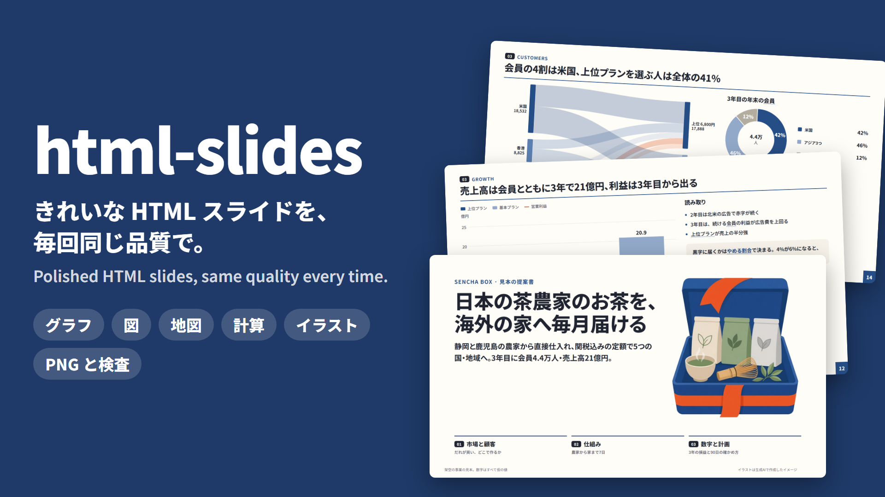

**AI エージェント用のスキル：きれいな 1920×1080 の HTML スライドを、毎回同じ品質で作る。**
グラフ・図・地図・表・計算の埋め込み・イラスト・PNG の書き出しと自動の検査まで 1 つに入っています。
事業計画・ピッチだけでなく、マーケティング・コンサルティング・調査の報告・社内の資料にも使えます。
[Agent Skills](https://agentskills.io/) の形式（`SKILL.md`）なので Cursor・Claude Code など対応したエージェントで使え、スクリプトは Node と Python で手でも動きます。
この README の画像は、すべてこのスキルで作った見本のスライド（`examples/`）をそのまま書き出したものです。

[日本語](#日本語) ・ [English](#english)

---

## 日本語

- [全体像](#全体像)
- [こんな資料に使える](#こんな資料に使える)
- [使い方：頼むだけ](#使い方頼むだけ)
- [できること（実際のスライド）](#できること実際のスライド)
  - [1. ページの型：結論を言い切る見出し](#1-ページの型結論を言い切る見出し)
  - [2. グラフ](#2-グラフ)
  - [3. 図](#3-図)
  - [4. 地図](#4-地図)
  - [5. 数字は計算から](#5-数字は計算から)
  - [6. イラスト](#6-イラスト)
  - [7. 発表用の型（pitch）](#7-発表用の型pitch)
  - [8. 崩れの自動検査](#8-崩れの自動検査)
  - [9. テーマ](#9-テーマ)
  - [10. 付録と敵対的な検査](#10-付録と敵対的な検査)
- [入れ方](#入れ方)・[手で使う](#手で使う)・[中身](#中身)・[ライセンス](#ライセンス)

### 全体像


上の 12 枚は一部です。グラフは棒（積み上げ・100%・横）・線・面・円・散布・バブル・滝・サンキー・ガントとその組み合わせ、図は担当者ごとの流れ・関係図・循環図・ツリー・ピラミッド・2×2・ベン図、ほかに表・大きな数字（KPI）・時間の帯・左右の比べ・引用・写真と画面の画像、世界・国・日本の都道府県の地図があり、1 ページの中で組み合わせられます。

1 つの HTML ファイル（デッキ）に 1 ページ＝1 つの `<section>` を並べます。1920×1080 固定で、ブラウザの大きさに合わせて拡大縮小します。CSS・JS・データ・地図をファイルに埋め込み、フォント（Noto Sans JP・Inter）を同梱するので、**ネットなしで開けます**。

### こんな資料に使える

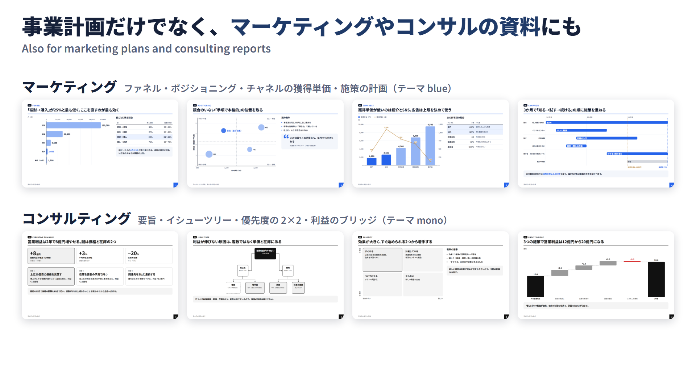

見出しで結論を言い切り、数字とグラフで裏付ける作りなので、次のような資料にそのまま使えます。

| 資料 | よく使うページ |
|---|---|
| 事業計画・ピッチ | 市場の地図・売上の積み上げ・1 件あたりの損益（滝）・計画（ガント）・発表用の型 |
| マーケティング | ファネル・ポジショニング（散布・バブルと 4 象限）・チャネルの獲得単価（棒＋線）・施策の計画 |
| コンサルティング | 要旨（KPI と提言）・イシューツリー・優先度の 2×2・利益のブリッジ（滝）・ロードマップ |
| 調査・分析の報告 | 地域ごとの地図・比べる表・推移のグラフ・前提を変えると数字がそろって変わる計算 |
| 社内の資料・研修 | 担当者ごとの業務の流れ・循環図・時間の帯・チェックの表 |

マーケティング（テーマ `blue`）とコンサルティング（テーマ `mono`）の見本は [examples/usecases/](examples/usecases/) にあります。

<p>
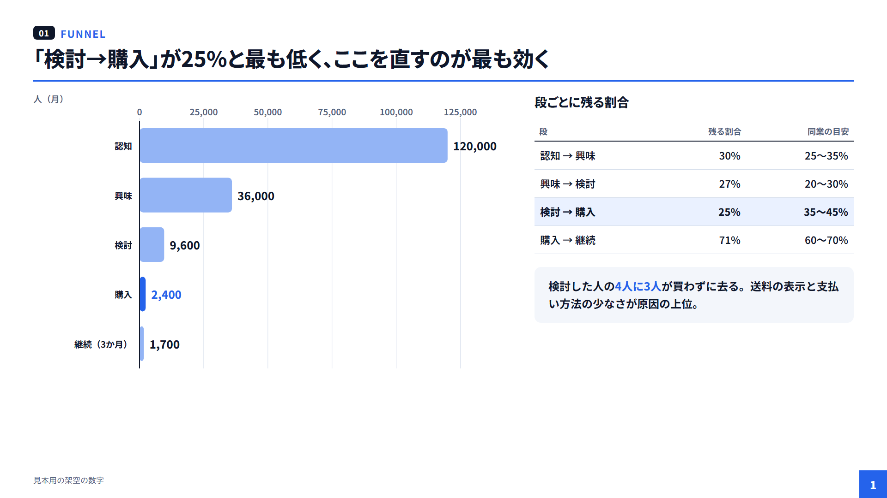
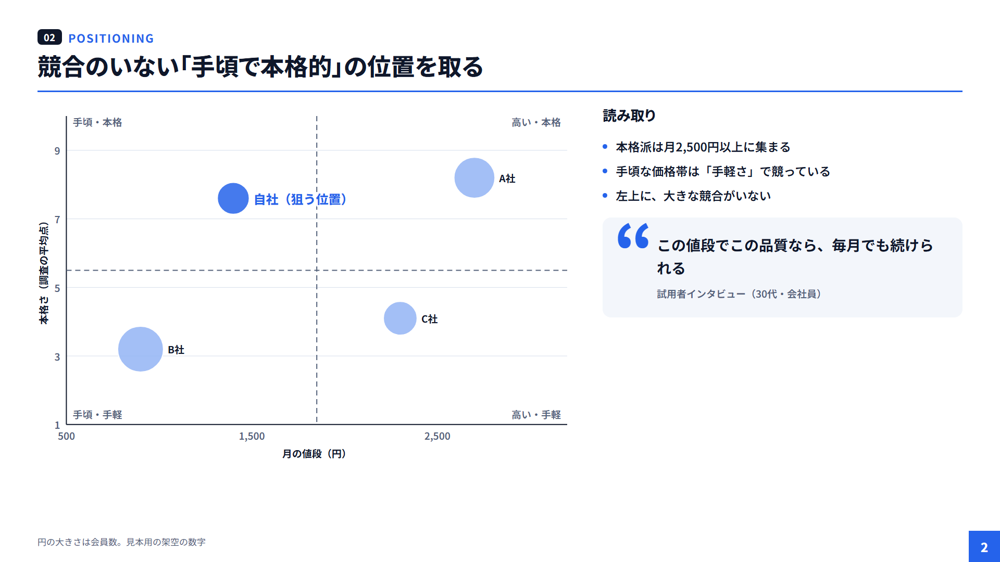
</p>
<p>
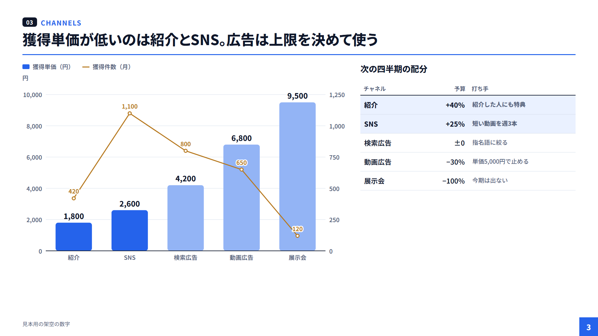
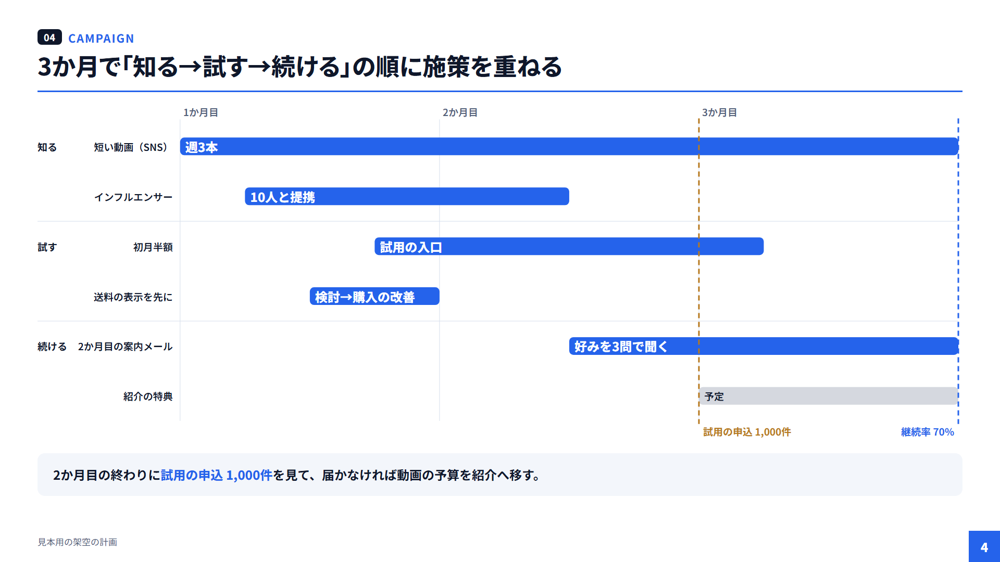
</p>
<p>
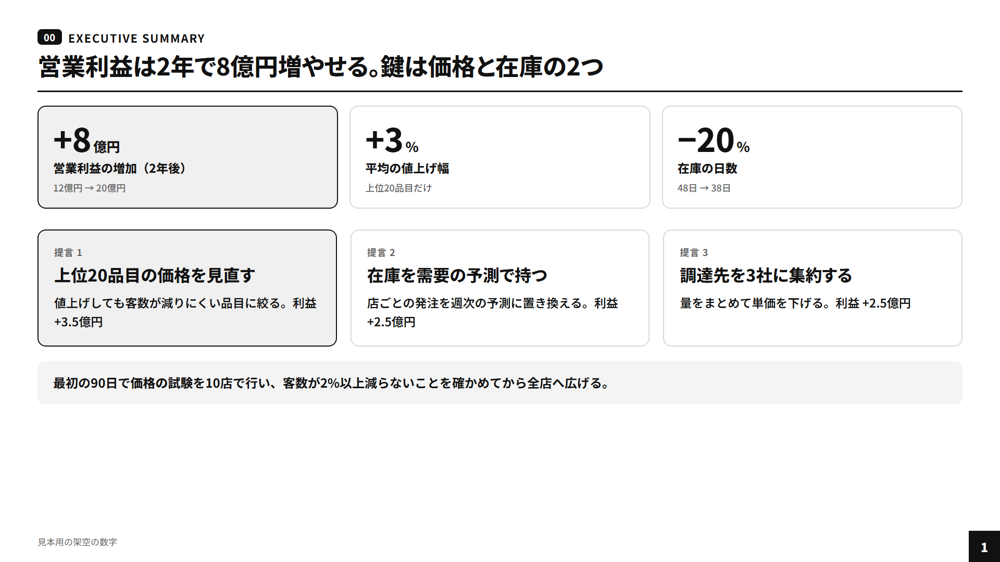
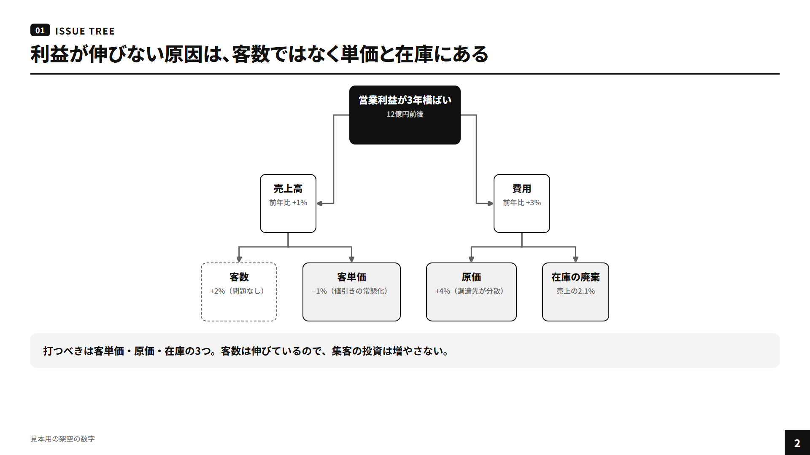
</p>
<p>
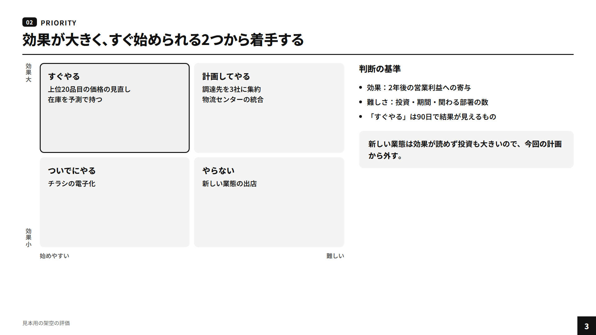
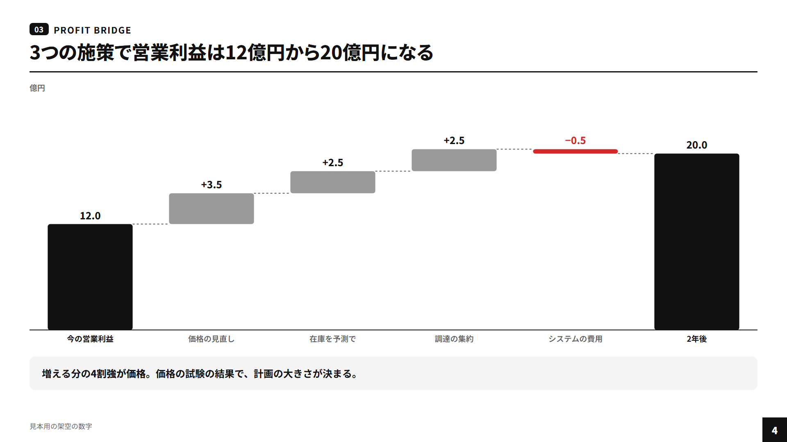
</p>

ファネルは横棒の `highlight`、ポジショニングは `"type":"bubble"` と `quad`、利益のブリッジは `"type":"waterfall"`、イシューツリーは `.tree.dgm` で、どれも見本の HTML を写して数字と言葉を変えるだけです。

```html
<div class="chart" style="height:640px" data-chart='{"type":"waterfall","unit":"億円","fmt":{"d":1},"items":[
  {"label":"今の営業利益","v":12,"total":true},{"label":"価格の見直し","v":3.5},{"label":"在庫を予測で","v":2.5},
  {"label":"調達の集約","v":2.5},{"label":"システムの費用","v":-0.5},{"label":"2年後","total":true,"color":"accent"}]}'></div>
```

### 使い方：頼むだけ

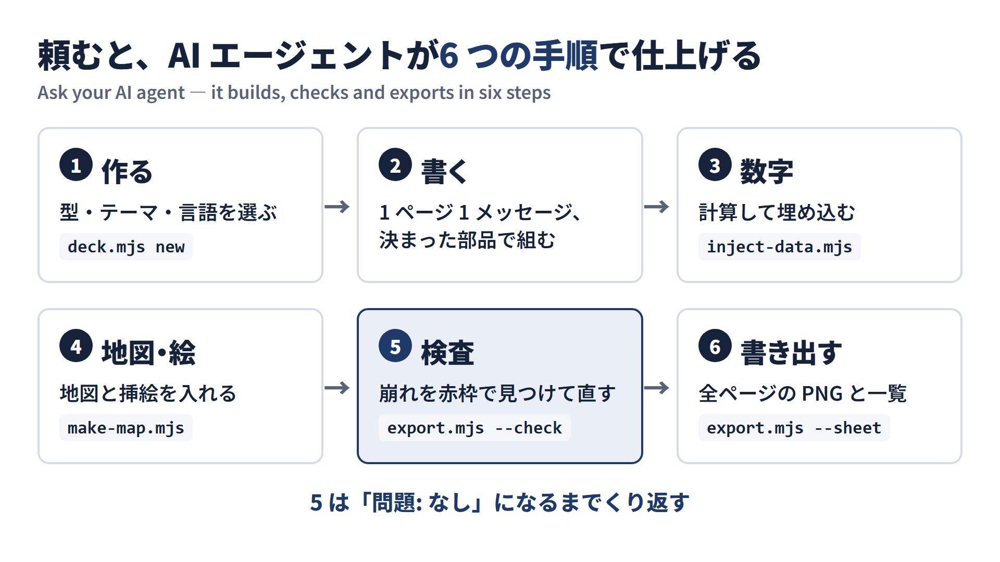

エージェントのチャットで「◯◯の事業計画を 15 枚のスライドにして」「このマーケティング計画をスライドにして」「このページにグラフを入れて」「PNG に書き出して」と頼むと、エージェントが [SKILL.md](SKILL.md) を読んで上の手順で仕上げます。最初に型（資料か発表か）・テーマ・言語を聞き、最後に全ページを検査して PNG を目で確かめます。

---

## できること（実際のスライド）

### 1. ページの型：結論を言い切る見出し

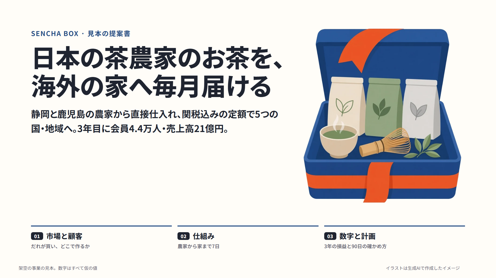

<p>
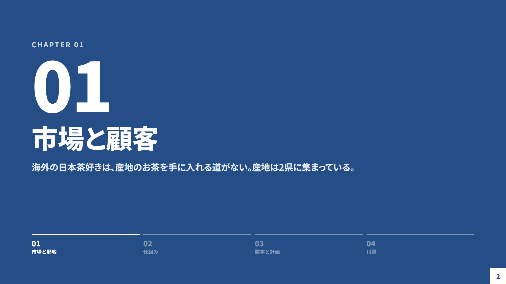
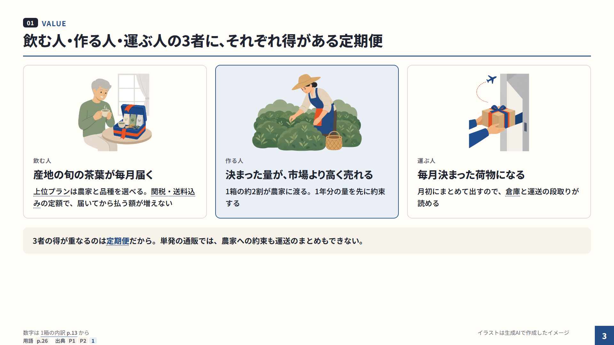
</p>

どのページも **小見出し → 結論の 1 文（h1）→ 線 → 本文 → まとめの帯 → 注記** の同じ並びです。見出しは「市場規模」のような題名ではなく「アジアの 3 つの国・地域から始め、7 か月目に北米へ広げる」のように言い切るので、見出しだけ読めば話が通ります（書き方は [reference/writing.md](reference/writing.md)）。中扉には章の並びが自動で付き、今の章が分かります。

```html
<section id="value">
  <div class="kicker"><span class="sec">01</span>VALUE</div>
  <h1>飲む人・作る人・運ぶ人の3者に、それぞれ得がある定期便</h1>
  <div class="rule"></div>
  <div class="grid">
    <div class="card"><div class="when">飲む人</div>
      <h2>産地の新茶が毎月届く</h2><p>…</p></div>
    <div class="card key">…</div>   <!-- key で強調（1 ページ 1〜2 か所） -->
  </div>
  <div class="strip">3者の得が重なるのは<b>定期便</b>だから。</div>
  <div class="foot"><span>注記・出典</span></div>
</section>
```

部品：カード・大きな数字（KPI）・足し算の流れ・時間の帯・表・横棒・左右の比べ・2×2・ピラミッド・ベン図・引用・画像（一覧は [reference/components.md](reference/components.md)）。

### 2. グラフ

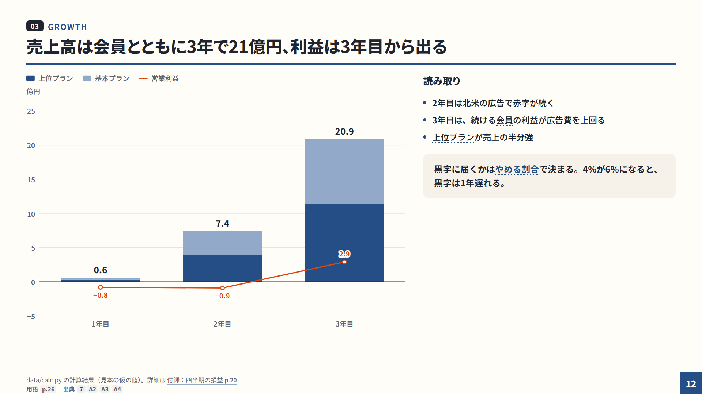

<p>
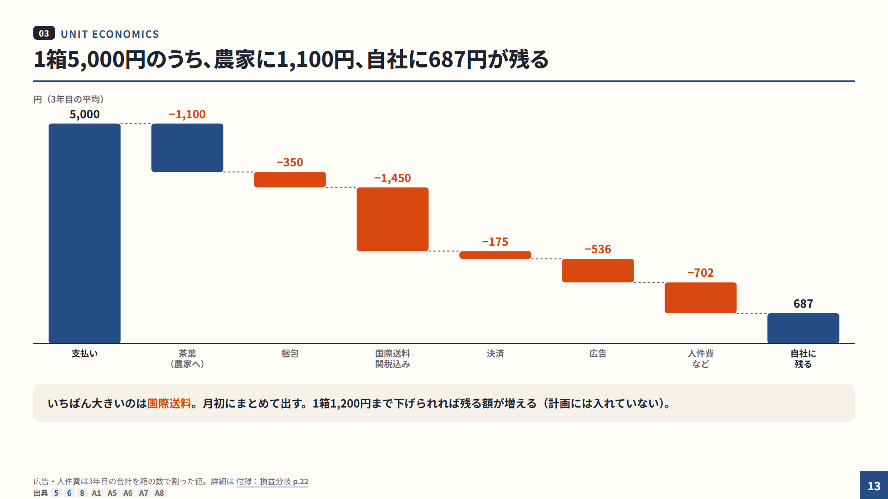
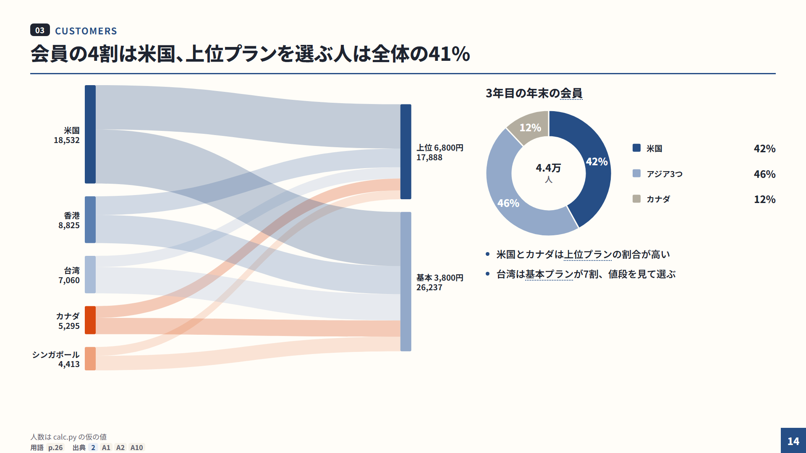
</p>
<p>
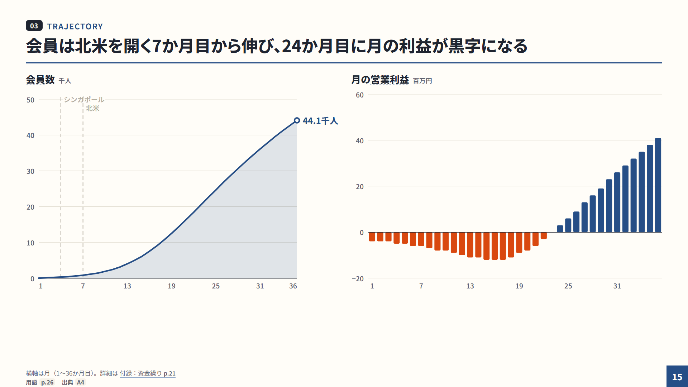
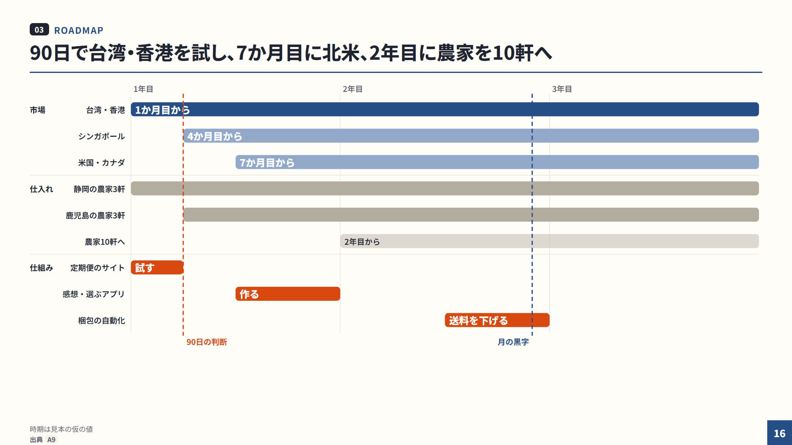
</p>

外部のライブラリを使わない自前の SVG で、テーマの色に自動で合います。上から **積み上げ棒＋線（右の軸も可）**、**滝**（1 箱の値段から利益まで）、**サンキー＋ドーナツ**、**面＋正負で色を変える棒**、**ガント**。ほかに横棒・100% 積み上げ・線・散布・バブル（下の「資料の見本の全 18 ページ」を開いた中の競合のページ）。`data-chart` に JSON を書くだけで描けます。

```html
<div class="chart" style="height:700px" data-chart='{
  "type": "bar", "stacked": true, "labels": ["1年目","2年目","3年目"], "unit": "億円",
  "series": [
    {"name": "上位プラン", "values": "@byPlan.premium", "color": "accent"},
    {"name": "基本プラン", "values": "@byPlan.standard", "color": "mid"},
    {"name": "営業利益",   "values": "@op", "type": "line", "color": "warn"}
  ]}'></div>
```

`"@byPlan.premium"` は計算結果（[5. 数字は計算から](#5-数字は計算から)）を指します。どのグラフを選ぶかの早見表は [reference/charts.md](reference/charts.md)。

### 3. 図

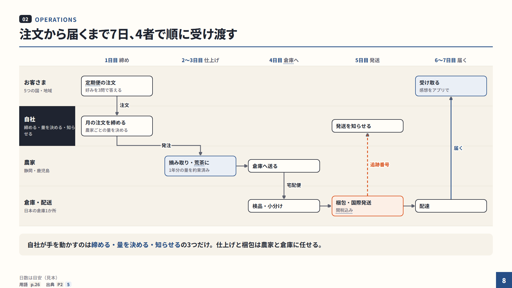

<p>
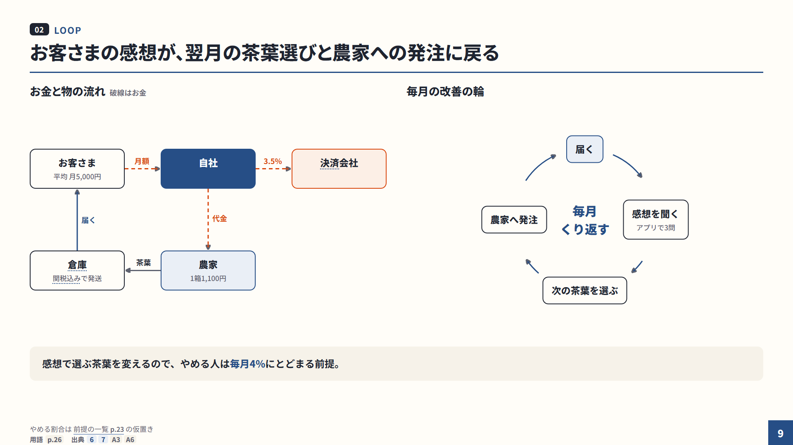
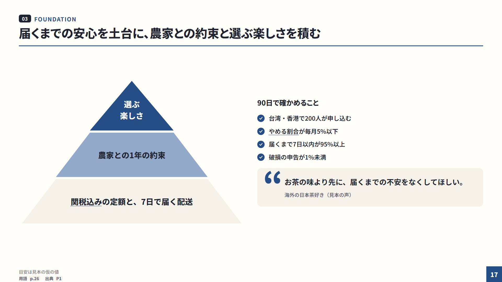
</p>

**担当者ごとのフロー図**（行＝担当、列＝段階）、**関係図**（お金の流れは破線）、**循環図**、ピラミッド、ツリー。箱は HTML で並べ、矢印は箱の id をつなぐだけで自動で引きます（直線・カギ形・曲線、ラベルの位置も自動）。

```html
<div class="lanes dgm" style="--cols:5; --rows:4"
     data-links='[["l1","l2","注文"],["l2","l3","発注"],["l6","l7","追跡番号",{"dash":true}],["l8","l9","届く",{"tone":"key"}]]'>
  <div class="who">お客さま</div>
  <div class="cell"><div class="box" id="l1">定期便の注文</div></div> …
</div>
```

詳しくは [reference/diagrams.md](reference/diagrams.md)。

### 4. 地図

<p>
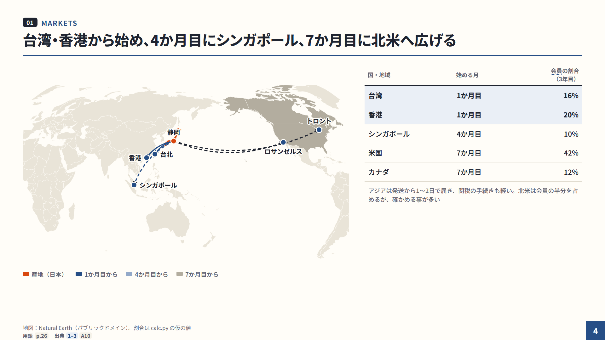
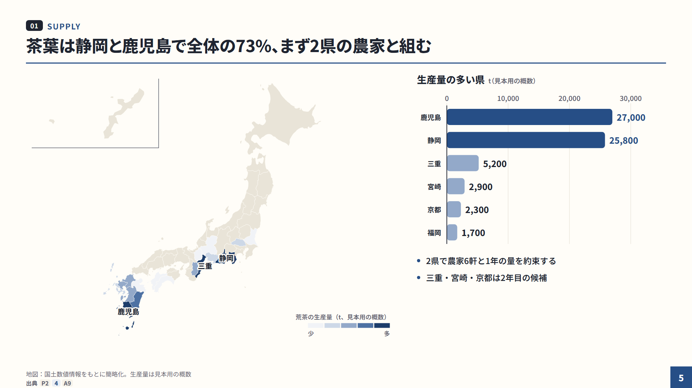
</p>

**世界地図**（太平洋を中心に、国の塗り分け・都市の点・弧の矢印）と、**日本の都道府県の塗り分け**（凡例・沖縄の差し込み付き）。ほかに国ごとの地図も。Natural Earth のデータから SVG を作ってデッキに埋め込むので、ネットなしで表示でき、色はテーマに従います。

```json
{ "name": "markets", "pacific": true,
  "fill":   { "TW": "accent", "HK": "accent", "SG": "mid", "US": "sub", "JP": "warn" },
  "arcs":   [ { "from": [138.38, 34.98], "to": "Taipei", "cls": "accent" } ],
  "points": [ { "city": "Taipei", "text": "台北", "label": "right" } ] }
```

```bash
node scripts/make-map.mjs maps.json --into slides.html   # <!--MAP:markets--> の場所に書き込む
```

詳しくは [reference/maps.md](reference/maps.md)。

### 5. 数字は計算から

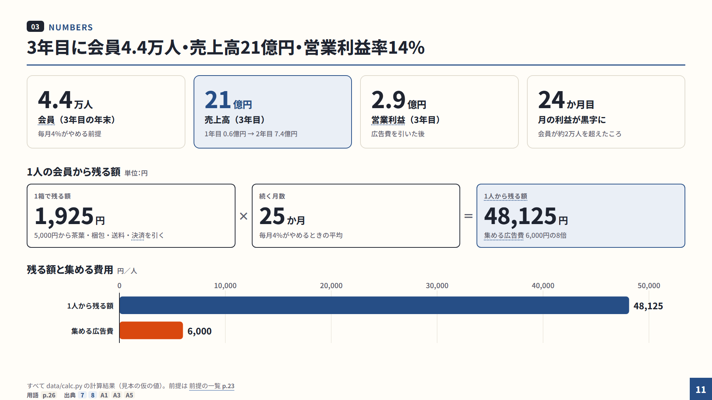

スライドの数字は手で打ちません。Python で計算した結果を JSON にしてデッキに埋め込み、`data-f` とグラフの `"@path"` で参照します。前提（やめる割合・広告費など）を 1 か所変えて 3 行を実行し直すと、**見出しの数字・カード・グラフ・地図がそろって変わり**、ページ間で数字が食い違いません。

```python
# data/calc.py（抜粋）
CHURN = 0.04                                              # 毎月やめる割合
COST = {"tea": 1100, "pack": 350, "ship": 1450, "pay_rate": 0.035}   # 1箱あたり
…
data = {
    "rev": [oku(v) for v in rev_y],                                   # 年ごとの売上高（億円）
    "members": [round(members[11]), round(members[23]), round(members[35])],
    "life": round(1 / CHURN),                                         # 続く月数
    …
}
(HERE / "data.json").write_text(json.dumps(data, ensure_ascii=False, indent=1), encoding="utf-8")
```

```html
<h1>3年目に会員<span data-f="members.2" data-x="0.0001" data-d="1"></span>万人・売上高<span data-f="rev.2"></span>億円</h1>
```

```bash
python data/calc.py
node scripts/inject-data.mjs slides.html pitch.html data/data.json
```

書式は `data-d`（小数の桁）・`data-x`（掛ける数）・`data-u`（単位）・`data-sign`（＋を付ける）。流れは [reference/data.md](reference/data.md)。

### 6. イラスト

<p>


</p>

表紙とカードの絵はエージェントの画像生成ツール（Cursor なら GenerateImage）で描きます。画像生成ツールがないエージェントでは、絵なしのページで作ります（絵以外はすべて Node と Python で動きます）。**テーマごとに固定した画風の指示**（色・線・影・余白・文字なし）を毎回付け、2 枚目からは 1 枚目を参考画像に渡すので、1 つのデッキの絵がそろいます。`scripts/to_webp.py` で背景を透明にして webp にするので、和風の生成りやダークの背景にもなじみます（指示の全文は [reference/illustrations.md](reference/illustrations.md)）。

### 7. 発表用の型（pitch）


<p>
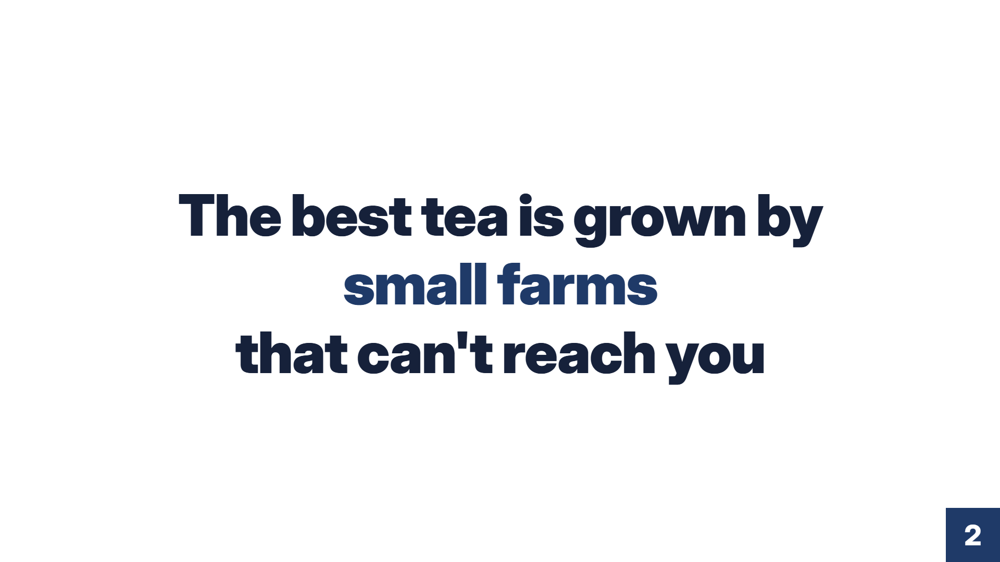

</p>

`--mode pitch` にすると、**文字はすべて 54px 以上**（検査が確かめる）、1 ページに 1 つのこと。大きな一言・大きな数字・絵 3 枚・地図・単純な棒・反転の締め、の部品があります。各ページに台本（`<aside class="notes">`）と終わりの目標時刻（`data-end="1:05"`）を書くと、**N** でメモを重ね、**P** でページ送りが連動する発表者用の窓（経過時間と目標）を開けます。資料（doc）と発表（pitch）は同じデータを共有できます。


### 8. 崩れの自動検査

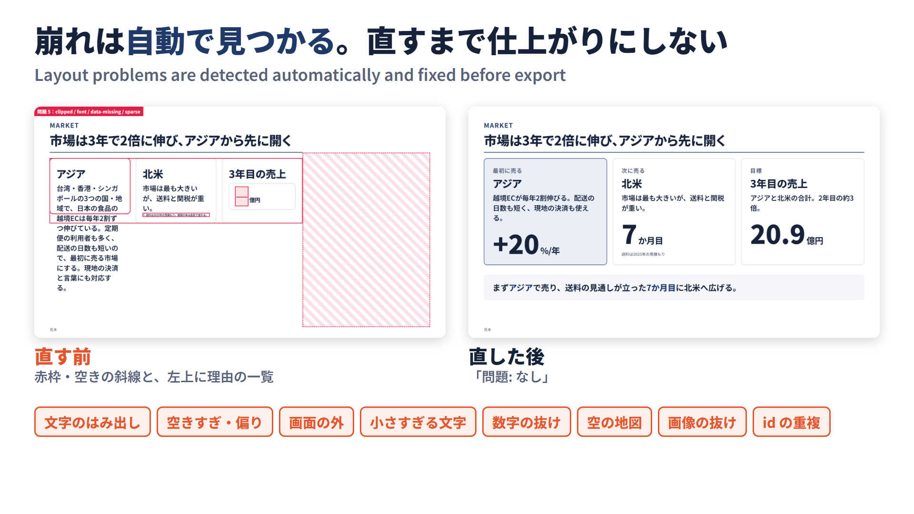

`export.mjs --check` が Chrome headless で全ページを描き、崩れを赤枠（空きは赤い斜線）で示して一覧にします。

| 理由 | 見つけるもの |
|---|---|
| `clipped` | 箱から文字があふれている |
| `sparse` | 中身が片側に寄って空きが大きい（左右の空きの差が 15% 以上、または下の空きが上より 35% 以上多い）。中央に寄せたページや表紙・中扉は対象外で、わざと空けるページは `data-sparse-ok` |
| `outside` | 1920×1080 の外へ出ている |
| `on-foot` | 下の注記に重なっている |
| `font` | 小さすぎる文字（doc は 16px、pitch は 54px 未満） |
| `data-missing` | 参照した計算結果がない |
| `map-empty` | 地図がまだ書き込まれていない |
| `image-missing` | 画像が読めない |
| `dup-id` | 同じ id が 2 か所（ページと図の箱など） |
| `link-missing` | ページ内リンクの飛び先の id がない |

エージェントは「問題: なし」になるまで直してから、PNG を書き出して目で確かめます。

### 9. テーマ

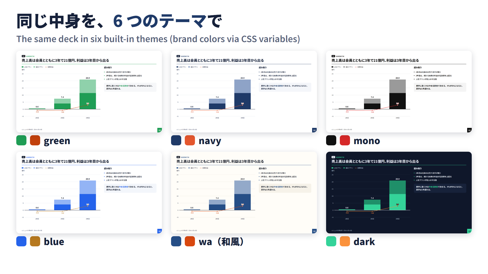

`green` `navy` `mono` `blue` `wa`（和風）`dark`。どれも **強調の色** と **お金・注意の色** の 2 色＋灰色で組み、グラフ・図・地図・イラストの指示が同じ色に合います。作った後でも 1 行で変えられます。

```bash
node scripts/deck.mjs set slides.html --theme dark
node scripts/export.mjs slides.html --theme navy --out /tmp/navy   # 変えずに試し撮り
```

会社やブランドの色に合わせるときは、デッキの `<style>` で色の変数を上書きします（グラフ・図も同じ変数を使うのでそろって変わります。変数の一覧は `assets/themes.css`）。

```css
html[data-theme] { --accent: #7c3aed; --accent-bg: #f3edff; --accent-mid: #c4b5fd; --c1: #7c3aed; }
```

### 10. 付録と敵対的な検査

読んだ人が数字をたどれて、疑いに耐える資料にするための道具です。付録は JSON から作るので、ページの並びや本文を変えても番号・ページ番号がずれません。

<p>
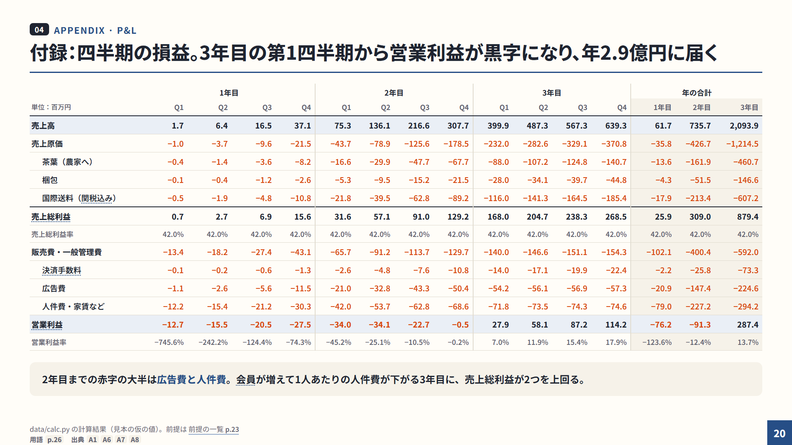
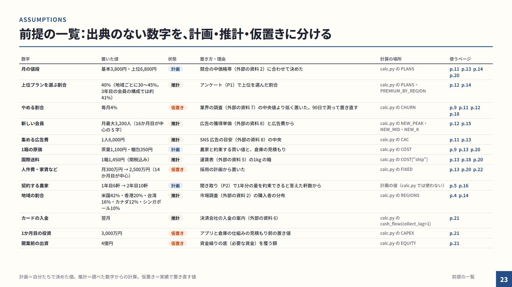
</p>
<p>
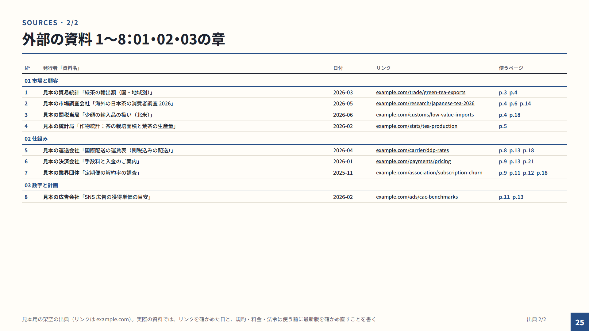
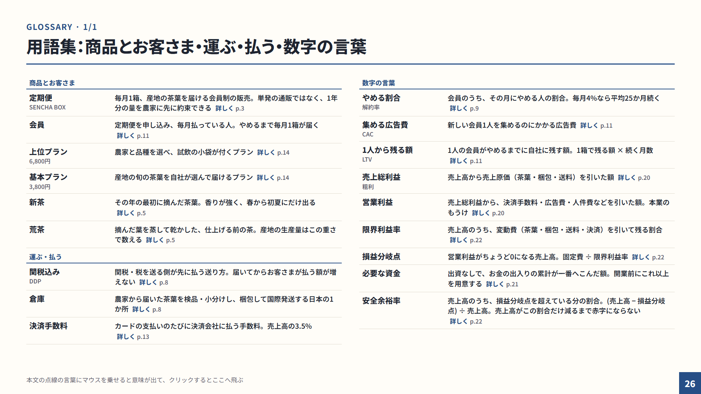
</p>

| 道具 | やること |
|---|---|
| `build-sources.mjs` | `sources.json` から一次調査・外部の資料・前提の一覧のページを作る。外部の資料は最初に使うページの順に番号を振り、各ページの注記の下に「出典 1 3–6 P2 A3」を出す。前提の一覧は数字ごとに計画・推計・仮置きと計算の場所を書く。文の中で資料を指すときは `{{key}}` で、番号は振り直したものに置き換わる |
| `build-glossary.mjs` | `glossary.json` から用語集を作り、本文の各ページで最初に出る言葉に下線を引く（クリックで意味へ） |
| ページ内リンク | `<a class="ref" href="#unit">` に「p.13」が自動で付き、飛んだ先に「← 元のページへ」。飛び先がなければ検査が知らせる |
| `templates/finance.py`＋`data-fin` | 月ごとの売上・費用から、四半期と年の損益計算書・資金繰り（入金の遅れ・出資・必要な資金）・損益分岐を計算し、表の部品で描く |
| `audit.mjs`（機械の検査） | 描いたあとの全ページを読み、ページをまたいだ数字の食い違い（丸めの違いは分ける）・出典のない数字・切れたリンク・題名だけの見出しを一覧にする |
| 専門家役のレビュー＋`build-review.mjs` | エージェントが 20 の分野の専門家の役で 5 問ずつ厳しい質問を出し、資料だけを根拠に答えて A/B/C を付ける。何人もが突いた論点・原文で確かめた食い違い・ページ別の参照索引の Markdown にまとめる |

見本では、機械の検査で見つからなかった「新茶を毎月届ける」と「新茶は春から初夏だけ」の矛盾や、見出しの「36%上回る」（表の数字では約 55%）をレビューが見つけ、直しました。レビューの結果は [examples/demo/review/slides-review.md](examples/demo/review/slides-review.md)、機械の検査は [slides-audit.md](examples/demo/review/slides-audit.md) です。

```bash
node scripts/build-sources.mjs slides.html data/sources.json
node scripts/build-glossary.mjs slides.html data/glossary.json
node scripts/export.mjs slides.html --check
node scripts/audit.mjs slides.html                 # review/ に検査の結果と、レビューが読む本文
node scripts/build-review.mjs review/slides-review.json --experts 20 --questions 5
```

<details>
<summary>資料の見本の全 26 ページ</summary>

架空の日本茶の定期便の事業計画を題材にした見本です（`examples/demo/slides.html`。数字は `data/calc.py` の計算、イラストは生成 AI）。


<p>

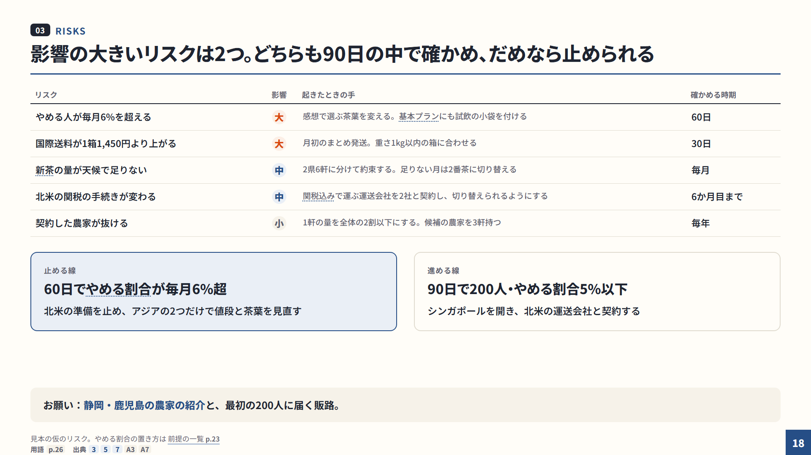
</p>

</details>

---

### 入れ方

使うエージェントのスキルのフォルダに clone して、地図に使うパッケージを入れます。

```bash
# Cursor
git clone https://github.com/32Lwk/html-slides.git ~/.cursor/skills/html-slides
# Claude Code
git clone https://github.com/32Lwk/html-slides.git ~/.claude/skills/html-slides

cd <clone した場所>/scripts && npm install     # 地図に使う d3-geo・topojson-client
```

- ほかのエージェントでも、`SKILL.md` 形式のスキルを読めるものなら、そのスキルのフォルダに置けば使えます。スキルに対応していないエージェントでは、「`<clone した場所>/SKILL.md` を読んで、その手順でスライドを作って」と頼めば同じ手順で進みます
- スクリプトは自分の場所から `assets/` を探すので、どこに置いても動きます
- Windows（PowerShell）は `~` を `$env:USERPROFILE` に置き換える
- 必要なもの：Node 18 以上、Chrome か Edge、Python 3（numpy。イラストの後処理に Pillow）
- Windows で Python の日本語が化けるときは環境変数 `PYTHONUTF8=1` を設定する

エージェントによって違うのはイラストだけです（画像生成ツールがあれば描き、なければ絵なしで作る）。デッキを作る・計算を埋め込む・地図・検査・書き出しは Node と Python のスクリプトなので、どのエージェントでも、手で実行しても同じ結果になります。

### 手で使う

エージェントなしでも、コマンドだけで作れます。

```bash
S=<clone した場所>/scripts
node $S/deck.mjs new ./my-deck --mode doc --theme green --lang ja --title "題名"   # デッキを作る
python calc.py && node $S/inject-data.mjs ./my-deck/slides.html data.json      # 計算を埋め込む
node $S/make-map.mjs maps.json --into ./my-deck/slides.html                      # 地図を書き込む
node $S/export.mjs ./my-deck/slides.html --check                                 # 検査（問題のページと理由）
node $S/export.mjs ./my-deck/slides.html --sheet                                 # PNG と一覧の sheet.png
```

ブラウザでは ← → ・スペースでページ送り、**F** で全画面。`slides.html#growth` のように id を付けるとそのページから開きます。

### 中身

| パス | 中身 |
|---|---|
| [SKILL.md](SKILL.md) | エージェントが読む手順（最初に決めること・手順・検査の直し方・コマンド） |
| [reference/](reference/) | 書き方・部品・グラフ・図・地図・データ・イラスト・出典と用語集・財務の表・敵対的な検査の詳しい説明 |
| `assets/` | テーマ・CSS・ランタイム・表・グラフ・図・フォント・地図のデータ |
| `scripts/` | `deck.mjs`（作る・更新）`export.mjs`（書き出し・検査）`inject-data.mjs` `make-map.mjs` `build-sources.mjs` `build-glossary.mjs` `audit.mjs` `build-review.mjs` `to_webp.py` |
| `templates/` | `deck new` の元（doc・pitch）と財務の計算のひな形 `finance.py` |
| `examples/demo/` | 見本のデッキ（事業計画の資料 26 枚・発表 7 枚）・計算・出典と用語集の JSON・地図の仕様・PNG・検査とレビューの結果（`review/`） |
| [examples/usecases/](examples/usecases/) | マーケティング（4 枚）とコンサルティング（5 枚）の見本と PNG。開く前に `node scripts/deck.mjs update examples/usecases/marketing.html` でフォントを置く |
| [examples/project-skill/SKILL.template.md](examples/project-skill/SKILL.template.md) | 案件ごとの約束（表記・出典・公開手順）を書くプロジェクトスキルのひな形 |
| `docs/figures/` | この README の図（図もこのスキルで作っている。`node docs/figures/build.mjs` で作り直す） |

**2 段の使い方**：汎用のデザインと道具はこの個人スキルに、案件ごとの約束（用語・為替・出典・公開の手順）はリポジトリのスキル（Cursor は `.cursor/skills/<名前>/SKILL.md`、Claude Code は `.claude/skills/<名前>/SKILL.md`）に分けると、どの案件でも同じ見た目で作れます。ひな形は実際の案件で使ったプロジェクトスキルから事業の中身を抜いたものです。

### ライセンス

スキル本体は [MIT](LICENSE)。同梱のフォント（Noto Sans JP・Inter）は SIL OFL 1.1、地図のデータは Natural Earth（パブリックドメイン）。詳しくは [THIRD_PARTY.md](THIRD_PARTY.md)。

---

## English

**An AI-agent skill for building polished 1920×1080 HTML slide decks with consistent quality** — charts, diagrams, maps, tables, computed numbers, illustrations, PNG export and automatic layout checks in one package. It follows the [Agent Skills](https://agentskills.io/) format (`SKILL.md`), so it works in Cursor, Claude Code and other agents that read skills, and every script also runs by hand with Node and Python. Every image here is a slide exported from the examples (`examples/`). The skill documentation is written in Japanese; decks can be English (`--lang en`, see the pitch demo).


The twelve slides above are only a sample: bar (stacked, 100%, horizontal), line, area, donut, scatter, bubble, waterfall, Sankey and Gantt charts and their combinations; swimlanes, relationship and cycle diagrams, trees, pyramids, 2×2 matrices and Venn diagrams; tables, KPI cards, timelines, comparisons, quotes, photos and screenshots; world, country and Japanese-prefecture maps.

### Use cases


Beyond business plans and pitches, the same takeaway-headline style fits **marketing plans** (funnel, positioning, channel CAC, campaign plan), **consulting reports** (executive summary, issue tree, 2×2 priority matrix, profit bridge, roadmap), research reports and internal decks. See [examples/usecases/](examples/usecases/).

| | What you get | Example |
|---|---|---|
| **Page pattern** | Every slide: kicker → one-sentence takeaway headline → body → summary strip → footnote | [cover](examples/demo/png/01-cover.png), [cards](examples/demo/png/03-value.png) |
| **Charts** | Built-in SVG: stacked bar + line (secondary axis), waterfall, Sankey, donut, area, Gantt, scatter/bubble — one JSON spec in `data-chart` | [growth](examples/demo/png/12-growth.png), [unit](examples/demo/png/13-unit.png), [mix](examples/demo/png/14-mix.png), [roadmap](examples/demo/png/16-roadmap.png) |
| **Diagrams** | Swimlane flows, relationship diagrams (dashed = money), cycles, pyramids, trees; arrows routed automatically between box ids | [lanes](examples/demo/png/08-lanes.png), [loop](examples/demo/png/09-loop.png) |
| **Maps** | World (Pacific-centered, fills, points, arcs), single countries, Japanese prefecture choropleth with Okinawa inset — generated from Natural Earth, embedded as SVG | [world](examples/demo/png/04-markets.png), [Japan](examples/demo/png/05-farms.png) |
| **Numbers from code** | A Python model writes JSON; headlines, cards and charts reference it via `data-f` / `"@path"`, so numbers never drift | [kpi](examples/demo/png/11-kpi.png) |
| **Illustrations** | Fixed per-theme style prompts for your agent's image-generation tool + background removal to webp (skipped if the agent has no image tool) | [cards](examples/demo/png/03-value.png) |
| **Pitch mode** | All text ≥ 54px (checked), speaker notes, synced presenter window with timer | [pitch sheet](examples/demo/png-pitch/sheet.png) |
| **Automatic checks** | Headless Chrome flags overflow, lopsided or sparse layouts (large empty areas), off-canvas, tiny text, missing data, empty maps, missing images, duplicate ids | see below |
| **Themes** | `green` `navy` `mono` `blue` `wa` `dark`, switchable in one command; brand colors via CSS variables (`html[data-theme] { --accent: … }`) | see below |
| **Appendices** | Sources (numbered by first use, per-page citation row), an assumptions table (plan / estimate / placeholder + where it is computed) and a glossary with in-text links, all generated from JSON; auto page numbers on internal links with a "back" link | [assumptions](examples/demo/png/23-assump.png), [sources](examples/demo/png/25-src-1.png), [glossary](examples/demo/png/26-gl1.png) |
| **Finance** | `templates/finance.py` computes a quarterly P&L, cash flow (collection lag, equity, funding need) and break-even; `data-fin` renders the statement table | [P&L](examples/demo/png/20-fin-pl.png), [cash](examples/demo/png/21-fin-cf.png), [break-even](examples/demo/png/22-fin-bep.png) |
| **Adversarial review** | `audit.mjs` cross-checks numbers across pages, unsourced numbers and broken links; the agent then role-plays 20 domain experts × 5 hard questions, answers only from the deck and grades A/B/C; `build-review.mjs` writes the Markdown report | [review](examples/demo/review/slides-review.md) (Japanese) |


### Install

Clone into your agent's skills folder, then install the map dependencies:

```bash
git clone https://github.com/32Lwk/html-slides.git ~/.cursor/skills/html-slides   # Cursor
git clone https://github.com/32Lwk/html-slides.git ~/.claude/skills/html-slides   # Claude Code
cd <clone>/scripts && npm install
```

Other agents that read `SKILL.md` skills work the same way; with an agent that doesn't, just ask it to "read `<clone>/SKILL.md` and follow it". Requires Node 18+, Chrome or Edge, and Python 3 (numpy; Pillow for illustrations). Then ask your agent to "make slides about …", "turn this marketing plan into slides", "add a chart", or "export to PNG".

### Manual use

No agent needed:

```bash
S=<clone>/scripts
node $S/deck.mjs new ./my-deck --mode pitch --theme navy --lang en --title "Title"
node $S/inject-data.mjs ./my-deck/slides.html data.json
node $S/make-map.mjs maps.json --into ./my-deck/slides.html
node $S/export.mjs ./my-deck/slides.html --check
node $S/export.mjs ./my-deck/slides.html --sheet
```

### License

The skill is [MIT](LICENSE). Bundled fonts (Noto Sans JP, Inter) are under the SIL OFL 1.1 and map data is from Natural Earth (public domain). See [THIRD_PARTY.md](THIRD_PARTY.md).
