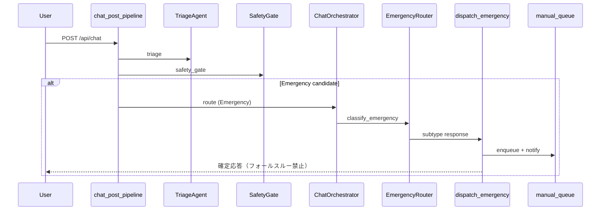

# マルチエージェントアーキテクチャ

## 概要

`LLM_AGENT_ENABLED=true` 時、チャット POST は `ChatOrchestrator` 経由でトリアージ後のハンドオフを実行する。カナリアは廃止し、フラグ ON で全セッションがエージェント経路となる（OFF は従来経路のキルスイッチ）。

## エージェント一覧

| エージェント | 役割 |
|-------------|------|
| TriageAgent | カテゴリ分類（Physical / Emotional / Emergency / Ask / Other） |
| SafetyGate | 診断名・不適切・緊急の決定的チェック |
| EmergencyRouter | 店舗 / メディカル / クライシス分岐 |
| PhysicalOrchestrator | 症状解析・rule_based 推奨 |
| NLUAgent | 属性・症状 NLU + ユーザー嗜好 GPT（`resolve_nlu_for_recommendation` で症状解析 ∥ `extract_preferences_with_gpt` を並列実行しマージ後キャッシュ）。症状 GPT フォールバック（`extract_symptoms_with_gpt`）は en/ko/zh 入力を受け取り `symptoms[].name` は辞書の日本語 canonical に正規化 |
| ExplanationAgent | カード先行後の推奨理由（SSE `explanations`） |
| CounselingManager | Emotional 系 |
| ConciergeAgent | 挨拶・できること・構成説明・軽い雑談（Other の窓口） |
| StoreInquiryAgent | Other / 店舗案内 |
| ModerationAgent | 境界クライシス検知 |

## Emergency フロー

1. `is_emergency_candidate()` でゲート
2. `classify_emergency()` で `store_incident` / `medical_self` / `crisis_language`
3. `dispatch_emergency()` → 店舗カード or メディカル HTML（119 明示）
4. メディカル: `medical_emergency_otc_locked`（ハード）/ 店舗: `store_incident_soft_banner`（ソフト）

### EmergencySubtype と priority_tag

| subtype | priority_tag | OTC 方針 |
|---------|--------------|----------|
| crisis_language | critical_crisis | 推奨停止 |
| medical_self | critical_medical | ハードロック（明示解除） |
| store_incident | store_high / store_low | ソフトバナー（オプトイン） |

## SSE イベント

| event | 内容 |
|-------|------|
| status | 処理ステップ（`detail_code` / `detail_label` 任意） |
| cards | 推奨薬カード（説明は空でも可） |
| explanations | 推奨理由の追送 |
| bot_followup | 第2応答シグナル（クライアントは messages 再取得） |
| advice_delta | 個別アドバイスのストリーム |

## トリアージキャッシュ

`src/services/triage_cache.py` — 正規化テキスト + `user_attributes` ダイジェスト、LRU・TTL は `TRIAGE_CACHE_MAX_ENTRIES` / `TRIAGE_CACHE_TTL_SEC`。

## ユーザー嗜好 NLU

- 並列解決: [`src/handlers/chat/nlu_resolve.py`](../src/handlers/chat/nlu_resolve.py)
- カタログ: [`data/user_preference_keyword_catalog.json`](../data/user_preference_keyword_catalog.json)
- 手動 QA: [`docs/MANUAL_QA_PREFERENCES.md`](MANUAL_QA_PREFERENCES.md)
- 開発レビュー: [`docs/PREFERENCE_NLU_DEV_REVIEW.md`](PREFERENCE_NLU_DEV_REVIEW.md)

## 管理画面

手動キュー: `priority_tag`（critical_crisis > critical_medical > store_*）、一覧 120 文字 / 詳細 800 文字抜粋。PII は自動マスクせず運用 playbook 参照（`docs/ADMIN_PII_PLAYBOOK.md`）。

## 緊急メール通知

`emergency_dispatch` がキュー登録時に `emergency_notify.notify_emergency_detected` を呼ぶ。宛先は管理設定の `alert_email`（`budget_guard.get_alert_email`）。`EMERGENCY_EMAIL_ENABLED=false` で無効化。SMTP 未設定時は `smtp_not_configured` をキュー `notification_status.email` に記録。
