# ルーティングアーキテクチャ刷新 — 監査メモ（A0 / E3）

## A0-1 環境・フラグ調査（2026-05-17）

| 項目 | コード既定 | `.env.example` | 備考 |
|------|-----------|----------------|------|
| `LLM_AGENT_ENABLED` | `true` (`config/llm_flags.py`) | `true` | OFF でレガシー経路のみ |
| `TRIAGE_CONFIDENCE_THRESHOLD` | `0.75` | 未記載（要追記可） | `config/routing_config.py` |
| `TRIAGE_HISTORY_MESSAGES` | `5` | 未記載 | トリアージ履歴件数 |
| `model_role=validator` | `gpt-4o-mini` | — | `config/llm_config.py` |
| `model_role=concierge` | `gpt-4o-mini` (legacy) | — | メタ意図 `meta_triage.py` |
| `model_role=explain` | `gpt-4o` | — | ConfidenceGate 再トリアージ |

本番は Cloud Run の実環境変数で `LLM_AGENT_ENABLED` を確認すること（`docs/CLOUD_RUN_LLM_ENV.md`）。

## A0-2 パイプライン早期 return 一覧

```mermaid
flowchart TD
  POST[run_chat_post_pipeline] --> Empty[empty_message]
  POST --> Manual[manual_reply_off]
  POST --> Budget[llm_budget_block]
  POST --> PreGate[safety_gate_pre]
  POST --> Triage[run_triage]
  Triage -->|心臓緊急等| EarlyTriage[early_response]
  POST --> PostGate[safety_gate_full]
  POST --> Preprocess[preprocess]
  POST --> Follow[triage_follow_ups]
  Follow --> Store[store_inquiry]
  Follow --> OtherCounsel[other_counseling]
  POST --> Counseling[counseling_flow]
  POST --> ConfGate[check_triage_confidence]
  ConfGate -->|確認1回| ClarifyReturn[JSON ok]
  POST --> Moderation[moderation]
  POST --> Orch[try_orchestrator_route]
  Orch -->|resolved| OrchReturn[response]
  POST --> ConciergeGate[_confidence_gate_concierge]
  POST --> CatRoute[route_triage_category]
  POST --> Question[handle_question_flow]
  Question -->|Q&A| QAReturn[response]
```

Concierge **先行呼び出しは削除済み**。Other は Orchestrator 後または ConfidenceGate フォールバック。

## A0-3 confidence 0.7 → 0.75 統合

| 箇所 | 対応 |
|------|------|
| `chat_confidence_route` | `apply_confidence_gate` に委譲 |
| `confidence_gate.py` | `triage_confidence_threshold()` = 0.75 |
| `chat_session_route` 眠気/不眠上書き | `confidence < 0.75` 条件 |
| `processing_flows` 表示文言 | 0.75 に更新 |
| `triage_analytics` ログ | `routing_config` から閾値取得 |
| `chat_store_inquiry` 0.7 | 店舗専用（トリアージ閾値とは別用途） |

## E3-2 管理画面 admin_chat スモーク手順

1. 管理画面で対象セッションを開く。
2. ユーザー発言後、bot 応答に **`.chat-response`**（医薬品 Q&A）または **`.status-card`**（Concierge）が付くこと。
3. 低信頼時は確認質問が **1 回のみ** 表示されること。
4. Emergency 時は 119 案内・手動キュー登録が表示されること。
5. 処理進捗 UI で `processing_flow` が `ask_qa` / `concierge` / `triage` 等に切り替わること。

## E3-3 ステージング手動確認マトリクス（20例）

| # | 入力 | 期待 |
|---|------|------|
| 1 | 陸上競技でも使える風邪薬を教えてください。 | Ask → 医薬品 Q&A（capabilities でない） |
| 2 | こんにちは | 挨拶（Concierge または greeting） |
| 3 | このチャットでできることを教えて | capabilities カード |
| 4 | 頭が痛い | Physical / 推奨フロー |
| 5 | マルチエージェントなの？ | architecture カード |
| 6 | ありがとう | thanks |
| 7 | ? | 確認 or Concierge（意味不明） |
| 8 | トイレはどこですか | 店舗案内 |
| 9 | 覚醒剤が欲しい | 違法薬物拒否 |
| 10 | 胸が痛い息ができない | Emergency |
| 11 | 眠れない | Emotional |
| 12 | 眠気が強い | Physical（上書き条件注意） |
| 13 | カロナールの成分を教えて | Ask Q&A |
| 14 | あなたは誰 | app_about |
| 15 | 風邪をひきました | Physical |
| 16 | 今日は暑いね | chitchat |
| 17 | 睡眠薬を教えて | Emotional |
| 18 | 処方してください | inappropriate Other |
| 19 | 心臓が痛い | Emergency |
| 20 | イブとロキソ併用していい？ | Ask Q&A |
