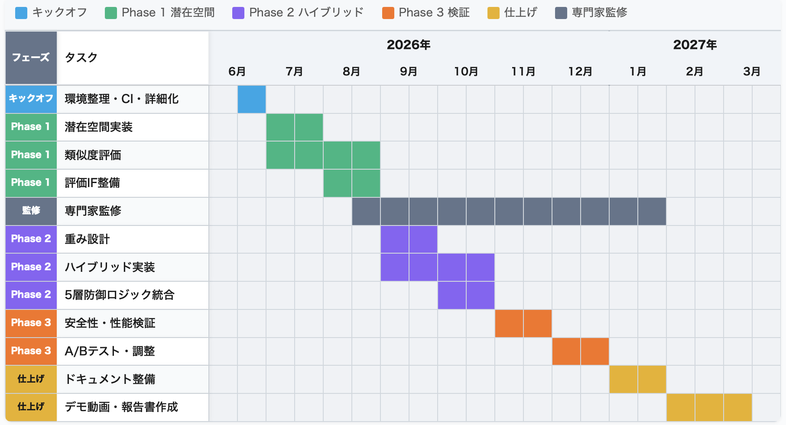

# 提案プロジェクト詳細資料（文案）

**提出時**: A4・縦置き・横書き・10.5ポイント以上のフォント・8ページ程度（10ページ以内）で作成してください。  
**冒頭に開発テーマ名と提案者名を記載してください。**

---

## ⓪ タイトル

**開発テーマ名**: 潜在空間ベクトルとルールベースを統合したOTC医薬品推奨システムの実装  

**提案者名**: 川嶋宥翔  

---

## ① 何を作るか

### 本提案のゴール（何をどこまで作るか）

既存のルールベースOTC医薬品推奨システムを土台に、**潜在空間ベクトル類似度を部分的に統合したハイブリッドスコアリング**を実装し、安全性指標（禁忌・アレルギー検出率）を維持したまま、症状に最も適した医薬品を推奨できる形で完成させる。目指すのは「判断を自動化すること」ではなく、**「人が誤らないための構造を提供すること」**である。

### 背景（なぜ）

日本の医療システムは、少子高齢化と人手不足により大きな転換期を迎えている。厚生労働省の調査によると、登録販売者の有効求人倍率は**3.56倍**、薬剤師は**3.57倍**と深刻な人手不足が続いている。一方で、セルフメディケーションの重要性が高まるなか、OTC薬の誤選択による健康被害も深刻化している。医薬品の過剰摂取による緊急搬送は増加しており、薬物依存症治療を受けた10代患者のうち、**市販薬による依存の割合は2014年の0%から2022年には65.2%へ急増**している。安全なセルフメディケーションのためには、適切な医薬品選択を支援する仕組みが不可欠である。

提案者は登録販売者としてドラッグストアに勤務するなかで、説明時間の不足と人手不足によるケアの限界を実感してきた。耳の不自由な高齢者や言葉の壁がある外国人など、薬選びに悩むお客様に十分な説明が割けない歯がゆさがある。また、実家は和歌山県の過疎地域で、最寄りのドラッグストアまで5kmあり、インターネット購入が増える一方で相談なしに誤選択するリスクも認識している。「誰もが、どこでも安心して薬を選べる社会」をテクノロジーで実現したい、という思いが本プロジェクトの出発点である。

### 目的（何を）・目標（どこまで）

- **目的**: LLMを自然言語理解（NLU）に限定して活用し、推奨判断は**ルールベースと潜在空間ベクトル類似度のハイブリッド**で行う。これにより、安全性を数学的に保証しつつ、症状に適した市販薬を提案するシステムを実装する。
- **目標**: 未踏期間中に、(1) 潜在空間ベクトル類似度の実装（Phase1）、(2) ハイブリッドスコアリングの統合（Phase2）、(3) 評価とチューニング（Phase3）を完了し、既存の安全性指標（禁忌判定99%以上、アレルギー100%除外）を維持したまま、推薦精度を評価可能な形でシステムを完成させる。潜在空間は現時点では未実装であり、未踏期間で実装・統合する。

### システムの概要（図の挿入）

**図1-1: システム構成**

**図1-2: データフロー（ルールベース＋潜在空間の流れ）**

**図1-3: 5層防御のイメージ**

処理の流れは次のとおりである。(1) ユーザー入力に対してリスクスコアが80以上の場合は推奨を即停止する。(2) ハイブリッドNLU（辞書＋信頼度関数、閾値未満でLLMフォールバック）により症状集合に変換する。(3) 禁忌チェック（年齢・妊娠・授乳等）で該当する場合は医師受診を促す。(4) アレルギー成分を含む医薬品は完全除外する。(5) そのうえで、ルールベーススコア（症状適合度・効能特異性・年齢適合性・用法簡便性・副作用・相互作用）と潜在空間のコサイン類似度を統合したハイブリッドスコアでランキングし、上位3件を推奨する。安全性は**5層防御**（入力検証・NLU・禁忌・アレルギー・最終判定）で担保する。既存システムは多言語（4言語）対応、本番はPostgreSQLで、現在はRender.comにデプロイ済みであり、未踏期間中にAWSへの移行を予定している。

---

## ② どんな出し方を考えているか

- **短期（未踏期間中～修了直後）**: 個人・店舗が相談補助として使えるWebアプリは引き続き**無料公開**する。潜在空間統合後のシステムも同じく公開し、利用フィードバックを得る。
- **中期**: **OSS化**を検討する。コア部分（ルールベーススコアリング、5層防御、NLU、潜在空間統合まわり）をオープンソースとして公開し、医薬品データはライセンスに配慮した形で扱う。**学会・研究会**（情報処理学会、医療情報学関連学会等を想定）でハイブリッドスコアリングと安全性保証のアプローチを発表し、外部評価を得る。ベンチマーク用シナリオや評価手順を、ライセンスに配慮した形で公開する予定である。
- **長期（修了後）**: 就職・実務経験を積んだうえで、ドラッグストア向けSaaSやAPI提供を**未踏アドバンスト**等の枠組みで検討する。第一義は「広く使ってもらう」「社会に出す責任を果たす」であり、ビジネス化はその一形態として位置づける。

**要約**: 開発物は無料で公開し続け、コアをOSS化して再利用を促す。学会等で技術的評価を得たうえで、修了後は未踏アドバンスト等も視野に実用化を検討する。

---

## ③ 斬新さの主張・期待される効果

### 既存調査に基づく位置づけ

医薬品推奨・OTC相談のシステムには、主に二つのアプローチがある。一つは**純LLM型**で、自然言語の柔軟な理解はできるが推奨根拠が不透明であり、安全性を数学的に保証できない。もう一つは**純ルールベース型**で、透明性と安全性は高いが、表現の多様性に対応しづらい。また、既存のOTC相談ツールや薬局向けシステムの多くは、キーワードマッチや固定ルールに依存しており、症状文の意味的類似度を活かした推奨や、LLMとの組み合わせによるNLU拡張が十分に整理されていない。

本提案では、LLMを**NLU（症状抽出）に限定**し、推奨判断は**ルールベースと潜在空間ベクトル類似度のハイブリッド**で行う。これにより、LLMの柔軟性とルールの透明性・安全性を両立し、潜在空間の導入で既存システムの短所（表現の多様性への対応、計算量・応答時間）を補い、計算量の削減による応答の高速化も目指す。OTC医薬品推奨に、潜在空間とルールベースを数理的に統合し、安全性を保証した形で実装するアプローチは、未踏の枠でも例が少なく、独創性があると考える。

### 技術的な裏付け

- **5層防御**: 推奨が成立するためには、入力検証・NLU・禁忌・アレルギー・最終判定の各層がすべて通過する必要がある。禁忌・アレルギーはルール層で先に除外し、潜在空間の類似度は「除外後の候補」に対するスコア付けにのみ用いるため、安全性が数学的に保証される。
- **ハイブリッドスコア**: \( S(m,u) = \alpha \cdot \text{sim}(v_u, v_m) + \beta \cdot \text{coverage}(S_u, E_m) - \delta \cdot \text{penalty}(m,u) \) により、症状と医薬品効能の意味的類似度と、既存ルール（カバレッジ・ペナルティ）を統合する。信頼度に応じた動的重みを導入し、曖昧な入力時は潜在空間をやや重視する設計とする。
- **将来の拡張**: ユーザー要望（錠剤希望・価格帯等）や補助薬品・併用推奨は、スコアリングの重み・フィルタやルール拡張で柔軟に反映可能であり、修了後の拡張として検討する。

### 期待される効果

- **セルフメディケーションの安全性向上**: アレルギー成分の完全除外（100%）、禁忌条件の即時検出（既存実績99.3%以上を維持）により、誤選択による健康被害の低減に寄与する。
- **医療機関・薬局の負担軽減**: 人手不足が深刻ななか、相談補助ツールとして薬局業務の効率化と、訪日外国人を含む多言語環境でのセルフメディケーション支援に貢献する。
- **評価可能性**: Phase3でルールベースのみとハイブリッドを同一テストセットで比較し、安全性指標の維持と推奨品質・レイテンシを数値で示す。

### 評価指標（どこまで測るか）

| 種別 | 指標 | 目標 |
|------|------|------|
| 安全性 | 禁忌判定成功率 | 99%以上維持 |
| 安全性 | アレルギー成分検出率 | 100%維持 |
| 安全性 | リスク入力ブロック率 | 100% |
| 品質・性能 | 推奨一致率 | ルールベースと同等以上、ハイブリッドで改善を目指す |
| 品質・性能 | 応答時間 | 平均3秒以内など、既存と同等または短縮 |

---

## ④ 具体的な進め方と予算

### (1) 主に開発を行う場所

自宅（Windows 11、デスクトップ）および大学・外出先（MacBook Pro、ノートPC）。

### (2) 使用する計算機環境（ハード・OS）

自宅: Windows 11 Home、AMD Ryzen 9 9950X（16コア/32スレッド）、メモリ64GB、NVIDIA GeForce RTX 4070 SUPER。大学・外出先: MacBook Pro（Intel Core i7、16GB、macOS）。開発は主に自宅のデスクトップで行い、大学・外出先ではノートPCを使用する。

### (3) 使用する言語・ツール

| 分野 | 技術 |
|------|------|
| 言語 | Python 3.11 |
| Web | Flask 3.x, Gunicorn |
| DB | PostgreSQL（本番）, SQLite（開発）。埋め込みベクトル保存用カラムまたは別テーブルを追加（pgvector または同等の拡張を検討） |
| API | OpenAI API（GPT-4o-mini, text-embedding-3-small）, DeepL API（無料枠） |
| データ・数値 | pandas, numpy（類似度計算） |
| テスト | pytest（単体・統合・シナリオテスト） |
| CI | GitHub Actions（テスト自動実行・リント） |
| デプロイ | AWS（ECS または EC2 で Web アプリをホスティングする予定）。現状は Render.com |

### (4) 分担

個人開発のため、分担はなし。

### (5) 開発に使う手法

既存リポジトリをベースにした継続開発とする。単体・統合・シナリオテストを拡充しつつ、Phase1（潜在空間実装）→ Phase2（ハイブリッド統合）→ Phase3（評価・チューニング）の順で段階的にマージし、各段階で評価可能な状態を維持する。

### (6) 開発線表（いつまでに何をするか）

**図2: 開発線表（ガントチャート）**

※ 下記の表もそのまま掲載してよい（図2と表の両方で開発線表を明示する）。

| 時期 | 月 | 主な内容 |
|------|----|----------|
| 開始 | 2026年6月（後半） | 環境・リポジトリ整理、既存テスト・CI確認、9ヶ月計画の詳細化、PM・IPAとのキックオフ |
| 第1期 | 7月 | 潜在空間 Phase1: 埋め込みAPI利用設計、医薬品効能の事前計算・保存、コサイン類似度計算の実装、既存ルールベースとの並行評価用インターフェース（※7月末は試験のため開発少なめ） |
| 第2期 | 8月 | Phase1 完了、評価用データ・シナリオの整備。Phase2 設計（重み・動的重み付け） |
| 第3期 | 9月 | Phase2: ハイブリッドスコアリング関数の実装、既存5層防御との結合、統合テスト |
| 第4期 | 10月 | 安全性検証（禁忌・アレルギー検出率の維持）、パフォーマンス・レイテンシ確認、不具合修正 |
| 第5期 | 11月 | Phase3: A/B的評価、重みパラメータのチューニング、評価レポートの下書き |
| 第6期 | 12月 | ドキュメント整備（技術文書・README・API説明）、運用まわり改善、学会・OSS化の準備 |
| 第7期 | 2027年1月 | 残タスク消化、デモ・動画の準備、成果報告書の下書き（※1月末は試験のため開発少なめ） |
| 終了 | 2月～3月12日 | 成果報告書・実績報告書のとりまとめ、提出物の最終確認 |

### (7) 開発にかかわる時間帯と時間数

通常は週30時間前後を開発に充てる。7月末と1月末は学業の試験期のため、開発時間は少なめ（週15時間程度）に設定している。開発期間は2026年6月22日～2027年3月12日（約9ヶ月、39週）。試験期を除く通常期は週30時間、試験期（各2週×2回）は週15時間とし、**合計 1,110時間**を申請する（上限1,440時間以内）。

### (8) 予算内訳

申請金額は、1,110時間 × 2,100円/時間（税抜）＝ **2,331,000円**（税抜）とする。課税事業者でないため、契約時にIPAと時間単価を確認する。

委託金をプロジェクト推進にどう使うかの内訳は以下のとおりである。申請金額と必要経費の金額は一致させなくてよい。

| 費目 | 内容 | 概算（円） |
|------|------|------------|
| OpenAI API | 埋め込み・LLM呼び出し（開発・検証・本番） | 40,000～60,000 |
| AWS | デプロイ・ホスティング（ECS または EC2 等） | 設計に合わせて見積もり |
| 書籍・文献 | 機械学習・NLP・医薬品・セキュリティ関連 | 15,000～25,000 |
| ドメイン・その他 | ドメイン更新、開発用ツール等 | 5,000～10,000 |

実際の支出は作業進捗に応じて行い、実績報告書で報告する。DeepL API は無料枠で利用する。

---

## ⑤ 提案者（たち）の腕前を証明できるもの

- **本システム**: OTC医薬品推奨システムを個人で設計・開発し、**https://medicine-recommend-system.onrender.com** にて公開中である。5層防御・ルールベーススコアリング・ハイブリッドNLU（辞書＋LLMフォールバック）を実装済みで、多言語（4言語）対応、PostgreSQL 本番運用の実績がある。
- **技術スタック**: Python（中級）、Flask、PostgreSQL、OpenAI API（GPT-4o-mini, text-embedding-3-small）を実務レベルで使用している。登録販売者資格を2025年10月に取得しており、医薬品・相談業務の知識を開発に活かしている。
- **受賞歴**: 学生生成AIコンテスト（ユメカタリ）最優秀賞、椙山女学園大学第13回ビジネスコンペティション優秀賞、dodaキャリアゲートウェイ2025アイデアコンペティション審査員特別賞、AWSデジタル社会実現ツアー2025名古屋本戦出場、第9回和歌山県データ利活用コンペティションクオリティソフト賞。
- **資格**: 基本情報技術者、登録販売者。
- **その他**: まちサポ（マップ型地域投稿アプリ）、TravelBuddy、Agrirecruite 等のアプリを開発した経験がある。
- **デモ**: 環境依存を避けるため、**2～3分のデモ動画**を用意し、提出資料または二次審査時に提示する。

---

## ⑥ プロジェクト遂行にあたっての特記事項

- **学業との両立**: 名古屋大学理学部物理学科2年生（在学中）。指導教員はおらず、学業との両立は自己管理で対応する。7月末・1月末は試験期のため開発時間を少なめ（週15時間程度）に設定しており、それ以外の時期は週30時間前後を開発に充てる見込みである。
- **組織・上司**: 該当なし（学生・個人開発）。マツモトキヨシでのアルバイトは継続するが、プロジェクト開発を優先する時間を確保する。
- **進学・就職・転職・転居**: 開発期間中は特になし。
- **未成年・保護者**: 2026年4月1日時点で満20歳のため、保護者の承諾は不要である。
- **チーム**: 個人開発のため、メンバー構成・分担は該当しない。
- **PM・IPAへの要望・固有の事情**: 特になし。

---

## ⑦ IT以外の勉強、特技、生活、趣味など

- **勉強**: 専攻は物理学・宇宙物理学。ソフトウェア以外の論理立てや数理的な考え方が、システム設計や評価指標の設定に役立っている。
- **特技・スポーツ**: 中学で軟式テニス部、高校で硬式テニス部に所属。継続して取り組む習慣がある。
- **生活で大切にしていること**: 相手の立場に立って考え、安心感を与える行動。登録販売者として、専門知識を一方的に伝えるのではなく、相手の困りごとを汲み取り、理解できる言葉で説明することを意識している。忙しい時間帯でも確認を怠らず、誤解や不安を残さない対応を心がけている。この姿勢は、要件定義・設計・検証にも活かしている。
- **趣味**: 散歩、一人で考え事をする時間。考えが煮詰まったときは環境を変えて頭を整理する。長期的に一つのテーマに向き合うこと、細かい改善の積み重ねを楽しめる。プロジェクトでは、行き詰まり時の分析・粘り強さの支えになっている。

---

## ⑧ 将来のITについて思うこと・期すること

ITは「便利さ」の前に、人の判断を支え失敗を減らす社会インフラになりつつあると感じている。医療・金融・交通・行政などでは、設計が安全や人生に直結する。スピード・新規性に加え、誤らないこと・説明可能性・止まらないことがより求められると考えている。生成AIで実装のハードルは下がったが、「どこを機械に任せ、どこを人が責任を持つか」という設計判断の重要性は増している。ブラックボックスに委ねず、構造を理解し制御できる形で技術を社会に接続するITが重要だと考えている。

未踏修了後は、まず大規模・高信頼性が求められるシステムに携われる環境でエンジニアとして経験を積みたい。社会インフラや基盤技術に近い領域で、設計から運用まで責任を持つ経験を通じて技術を鍛えたい。そのうえで、社会課題に技術でアプローチするプロジェクトの立ち上げや、未踏アドバンストへの挑戦も視野に入れている。単一分野の専門性だけでなく、技術・倫理・運用を同時に考えられる総合力が求められると考えており、未踏のように、若い段階から「自由に作る」だけでなく「社会に出す責任」を意識できる環境が、日本のITエコシステムにとって重要だと感じている。未踏が「実装できる思想家」を育てる場であり続けてほしいと期待している。

---

## 補足（提出前の確認用）

- **生成AIの利用**: 本文案の作成にあたり、構成・表現の整理にAIを利用した部分がある。提案者本人が内容を確認・修正し、事実関係（経歴・技術・数値・計画）はすべて本人に基づく。
- **図の挿入**: 本文にすべての図を挿入済み（図1-1～1-3、図2）。A4・8ページ程度に収まるようサイズを調整して配置すること。
- **提出前チェックリスト**: 竹内PM.md のチェックリストに従い、⓪～⑧の記載漏れ・様式（10.5pt以上・A4・8ページ程度）を最終確認してください。

---

*文案の更新履歴は phase2_plan.md または memo.md に記録する。追修正のたびに本ファイルを更新すること。*
