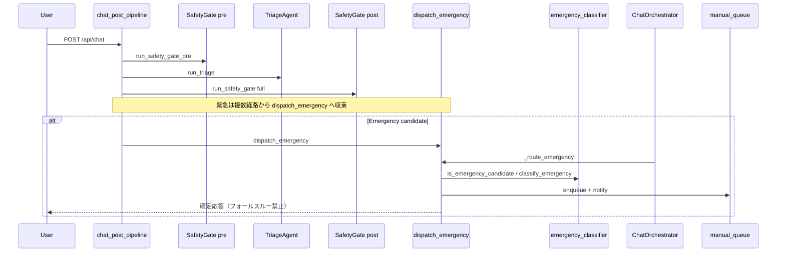
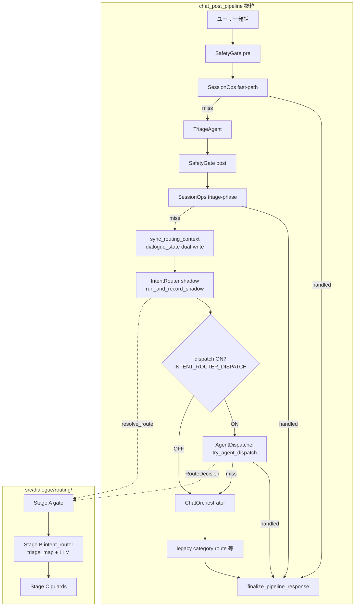

# マルチエージェントアーキテクチャ

**正本**: エージェント構成・Emergency・SSE・v2 ルーティングの概要。v2 の詳細手順・ベースラインは [CHAT_PIPELINE_V2.md](./CHAT_PIPELINE_V2.md) を併読。

## 概要

`LLM_AGENT_ENABLED=true`（既定 ON）時、チャット POST は `chat_post_pipeline` 内の **多段ルーティング** で各エージェント／ハンドラへ委譲する。カナリアは廃止済み。OFF は従来経路のみのキルスイッチ。

典型フロー（簡略）:

1. **SafetyGate（pre）** — 入力検証・診断名・不適切入力（トリアージ前）
2. **SessionOps fast-path** — 削除確認・ステータス等（v2: `dialogue/session_ops.py`、OFF: `SessionAgent`）
3. **TriageAgent** — カテゴリ分類
4. **SafetyGate（post）** — トリアージ結果を踏まえた緊急・不適切チェック
5. **（v2 ON 時）IntentRouter shadow** → **AgentDispatcher**（`try_agent_dispatch`）
6. **ChatOrchestrator** — dispatch 未処理時のフォールバック、または v2 dispatch OFF 時の本線
7. **レガシー category route** — confidence gate 等を経た最終フォールバック（PRIMARY + TRIM 時は縮小）

`CHAT_PIPELINE_V2=true`（dev では `APP_ENV=development` 未設定でも自動 ON）時は、手順 5 の IntentRouter / dispatch が加わる。詳細は本文末の v2 節。

## エージェント一覧

| エージェント | 実装 | 役割 |
|-------------|------|------|
| TriageAgent | `src/agents/triage_agent.py` | カテゴリ分類（Physical / Emotional / Emergency / Ask / Other） |
| SafetyGate | `src/agents/safety_gate.py` | 診断名・不適切・緊急の決定的チェック（**pre / post の 2 段**） |
| EmergencyRouter ※ | `src/agents/emergency_classifier.py` | 店舗 / メディカル / クライシス分岐（論理名。`is_emergency_candidate` / `classify_emergency`） |
| PhysicalOrchestrator | `src/agents/physical_orchestrator.py` | rule_based 推奨の唯一のランキング入口（症状 NLU は上流で解決） |
| NLUAgent | `src/agents/nlu_agent.py` | 属性・症状 NLU のファサード（実体は `hybrid_nlu_extraction`）。推奨フローでは `resolve_nlu_for_recommendation` が症状解析 ∥ `extract_preferences_with_gpt` を並列実行しマージ後キャッシュ |
| ExplanationAgent | `src/agents/explanation_agent.py` | カード先行後の推奨理由（SSE `explanations`） |
| AskAgent | `src/agents/ask_agent.py` | 推奨後の医薬品 Q&A（`chat_with_medicine_context`） |
| CounselingManager | `src/agents/counseling_manager.py` | Emotional 系カウンセリング |
| ConciergeAgent | `src/agents/concierge_agent.py` | 挨拶・できること・構成説明・軽い雑談（Other の窓口） |
| StoreInquiryAgent | `src/agents/store_inquiry_agent.py` | 店舗案内・購入先クエリ |
| ModerationAgent | `src/agents/moderation_agent.py` | 境界クライス検知 |
| SessionAgent / SessionOps | `src/agents/session_agent.py` / `src/dialogue/session_ops.py` | 記憶削除・要約・ステータス・履歴参照（v2 ON 時は SessionOps が統一入口） |
| ProfileMemoryAgent | `src/agents/profile_memory_agent.py` | LINE セッション属性を `line_user_profile` へ非同期マージ保存 |
| EpisodeSummaryAgent | `src/agents/episode_summary_agent.py` | 相談ログからエピソード要約を `consultation_summaries` に upsert |
| MemoryDeleteAgent | `src/agents/memory_delete_agent.py` | 「記憶を消して」等の削除意図を分類し全件/部分削除（同期） |

※ **EmergencyRouter** は独立クラスではなく、トレース・ログ上の論理名。ディスパッチ本体は `src/handlers/chat/emergency_dispatch.py` の `dispatch_emergency()`。

### 症状 NLU（多言語）

`extract_symptoms_with_gpt`（`src/core/nlu_service.py`）は hybrid NLU パイプラインの GPT フォールバック。en/ko/zh 入力を受け取り、`symptoms[].name` は辞書の日本語 canonical に正規化する。

## Emergency フロー

1. `is_emergency_candidate()`（`emergency_classifier.py`）でゲート
2. `classify_emergency()` で `store_incident` / `medical_self` / `crisis_language`
3. `dispatch_emergency()` → 店舗カード or メディカル HTML（119 明示）
4. メディカル: `medical_emergency_otc_locked`（ハード）/ 店舗: `store_incident_soft_banner`（ソフト）

`dispatch_emergency()` の呼び出し元（いずれも同一関数に収束）:

- `SafetyGate` 内の緊急ハンドラ（pre / post）
- `chat_post_pipeline` — トリアージ `category == Emergency` 時
- `ChatOrchestrator._route_emergency`
- v2 `AgentDispatcher` — `Emergency` ルート
- `confidence_gate` / `chat_category_route` 等の補助経路

### EmergencySubtype と priority_tag

| subtype | priority_tag | OTC 方針 |
|---------|--------------|----------|
| crisis_language | critical_crisis | 推奨停止 |
| medical_self | critical_medical | ハードロック（明示解除） |
| store_incident | store_high / store_low | ソフトバナー（オプトイン） |

## SSE イベント

| event | 内容 |
|-------|------|
| status | 処理ステップ（`detail_code` / `detail_label` 任意） |
| cards | 推奨薬カード（説明は空でも可） |
| explanations | 推奨理由の追送 |
| bot_followup | 第2応答シグナル（クライアントは messages 再取得） |
| advice_delta | 個別アドバイスのストリーム |

## トリアージキャッシュ

`src/services/triage_cache.py` — 正規化テキスト + `user_attributes` ダイジェスト、LRU・TTL は `TRIAGE_CACHE_MAX_ENTRIES` / `TRIAGE_CACHE_TTL_SEC`。

## ユーザー嗜好 NLU

- 並列解決: [`src/handlers/chat/nlu_resolve.py`](../../src/handlers/chat/nlu_resolve.py)
- カタログ: [`data/user_preference_keyword_catalog.json`](../../data/user_preference_keyword_catalog.json)
- 手動 QA: [`../ops/MANUAL_QA_PREFERENCES.md`](../ops/MANUAL_QA_PREFERENCES.md)
- 開発レビュー: [`../ops/PREFERENCE_NLU_DEV_REVIEW.md`](../ops/PREFERENCE_NLU_DEV_REVIEW.md)

## 管理画面

手動キュー: `priority_tag`（critical_crisis > critical_medical > store_*）、一覧 120 文字 / 詳細 800 文字抜粋。PII は自動マスクせず運用 playbook 参照（[`../security/ADMIN_PII_PLAYBOOK.md`](../security/ADMIN_PII_PLAYBOOK.md)）。

LINE Messaging API 経由の相談はセッション ID が `line:{userId}` 形式（例: `line:Uxxxxxxxx`）。管理画面のセッション一覧で Web ユーザーと同様に参照できる。

Web 引き継ぎセッションは `handoff_from_line` で記憶オーナーを `line:{userId}` に解決する。長期記憶の注入は `line_memory_context.build_long_term_memory_block` がトリアージ・カウンセリング・医薬品 Q&A 各経路で使用される。詳細: [LINE_LONG_TERM_MEMORY.md](../ops/LINE_LONG_TERM_MEMORY.md)

## 緊急メール通知

`emergency_dispatch` がキュー登録時に `emergency_notify.notify_emergency_detected` を呼ぶ。宛先は管理設定の `alert_email`（`budget_guard.get_alert_email`）。`EMERGENCY_EMAIL_ENABLED=false` で無効化。SMTP 未設定時は `smtp_not_configured` をキュー `notification_status.email` に記録。

---

## Chat Pipeline v2 アーキテクチャ（Wave 1a〜2 / Phase 4b）

`CHAT_PIPELINE_V2` 有効時の routing フロー。**OFF 時**は IntentRouter shadow / dispatch をスキップし、ChatOrchestrator + レガシー category route が本線（`LLM_AGENT_ENABLED` の ON/OFF は別軸）。

**ランタイム既定**（`config/llm_flags.py`）:

| 環境 | `CHAT_PIPELINE_V2` 未設定時 |
|------|---------------------------|
| `APP_ENV=development`（ローカル / GCP dev） | **ON**（router / dispatch / LLM までカスケード ON） |
| `APP_ENV=production` | **OFF**（明示 `CHAT_PIPELINE_V2=true` で投入） |
| pytest | **OFF** |

図はルーティング中核のみ。カウンセリングフロー・medicine_context 早期分岐・confidence gate 等は省略。

### 環境変数とフェーズ

| 変数 | 効果 |
|------|------|
| `CHAT_PIPELINE_V2` | グローバル ON/OFF |
| `CHAT_PIPELINE_V2_ALLOWLIST` / `DENYLIST` | セッション単位カナリア（本番投入用） |
| `CHAT_PIPELINE_V2_INTENT_ROUTER` | shadow 記録（`false` で router 全体 OFF） |
| `CHAT_PIPELINE_V2_INTENT_ROUTER_DISPATCH` | 本線 dispatch（`false` で shadow のみ、ChatOrchestrator 本線） |
| `CHAT_PIPELINE_V2_INTENT_ROUTER_LLM` | Stage B structured LLM（`false` で gate / triage マップのみ） |
| `CHAT_PIPELINE_V2_INTENT_ROUTER_PRIMARY` | Phase 4b — IntentRouter LLM を legacy triage map より優先（dev 未設定 ON / 本番未設定 OFF） |
| `CHAT_PIPELINE_V2_INTENT_ROUTER_PRIMARY_ALLOWLIST` / `PRIMARY_DENYLIST` | PRIMARY のセッション単位カナリア（本番） |
| `CHAT_PIPELINE_V2_LEGACY_FALLBACK_TRIM` | PRIMARY ON 時、dispatch 成功後の legacy category / Other 再実行を defensive bypass（dev 未設定 ON） |

### Wave 別 dialogue パッケージ

| パッケージ | 責務 | Wave |
|-----------|------|------|
| `src/dialogue/context.py` | DialogueContext load/save/dual-write | 1a |
| `src/dialogue/context_provider.py` | agent_kind 別履歴窓 | 1a |
| `src/dialogue/session_ops.py` | SessionOps 統一入口 | 1a |
| `src/dialogue/envelope.py` | ResponseEnvelope delivery_mode | 1a |
| `src/dialogue/routing/gate.py` | Stage A gate | 1b |
| `src/dialogue/routing/intent_router_llm.py` | Stage B LLM | 1b |
| `src/dialogue/routing/guards.py` | Stage C 後段ガード | 1b |
| `src/dialogue/dispatcher.py` | AgentDispatcher | 1b |
| `src/dialogue/history.py` | with_fallback 履歴解決 | 2 |
| `src/dialogue/sync_legacy.py` | legacy dual-write + correction mark | 2 |

### 関連ドキュメント

- [CHAT_PIPELINE_V2.md](./CHAT_PIPELINE_V2.md) — ベースライン・ロールアウト手順・パッケージ境界
- [CHAT_ROUTE_EXPECTATIONS.md](./CHAT_ROUTE_EXPECTATIONS.md) — ルート期待値
- `config/llm_flags.py` — フラグ判定の実装正本
