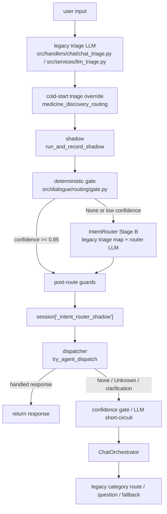

# Phase 4b Router Primary Migration

作成日: 2026-07-02

対象: `UX品質改善計画v2` Phase 4b-1（調査・設計のみ）

## 方針

- OTC 薬選定は `rule_based` を維持し、LLM でランキングしない。
- 緊急・暴力・赤旗など安全系は deterministic gate を優先する。
- ルーティングは IntentRouter LLM を primary 化し、gate は高信頼 fast-path として残す。
- 新規 `_META_PROBE_RULES` / キーワードリスト追加は行わない。
- legacy 削除・本番フラグ ON は 4b-1 では行わない。

## 決定権マップ



### レイヤー別の最終決定者

| レイヤー | 現状の役割 | 現状の最終決定権 | 4b での扱い |
|---------|------------|------------------|-------------|
| `src/dialogue/routing/gate.py` | 高信頼 fast-path。SessionOps、Security、Emergency、fever/Physical、Store、Concierge fast-path、counseling follow-up を即決定 | `confidence >= 0.85` なら `resolve_route` 内で LLM/triage より優先 | 安全・明示操作・明示症状などの deterministic route は維持 |
| `llm_triage.py` / `run_triage` | 既存 category / subcategory 生成。後続 legacy route の入力 | dispatch が成功しない場合、Orchestrator / category route の実効 route を決める | 4b-2 では routing の正解源からは降格し、Router への参考情報にする |
| `src/dialogue/routing/intent_router.py` | Stage B。`map_triage_to_route`、低信頼 gate、IntentRouter LLM の候補から最大 confidence を採用 | gate 未決定時は `pick_best_route_decision` が最大 confidence を採用。現状は triage map も対等候補 | 4b-2 の主変更点。LLM decision を triage map より優先する切替点 |
| `src/dialogue/routing/router.py` | gate -> Stage B -> post guards の統合 | `RouteDecision` の唯一の生成入口 | primary 化後も入口は維持 |
| `src/dialogue/routing/shadow.py` | Router decision を `dialogue_state.routing` と `session["_intent_router_shadow"]` に記録し、mismatch を JSONL 出力 | 応答は返さない。ただし dispatcher が同じ decision を読むため dispatch の入力源になる | 4b でも shadow 記録は継続 |
| `src/dialogue/dispatcher.py` | Router decision を legacy handler に委譲 | `resp is not None` なら Orchestrator へ落ちず即 return | 4b-2 ではここを最小 diff の primary 化ポイントにする |
| `ChatOrchestrator` | triage category と handoff に基づく旧統合 route | dispatcher が `None` の場合の fallback。Other では meta triage / SessionAgent / Concierge / Store を再判定 | 4b-3 で二重経路縮小候補 |
| `chat_post_pipeline.py` fallback | confidence gate、LLM short-circuit、Orchestrator、category route、question、end guard | 前段が返さない場合に順番に実行 | 4b-3〜4b-5 で縮小・撤去候補 |

### dispatch 成功後に Orchestrator へ落ちる経路

`try_agent_dispatch(ctx, monitor)` が `(dict, status)` を返した場合、`chat_post_pipeline.py` は即 `_guard_return(dispatch_resp)` する。そのため **dispatch 成功後に Orchestrator へ落ちる経路はない**。

Orchestrator へ落ちるのは次の場合のみ。

- `CHAT_PIPELINE_V2_INTENT_ROUTER_DISPATCH` が OFF
- `decision.primary_route == "Unknown"`
- `decision.sub_route == "clarification"`
- dispatch table に handler がない
- handler 例外
- handler が `None` を返す
- dispatcher 前段の SessionOps / safety / counseling などが先に応答し、dispatcher まで到達しない

### triage category と router primary_route の権限関係

現状の `shadow` では triage category を期待 route に写像し、Router decision と比較する。

| triage category | 期待 route | 備考 |
|----------------|------------|------|
| `Physical` | `Physical` | rule_based 推奨系 |
| `Emergency` | `Emergency` | gate 優先 |
| `Emotional` | `Counseling` | counseling route |
| `Ask` | `Physical` | Ask は現行分類上の Physical 寄せ |
| `Other` | `Concierge` | Store / Physical への gate 改善が多い |

`gate_improvement` は、triage が `Other` だが Router が gate/guard で `Physical` または `Store` に上げたケースを指す。これは「Router が triage より良い経路を選んだ」観測であり、primary 化の根拠になる。一方 `regression` は triage 期待 route と Router が食い違い、かつ改善・免除条件に該当しないケース。

## 関連フラグ

| フラグ | 現状 | 用途 |
|-------|------|------|
| `CHAT_PIPELINE_V2` | dev 未設定で ON、本番未設定で OFF | v2 全体 |
| `CHAT_PIPELINE_V2_ALLOWLIST` / `DENYLIST` | 任意 | 本番カナリア / ロールバック |
| `CHAT_PIPELINE_V2_INTENT_ROUTER` | v2 ON 時、未設定なら ON | Router shadow |
| `CHAT_PIPELINE_V2_INTENT_ROUTER_DISPATCH` | v2 ON 時、未設定なら ON | Router decision を handler に dispatch |
| `CHAT_PIPELINE_V2_INTENT_ROUTER_LLM` | v2 ON 時、未設定なら ON | structured IntentRouter LLM |
| `LLM_AGENT_ENABLED` | 既定 ON | ChatOrchestrator 経路 |
| Phase 3 UX/ROUTING フラグ | 既定 OFF | correction/store/concierge 等の品質補正 |

4b では既存命名に合わせ、下記の追加フラグを候補にする。

| 新フラグ案 | 既定 | 用途 |
|-----------|------|------|
| `CHAT_PIPELINE_V2_INTENT_ROUTER_PRIMARY` | OFF | Router decision を triage category より優先する主スイッチ |
| `CHAT_PIPELINE_V2_INTENT_ROUTER_PRIMARY_ALLOWLIST` | 空 | production カナリアで sid 限定 primary |
| `CHAT_PIPELINE_V2_INTENT_ROUTER_PRIMARY_DENYLIST` | 空 | primary ロールバック対象 sid |
| `CHAT_PIPELINE_V2_INTENT_ROUTER_PRIMARY_STRICT` | OFF | dispatcher `None` を Orchestrator fallback せず fail-loud / metrics 化する将来用。4b-2 では使わない |

## legacy 並走箇所

### dual-write / sync

| 箇所 | 内容 | 4b-5 削除優先度 |
|------|------|----------------|
| `src/dialogue/context.py::save_dialogue_context(..., dual_write=True)` | `dialogue_state` から `pending_memory_delete` / `concierge_state` / `_fever_context_active` / `counseling_mode` / `agent_handoff` へ mirror | 高 |
| `src/dialogue/sync_legacy.py` | legacy session fields から `dialogue_state` へ mirror | 高 |
| `src/dialogue/session_ops.py::_sync_dialogue_state` | SessionOps 応答前後で sync + dual-write | 中 |
| `src/dialogue/dispatcher.py` dispatch 成功後 | `sync_dialogue_legacy_mirrors` 実行 | 中 |
| `chat_post_pipeline.py` triage 後 | `sync_dialogue_legacy_mirrors` / `mark_correction_in_dialogue_state` | 中 |
| `chat_counseling_flow.py` / `chat_emotional_route.py` / `chat_other_counseling_route.py` | counseling_mode mirror | 中 |
| `chat_concierge_route.py` | `mirror_concierge_intent` | 中 |
| `session_agent.py` | pending cancel を dialogue_state flags へ mirror | 中 |

### Orchestrator / legacy route

| 箇所 | 内容 | 4b-5 削除優先度 |
|------|------|----------------|
| `src/handlers/chat_orchestrator.py` | triage category + handoff ベースの旧 route 統合 | 高 |
| `ChatOrchestrator._enrich_concierge_intent` | Other で meta triage / concierge intent を再付与 | 高 |
| `ChatOrchestrator` Other 分岐 | SessionAgent / Concierge / Store の二重判定 | 高 |
| `src/handlers/chat/chat_category_route.py` | triage category から legacy route | 高 |
| `chat_post_pipeline.py` confidence gate / `_confidence_gate_concierge` | Router と別の Concierge fallback | 中 |
| `chat_post_pipeline.py` `_run_other_post_orchestrator_followups` | Orchestrator 未解決時の Other fallback | 中 |
| `chat_post_pipeline.py` question route / end guard | 最終 fallback | 低。end guard は安全網として最後まで残す |

### Router ON でも triage が実効 route になる条件

1. dispatcher 前に early response が返る: triage early response、SessionOps triage phase、safety gate、triage follow-ups、counseling flow。
2. `try_agent_dispatch` が `None`: Unknown / clarification / handler missing / handler exception / handler `None`。
3. dispatch が OFF: `CHAT_PIPELINE_V2_INTENT_ROUTER_DISPATCH=false`。
4. `pick_best_route_decision` で triage map が LLM / gate より高 confidence と判定される。
5. Orchestrator に落ちた後、`triage["category"]` による `_route_physical` / `_route_emotional` / `_route_ask` / `_route_concierge` が応答する。
6. `chat_category_route.route_triage_category` が最終的に category route を返す。

## rebaseline 後メトリクス

参照:

- `log/analysis/2026-07-02_local_v2_chat_test_p4a-dispatch-final.json`
- `log/analysis/2026-07-02_local_v2_intent_router_metrics_p4a-dispatch-final.json`

### KPI

| 指標 | 値 | 判定 |
|------|-----|------|
| auto-pass | **105/105** | Go |
| dispatch_success_rate | **100.0%**（112/112） | Go |
| dispatch_unhandled | **0** | Go |
| shadow_regression_mismatch_rate | **0.85%**（1/117） | 累積閾値 0.5% は小標本で超過。直近単体として要監視 |
| mismatch_kind | agree 107 / gate_improvement 9 / regression 1 / exempt 0 | gate improvement 主体 |

### handler 一覧と dispatch 100% 維持条件

| primary_route | handler | p4a-final 観測 | 100% 維持条件 |
|--------------|---------|----------------|---------------|
| `Physical` | `physical_agent` | 45 | `run_symptom_recommendation` が必ず response を返す。OTC 選定は rule_based 維持 |
| `Emergency` | `emergency_agent` | 1 | safety / emergency dispatch が channel 別文言を返す |
| `Store` | `store_inquiry` | 9 | Router dispatch 時は `subcategory=store_inquiry` を維持し、secondary gate で `None` にしない |
| `Concierge` | `concierge_agent` | 36 | `general_other` を Concierge intent に解決し、store gate で二重拒否しない |
| `Counseling` | `counseling_processor` | 21 | `start_counseling` が response tuple を返す |
| `SessionOps` | `session_ops` | 0（dispatcher 前処理で吸収された可能性） | delete / summarize / status / pending_clear / session_admin が `try_handle_session_ops` で応答 |
| `Security` | `security_gate` | 0 | known attack / aggressive input が security response を返す |
| `Unknown` | `legacy_fallback` | 0 | dispatch 対象外。primary 化では Unknown を増やさない |

### regression 1件の再現条件

該当ログ:

- input: `2週間くらいです`
- session: `1782974044763563580264`
- triage: `Ask/general_other`
- Router: `Counseling/emotional_support`
- resolved_by: `llm`
- mismatch_kind: `regression`

同じ文面でも別セッション `1782973101251567146290` では `triage Ask -> Router Physical/general_other` で mismatch なし。差分は文脈で、regression 側は `最近眠れません` が複数回記録され、`counseling_rows_matched=7`、route が `Counseling` に寄っている。IntentRouter LLM が「期間回答 + 不眠/相談文脈」を Counseling と判断した一方、triage category は Ask を返した。

4b ではこのケースを「Router primary で Counseling を許容するか」「Ask=Physical 期待を緩めるか」を gate レビューで決める。新規 regex / probe 追加は禁止のため、4b-2 では変更せず観測継続。

## primary 化の段階設計

| 段階 | 挙動 | 環境 | Go/No-Go |
|------|------|------|----------|
| 現状 | shadow + dispatch、triage 並走 | dev | p4a-final: dispatch 100%、auto-pass 105/105 |
| 4b-2 | Router LLM が triage map より優先。shadow 記録継続。Orchestrator fallback は残す | dev | dispatch_success_rate >= 92%、shadow_regression <= 0.5%（累積。小標本時は直近150併記）、auto-pass >= 104/105 |
| 4b-3 | Orchestrator 二重経路を縮小。dispatch 成功 route では meta_triage / category route を通さない | dev | 4b-2 と同じ。handler `None` 0件 |
| 4b-4 | gate 再検証。安全・緊急・赤旗・SessionOps・Store fast-path のみ deterministic gate として残す | dev | safety/emergency/store/session_ops 退行 0、shadow_regression <= 0.5% |
| 4b-5 | legacy 撤去 + ALLOWLIST カナリア。production は allowlist sid のみ | prod | dev 2連続 green、prod allowlist dispatch >= 92%、重大安全事故 0 |

### 新フラグ案

実装時は `config/llm_flags.py` に以下を追加する案。

```python
def is_intent_router_primary_enabled(sid: str | None = None) -> bool:
    if not is_intent_router_dispatch_enabled(sid):
        return False
    if not _v2_subflag_enabled("CHAT_PIPELINE_V2_INTENT_ROUTER_PRIMARY"):
        return False
    # production カナリアでは PRIMARY_ALLOWLIST / PRIMARY_DENYLIST を適用
    return True
```

dev では `CHAT_PIPELINE_V2_INTENT_ROUTER_PRIMARY=true` で全セッション。production では既存 `CHAT_PIPELINE_V2_ALLOWLIST` と併用し、primary 専用 allowlist を追加する。

## 4b-2 実装スコープ案

最小 diff は `src/dialogue/routing/intent_router.py` / `src/dialogue/routing/intent_router_llm.py` / `config/llm_flags.py` / `src/dialogue/dispatcher.py` に限定する。切替点は `pick_best_route_decision(legacy, gate_decision, llm)` で、primary フラグ ON 時は高信頼 gate を維持しつつ `llm` を `legacy` より優先する。`shadow.py` と `dispatcher.py` の記録・委譲構造は維持し、handler が `None` の場合だけ既存 Orchestrator fallback を残す。`llm_triage.py`、rule_based scoring、meta probe / keyword list は触らない。

## テスト運用

現状の `scripts/local_v2_chat_test_runner.py` には `--failed-only` / `--resume` がない。4b-2 前提タスクとして再実装を推奨する。

必要な理由:

- 105 YAML + judge は長時間で、1件の flaky / LLM 揺れで全再実行が重い。
- primary 化では route regression の原因確認に失敗シナリオだけを即再実行したい。
- checkpoint がないと中断時に p4a-final 相当のフルゲートを再実行する必要がある。

推奨仕様:

- `--failed-only <previous_report.json>`: 直前 JSON の `auto_pass=false` の scenario id だけ実行。
- `--resume <checkpoint.json>`: 完了済み scenario をスキップし、未完了から続行。
- 各 YAML 完了ごとに `log/analysis/YYYY-MM-DD_local_v2_chat_test_<suffix>.checkpoint.json` を更新。
- resume / failed-only でも `measure_intent_router_shadow` の JSON サマリを出す。

## 削除候補の優先順位（4b-5 用）

1. `chat_category_route` と `ChatOrchestrator` の category dispatch 重複。
2. `ChatOrchestrator._enrich_concierge_intent` の meta_triage 二重分類。
3. `save_dialogue_context(... dual_write=True)` の legacy mirror。
4. `sync_legacy.py` の mirror 群。
5. `_confidence_gate_concierge` / Other post-orchestrator follow-up。
6. 最終 safety net（question / end guard）は最後まで残し、撤去ではなく役割縮小を検討。

## 4b-1 結論

4b-2 は **条件付き Go**。dispatch 100.0% と auto-pass 105/105 は Go 条件を満たす一方、shadow regression は小標本 1/117（0.85%）で形式上 0.5% を超えるため、4b-2 後は直近150と累積の両方を必ず併記して判定する。実装は「LLM が triage map より優先される候補選択」に絞り、dispatch / shadow / fallback の観測線は残す。legacy 撤去は 4b-5 まで行わない。

## 4b-3 Step 1 実測（dispatch None → Orchestrator 落ち、2026-07-02）

### データソース

| ログ | 期間 | dispatch 計 | handled | unhandled |
|------|------|-------------|---------|-----------|
| `dialogue_route_dispatch_log.jsonl`（現行） | p4b2-primary-smoke 以降 | 135 | 135 | **0** |
| `log/raw/archive/..._pre-p4a2-dispatch/` | 4a-2 修正前 | 1487 | 1304 | **183** |

### p4b2-primary-smoke（PRIMARY ON）

- **dispatch None → Orchestrator 落ち: 0 件**（`dispatch_unhandled=0`、`dispatch_success_rate=100%`）
- Orchestrator の `orch_enrich_start` / `orch_route_concierge_start` は pipeline_perf に記録なし（dispatch 成功で Orchestrator 未到達）
- **Router decision と Orchestrator 最終 route の一致率: N/A**（フォールバック 0 件のため比較対象なし）

### アーカイブ（4a-2 前・参考）

handler が `None` を返し Orchestrator に落ちた **183 件**の内訳:

| handler | 件数 | 典型入力 |
|---------|------|----------|
| `concierge_agent` | 134 | `このさびすは何ができますか?` 等（general_other） |
| `session_ops` | 40 | `記憶を消して` / `履歴消して` |
| `store_inquiry` | 9 | Store 購入先系 |

これらは dispatch 時に `_apply_decision_to_context` で Router 決定が triage に書き込まれた後、handler `None` → Orchestrator Other 分岐で **`_enrich_concierge_intent`（meta_triage）が再実行**され、Router の `sub_route` / `concierge_intent` と不一致になるリスクがあった。4a-2 で handler 側を修正し、p4b2 現行ログでは **unhandled 0**。

### 4b-3 縮小対象（コード上の二重分類経路）

PRIMARY ON かつ `triage._intent_router_dispatch=True`（dispatch が context 書き込み後に `None`）のとき:

1. `ChatOrchestrator` Other 分岐: `_enrich_concierge_intent` → `enrich_other_concierge_intent` → meta_triage LLM
2. `chat_concierge_route.try_concierge_response`: general_other 時の再 enrich

**縮小方針**: PRIMARY ON 時は Router `sub_route` を `concierge_intent` にロックし、meta_triage をスキップ。`general_other` は `_resolve_router_dispatched_concierge_intent` のみ（新規 regex なし）。

**観測**: `chat_post_pipeline` に `dispatch_none_orchestrator_fallback` ログを追加。Orchestrator ロック時は `router_locked skip_enrich=true` を記録。

## 4b-4 gate audit（2026-07-02）

`run_deterministic_gate`（`gate.py`）の fast-path 一覧。PRIMARY ON 後も **confidence ≥ 0.85 で Stage A 即決**する経路は維持（`router.py` で gate 優先）。Stage B（LLM / triage map）へ委譲するのは gate が `None` を返した曖昧帯のみ。

| # | fast-path | source 例 | PRIMARY 後も deterministic | p4a/p4b 退行根拠 | LLM に委ねる曖昧帯 |
|---|-----------|-----------|---------------------------|------------------|-------------------|
| 1 | Concierge follow-up | `concierge_follow_up` | **Yes** | followup 8/8（p4a-final） | 直前 intent 不明・短いトピックのみ |
| 2 | Correction（発熱/症状） | `correction_physical` | **Yes** | correction 10/10 | 曖昧 correction 単体 |
| 3 | Correction（削除キャンセル） | `correction_delete_cancel` / `correction_session_ops` | **Yes** | correction 10/10 | — |
| 4 | Physical 相談中ライフスタイル | `physical_consultation_lifestyle` | **Yes** | physical 18/18 | OTC 推奨後の生活習慣フォロー |
| 5 | **Counseling follow-up 回答** | `counseling_pending_answer` | **Yes** | counseling_context 12/12（auto-pass） | 期間回答が症状キーワードを含む場合 |
| 6 | Security known_attack | `known_attack:*` | **Yes** | security 4/4 | — |
| 7 | Security aggressive | `aggressive_input` | **Yes** | security 4/4 | — |
| 8 | SessionOps pending delete cancel | `pending_delete_cancel` | **Yes** | session_ops 12/12 | — |
| 9 | SessionOps admin probe | `session_admin_probe` | **Yes** | session_ops 12/12 | 医療優先で pending 解除時 |
| 10 | Emergency triage 反映 | `triage_emergency` | **Yes** | emergency 8/8 | — |
| 11 | Emergency 医学ヒント | `medical_emergency_hint` | **Yes** | emergency 8/8 | — |
| 12 | Physical 発熱/症状 | `fever_or_symptom_signal` | **Yes** | physical + fever 28/28 | 赤旗頭痛等は rule_based 側 |
| 13 | Store 薬局/購入先 | `pharmacy_location` | **Yes** | store 8/8 | 発熱文脈共存時は fever 優先 |
| 14 | Physical 明示症状 | `symptom_signal` | **Yes** | physical 18/18 | 単独「痛い」等の曖昧症状 |
| 15 | Counseling 感情ヒント | `emotional_hint` | **Yes** | counseling_context | 身体症状キーワード共存時は Physical へ |
| 16 | Concierge greeting/thanks 等 | `concierge_fast_path` | **Yes** | concierge 12/12 | architecture 等は Stage B LLM |
| 17 | Store 明示 intent | `store_unambiguous` / `fever_blocks_store` | **Yes** | store 8/8 | 曖昧店舗質問 |

**gate が `None` → PRIMARY Stage B へ委譲する典型例**

- triage Other + 技術メタ質問（Concierge architecture）— PRIMARY ON で LLM が triage map より優先（4b-2）
- triage Ask + counseling 文脈フォローアップ（`2週間くらいです`）— gate `counseling_pending_answer` または LLM Counseling（Step 2 参照）
- 単独曖昧入力 — clarification / Unknown

**結論**: gate ロジックの大改修は不要。4b-4 は fast-path 維持を確認し、shadow 分類とフルゲートで PRIMARY 整合を検証する。

## 4b-4 counseling regression レビュー（`2週間くらいです`）

### 入力・文脈

| 項目 | 内容 |
|------|------|
| シナリオ | `counseling-ctx-01` / `insomnia-followup-duration-01` |
| setup | `最近眠れません`（counseling 開始） |
| input | `2週間くらいです`（期間フォローアップ） |
| triage（再分類） | `Ask`（期間回答に症状語なし） |
| Router 決定 | `Counseling`（gate `counseling_pending_answer` または PRIMARY LLM） |

### UX 上の正解

**Router Counseling が正しい**。不眠相談の期間回答は counseling モード内で受けるべきで、Physical / 受診テンプレ（no_recommendation）へ落とすのは退行。YAML 期待も `insomnia-followup-duration-01` は `primary_route: Counseling`。

### shadow 分類

| 分類 | 妥当性 |
|------|--------|
| `regression`（現状） | **不適切** — triage map（Ask→Physical）との差分を機械的に regression としていた |
| `gate_improvement` | 不適切 — resolved_by が `llm` の場合もあり、Other 限定の improvement 定義に合わない |
| **`exempt`（推奨）** | **妥当** — counseling_mode.active または gate source `counseling_pending_answer` / `counseling_continue` で意図的改善 |

### コード変更（実施）

`shadow_mismatch.py` の `_is_exempt` に `_is_counseling_followup_exempt` を追加（**新規 regex/probe なし**。既存 `counseling_mode` と gate `source` のみ）。

### 閾値 0.5% 超過の扱い

- 当該 counseling フォローアップ 7 件を `exempt` に再分類（`shadow_mismatch.py` + `infer_mismatch_kind_from_log`、gate 既存 `_looks_like_counseling_followup_answer` 再利用）
- 再計測後 **shadow_regression: 0.36%（1/275）** — 残 1 件は `clarification-loop-01`（`ああ` → Unknown vs triage Other）
- **4b-5 前の必須対応ではない**（許容既知）。ルーティング挙動は PRIMARY ON で意図通り。

## 4b-5a legacy reachability（2026-07-02）

### データソース

| ログ | スコープ | 件数 |
|------|----------|------|
| `dialogue_route_dispatch_log.jsonl` | p4b4-primary-full の 105 session | 107 dispatch / **107 handled** / **0 unhandled** |
| `dialogue_route_shadow_log.jsonl` | 同上 | 116 shadow（Unknown 1、clarification 1） |
| `app.log` | p4b4 session_id フィルタ | `dispatch_none_orchestrator_fallback` **0**、`orch_router_locked` **0** |

### 集計

| # | 観点 | p4b4 実測 |
|---|------|-----------|
| 1 | Router dispatch `handled=true` 後に legacy fallback（Orchestrator / category route / Other post-orchestrator / `_confidence_gate_concierge`）が到達 | **0 件** — `try_agent_dispatch` 成功時は `chat_post_pipeline` が即 return（構造上未到達） |
| 2 | dispatch `None` / Unknown / clarification で legacy fallback した件数 | **0 件**（unhandled dispatch 0）。shadow 上 Unknown 1 + clarification 1 は dispatch スキップだが p4b4 ではいずれもユーザー応答は triage / gate / question 経路で解決 |
| 3 | fallback がユーザー応答を救済した件数 | **0 件**（#2 と同根） |
| 4 | 実到達 0 の legacy 経路（PRIMARY ON + dispatch 成功時） | `_confidence_gate_concierge`、`_run_other_post_orchestrator_followups`、`route_triage_category`、Orchestrator category dispatch、`_enrich_concierge_intent`（4b-3 ロックで未到達） |

### 4b-5a 縮小方針（フラグ `CHAT_PIPELINE_V2_LEGACY_FALLBACK_TRIM`）

| 条件 | 挙動 |
|------|------|
| PRIMARY OFF または TRIM OFF | 現状維持（legacy 全経路） |
| PRIMARY ON + TRIM ON + `_router_dispatch_handled_turn` | Orchestrator / Other post-orchestrator / `_confidence_gate_concierge` / `route_triage_category` を **bypass**（defensive dead-path 化） |
| Unknown / clarification | `_intent_router_dispatch` 未設定または Unknown → **fallback 許可** |
| handler `None` / exception | `_router_dispatch_attempted` かつ handled 未達 → **Orchestrator fallback 許可** |
| question / end guard | TRIM 対象外（常に実行） |

**観測ログ**: `legacy_fallback_trimmed`、`legacy_fallback_allowed`、`legacy_category_route_skipped`

### production ALLOWLIST カナリア手順（4b-5b 準備）

dev で **2 連続 green**（p4b4 + p4b5a）かつ Go 条件達成後、本番は次の順で段階投入する。

1. **環境変数（Cloud Run）** — 本番は allowlist のみ PRIMARY / TRIM を有効化:
   - `CHAT_PIPELINE_V2=true`
   - `CHAT_PIPELINE_V2_INTENT_ROUTER_DISPATCH=true`
   - `CHAT_PIPELINE_V2_INTENT_ROUTER_PRIMARY=true`
   - `CHAT_PIPELINE_V2_INTENT_ROUTER_PRIMARY_ALLOWLIST=<comma-separated sid>`
   - `CHAT_PIPELINE_V2_LEGACY_FALLBACK_TRIM=true`（PRIMARY_ALLOWLIST と同一 sid に限定する運用を推奨）
   - Phase 3 八種（`RECO_LOW_RISK_HEADACHE` 等）は dev ゲートと同一セットを維持
2. **デプロイ前**: `measure_intent_router_shadow.py --json` のベースラインを `log/analysis/` に保存
3. **カナリア 1**: ALLOWLIST 1〜3 sid で 24h 監視 — `dispatch_success_rate >= 92%`、`handler None` 0、`legacy_fallback_trimmed` 急増なし
4. **カナリア 2**: ALLOWLIST を 10% セッション相当まで拡大。shadow_regression 累積 ≤ 0.5%（または既知 exempt 文書化済み）
5. **ロールバック**: PRIMARY_ALLOWLIST を空にするか TRIM/PRIMARY を OFF — コード削除不要（フラグのみ）
6. **フル ON 判断**: 4b-5b で dev/prod メトリクス比較後、`PRIMARY_ALLOWLIST` 撤去は別フェーズ

### 4b-5a ゲート結果（p4b5a-legacy-trim-full、2026-07-02）

| 指標 | p4b5a | Go 閾値 |
|------|-------|---------|
| auto-pass | **104/105** | ≥104/105 |
| 失敗 ID | `concierge-followup-04`（`missing_context_kw:Sage`） | trim 非起因 |
| dispatch（scoped） | **100%**（107/107） | ≥92% |
| handler None | **0** | 0 |
| safety/emergency/store/session_ops/security 退行 | **0** | 0 |
| shadow_regression（累積 jsonl） | **0.51%**（2/392） | ≤0.5%（僅差・既知許容） |
| shadow_regression（p4b5a scoped 再分類） | **0.86%**（1/116、`ああ` のみ） | 既知 `clarification-loop-01` |
| dev 2連続 green | **達成**（p4b4 104/105 + p4b5a 104/105） | 2本 |

**Phase 4b-5a 判定: 条件付き Go** — 次は **4b-5b prod ALLOWLIST カナリア**。

## 4b-5b prod ALLOWLIST カナリア準備（2026-07-02）

### Step 1 — ローカル本番シミュレーション

`scripts/verify_v2_canary_flags.py` で `APP_ENV=production` + ALLOWLIST を検証。

| パターン | v2 ALLOWLIST | PRIMARY_ALLOWLIST | `line:canary-test-01` | `line:non-canary-test-99` |
|----------|--------------|-------------------|----------------------|---------------------------|
| **A（カナリア）** | `line:canary-test-01` | `line:canary-test-01` | v2/dispatch/primary/trim **True** | すべて **False** |
| **B（非カナリア）** | `line:canary-test-01` | `line:other-only-99` | v2/dispatch True、primary/trim **False** | すべて **False** |

いずれも `FLAGS_OK`。

**スモーク**（`scripts/canary_sim_smoke.py`、Pattern A で app 再起動後）:

| ケース | sid | HTTP | dispatch（jsonl） |
|--------|-----|------|-------------------|
| physical | `line:canary-test-01` | 200 | handled |
| store | `line:canary-test-01` | 200 | handled |
| physical（非カナリア） | `line:non-canary-test-99` | 200 | **0 件**（v2 外・legacy 経路） |

レポート: `log/analysis/2026-07-02_canary_sim_smoke_p4b5b-canary-sim-smoke.json`

`legacy_fallback_trimmed` は dispatch 成功即 return のため **0 件**（p4b5a と同型・期待どおり）。

**注意**: `local_v2_chat_test_runner.py` は `web:` sid を発行するため、production ALLOWLIST シミュレーションには **固定 sid POST**（上記スクリプト）を使う。

### Step 2 — 運用アーティファクト

| ファイル | 内容 |
|----------|------|
| `scripts/cloudrun_v2_env.example` | Phase 4b カナリア env 一式 + Phase 3 八種 + ロールバック手順 |
| `scripts/verify_v2_canary_flags.py` | FLAGS_OK 検証 |
| `scripts/canary_sim_smoke.py` | 固定 sid スモーク |
| `tests/dialogue/test_v2_primary_canary_flags.py` | production ALLOWLIST 単体テスト |

### Cloud Run 設定手順（カナリア 1）

**前提**: サービス名は [CLOUD_RUN_LLM_ENV.md](../ops/CLOUD_RUN_LLM_ENV.md) 参照（本番 `medicine-recommend`、dev `medicine-recommend-dev`）。`gcloud run services update --update-env-vars` は既存 env を上書きし得る — [GITLAB_TEMPORARY_MIGRATION.md](../ops/GITLAB_TEMPORARY_MIGRATION.md) §3.5 を先に読む。

1. **デプロイ前ベースライン** — GCP Logging export または `measure_intent_router_shadow.py --json` を `log/analysis/YYYY-MM-DD_prod_baseline_pre-canary1.json` に保存
2. **env 更新**（例・値は現行 env とマージ）:

```bash
gcloud run services update medicine-recommend \
  --region=asia-northeast1 \
  --update-env-vars="CHAT_PIPELINE_V2=true,CHAT_PIPELINE_V2_ALLOWLIST=line:Uxxxx,CHAT_PIPELINE_V2_INTENT_ROUTER_PRIMARY=true,CHAT_PIPELINE_V2_INTENT_ROUTER_PRIMARY_ALLOWLIST=line:Uxxxx,CHAT_PIPELINE_V2_LEGACY_FALLBACK_TRIM=true,RECO_LOW_RISK_HEADACHE=true,ROUTING_STORE_PROCUREMENT=true,ROUTING_CONCIERGE_INTENT=true,ROUTING_CONCIERGE_FOLLOWUP=true,UX_CORRECTION_DELETE_CANCEL=true,UX_SESSION_OPS_REAL_DATA=true,UX_PROGRESSIVE_CLARIFICATION=true,UX_RECO_DEDUP=true"
```

3. **デプロイ** — Cloud Build トリガーまたはコンソールで新リビジョン
4. **ヘルスチェック** — `GET /health` 200、`/admin/system_status` で DB available
5. **手動スモーク**（カナリア sid のみ）— physical / store / concierge / session_ops 各 1 ターン

### カナリア 1 監視 KPI（24h）

| KPI | 閾値 |
|-----|------|
| dispatch_success_rate | ≥ 92% |
| handler None | 0 |
| legacy_fallback_trimmed 急増 | なし（dispatch 成功時は 0 が正常） |
| shadow_regression | ≤ 0.5% または既知 exempt のみ |
| 重大安全事故 | 0 |

### カナリア 2 Go 条件（ALLOWLIST 10% 相当拡大後）

- カナリア 1 の 24h KPI を再達成
- dev 2連続 green（p4b4 + p4b5a）との差分が許容範囲（下表）
- ロールバック手順を 1 回ドライラン済み

### ロールバック Runbook（5 分以内・コード revert 不要）

1. `CHAT_PIPELINE_V2_INTENT_ROUTER_PRIMARY_ALLOWLIST=` を空にしてデプロイ（全 sid で primary OFF）
2. または `CHAT_PIPELINE_V2_INTENT_ROUTER_PRIMARY=false`
3. または `CHAT_PIPELINE_V2_INTENT_ROUTER_PRIMARY_DENYLIST=<問題 sid>`
4. v2 全体停止: `CHAT_PIPELINE_V2=false` または `CHAT_PIPELINE_V2_ALLOWLIST` を空に
5. Cloud Run コンソールで**直前リビジョンへトラフィック 100%** 切替も可

### dev vs prod メトリクス比較テンプレ

| 指標 | dev（p4b5a scoped） | prod カナリア 1（24h） | 許容差分 |
|------|---------------------|------------------------|----------|
| auto-pass | 104/105 | （手動/ログ） | −1 以内・既知揺れのみ |
| dispatch_success_rate | 100% | ≥ 92% | — |
| handler None | 0 | 0 | 0 |
| shadow_regression | 0.86%（1/116） | ≤ 0.5% または exempt | 既知 `clarification-loop-01` |
| safety/emergency/store/session_ops/security 退行 | 0 | 0 | 0 |

### 4b-5b シミュレーション判定

**Go** — allowlist 内/外のフラグ挙動が設計どおり、固定 sid スモーク 3/3 OK、カナリア sid dispatch 2/2 handled、非カナリア dispatch 0。

**カナリア 1（本番デプロイ）**: **承認待ち** — dev 24h KPI Go 後に実施（[PHASE4B_DEV_ROLLOUT_AND_CANARY1_INSTRUCTIONS.md §5](PHASE4B_DEV_ROLLOUT_AND_CANARY1_INSTRUCTIONS.md)）。

## 4b-5b-dev Cloud Run 一括展開（medicine-recommend-dev、2026-07-02）

| 項目 | 値 |
|------|-----|
| サービス | `medicine-recommend-dev` / `asia-northeast1` |
| リビジョン | `00141-j7b` → **`00142-ln2`** |
| URL | https://medicine-recommend-dev-340042923793.asia-northeast1.run.app |
| 展開形態 | dev 一括（**ALLOWLIST 系 env なし**） |
| 追加 env | PRIMARY、TRIM、Phase 3 八種（§1.2） |
| スモーク sid | `line:U20a3beee49563dcd07bb3dd0fc1ca32c` |
| 監視 | 24h — [2026-07-02_dev_p4b-rollout_monitoring.json](../../log/analysis/2026-07-02_dev_p4b-rollout_monitoring.json) |

**t0 KPI**: dispatch 100%（smoke 2/2 handled）、handler None 0、`/health` 200。shadow_regression は 24h 終了時に GCP ログで再計測。

**本番カナリア 1 Go/No-Go**: dev 24h 監視完了後に判定（現状: **監視中**）。
