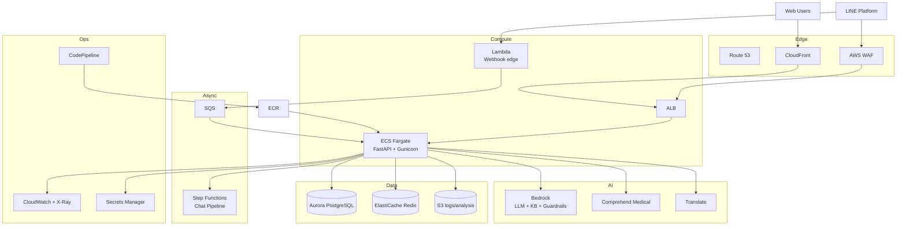

**medicine-recommend**（FastAPI + Gunicorn、LINE Webhook、OpenAI/DeepL、PostgreSQL、25–30秒の推奨パイプライン、管理画面・SSE）向けに、AWS サービスを観点別に整理しました。すでに **ECS / ECR / CodePipeline / CodeBuild / S3** は稼働または構築済みです。

---

## 現状の AWS 利用（ベースライン）

| サービス | 役割 |
|----------|------|
| **ECS Express** | 本番コンテナ実行（`aws.medicine.yutok.dev`） |
| **ECR** | Docker イメージ保管 |
| **CodePipeline + CodeBuild** | GitHub main → ビルド → ECR push → ECS 再デプロイ |
| **S3** | Pipeline アーティファクト |
| **IAM** | CodeBuild / Pipeline ロール |

ここから「実用」「AI」「データ」「面白い」方向へ拡張できます。

---

## 1. 実用的・インフラ基盤

### コンピュート・ネットワーク

| サービス | 本アプリでの活用 |
|----------|------------------|
| **ECS Fargate**（Express から本格化） | タスク CPU/メモリを細かく指定。推奨処理 25–30 秒・タイムアウト 120 秒に合わせたサイジング。複数タスク + オートスケール |
| **App Runner** | ECS より運用を簡略化したい場合の代替。GitHub 連携で Render に近い体験 |
| **Application Load Balancer (ALB)** | `/health` チェック、Web / LINE Webhook / 管理画面のルーティング、HTTPS 終端 |
| **Route 53** | `aws.medicine.yutok.dev` の DNS、ヘルスチェック付きフェイルオーバー |
| **CloudFront** | 静的アセット（`static/`）、`/about`、管理画面 JS/CSS の CDN 配信。東京エッジで LINE ユーザー向けレイテンシ改善 |
| **VPC + Private Subnet** | ECS タスクをプライベートに置き、RDS 等へ非公開接続 |

### データベース・状態管理

| サービス | 本アプリでの活用 |
|----------|------------------|
| **Amazon RDS / Aurora PostgreSQL** | 現行 Neon の AWS 内完結版。セッション、管理画面キュー、フィードバック、トリアージ履歴を同一リージョンに |
| **ElastiCache (Redis)** | LINE Webhook 去重（`line_dedup.py`）、ジョブロック（`line_job_lock.py`）、セッションキャッシュ、レート制限。DB 負荷軽減 |
| **Secrets Manager** | `OPENAI_API_KEY`, `LINE_CHANNEL_SECRET`, `DATABASE_URL`, `DEEPL_API_KEY` のローテーション |
| **Systems Manager Parameter Store** | 非機密設定（`DB_MAX_CONNECTIONS`、Feature フラグ）の集中管理 |

### CI/CD・運用

| サービス | 本アプリでの活用 |
|----------|------------------|
| **CodeDeploy (Blue/Green)** | デプロイ時の 503 低減（GCP ログ分析でもロールアウト直後の Webhook 503 が課題）。Readiness で必須 env 未設定 revision への振り分け防止 |
| **EventBridge Scheduler** | `cleanup_old_sessions` 相当の定期クリーンアップ、ログローテーション |
| **AWS Backup** | RDS スナップショット、Secrets のバックアップ |

---

## 2. AI / LLM（OpenAI 補完・置換）

本アプリは **rule_based 推奨 + LLM（トリアージ・コンシェルジュ・カウンセリング）** 構成。AWS AI はここが最も「面白い」領域です。

| サービス | 活用イメージ |
|----------|--------------|
| **Amazon Bedrock** | OpenAI の代替/併用。Claude / Llama 等で IntentRouter、Concierge、カウンセリング質問生成。`budget_guard` と連携してモデル別コスト管理 |
| **Bedrock Knowledge Bases** | `docs/concierge/`、`data/` CSV 説明、CHANGELOG を RAG 化。「インフラ構成を教えて」「Cloud Run は？」系のコンシェルジュ FAQ をコード変更なしで更新 |
| **Bedrock Guardrails** | 医療アドバイス境界の強化。診断断定・危険な自己判断をブロック（既存 `input_block` と二重防御） |
| **Bedrock Agents** | ConciergeOrchestrator をエージェント化。ツール呼び出し（セッション管理、推奨 API、店舗在庫）を AWS 側でオーケストレーション |
| **Amazon Comprehend Medical** | ユーザー症状テキストからエンティティ抽出（症状・薬剤・用量）。トリアージ前処理やログ分析の構造化 |
| **Amazon Translate** | DeepL の代替/併用。Flex Message 多言語化（`translate_flex_fields`）、i18n パイプライン |
| **Amazon Polly** | アクセシビリティ向け。推奨結果の音声読み上げ（Web / LINE リッチメニュー連携） |
| **Amazon Textract** | ユーザーが送るお薬手帳・包装写真の OCR → 成分照合（`ingredient_dictionary.json` と突合） |
| **SageMaker** | 推奨スコアリングの ML 化。ルールベース CSV スコアを学習モデルで補強（A/B テスト用エンドポイント） |

**特に面白い組み合わせ**: Bedrock Knowledge Bases + Guardrails で「技術 FAQ は答えるが、医療断定はしない」コンシェルジュを、プロンプト変更なしで運用改善。

---

## 3. 非同期・イベント駆動（LINE Webhook 向け）

LINE Webhook は **200 即返し + 非同期処理** が基本。AWS のイベント系がよく合います。

| サービス | 活用イメージ |
|----------|--------------|
| **API Gateway + Lambda** | Webhook 受信専用の薄いエッジ。署名検証 → SQS 投入 → 即 200 |
| **Amazon SQS** | Webhook イベントキュー。バースト時のバッファ、DLQ で失敗イベントの再処理 |
| **AWS Step Functions** | Chat Pipeline v2 の可視化オーケストレーション。IntentRouter → 推奨 → LINE 配信（`REPLY_TOKEN_BUDGET_MS = 22s`）を状態マシンで管理 |
| **EventBridge** | デプロイ完了・503 スパイク・LLM 予算超過をルールベースで Slack / SNS 通知 |
| **Lambda** | 軽量ジョブ（ログ集計、Neon→RDS 同期、Flex Message プレビュー生成） |

**面白い点**: Step Functions で「reply token 失効前に何を返すか」をステートとして表現でき、パイプライン性能分析（`pipeline_perf.py`）と直結しやすい。

---

## 4. オブザーバビリティ・品質

GCP Cloud Logging 分析スキルに相当する AWS 版を組めます。

| サービス | 活用イメージ |
|----------|--------------|
| **CloudWatch Logs** | 構造化ログ（`PIPELINE_PERF`, `counseling_detail`, LLM メトリクス）の集約 |
| **CloudWatch Logs Insights** | 「`POST /line/webhook` 503」「E2E > 30s セッション」のクエリ。GCP ログ分析の AWS 版 |
| **CloudWatch Metrics + Alarms** | デプロイ ±5 分以外の 503、P95 レイテンシ、OpenAI エラー率 |
| **X-Ray** | 推奨パイプラインのトレース。`delivery_mode` 以降のギャップ（LINE API 待ち）の可視化 |
| **CloudWatch Application Signals (APM)** | サービスマップ、SLO（「推奨完了 30 秒以内 95%」等） |
| **Amazon OpenSearch Service** | `log/counseling_detail_log.jsonl`、セッション transcript の全文検索・ダッシュボード |
| **Amazon Managed Grafana** | 管理画面と別の運用ダッシュボード（LLM コスト、ルート別成功率） |

---

## 5. セキュリティ・コンプライアンス

医療相談系アプリとして重要度が高い領域です。

| サービス | 活用イメージ |
|----------|--------------|
| **AWS WAF** | `/line/webhook` への不正 POST、管理画面へのブルートフォース、攻撃入力（ログ分析の `offensive_input` 系） |
| **AWS Shield Advanced** | DDoS 対策（コスト不問なら） |
| **GuardDuty + Security Hub** | 異常 API 呼び出し、コンテナ脆弱性 |
| **KMS** | RDS・S3・Secrets の暗号化キー管理 |
| **AWS Audit Manager** | 運用監査証跡（将来の医療系コンプライアンス検討時） |
| **Amazon Macie** | ログ・S3 に PII が混入していないかの検出（プロジェクト方針で log/ を追跡しているため有用） |

---

## 6. データ・分析・ML 基盤

| サービス | 活用イメージ |
|----------|--------------|
| **S3** | ログアーカイブ（`log/analysis/`）、GCP エクスポート JSON、モデル評価データ、CSV スナップショット |
| **Athena + Glue** | S3 上の jsonl を SQL 分析。「ルート別成功率」「シミュレーション eval」レポート自動化 |
| **Kinesis Data Firehose** | アプリログを S3 / OpenSearch へストリーミング |
| **QuickSight** | セッション品質、LLM コスト、LINE チャネル別 KPI の BI |
| **Personalize** | ユーザー属性・過去推奨から「次に聞くべき質問」や OTC 候補のパーソナライズ（実験向け） |

---

## 7. 「面白い」・実験向け

| サービス | なぜ面白いか |
|----------|--------------|
| **Bedrock Agents + Lambda ツール** | Concierge が「在庫確認」「セッション削除」「CHANGELOG 参照」を自律的に呼び分け |
| **Step Functions Express** | チャット 1 ターンをステートマシン化し、v2 パイプラインのデバッグ UI 化 |
| **Amazon Q Developer** | ルーティングマトリクス（`medicine_context_routing_cases.yaml`）のテスト生成 |
| **IoT Core** | 将来、店舗端末やキオスクからの問い合わせチャネル追加 |
| **Location Service** | 「近くの薬局」連携（店舗ルーティング機能の拡張） |
| **HealthLake** | FHIR 形式で相談履歴を構造化保存（大規模医療連携を見据えた実験） |
| **Amazon Connect** | 薬剤師有人エスカレーション（管理画面 manual reply の音声版） |
| **SageMaker Canvas** | 非エンジニアが推奨スコアの特徴量を試せる |

---

## 8. 推奨アーキテクチャ例（拡張版）

---

## 9. 優先度の目安（コスト不問）

| 優先度 | サービス | 理由 |
|--------|----------|------|
| 高 | **Secrets Manager**, **RDS/Aurora**, **CloudWatch + Alarms**, **WAF** | 本番の安定性・セキュリティ |
| 高 | **ElastiCache Redis** | LINE 去重・ロックの DB 依存解消 |
| 中 | **Bedrock + Guardrails + Knowledge Bases** | OpenAI 依存分散、コンシェルジュ品質 |
| 中 | **S3 + Athena** | 既存 `log/analysis/` ワークフローの AWS 版 |
| 中 | **CodeDeploy Blue/Green** | デプロイ時 503 の実害低減 |
| 低（実験） | **Step Functions**, **Comprehend Medical**, **Textract**, **Personalize** | 差別化・研究開発向け |

---

## 10. GCP との役割分担（参考）

現状は **GCP Cloud Run（主）+ AWS ECS（副）** の二系統です。コスト不問なら:

- **AWS**: LINE 向け低レイテンシ、Bedrock AI、ログ分析基盤、セキュリティ（WAF）
- **GCP**: 既存 Cloud Build / Cloud Logging 分析スキルの継続利用

どちらかに寄せるより、**LINE → AWS / Web 管理 → 両方** のマルチクラウドも十分現実的です。

---

特定領域（Bedrock 置換、ログ分析の AWS 移行、LINE Webhook の SQS 分離など）を深掘りしたい場合は、関心のあるカテゴリを指定してもらえれば、本リポジトリのコードパスに沿った具体設計まで落とし込みます。
