# AWS 統合アーキテクチャ図 — medicine-recommend

> **対象環境**: AWS ステージング `https://aws.medicine.yutok.dev`  
> **アカウント**: `290780119994` / **リージョン**: `ap-northeast-1`（東京）  
> **調査日**: 2026-07-28（AWS CLI `medicine-recommend-dev` プロファイルで実リソース確認）

本番トラフィックは **GCP Cloud Run**（`medicine.yutok.dev`）が正本。AWS はステージング試験環境として、Translate / Polly / Bedrock KB / CloudFront 等の AWS ネイティブ機能を検証する。

**draw.io 版**（AWS アイコン付き・**3ゾーン構成 + 用途別分解図**）:

| 図 | 内容 | 用途 |
|----|------|------|
| **[`medicine-recommend-aws-staging-complete.drawio`](../medicine-recommend-aws-staging-complete.drawio)** | **マルチページ統合版（13 シート）** — 目次 + 全体構成 + 分解図 + LINE + データ | **推奨：最初に開くファイル** |
| [`aws-integrated-architecture.drawio`](../diagrams/aws-integrated-architecture.drawio) | **統合全体像** — 左: User+External / 中央: AWS Runtime / 右: CI/CD | 全体俯瞰 |
| [`aws-user-request-flow.drawio`](../diagrams/aws-user-request-flow.drawio) | ユーザーリクエストのみ（Browser → WAF → ALB → ECS） | ランタイム理解 |
| [`aws-cicd-flow.drawio`](../diagrams/aws-cicd-flow.drawio) | CI/CD のみ（GitHub → Pipeline → ECR → ECS + S3 sync） | デプロイ理解 |
| [`aws-external-integrations.drawio`](../diagrams/aws-external-integrations.drawio) | ECS 中心の外部連携（OpenAI / Neon / R2 / AI） | 接続先一覧 |
| [`aws-runtime-services.drawio`](../diagrams/aws-runtime-services.drawio) | AWS 内サービスのみ（WAF〜CloudWatch） | AWS リソース一覧 |
| [`aws-cross-cloud-overview.drawio`](../diagrams/aws-cross-cloud-overview.drawio) | GCP 本番 vs AWS ステージング vs 共通 R2 | クロスクラウド比較 |
| [`aws-multi-agent-architecture.drawio`](../diagrams/aws-multi-agent-architecture.drawio) | マルチエージェント会話パイプライン | アプリ内部 |
| [`aws-agent-detail-architecture.drawio`](../diagrams/aws-agent-detail-architecture.drawio) | エージェント詳細 | アプリ内部 |

再生成:

```bash
# マルチページ統合版（13 シート — 推奨）
python scripts/generate_aws_staging_complete_diagram.py

# 単体分解図（docs/diagrams/ 配下 6 ファイル）
python scripts/generate_aws_integrated_diagram.py

# 01 全体構成のみ（A3 1 ページ詳細版）
python scripts/generate_aws_staging_diagram.py
```

### マルチページ統合版（13 シート）の構成

| シート | 内容 |
|--------|------|
| 00 目次 | 全シートの説明一覧 |
| 01 全体構成 | AWS ステージング全コンポーネント（ユーザー / ECS / CI/CD / AI / 外部 / 監視） |
| 02 統合 3 ゾーン | ユーザー / AWS ランタイム / CI/CD / 外部 SaaS |
| 03 ユーザーリクエスト | Browser → WAF → ALB → ECS |
| 04 CI/CD パイプライン | GitHub → CodePipeline → CodeBuild → デプロイ |
| 05 外部連携マップ | OpenAI / Neon / R2 / AWS AI サービス |
| 06 クロスクラウド比較 | GCP 本番 vs AWS ステージング |
| 07 Chat Pipeline v2 | マルチエージェント会話フロー |
| 08 症状相談 Physical | ルールベース推奨 + AWS サービス |
| 09 Bedrock KB RAG | KB 同期・ingestion・Retrieve |
| 10 運用・コスト管理 | CloudWatch / Budget / Lambda / IAM |
| 11 LINE Webhook (GCP) | LINE → Cloud Run 本番経路 |
| 12 シークレット・データ | Secrets Manager / Neon / Web vs LINE 保存 |

### 図の選び方

| 知りたいこと | 開く図 |
|-------------|--------|
| **全体を一度に（推奨）** | `medicine-recommend-aws-staging-complete.drawio` → タブ「01 全体構成」 |
| シート一覧から選びたい | 同上 → タブ「00 目次」 |
| チャット API の流れだけ | `aws-user-request-flow.drawio` |
| デプロイの流れだけ | `aws-cicd-flow.drawio` |
| ECS から何に繋がっているか | `aws-external-integrations.drawio` |
| AWS 内のサービス一覧 | `aws-runtime-services.drawio` |
| GCP 本番との違い | `aws-cross-cloud-overview.drawio` |
| アプリ内部のエージェント | `aws-multi-agent-architecture.drawio` |

### 統合図の 3 ゾーン構成

```
┌─────────────────┬──────────────────────────────┬─────────────────┐
│ ① User & External│  ② AWS Runtime              │  ③ CI/CD        │
│                 │  (ap-northeast-1)            │                 │
│  Web Browser    │  Request: WAF→ALB→ECS        │  GitHub (main)  │
│  OpenAI API     │  Static:  S3 → CloudFront    │  CodeStar       │
│  Neon PostgreSQL│  AI: Translate/Polly/KB    │  CodePipeline   │
│  Cloudflare R2  │  Secrets / CloudWatch      │  CodeBuild→ECR  │
└─────────────────┴──────────────────────────────┴─────────────────┘
```

ゾーン間は破線枠と縦区切り線で分離。矢印はゾーンをまたいで最小限にルーティング。

## 1. 統合アーキテクチャ全体像

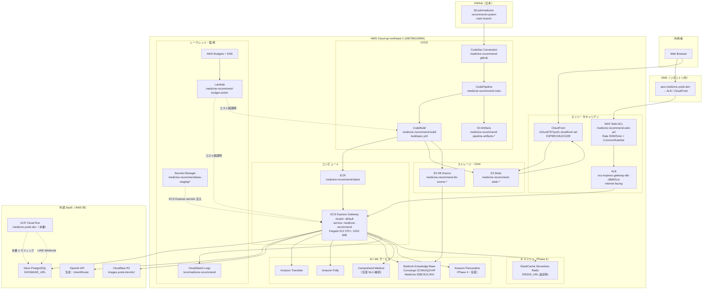

### 実リソース一覧（CLI 確認済み）

| カテゴリ | リソース名 / ID |
|---------|----------------|
| ALB | `ecs-express-gateway-alb-c8b801ce-655959205.ap-northeast-1.elb.amazonaws.com` |
| WAF | `medicine-recommend-web-acl` |
| CloudFront | `d1hux8767tyzd1.cloudfront.net`（Distribution `E3P9RCD6JXOZIR`） |
| ECS クラスタ | `default` |
| ECS サービス | `medicine-recommend`（Express Gateway / CANARY デプロイ） |
| タスク定義 | `default-medicine-recommend`（512 CPU / 1024 MiB / Gunicorn 2 workers） |
| ECR | `290780119994.dkr.ecr.ap-northeast-1.amazonaws.com/medicine-recommend` |
| CodePipeline | `medicine-recommend-main`（Source → Build） |
| S3 | `medicine-recommend-static-*`, `medicine-recommend-kb-source-*`, `medicine-recommend-pipeline-artifacts-*` |
| CloudWatch | `/ecs/medicine-recommend` |
| Lambda | `medicine-recommend-budget-action` |
| Secrets Manager | `medicine-recommend/aws-staging/*`（7 件: OpenAI, DB, SECRET_KEY, R2, DeepL, LINE 等） |

> **注**: 調査時点で ECS `desiredCount=0`（ステージング停止中）。Budget 段階的アクションまたは手動停止の可能性あり。アーキテクチャ自体は変わらない。

---

## 2. CI/CD デプロイフロー

GitHub `main` push をトリガーに、ビルド・デプロイ・静的アセット同期・KB ingestion・smoke test まで一連で実行。

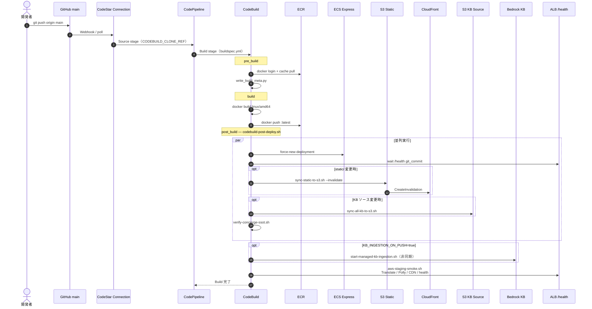

### CodeBuild 環境変数（主要）

| 変数 | 既定 | 説明 |
|------|------|------|
| `SYNC_STATIC_TO_S3` | `true` | static/ → S3 + CloudFront 無効化 |
| `SYNC_KB_TO_S3` | `true`（Console 設定） | Concierge + Medicine KB ソース同期 |
| `KB_INGESTION_ON_PUSH` | `true` | Managed KB ingestion 非同期起動 |
| `RUN_KB_EVAL` | `false` | retrieve 精度 eval |
| `SMOKE_STRICT` | `false` | smoke 失敗で build fail にするか |
| `AWS_STAGING_URL` | `https://aws.medicine.yutok.dev` | ヘルス・smoke 先 |

変更パス検知: `scripts/lib/codebuild_deploy_paths.py` — `src/` のみ push 時は static/KB sync をスキップ（検知不能時はフル sync フォールバック）。

---

## 3. Web リクエストパス（ランタイム）

ブラウザからの HTTP リクエストが ALB 経由で FastAPI コンテナに到達するまでの経路。

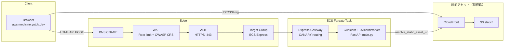

### ヘルスチェック

| エンドポイント | 用途 |
|---------------|------|
| `GET /health` | ALB プローブ + CI commit 確認（`status`, `git_commit`） |
| `GET /health/aws` | AWS 機能フラグ（Translate/Polly/KB 等の利用有無） |
| `POST /api/smoke/aws-translate` | CodeBuild smoke 用 |

---

## 4. Chat Pipeline v2 — マルチエージェント会話フロー

アプリケーション内部の会話処理パイプライン。GCP/AWS 共通ロジックで、AWS 固有サービスは env ゲートで切替。

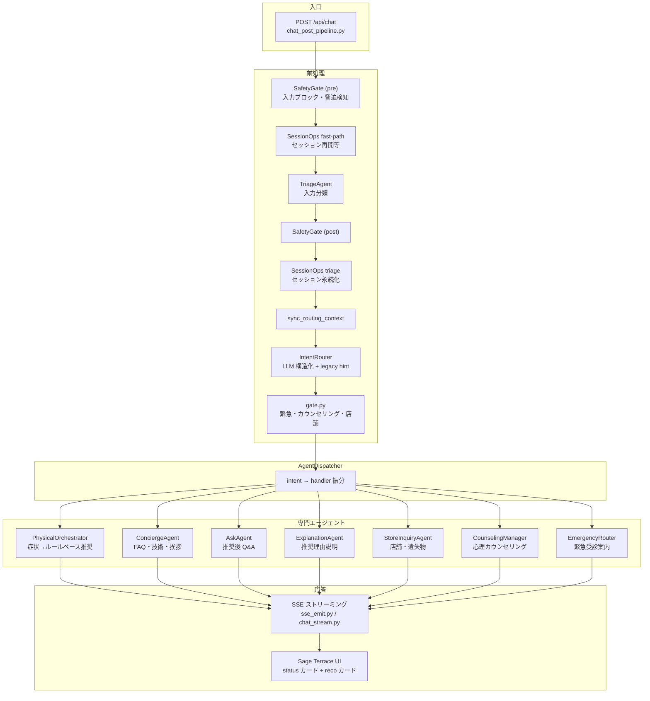

### IntentRouter 振分先（主要）

| ルート | エージェント | 典型入力 |
|--------|-------------|---------|
| Physical | PhysicalOrchestrator | 「頭痛がする」「風邪の薬」 |
| Concierge | ConciergeAgent | 「このサービスとは」「デプロイ方法」 |
| Medicine QA | AskAgent | 推奨後の「副作用は？」 |
| Store | StoreInquiryAgent | 「営業時間は？」 |
| Emergency | EmergencyRouter | 重篤症状・緊急 |
| Counseling | CounselingManager | 心理的相談 |

---

## 5. 症状相談フロー（PhysicalOrchestrator + AWS サービス）

市販薬推奨の核心パス。薬名選定は **ルールベース**（LLM は説明・NLU のみ）。

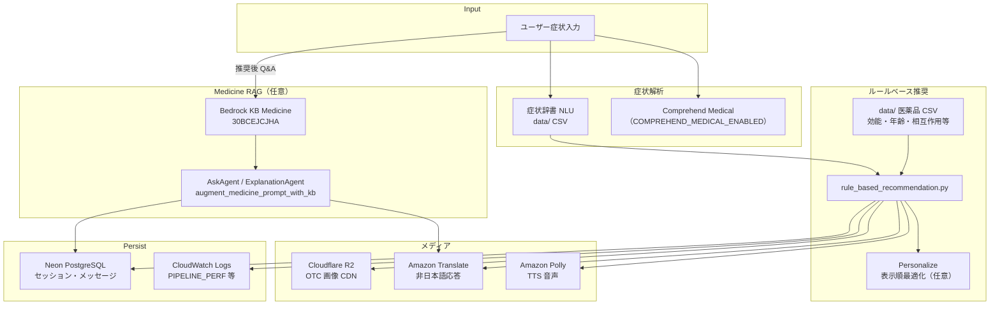

### AWS vs GCP 機能切替（env ゲート）

| 機能 | GCP 本番 | AWS ステージング |
|------|---------|-----------------|
| 翻訳 | DeepL | Amazon Translate |
| TTS | Google Cloud Text-to-Speech | Amazon Polly |
| Concierge RAG | ローカル JSON | Bedrock KB `2CNAGQ2V4P` |
| Medicine RAG | ローカル | Bedrock KB `30BCEJCJHA` |
| 静的 JS/CSS | アプリ同梱 | CloudFront CDN |
| キャッシュ | なし | ElastiCache Redis（任意） |
| 表示順 | ルール順 | Personalize（任意） |

正本: [`config/aws_features.py`](../../config/aws_features.py)

---

## 6. Concierge / Bedrock KB RAG フロー

技術 FAQ・運用情報への回答。AWS ステージングでは Managed KB 経由で retrieve。

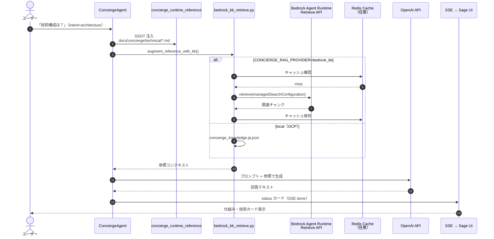

### KB データパイプライン

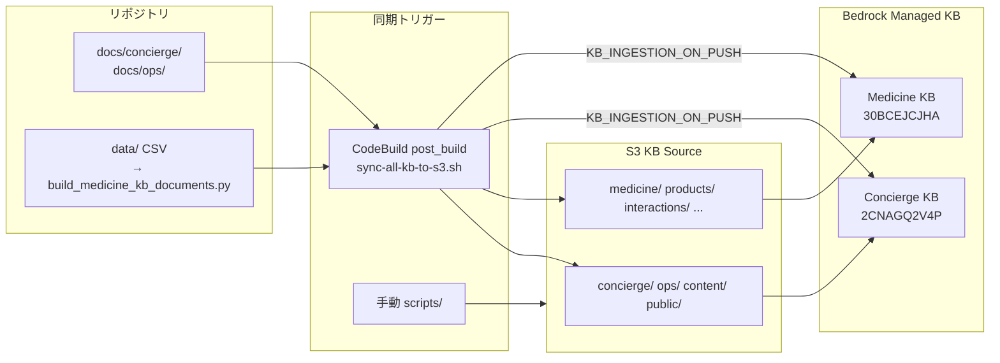

---

## 7. シークレット・データ永続化フロー

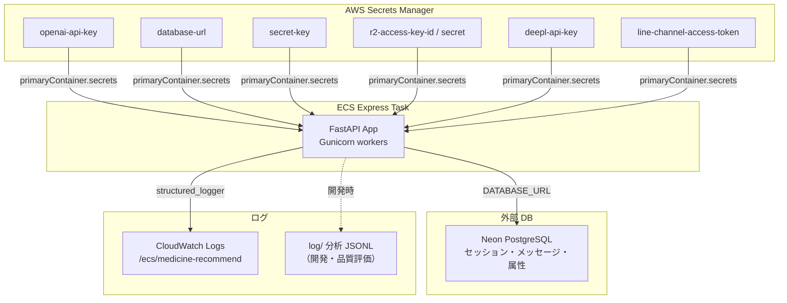

> GCP 本番は Secret Manager + Cloud Logging。DB は Neon の別インスタンスまたは同一（環境により異なる）。

---

## 8. コスト管理フロー（Budget 段階的アクション）

月次予算超過時に Lambda が ECS / CodeBuild を段階的に縮小・停止。

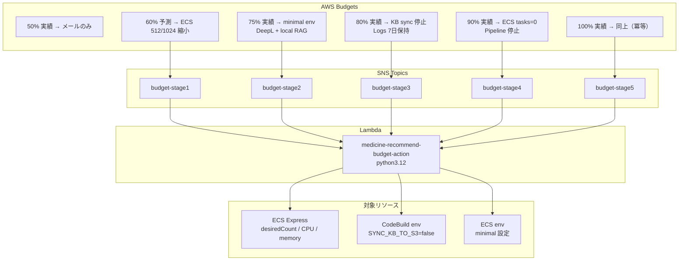

手動復旧: `scripts/resume-aws-staging.sh` / `scripts/resume-aws-bedrock-kb.sh`

---

## 9. クロスクラウド位置づけ

AWS ステージングは GCP 本番と **同一アプリケーションコード** を共有。インフラと AI サービスのみ差分。

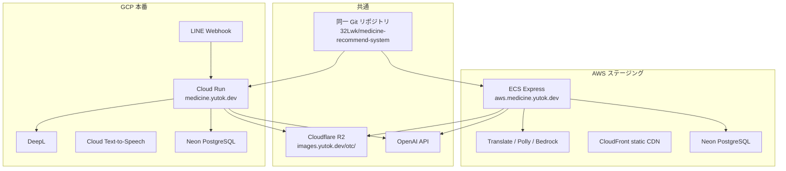

---

## 10. IAM ロール構成

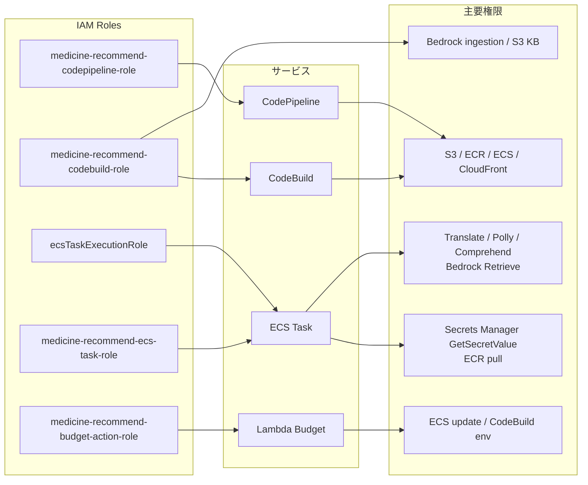

---

## 関連ドキュメント

| ドキュメント | 内容 |
|-------------|------|
| [AWS_INFRA.md](./AWS_INFRA.md) | Phase 1: CloudWatch / WAF / CloudFront |
| [AWS_CODEPIPELINE.md](./AWS_CODEPIPELINE.md) | CI/CD 詳細・トラブルシュート |
| [AWS_FEATURES_ROLLOUT.md](./AWS_FEATURES_ROLLOUT.md) | env ゲート一覧 |
| [AWS_BEDROCK_KB.md](./AWS_BEDROCK_KB.md) | Bedrock KB 運用 |
| [AWS_BUDGET_STAGED_ACTIONS.md](./AWS_BUDGET_STAGED_ACTIONS.md) | コスト削減 |
| [01-cross-cloud-architecture.md](../concierge/technical/01-cross-cloud-architecture.md) | クロスクラウド概要 |
| [02-chat-pipeline-agents.md](../concierge/technical/02-chat-pipeline-agents.md) | エージェント詳細 |

## セットアップスクリプト索引

| Phase | スクリプト |
|-------|-----------|
| 1 | `setup-aws-infra.sh`（CloudWatch + WAF + CloudFront） |
| 2 | Translate / Polly（env 設定） |
| 3 | `setup-aws-bedrock-kb.sh` |
| 4 | `setup-aws-elasticache.sh`, `setup-aws-personalize.sh` |
| 5 | CodeBuild KB 自動 sync（`buildspec.yml` post_build） |
| CI/CD | `setup-aws-codepipeline.sh` |
| コスト | `setup-aws-budget-staged-actions.sh` |
