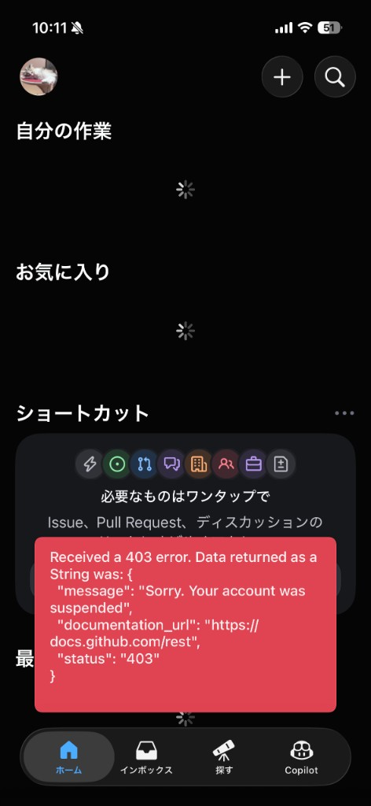

# GitHub アカウント停止インシデント記録（@32Lwk）

**記録日**: 2026-06-22  
**タイムゾーン**: 本文の時刻はすべて **JST（日本標準時, UTC+9）**  
**対象アカウント**: [@32Lwk](https://github.com/32Lwk)  
**対象リポジトリ**: [medicine-recommend-system](https://github.com/32Lwk/medicine-recommend-system)（個人開発・OTC 医薬品推奨アプリ）  
**本番 URL**: https://medicine.yutok.dev  
**Support チケット**: **#4501520**（**2026-06-22 11:05** 受付）  
**ステータス**: ✅ **解決済み — 2026-07-07 に GitHub アクセス復旧**（`git fetch origin` / `gh` が回復）  
**一時ミラー（GitLab）**: [blank2703726/medicine-recommend](https://gitlab.com/blank2703726/medicine-recommend) — **2026-06-22 〜 2026-07-07**（復旧後は `origin`/GitHub がプライマリ）

---

## エグゼクティブサマリー

2026-06-22 午前、Cursor IDE 上の AI エージェントが `gh`（GitHub CLI）経由で **自リポジトリの issue を大量更新**していた。**09:49 までは `git push` 成功**（コミット履歴より）。**09:52** に GitHub Education の再認証メール着信（この時点ではアクセス中断の記載なし）。その後 **~10:11 頃** モバイルアプリで suspend 403 を確認。**11:05** に Support Appeal 受付（Ticket 4501520）。停止の公式通知メール・パスワードリセットメールは **未着**。**その後 2026-07-07 にアクセスが復旧**し、`git fetch origin` / `gh` が正常動作。停止中に GitLab へ積んだ 56 コミットを GitHub へ同期し、通常運用（`origin`/GitHub プライマリ）へ復帰した。

**推定原因（確定ではない）**: 短時間の大量 issue API 操作が自動 abuse 検知に引っかかった可能性が高い。悪意のあるスパム行為ではなく、CHANGELOG / ロードマップ同期の正当なプロジェクト管理だった。

**開発継続**: GitHub 停止中は **GitLab を一時的な正本リモート**として利用（下記「GitLab 一時ミラー」）。

---

## GitLab 一時ミラー（2026-06-22 〜 GitHub 復旧まで）

GitHub への `git push` / `gh` が使えない間、ローカル開発とリモート同期は GitLab で継続する。**代替 GitHub アカウントは作成しない**（ToS リスク）。GitLab は同一リポジトリ内容のミラーであり、GitHub 復旧後に再同期する。

### リモート構成

| リモート | URL | 役割 |
|----------|-----|------|
| `gitlab` | https://gitlab.com/blank2703726/medicine-recommend | **プライマリ** — fetch / push / upstream |
| `origin` | https://github.com/32Lwk/medicine-recommend-system.git | 参照用に残置。**停止中は fetch / push 不可**（403） |

- ローカル `main` の upstream: **`gitlab/main`**
- Cursor エージェント向けルール: [`.cursor/rules/git-remote.mdc`](../../.cursor/rules/git-remote.mdc)（`alwaysApply: true`）
- **Cloud Build（dev）・`cloudbuild.yaml` 修正・復旧手順の詳細**: [`GITLAB_TEMPORARY_MIGRATION.md`](./GITLAB_TEMPORARY_MIGRATION.md)

### 日常コマンド

```powershell
git pull                    # gitlab/main から取得
git push                    # gitlab へ push（upstream 設定済みなら引数不要）
git push gitlab main        # 明示する場合
```

`gh issue` / `gh pr` は停止中は使わない。issue 管理はローカル doc または GitLab Issues に任せる。

### ミラー開始時の状態（2026-06-22）

| 項目 | 内容 |
|------|------|
| GitHub 最終 push | `9832680`（09:49 JST 頃） |
| GitLab `main` 先端 | `db91348`（停止後に doc・ライセンス等 3 コミットを GitLab 側で反映済み） |
| ローカル | `gitlab/main` と同期済み |

### GitHub 復旧後の手順

詳細チェックリストは [`GITLAB_TEMPORARY_MIGRATION.md` §6](./GITLAB_TEMPORARY_MIGRATION.md#6-github-復旧時の手続き) を参照。

1. `git fetch origin` が成功することを確認
2. `gitlab/main` と `origin/main` の差分を確認し、欠けているコミットを双方に反映
3. upstream を戻す: `git branch --set-upstream-to=origin/main main`
4. **Cloud Build**: dev の GitLab トリガー（`medicine-recommend-dev-gitlab-main`）と GitHub 旧トリガーの **どちらか一方** に統一。本番 GitHub トリガーの動作確認
5. `.cursor/rules/git-remote.mdc` を削除または無効化し、本節と `GITLAB_TEMPORARY_MIGRATION.md` §8 に **復旧日** を追記

---

## タイムライン（詳細・JST）

### 時系列一覧

| 時刻 (JST) | 区分 | 出来事 | 根拠・備考 |
|------------|------|--------|-----------|
| **〜09:26** | 作業 | Cursor エージェントに CHANGELOG 同期・issue 改善を依頼。`gh issue edit/create/close/comment` の一連作業開始 | 会話ログ |
| **09:26:59** | git ✅ | `fix: 管理画面のAI自動応答が意図せずOFFに戻る問題を修正` を commit | `git log` |
| **09:26〜09:42** | gh ✅ | issue 大量更新の第1波 — #71 ロードマップ、#55 Epic、#52/#69/#60 等の本文更新、#82 クローズ、#87 作成 等 | 会話ログ・Appeal「~50 issues」 |
| **09:42:49** | git ✅ | commit `050e708` — `docs: LINE 長期記憶運用ガイドと issue レポート形式を追加` を **push 成功** | `git log` |
| **09:42〜09:49** | gh ✅ | issue 作業継続 — #87 クローズ、#60 クローズ、#88/#89–#91 作成、マイルストーン一括付与、リネーム 等 | 会話ログ |
| **09:49:12** | git ✅ | `chore: MIT から PolyForm Noncommercial License へ移行…` を **push 成功**（停止前の最後の push と推定） | `git log` |
| **09:49〜10:05** | gh ✅→❌ | issue 大量更新の第2波 — #57/#52/#74 詳細レポート、CHANGELOG 思想反映の `gh issue edit` 等。Appeal 記載の「停止 **約30分前**」の bulk 操作は **おおよそ 09:35〜10:05** に集中 | Appeal 文面・会話ログ |
| **09:52** | 📧 Education | **GitHub Education Team** から再認証（re-verification）メール着信。本文に「**30日以内に再認証すれば GitHub アクセスへの中断はない**」と明記 | ユーザー提供メール（下記全文要約） |
| **09:52 時点** | 状態 | メール受信可能。**公式の suspend 通知はこのメールではない**（Education 手続きの案内） | 同上 |
| **〜10:05 頃** | gh ❌ | `gh issue edit` / `gh issue view` が `403: Sorry. Your account was suspended` を返し始めた（推定） | 会話ログ・Appeal |
| **10:11** | 📱 判明 | GitHub **iOS アプリ**で 403 エラーを確認（スクリーンショット）。ステータスバー時刻 **10:11** | [証跡画像](./assets/github-ios-suspend-403-2026-06-22-1011.png) |
| **10:11 頃〜** | 🔒 | モバイル: 「自分の作業」「お気に入り」がローディングのまま取得不可 | スクショ |
| **10:11〜11:05** | 🔒 | Web サインイン不可 — パスキー: *Unable to sign in with your passkey…* / パスワードも不可 | ユーザー報告 |
| **10:11〜11:05** | 🔒 | `git push` 拒否（アカウント停止） | Appeal 文面 |
| **10:11〜11:05** | 📧 | 停止通知メール **未着** / パスワードリセットメール **未着** | ユーザー報告 |
| **〜11:05** | 📧 Support | GitHub Support へ Appeal フォーム送信 | ユーザー操作 |
| **11:05** | 📧 Support | Ticket **#4501520** 受付自動返信着信。参照タグ `[K79G0V-J5DEV]` | ユーザー提供メール |
| **11:05 以降** | ⏳ | Support 人間による審査結果 **未着** | — |

### 時間関係の整理

```
09:26        git commit（管理画面 fix）
  │
09:26–09:49  gh issue 大量更新（第1〜2波）+ git push ×2 成功
  │
09:42        push 050e708（LINE 長期記憶 doc）
09:49        push ライセンス変更 ← 停止前の最後の push（推定）
  │
09:52        📧 Education 再認証メール（suspend とは別件）
  │
~09:35–10:05 bulk gh 操作集中帯（Appeal: 停止約30分前）
  │
~10:05       gh API 403 suspend 開始（推定）
  │
10:11        📱 モバイルアプリで suspend 確認
  │
10:11–11:05  サインイン不可・停止/リセットメール未着
  │
11:05        📧 Support Ticket 4501520 受付
```

| 区間 | 所要時間 | 意味 |
|------|---------|------|
| 09:49 → 09:52 | **3 分** | 最後の push 成功後もメール受信は正常。Education メールは **アクセス停止の通知ではない** |
| 09:52 → 10:11 | **~19 分** | Education メール受信後、モバイルで suspend を初確認するまでの推定時間 |
| 10:11 → 11:05 | **~54 分** | suspend 判明から Appeal 受付まで（調査・文面作成・フォーム送信） |
| 09:49 → 10:11 | **~22 分** | 最後に確認できた正常 push から suspend 判明までの推定ウィンドウ |

> **注意**: suspend が発動した正確な秒刻は GitHub 側非公開。上表の `~10:05` は「09:49 以降に gh が失敗し始めた」と「10:11 スクショ」の間から推定。

### フェーズ別サマリー（同日 2026-06-22）

| フェーズ | 時刻帯 | アカウント状態 |
|---------|--------|---------------|
| A. 通常作業 | 〜09:49 | git push ✅ / gh issue ✅ |
| B. 移行期（推定） | 09:49〜10:05 | push はまだ成功した可能性 / gh は後半で 403 の可能性 |
| C. 停止確認 | 10:11〜 | API・モバイル 403 / サインイン不可 |
| D. 救済申請 | 11:05〜 | Ticket 4501520 受付 |
| E. 復旧 | 2026-07-07 | ✅ アクセス回復。`git fetch origin` / `gh` 正常。GitHub へ 56 コミット同期・upstream 復帰 |

---

## タイムライン（過去・Education 関連）

| 日付 | 出来事 |
|------|--------|
| **2025-12-10** | GitHub Education 申請を提出（@32Lwk） |
| **2025-12-10 以降** | **却下** — 学生証の法的氏名と GitHub プロフィール/請求名が不一致（ニックネーム「ゆう」等 vs 法定名 Kawashima Yuto） |
| **2026-06-22 09:52** | 再認証（re-verification）の催促メール着信（30 日以内に手続きを求める） |

---

## 停止直前に実行していた操作（作業内容）

### 目的

- `CHANGELOG.md`（最終更新 2026-06-22）とコードベースを照合
- GitHub issue をロードマップ（#71）・Epic（#55, #88）と同期
- `docs/planning/ISSUE_REPORT_FORMAT.md` 形式の詳細レポートを主要 issue に付与

### 実施済み（停止前に成功した可能性が高い操作）

| カテゴリ | 内容 |
|---------|------|
| **クローズ** | #82 Rich Menu、#60 LINE doc、#87 長期記憶運用 doc |
| **新規作成** | #88 Epic（オンボーディング checklist）、#89–#91 |
| **リネーム** | #51, #47, #54 等（口語タイトル → 説明的タイトル） |
| **マイルストーン** | open issue 全件にマイルストーン付与 |
| **本文更新** | #71 ロードマップ全面更新、#55 Epic、#52/#57/#74 詳細レポート、他多数 |
| **コメント** | #55, #71 等へのクロスリンク |
| **git** | doc commit `050e708` push 済み |

### 停止時に失敗した操作

| 操作 | エラー |
|------|--------|
| `gh issue edit` (#55, #88, #57, #52, #74 等) | `403 Forbidden: Sorry. Your account was suspended` |
| `gh issue view` | `HTTP 403: Sorry. Your account was suspended` |
| `scripts/update_issues_changelog_philosophy.sh` 実行 | 同上（未反映の思想セクションが残存） |

### 操作規模（Appeal 記載・会話ログより）

- **対象**: 自リポジトリ `medicine-recommend-system` **のみ**
- **規模**: issue 約 **50 件** 程度の一括更新（edit / create / close / comment / label / milestone）
- **ツール**: Cursor IDE + GitHub CLI (`gh`)
- **他ユーザー・他リポジトリへの操作**: なし（意図的に自プロジェクトのみ）

---

## 現在の症状（アクセス不能の詳細）

### API / CLI

```json
{
  "message": "Sorry. Your account was suspended",
  "documentation_url": "https://docs.github.com/rest",
  "status": "403"
}
```

### モバイルアプリ（GitHub iOS）

- **確認時刻**: **2026-06-22 10:11 JST**（ステータスバー時刻）
- **端末**: iPhone（GitHub iOS アプリ・日本語 UI）
- ホーム画面でデータ取得時に上記 403 が赤いエラーバナーで表示
- 「自分の作業」「お気に入り」等がローディングのまま取得不可
- 下部タブ: ホーム（選択中）/ インボックス / 探す / Copilot

**スクリーンショット証跡**（suspend 初回確認）:



*ファイル: [`docs/ops/assets/github-ios-suspend-403-2026-06-22-1011.png`](./assets/github-ios-suspend-403-2026-06-22-1011.png)*

画面上のエラー全文（API レスポンス）:

```text
Received a 403 error. Data returned as a String was: {
"message": "Sorry. Your account was suspended",
"documentation_url": "https://docs.github.com/rest",
"status": "403"
}
```

| 画面要素 | 状態 |
|---------|------|
| ステータスバー時刻 | **10:11** |
| バッテリー | 51% |
| 「自分の作業」 | ローディングスピナー（データ取得失敗） |
| 「お気に入り」 | ローディングスピナー（データ取得失敗） |
| 「ショートカット」 | 表示されるが操作不能 |

### Web サインイン

| 手段 | 結果 |
|------|------|
| パスキー | `Unable to sign in with your passkey. Please sign in with your password.` |
| パスワード（@32Lwk + 正しいパスワード） | **サインイン不可** |
| パスワードリセット | リセットメール **未着** |

### メール（着信時刻付き）

| 種別 | 時刻 (JST) | 状態 |
|------|------------|------|
| GitHub Education 再認証案内 | **09:52** | ✅ **着信済み**（suspend 通知ではない） |
| Education 却下理由の再掲（2025-12-10 申請） | **09:52** | 同一メール内に含まれる |
| アカウント停止の公式通知 | — | ❌ **未着** |
| パスワードリセット | — | ❌ **未着** |
| Support 受付確認（Ticket 4501520） | **11:05** | ✅ **着信済み** |
| Support 人間による審査結果 | — | ⏳ **未着** |

> suspend 中はログイン・メール配信が制限されることがあり、停止通知が遅延または届かないケースがある。

### git 操作

- `git push` → アカウント停止により拒否（Appeal 記載）

---

## 本人情報（Appeal 提出内容）

| 項目 | 値 |
|------|-----|
| 氏名 | Kawashima Yuto（川嶋宥翔） |
| メール | yuto.k_1028@icloud.com |
| 電話 | +81-80-8537-2616 |
| 所属 | 名古屋大学 理学部 物理学科 3年 |
| GitHub ユーザー名 | @32Lwk |
| アカウント数 | この 1 のみ（代替アカウント作成予定なし） |

---

## GitHub Education 関連コンテキスト

### 2026-06-22 09:52 着信メール（全文要約）

**送信元**: GitHub Education Team  
**着信時刻**: **2026-06-22 09:52 JST**  
**宛名**: ゆう（Hi ゆう,）

#### パート 1 — 再認証（re-verification）の催促

> Hello from the GitHub Education Team!
>
> Occasionally it is necessary for us to ask you to reverify your current academic status…
>
> **There will be no interruption to your GitHub access, provided you are successfully reverified within the next 30 days.** However, if you are a member of the GitHub Student Developer Pack you must be reverified before your access to the partner offers is restored.
>
> To reverify: https://education.github.com/discount_requests/application → "submit your information again."
>
> Upload official, dated proof — student/faculty ID or current course registration. Review may take up to two weeks.

**要点（時系列上の意味）**:

- このメールは **09:52 に着信** — その **19 分後（10:11）** にモバイルで suspend を確認
- メール本文は「再認証すれば **GitHub アクセスは中断されない**」と明記 → **Education 再認証とアカウント suspend は別イベントの可能性が高い**
- ただし同日朝に届いたことは、Support 審査時の背景情報として有用

#### パート 2 — 2025-12-10 申請の却下理由（再掲）

> We couldn't verify your academic affiliation based on your submission (Dec 10, 2025) for user @32Lwk.
>
> **Issues to address:**
>
> 1. 学生証の **姓** が GitHub **billing** の last name と完全一致すること
> 2. 学生証の **名** が GitHub **billing** の first name と完全一致すること（ニックネーム不可）
> 3. GitHub **プロフィール**の氏名も学生証と完全一致。ニックネーム不可。更新後は **ログアウト→再ログイン** してから再申請

**本人の対応予定（復旧後）**:

| 項目 | 現状 | 修正先 |
|------|------|--------|
| プロフィール名 | ニックネームの可能性 | **Kawashima Yuto**（学生証通り） |
| Billing 名 | 不一致で却下 | 同上 |
| 再申請 | 未完了 | 名古屋大学の学生証をアップロード |

**制約**: アカウント suspend 中はログインできず、**プロフィール/billing の修正も Education 再申請も不可**。

### 過去の Education 履歴

| 日付 | 出来事 |
|------|--------|
| **2025-12-10** | 初回申請 → **却下**（氏名不一致） |
| **2026-06-22 09:52** | 再認証催促 + 却下理由の再掲 |
| **suspend 中** | 再認証 **未着手**（アクセス不可のため） |

---

## Support への問い合わせ記録

### 送信・受付時刻

| イベント | 時刻 (JST) |
|---------|------------|
| Appeal フォーム送信 | **〜11:05**（受付メール直前と推定） |
| Ticket **#4501520** 受付自動返信 | **2026-06-22 11:05** |

### フォーム入力

| フィールド | 値 |
|-----------|-----|
| 件名 | Appeal: Suspended student account @32Lwk — no malicious intent, request reinstatement |
| ユーザー名 | 32Lwk |
| プライマリメール | yuto.k_1028@icloud.com |
| 制限の種類 | **アカウントが停止されています** |
| ドメイン/コンテンツ削除要否 | **いいえ** |
| 以前のチケット | 空欄（初回） |

### 受付自動返信（11:05 着信）

- **Ticket ID**: `4501520`
- **着信時刻**: **2026-06-22 11:05 JST**
- **参照タグ**: `[K79G0V-J5DEV]`
- **宛名**: Kawashima,（フォームの氏名から）
- **内容（要約）**:
  - メッセージ受領の確認
  - サポートリクエスト増加により **対応に時間がかかる** 旨
  - GitHub Docs / Community ではアカウント復旧は扱えない旨
- **審査結果（人間による返信）**: 未着

### Appeal 本文の要点

1. 悪意なし — 自リポジトリの issue 整理のみ
2. bulk CLI が自動検知をトリガーした可能性を認識、今後は大量更新を控える
3. Education 再認証を法定名で完了する意思
4. サインイン不可・メール未着の現状
5. 新規アカウントでの迂回はしない

---

## 技術的影響（本リポジトリ）

| 領域 | 影響 |
|------|------|
| **GitHub への push** | 不可（403） |
| **GitLab への push** | **可** — 一時ミラー [`blank2703726/medicine-recommend`](https://gitlab.com/blank2703726/medicine-recommend) |
| **issue 更新（未反映分）** | `scripts/update_issues_changelog_philosophy.sh` がローカルに残存。#57/#52/#74/#55/#88 の CHANGELOG 思想セクションは **GitHub 上未反映の可能性**（`gh` 停止中） |
| **CI / Actions** | GitHub Actions はアカウント停止により動かない。GitLab CI は未導入 |
| **dev デプロイ** | **GitLab 連携済み** — トリガー `medicine-recommend-dev-gitlab-main` → `medicine-recommend-dev`（[`GITLAB_TEMPORARY_MIGRATION.md`](./GITLAB_TEMPORARY_MIGRATION.md)） |
| **本番デプロイ** | Cloud Run 既存リビジョンは継続。GitHub 本番トリガーは停止中は動かない — 急ぎは GCP コンソール / `gcloud builds submit` |
| **ローカル開発** | ローカルコード・doc は無事。`.env` 等はローカルに保持。`git pull` / `git push` は GitLab 経由で継続可能 |

### 未コミット変更（停止時点で残っていた可能性）

会話ログより、以下は doc commit `050e708` **に含まれていない** 変更があった:

- `LICENSE`, `README.md`
- 公開 doc（プライバシーポリシー、免責事項等）
- `static/js/main.js`（#52 スクロール修正の途中変更は **abort されワークスペースに残存した可能性** — 要 `git status` 確認）

---

## 推定原因分析

### 最有力: 自動 abuse 検知（false positive の可能性）

GitHub はスパム bot 対策のため、以下パターンでアカウントを **自動 suspend** することがある:

- 短時間に大量の REST / GraphQL API 呼び出し
- 多数の issue 作成・編集・クローズの連続
- 新規・低活動アカウントでの一気操作

今回の `gh issue edit` × 数十件は、**中身が正当でも API パターンが bot と類似**する。

### 関連しうるが確定しない要因

- GitHub Education 再認証未完了（**09:52 メールは「アクセス中断なし」と明記** — suspend 直接原因とは考えにくい）
- プロフィール名と請求名の不一致（2025-12-10 却下。Trust & Safety とは別チームの可能性）
- トークン/keyring の invalid 表示（suspend の **結果** として発生した可能性が高い）

### Education メール（09:52）と suspend（〜10:11）の関係

| 観点 | 解釈 |
|------|------|
| 時刻順 | Education **09:52** → suspend 確認 **10:11**（19 分後） |
| メール文言 | Education は「再認証すればアクセス中断なし」— **suspend 予告ではない** |
| 同日発生 | 偶然のタイミングの可能性、または別部門の並行処理 |
| Appeal での扱い | 背景説明として提出済み。因果は **Support に確認待ち** |

### 今回の作業が **BAN 理由になりにくい** もの

- CHANGELOG / ops doc の commit 内容そのもの
- 日本語の issue 本文
- 自リポジトリのみの操作
- 他ユーザーへのスパム・フォーク乱用・不正コンテンツ

---

## 再発防止（復旧後の運用ルール）

1. **issue 一括更新は 1 回 5 件以下、操作間に 30 秒以上の間隔**
2. **`gh issue edit` のループは避け**、本文はローカル md で下書き → 少数ずつ反映
3. **Cursor エージェントへの依頼は「10 件ずつ」「間隔を空けて」** と明示
4. `scripts/update_issues_changelog_philosophy.sh` は **分割実行用に改修**するか、手動で 1 issue ずつ実行
5. **Education 再認証**は法定名（Kawashima Yuto）でプロフィール・請求を揃えてから申請
6. **代替アカウントを作らない**（ToS 違反・永久化リスク）

---

## 次のアクション

| 優先度 | アクション | 状態 |
|--------|-----------|------|
| P0 | Support 返信待ち（Ticket **4501520**） | ✅ 復旧（2026-07-07） |
| P0 | 受信トレイ（icloud.com）の迷惑メール・プロモーション確認 | 未確認 |
| P1 | Support 返信があれば **同スレッドに返信**で追記（学生証提出等） | 待機 |
| P1 | 復旧後: `gh auth login` 再実行 | ブロック中 |
| P1 | 復旧後: `scripts/update_issues_changelog_philosophy.sh` を **分割実行** | ブロック中 |
| P1 | 停止中: コミットは **`git push`（GitLab）** で同期 | ✅ 運用中 |
| P2 | ローカル未コミット変更の整理（`git status`） | いつでも可 |
| P2 | 本番 Cloud Run は既存 revision で継続、急ぎの hotfix は GCP コンソール経由を検討 | 必要時 |
| P1 | Cloud Build dev を GitLab 連携（`medicine-recommend-dev-gitlab-main`） | ✅ 実施（2026-06-23） |
| P2 | GitHub 復旧後: GitLab ↔ GitHub 同期・upstream 復帰・トリガー整理 | 復旧後（[手順](./GITLAB_TEMPORARY_MIGRATION.md#6-github-復旧時の手続き)） |

### Support 返信への追記候補（返信メールにそのまま貼れる）

```
Ticket ID: 4501520

Additional context (timeline, JST):
- 09:52 — Received GitHub Education re-verification email (states no access 
  interruption if reverified within 30 days). This is NOT a suspension notice.
- ~10:11 — First confirmed suspension via mobile app (HTTP 403).
- 11:05 — Submitted this appeal; received auto-reply for ticket 4501520.
- I still cannot sign in (passkey or password). No suspension or password-reset 
  emails to yuto.k_1028@icloud.com.
- Last successful git push: 2026-06-22 09:49:12 JST.
- All bulk issue activity was limited to my repository medicine-recommend-system only.
- I am happy to provide Nagoya University student ID for verification.
- I will not perform bulk issue updates via CLI after reinstatement.

Thank you for your review.
Kawashima Yuto / @32Lwk
```

---

## 参考リンク

- [GitHub REST API — 403 suspended](https://docs.github.com/rest)
- [GitHub Support](https://support.github.com)
- 証跡画像: [`docs/ops/assets/github-ios-suspend-403-2026-06-22-1011.png`](./assets/github-ios-suspend-403-2026-06-22-1011.png)
- ローカル未反映スクリプト: [`scripts/update_issues_changelog_philosophy.sh`](../../scripts/update_issues_changelog_philosophy.sh)
- issue レポート形式: [`docs/planning/ISSUE_REPORT_FORMAT.md`](../planning/ISSUE_REPORT_FORMAT.md)
- GitLab 一時ミラー: [blank2703726/medicine-recommend](https://gitlab.com/blank2703726/medicine-recommend)
- Cursor ルール: [`.cursor/rules/git-remote.mdc`](../../.cursor/rules/git-remote.mdc)
- GitLab 一時移行（Cloud Build 含む）: [`GITLAB_TEMPORARY_MIGRATION.md`](./GITLAB_TEMPORARY_MIGRATION.md)

---

## 更新履歴

| 日付 | 内容 |
|------|------|
| **2026-07-07** | ✅ **解決** — GitHub アクセス復旧。停止中の 56 コミットを GitHub へ同期（巨大ログ `log/app.log`(3.4GB)・131MB err.log を GitHub 履歴から除去）、upstream を `origin/main` へ復帰、`git-remote.mdc` 無効化。詳細: [`GITLAB_TEMPORARY_MIGRATION.md` §9](./GITLAB_TEMPORARY_MIGRATION.md#9-復旧記録2026-07-07-実施) |
| 2026-06-22 | 初版 — 停止判明・Appeal 送信・Ticket 4501520 受付 |
| 2026-06-22 | **時刻詳細追記** — JST タイムライン、09:52 Education メール全文要約、11:05 Ticket 4501520、`git log` 時刻（09:42/09:49 push）、10:11 モバイルスクショ |
| 2026-06-22 | **証跡画像追加** — `docs/ops/assets/github-ios-suspend-403-2026-06-22-1011.png`（10:11 iOS 403 画面） |
| 2026-06-22 | **GitLab 一時ミラー** — リモート `gitlab`・upstream `gitlab/main`・`.cursor/rules/git-remote.mdc`・本節追記 |
| 2026-06-23 | **Cloud Build dev → GitLab** — `GITLAB_TEMPORARY_MIGRATION.md`・`cloudbuild.yaml` の `$$` エスケープ |

---

_この文書はインシデント記録であり、GitHub の公式見解ではない。停止理由の確定は Support の返答を待つ。_
