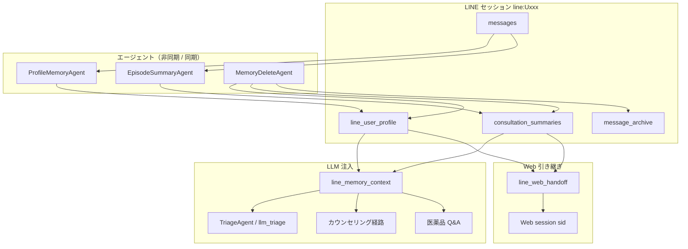

# LINE 長期記憶 — 運用ガイド

LINE 連携ユーザー向けの**永続プロファイル**と**相談エピソード要約**の保存・注入・削除・管理画面操作をまとめた運用ドキュメントです。

関連: [LINE_WEBHOOK_SETUP.md](LINE_WEBHOOK_SETUP.md) · [プライバシーポリシー](../public/プライバシーポリシー.md) · [ADMIN_PII_PLAYBOOK.md](../security/ADMIN_PII_PLAYBOOK.md) · [ARCHITECTURE_MULTI_AGENT.md](../dev/ARCHITECTURE_MULTI_AGENT.md)

---

## 1. 概要

| 概念 | 保存先 | 内容 |
|------|--------|------|
| **永続プロファイル** | `line_user_profile`（DB セッション `line:{userId}`） | 年齢・性別・妊娠/授乳・アレルギー・服薬中・既往等 |
| **エピソード要約** | `consultation_summaries` | 相談ログから生成した JSON 要約（症状・推奨薬・key_facts 等） |
| **会話アーカイブ** | `message_archive` | トリム前の全履歴（バックフィル元・削除対象に含められる） |
| **現行会話** | `messages` | 直近の表示用メッセージ（LINE セッションは最大 **24 件**に trim — `LINE_SESSION_MAX_MESSAGES`） |

トリアージ・カウンセリング・医薬品 Q&A・Web 引き継ぎ先セッションへ、上記を LLM プロンプト用に整形して注入します。

---

## 2. アーキテクチャ



### オーナー解決（`resolve_memory_owner_sid`）

| セッション種別 | sid 例 | 記憶オーナー |
|---------------|--------|-------------|
| LINE 本番 | `line:Uxxxxxxxx` | 自身 |
| Web 引き継ぎ | `sess-...` + `handoff_from_line: line:Uxxx` | `line:Uxxx` |

Web だけのセッション（引き継ぎなし）には長期記憶は紐づきません。

---

## 3. 環境変数

| 変数 | 既定 | 説明 |
|------|------|------|
| `LINE_MEMORY_RECENT_TURNS` | `5` | LLM に渡す直近ターン数（Sage マーカーは圧縮テキストに展開） |
| `LINE_MEMORY_SUMMARY_MAX` | `5` | 保持するエピソード要約の最大件数 |

定義: `config/line_memory_config.py`

---

## 4. ライフサイクル

### 4.1 セッション開始

1. `prime_line_session`（`line_session.py`）で LINE セッションを初期化
2. `apply_profile_to_session` — DB の `line_user_profile` を `user_attributes` にマージ

### 4.2 相談中

| タイミング | 処理 | 実装 |
|-----------|------|------|
| 属性抽出完了 | プロファイル非同期永続化 | `async_attribute_extractor` → `schedule_profile_persist` |
| セッション DB 保存 | 同上 | `session_manager._schedule_line_memory_side_effects` |
| 各 POST | 記憶削除意図チェック | `chat_post_pipeline` → `try_handle_memory_delete`（同期） |
| トリアージ / Q&A | 長期記憶ブロック注入 | `build_long_term_memory_block` + `memory_digest` キャッシュキー |

### 4.3 推奨完了

- `maybe_schedule_line_episode_summary` — 推奨 diagnosis ありのとき `EpisodeSummaryAgent` を非同期実行
- 同一 `episode_id` 内の要約は **upsert**（推奨完了 + セッション終了の重複防止）

### 4.4 セッション終了（`/終了` 等）

- `clear_line_session_state` — 会話・カウンセリング状態をリセット
- **プロファイルは保持** — 要約生成 + プロファイル保存ジョブをスケジュール

### 4.5 Web 引き継ぎ

- `line_web_handoff.py` — snapshot に `line_user_profile` / `consultation_summaries` を載せる
- Web セッションでの属性更新 → `schedule_handoff_profile_writeback` で LINE オーナーへ非同期反映

#### 運用手順（QA / サポート）

1. LINE トークで「Web で続ける」等の導線から引き継ぎ URL を発行（`create_web_session_from_handoff`）
2. ユーザーが `/resume/{token}` を開く — サーバーが `ui_variant=sage` クッキーを付与
3. 管理画面で Web セッションを確認:
   - `handoff_from_line: line:Uxxx` が設定されていること
   - `line_memory_owner_sid` が LINE sid を指すこと
4. 長期記憶タブ — プロファイル・要約が LINE オーナー sid のデータと一致すること
5. legacy HTML 履歴は `normalize_handoff_messages` で `sage_reco` / `sage_status` / `sage_qa` + diagnosis v1 に正規化される
6. LINE 本番でスキップした個別アドバイスは引き継ぎ時 `_maybe_enrich_personalized_advice` で補完される

関連テスト: `tests/line/test_line_web_handoff.py`

---

## 5. ユーザー向け削除

### 5.1 チャット内削除依頼

`MemoryDeleteAgent`（`src/agents/memory_delete_agent.py`）がセキュリティゲート後・トリアージ前に同期処理します。

**キーワード例**（ルールベース）:

- 全件: 「記憶を消して」「履歴を削除」「全部消して」
- 部分: 「アレルギー情報だけ消して」「服薬の記憶を消して」

**scope**:

| scope | 動作 |
|-------|------|
| `all` | プロファイル + 要約 + `message_archive` 削除 |
| `summaries_only` | 要約のみ削除 |
| `profile_partial` | 指定 `profile_keys` のみクリア |

応答は `sage_status`（`kind: memory_delete`）で返します。

### 5.2 法務・問い合わせ

- プライバシーポリシー **第5条・第7条** 参照
- チャット外の開示・部分削除: [不具合報告フォーム](https://forms.gle/UB8kZHd4VHenmRUN6) または運営連絡先

---

## 6. 管理画面オペレーション

### 6.1 長期記憶タブ

管理画面（`admin_chat.html`）右パネル **コントロール / 長期記憶** タブ。

| UI 要素 | 説明 |
|---------|------|
| 脳アイコン | 長期記憶パネルへフォーカス |
| プロファイル表示 | `line_user_profile` の各フィールド |
| 要約一覧 | `consultation_summaries`（チェックボックス選択可） |
| アーカイブから生成 | バックフィル API 呼出 |
| 全削除 / 選択削除 | 削除 API 呼出 |

セッション一覧バッジ:

- `is_line_related` — LINE セッションまたは引き継ぎ関連
- `is_line_handoff` — Web 引き継ぎセッション
- `line_memory_owner_sid` — 記憶の実オーナー（引き継ぎ時に表示）

### 6.2 API

#### バックフィル

```http
POST /api/admin/sessions/{session_id}/line_memory/backfill
Authorization: Basic ...
Content-Type: application/json

{ "force": false }
```

| `force` | 動作 |
|---------|------|
| `false` | プロファイルが空のときのみ LLM 抽出、要約 0 件のときのみ生成 |
| `true` | プロファイル再抽出、要約を最大件数まで再生成（既存要約は置換） |

#### 削除

```http
POST /api/admin/sessions/{session_id}/line_memory/delete
Content-Type: application/json

{
  "scope": "all",
  "profile_keys": [],
  "summary_ids": []
}
```

| scope | 説明 |
|-------|------|
| `all` | プロファイル + 要約 + アーカイブ（現行 `messages` は保持） |
| `summaries_only` | 要約全削除、または `summary_ids` 指定で部分削除 |
| `profile_partial` | `profile_keys` / `summary_ids` で部分削除 |

### 6.3 ライフサイクルラベル

| ラベル | 意味 |
|--------|------|
| `line_memory_deleted` | 長期記憶の削除実行 |
| `line_memory_backfilled` | アーカイブからのバックフィル完了 |

---

## 7. トラブルシュート

| 症状 | 確認ポイント | 対処 |
|------|-------------|------|
| 記憶が LLM に注入されない | `resolve_memory_owner_sid` が null でないか | LINE sid / `handoff_from_line` を確認 |
| トリアージ結果が古い | `memory_digest` がキャッシュキーに含まれる | 記憶更新後はキャッシュ無効化済み。属性変更直後の再 POST を試す |
| バックフィルが `skipped` | `message_archive` が空、または既に記憶あり | `force: true` で再実行。`messages_live_count` / `message_archive_count` を管理画面で確認 |
| 引き継ぎ Web で記憶が見えない | `line_memory_owner_sid` | オーナー sid のセッションを直接開く |
| 要約が重複 | 同一 `episode_id` | 設計上 upsert。`reset_current_episode_id` はセッション終了時に暗黙リセット |
| 削除後も属性が残る | 現行セッションの `user_attributes` | 削除 API 後にセッション再読込。ユーザー側は次メッセージで反映 |

---

## 8. 手動 QA チェックリスト

- [ ] LINE で症状相談 → 推奨後、管理画面の長期記憶タブに要約が追加される
- [ ] 「記憶を全部消して」→ 確認メッセージ + プロファイル・要約が空になる
- [ ] 「アレルギーだけ消して」→ アレルギーのみクリア、他属性は保持
- [ ] Web 引き継ぎ後、Web セッションの長期記憶タブでオーナー sid が表示される
- [ ] バックフィル（force=false）— 空の記憶のみ生成、既存は skipped
- [ ] ライフセッションイベントに `line_memory_backfilled` / `line_memory_deleted` が記録される

---

## 9. テスト

| ファイル | 内容 |
|---------|------|
| `tests/line/test_line_user_memory.py` | オーナー解決、マージ、削除意図、memory_digest |
| `tests/line/test_line_memory_backfill.py` | エピソード分割、バックフィル |
| `tests/line/test_line_session_policy.py` | セッション終了時ジョブ |
| `tests/routing/test_triage_cache_matrix.py` | memory_digest によるキャッシュキー差分 |

```bash
pytest tests/line/test_line_user_memory.py tests/line/test_line_memory_backfill.py tests/routing/test_triage_cache_matrix.py -q
```

---

## 10. 主要ソースファイル

| パス | 役割 |
|------|------|
| `src/services/line_user_memory.py` | 永続化コア |
| `src/services/line_memory_context.py` | LLM プロンプト整形 |
| `src/services/line_memory_jobs.py` | 非同期ジョブ |
| `src/services/line_memory_backfill.py` | アーカイブバックフィル |
| `src/agents/profile_memory_agent.py` | プロファイル永続化 |
| `src/agents/episode_summary_agent.py` | エピソード要約 |
| `src/agents/memory_delete_agent.py` | 削除意図分類・実行 |
| `config/line_memory_config.py` | 環境変数 |

---

_初版: 2026-06-22（CHANGELOG 2026-06-22 実装に対応）_
