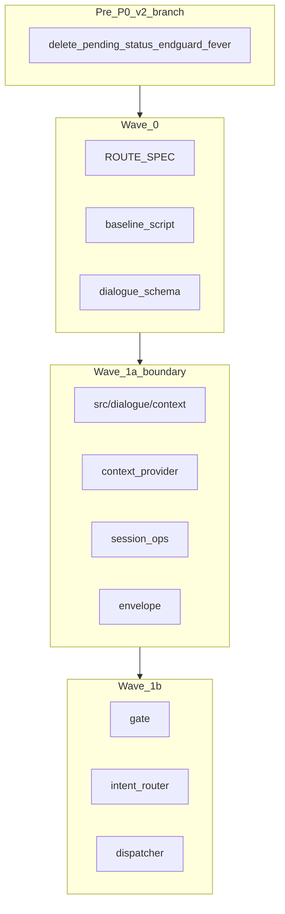

# Chat Pipeline v2 — 改訂版 v4（第3レビュー: 実行リスク）

**ステータス**: **Wave 0 着手 Go** / Wave 1a は Wave 0 signoff + CCR + Pre-P0 + **48h dev QA 合格** 後

**カレンダー見積**: 工数 **13–18 週（1 FTE）** + CCR 待ち・手動 QA・soak → **約 4–5 ヶ月**

---

## 確定した意思決定（全集約）

| ID | 論点 | 確定 |
|----|------|------|
| D1 | Pre-P0 配置 | v2 ブランチ先頭。**dev は手動デプロイ + ソフト SLA**（下記 D9） |
| D2 | Wave 1a | Session + Context + Envelope のみ |
| D3 | Golden test | ROUTE_SPEC + expected_v2_diff.yaml |
| D4 | スケジュール | 13–18 週工数、**1a ゲート**、カレンダー **4–5 ヶ月** |
| D5 | IntentRouter | 2 段 gate → LLM |
| D6 | Web SessionOps | 要約+status Web 可、delete は line owner/handoff |
| D7 | LINE 計画統合 | P0-2〜6 + P1-3,6,7 → v2 Pre-P0。**別 MR 禁止** |
| D8 | パッケージ名 | `src/dialogue/` |
| D9 | dev デプロイ SLA | **Pre-P0 マージ後 48h 以内** dev 手動デプロイ + **LINE QA 10 項目** 全合格 |
| D10 | Pre-P0 工数 | **3–5 営業日**（12 pre 項・fever/end_guard 相互作用込み） |
| D11 | dev QA 担当 | **実装者**がデプロイ + QA 実施 + チェックリスト記録 |
| Q2–Q23 | その他 | 第2レビュー表どおり |

- [ ] Pre-P0 完了後 **48h 以内** dev デプロイ + [`PRE_P0_LINE_QA_10.md`](docs/ops/PRE_P0_LINE_QA_10.md) 全合格（D9–D11）

---

## Pre-P0 ソフト SLA と QA（D9–D11）

| 項目 | 内容 |
|------|------|
| **担当** | 実装者（開発担当が Cloud Run dev デプロイ + LINE 実機 QA） |
| **期限** | Pre-P0 MR マージから **48 時間以内**（ソフト SLA — 遅延時は Wave 0 着手を止める） |
| **合格** | 下記 10 項目 **すべて Pass**（1 項目でも Fail → 修正 MR → 再デプロイ → 再 QA） |
| **記録** | チェックリストに日時・dev URL・実行者・Pass/Fail を記入し `log/` または MR コメントに残す |

### LINE QA 10 項目（`PRE_P0_LINE_QA_10.md` 初版）

1. `履歴消して` → 削除**確認**（即実行しない）
2. `キャンセル` → pending 解除・症状相談再開可
3. `何が記録されてる` / `履歴を教えて` → **status**（delete 確認にならない）
4. 削除確認 pending 中に `頭痛い` → **症状処理**（再確認ループしない）
5. `39度の熱` → **店舗案内にならない** + bot 応答が空でない
6. `技術スタックは？` → `技術面を詳しく` → **architecture 維持**（greeting 化しない）
7. Quick Reply **削除する / キャンセル** が表示・動作
8. 連続送信で **二重返信が目立たない**（同一文 2 回以内）
9. 期限切れフィードバック → `評価の有効期限が切れました`（誤 success なし）
10. 通常挨拶 1 回 → **汎用 OTC テンプレのみ**で終わらない（end_guard redirect 率の目視確認）

---

## Wave 0 着手前チェックリスト

- [ ] `feature/chat-pipeline-v2` ブランチ作成
- [ ] [`LINE_IMPROVEMENT_PLAN_2026-06-27.md`](docs/planning/LINE_IMPROVEMENT_PLAN_2026-06-27.md) に **v2 統合・別 MR 禁止** を追記（D7）
- [ ] [`src/dialogue/`](src/dialogue/) パッケージ名を [`CHAT_PIPELINE_V2.md`](docs/dev/CHAT_PIPELINE_V2.md) に記載（D8）
- [ ] **Wave 1a スコープ境界** を文書化（下記 §1a 境界）
- [ ] `scripts/measure_pipeline_baseline.py` を Wave 0 todo に含む（todo: w0-baseline-script）
- [ ] Pre-P0 完了後 **48h 以内** dev デプロイ手順 + QA 10 項目 doc（todo: pre-p0-line-qa-checklist）

**Wave 0 の削減方針**: シナリオ **30+ 件は維持**。削るなら **ROUTE_SPEC の冗長説明** から。2–3 週はタイト → **3–4 週** を正式見積もりに含める。

---

## §1a スコープ境界（スコープ creep 防止）

**Wave 1a で変更してよいもの**

- `DialogueContext` / dual-write（`pending_memory_delete` 等）
- `SessionOpsHandler`（旧 SessionAgent の session 操作経路）
- `ContextProvider`（session 操作・end_guard 用の履歴注入）
- `ResponseEnvelope` + Web SSE / LINE delivery **アダプタ**
- `chat_pipeline_end_guard` fail-loud 強化
- `CHAT_PIPELINE_V2` flag + per-session rollback

**Wave 1a で触らないもの（旧 pipeline 100% 維持）**

- `llm_triage` / `meta_triage` / `ChatOrchestrator` の **category 分岐**
- Physical / Concierge / Store / Emergency / Counseling の **route 決定**
- `confidence_gate` 再 triage
- legacy fallback チェーン

**例外**: SessionOps 到達経路のみ v2 化（category routing ではない）。

**生命線（第3レビュー）**: `w1a-scope-creep-lint` — `chat_post_pipeline` / `chat_orchestrator` / `llm_triage` 等への 1a 変更は CI で fail。hook 追加時に triage/orchestrator を触った MR は 1b まで禁止。

---

## LINE_IMPROVEMENT_PLAN 統合マッピング（D7）

| LINE 計画 ID | v2 吸収先 | フェーズ |
|-------------|----------|---------|
| P0-2 SessionAgent | `src/dialogue/session_ops.py`（1a）+ Pre-P0 バグ修正 | pre-p0 / w1a |
| P0-3 session_admin triage | Wave 1b IntentRouter（1a では旧維持） | w1b |
| P0-4 3 経路 | **1b で廃止**（IntentRouter 一本化） | w1b |
| P0-5 Quick Reply | pre-p0-quick-reply-unify | pre-p0 |
| P0-6 テスト | pre-p0-tests | pre-p0 |
| P1-3 発熱 vs 店舗 | pre-p0-fever-store | pre-p0 |
| P1-6 aggressive | pre-p0-aggressive | pre-p0 |
| P1-7 feedback | pre-p0-feedback-expired | pre-p0 |
| P1-1 architecture | CCR + Wave 1b | pre-ccr / w1b |
| P1-4 counseling_detail | w0-baseline + w4 KPI | w0 / w4 |

**禁止**: LINE 計画用の **別 MR を main に出す**（cherry-pick 地獄防止）。

---

## 正直な期待値（ユーザー痛み vs フェーズ）

| 痛み | Pre-P0 | Wave 1a | Wave 1b | Wave 2 |
|------|--------|---------|---------|--------|
| delete 誤誘導 / pending | **改善** | 維持 | 維持 | 維持 |
| fever → store / empty | **改善** | 維持 | **改善** | 維持 |
| architecture follow-up → greeting | CCR 依存 | 部分 | **改善** | 維持 |
| **Counseling 胸フォロー誤爆** | 未改善 | **未改善** | 未改善 | **改善**（counseling_mode PR） |
| 履歴件数分散 | 未改善 | ContextProvider 開始 | 拡大 | 拡大 |

---

## 成功指標（第2レビュー反映）

| KPI | 定義 | 目標 |
|-----|------|------|
| meta follow-up **意図** 維持率 | `last_intent` 一致 | > 95% |
| meta follow-up **内容** 合格率 | architecture 時: greeting 禁止 + 技術語彙1+ | > 90% |
| response_missing | guard 補完除く | < 1% |
| end_guard_redirect 率 | 別 KPI | < 3% |
| ベースライン | w0-baseline-run 記録必須 | 計測後に目標設定 |

---

## 問題診断・目標アーキテクチャ・スケジュール

（改訂版 v2 の §1–3 と同内容。パッケージパスを `src/dialogue/` に更新。）

| フェーズ | 工数（1 FTE） | カレンダー目安 |
|---------|--------------|---------------|
| Pre-P0 実装+QA | **3–5 営業日** + 48h デプロイ SLA | 1 週 |
| Pre-CCR | 1–3 日（**並行可**、1a ブロッカーのみ） | 0–2 週（待ち含む） |
| Wave 0 | **3–4 週** | 1 ヶ月 |
| Wave 1a | 3–4 週 | 1 ヶ月 |
| Wave 1b | 3–4 週 | 1 ヶ月 |
| Wave 2–4 | 7–9 週 + 2 週 soak | 2–3 ヶ月 |
| **合計** | **13–18 週** | **約 4–5 ヶ月** |

---

## ToDo 一覧（細分化 — frontmatter 同期）

全 **54 項**（+pre-p0-line-qa-checklist, +w1a-scope-creep-lint）

### setup（2）
- setup-v2-branch
- setup-line-plan-supersede

### pre（13）
- pre-ccr-merge
- pre-p0-*（9 項）+ pre-p0-tests + pre-p0-line-qa-checklist + pre-p0-dev-deploy-manual

### w0（18）
- w0-pkg-dialogue … w0-review-signoff

### w1a（11）
- w1a-* … **w1a-scope-creep-lint**（生命線）

### w1b（5）
- w1b-deterministic-gate … w1b-legacy-coexist-metrics

### w2–w4（5）
- w2-counseling-mode-pr … w4-architecture-doc

---

## Plan Mode 判定（v4）

| 項目 | 判定 |
|------|------|
| 問題診断 | Accept |
| 目標アーキテクチャ | Accept |
| 実施順序 | Accept |
| 成功指標 | Accept with revision |
| 実行リスク（D1 デプロイ） | **Mitigated**（48h + QA10 + 担当固定） |
| **Wave 0** | **Go** |
| **Wave 1a** | Wave 0 + CCR + Pre-P0 **QA10 合格** |

---

## 残リスク（過信禁止 — 第3レビュー追記）

1. **48h SLA 違反**: Pre-P0 の価値が dev に載らない → **Wave 0 着手を止める**（ゲート）
2. **Pre-P0 3–5 日超過**: fever/end_guard 相互作用 — スコープ追加せず日数延長を許容
3. **Wave 0 重い腰**: 削るのは文書粒度のみ。シナリオ 30+ は非交渉
4. **1a hook 誘惑**: scope-creep lint なしでは計画破綻
5. **1a 完了時の文脈弱さ**: Emotional は Wave 2 — **正常**。計画を疑わない
6. **手動デプロイ忘れ**: QA10 未記録の MR は Pre-P0 未完了扱い
