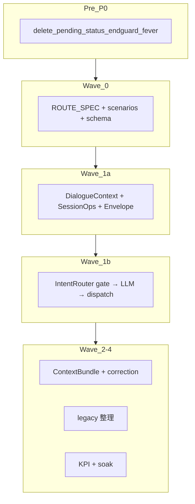

# Chat Pipeline v2 — 実装計画（改訂版 v4）

**ブランチ**: `feature/chat-pipeline-v2`  
**策定**: 2026-06-28（第3レビュー: 実行リスク）  
**ステータス**: コード実装 **49/54 todo 完了** — 残 5 件は人手ゲート

関連ドキュメント:

| ドキュメント | 用途 |
|-------------|------|
| [CHAT_PIPELINE_V2.md](../dev/CHAT_PIPELINE_V2.md) | 技術仕様・フラグ・ベースライン |
| [CHAT_ROUTE_EXPECTATIONS.md](../dev/CHAT_ROUTE_EXPECTATIONS.md) | ルート期待値・決定権マトリクス |
| [PRE_P0_LINE_QA_10.md](../ops/PRE_P0_LINE_QA_10.md) | dev 手動 QA 10 項目 |
| [LINE_IMPROVEMENT_PLAN_2026-06-27.md](LINE_IMPROVEMENT_PLAN_2026-06-27.md) | LINE P0–P2 → v2 統合マッピング |

---

## 目的

Web / LINE 共通チャット基盤の **決定権分散** と **履歴注入の散在** を解消する。OTC 推奨本体は **rule_based 維持**。新パッケージは **`src/dialogue/`**。

---

## 確定した意思決定

| ID | 論点 | 確定 |
|----|------|------|
| D1 | Pre-P0 配置 | v2 ブランチ先頭。dev は手動デプロイ + ソフト SLA |
| D2 | Wave 1a | Session + Context + Envelope のみ |
| D3 | Golden test | ROUTE_SPEC + expected_v2_diff.yaml |
| D4 | スケジュール | 13–18 週工数、カレンダー 4–5 ヶ月 |
| D5 | IntentRouter | 2 段 gate → LLM |
| D6 | Web SessionOps | 要約+status Web 可、delete は line owner/handoff |
| D7 | LINE 計画統合 | P0-2〜6 + P1-3,6,7 → v2 Pre-P0。**別 MR 禁止** |
| D8 | パッケージ名 | `src/dialogue/` |
| D9 | dev デプロイ SLA | Pre-P0 マージ後 **48h 以内** + LINE QA 10 項目全合格 |
| D10 | Pre-P0 工数 | 3–5 営業日 |
| D11 | dev QA 担当 | 実装者がデプロイ + QA + 記録 |

---

## フェーズとスケジュール



| フェーズ | 工数（1 FTE） | カレンダー目安 |
|---------|--------------|---------------|
| Pre-P0 実装+QA | 3–5 営業日 + 48h デプロイ SLA | 1 週 |
| Pre-CCR | 1–3 日（1a ブロッカー） | 0–2 週 |
| Wave 0 | 3–4 週 | 1 ヶ月 |
| Wave 1a | 3–4 週 | 1 ヶ月 |
| Wave 1b | 3–4 週 | 1 ヶ月 |
| Wave 2–4 | 7–9 週 + 2 週 soak | 2–3 ヶ月 |
| **合計** | **13–18 週** | **約 4–5 ヶ月** |

---

## Wave 1a スコープ境界（生命線）

**変更してよいもの**: DialogueContext / SessionOps / ContextProvider / ResponseEnvelope / end_guard fail-loud / フラグ

**触らないもの**: llm_triage / meta_triage / ChatOrchestrator の category 分岐、legacy fallback 削除

CI: `scripts/check_w1a_scope.py`（w1a-scope-creep-lint）

---

## 環境変数

**dev（ローカル / GCP dev）**: `APP_ENV=development` のみで v2 全機能有効。ALLOWLIST・段階フラグ不要。

**本番**: `APP_ENV=production` + `CHAT_PIPELINE_V2` 未設定 = OFF。投入時は `CHAT_PIPELINE_V2=true`（サブフラグはカスケード ON）。

| 変数 | 用途 |
|------|------|
| `CHAT_PIPELINE_V2` | グローバル ON/OFF（dev 未設定時は development で自動 ON） |
| `CHAT_PIPELINE_V2_ALLOWLIST` / `DENYLIST` | 本番カナリア用（dev では不要） |
| `CHAT_PIPELINE_V2_INTENT_ROUTER` 等 | 既定 ON。`false` で個別 OFF |

dev 補助: `scripts/dev_v2_flags.ps1`（`-Off` で明示 OFF）  
Cloud Run 例: `scripts/cloudrun_v2_env.example`

---

## Todo 進捗（54 項）

| フェーズ | 完了 | 残（人手） |
|---------|------|----------|
| Setup (2) | 2 | — |
| Pre-P0 (13) | 11 | CCR マージ、dev デプロイ+QA |
| Wave 0 (18) | 17 | Wave 0 レビュー承認 |
| Wave 1a (11) | 10 | dev 手動 QA + ゲートレビュー |
| Wave 1b (5) | 5 | — |
| Wave 2 (3) | 3 | — |
| Wave 3 (2) | 2 | — |
| Wave 4 (3) | 2 | 2 週 soak |
| **合計** | **49/54** | **5** |

### 残タスク（人手ゲート）

1. **pre-ccr-merge** — CCR `concierge_state` 永続化を main/dev にマージ
2. **pre-p0-dev-deploy-manual** — 48h 以内 dev 手動デプロイ + [PRE_P0_LINE_QA_10.md](../ops/PRE_P0_LINE_QA_10.md) 全合格
3. **w0-review-signoff** — ROUTE_SPEC + diff + baseline + schema の人間レビュー
4. **w1a-manual-qa** — dev 手動 QA + 1b 見積もり再算定
5. **w4-dev-soak-2w** — v2 デフォルト ON 後 2 週間 soak

---

## Pre-P0 LINE QA 10 項目

[PRE_P0_LINE_QA_10.md](../ops/PRE_P0_LINE_QA_10.md) 参照。全 Pass まで Wave 0 本着手停止。

---

## 成功指標（KPI）

| KPI | 目標 |
|-----|------|
| meta follow-up 意図維持率 | > 95% |
| architecture follow-up 内容合格率 | > 90% |
| response_missing | < 1% |
| end_guard_redirect 率 | < 3% |

計測: `scripts/measure_pipeline_baseline.py` / `scripts/kpi_dashboard_v2.py` / `scripts/measure_intent_router_shadow.py`

---

## 残リスク

1. **48h SLA 違反** → Wave 0 着手停止
2. **CCR 未マージ** → Wave 1a 本番ブロッカー
3. **1a hook 誘惑** → scope-creep lint で CI 防御
4. **手動デプロイ忘れ** → QA10 未記録は Pre-P0 未完了扱い

---

## 検証

```powershell
.\scripts\verify_chat_pipeline_v2.ps1   # 152 passed（v2 契約スイート）
python scripts/kpi_dashboard_v2.py     # KPI ダッシュボード
```
