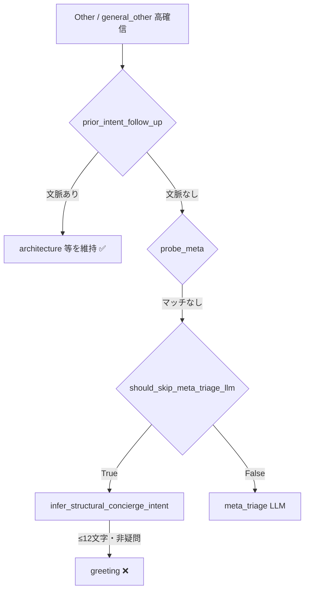

# Concierge 文脈ルーティング改善計画

**作成日**: 2026-06-27  
**根拠**: GCP ログ分析（2026-06-25〜26）、開発者 QA、コードベース照合  
**ステータス**: 意思決定済み — **実装済み**（2026-06-27、dev QA 待ち）  
**関連**: [`LINE_IMPROVEMENT_PLAN_2026-06-27.md`](./LINE_IMPROVEMENT_PLAN_2026-06-27.md)（P1-1 参照）

---

## 確定した意思決定

| # | 論点 | 決定 |
|---|------|------|
| Q1 | `doc_*` フォローアップ拡張 | **A**: `doc_privacy` / `doc_terms` / `doc_operator` / `doc_consultation` / `doc_app_overview` を `_META_FOLLOW_UP_PRIOR_INTENTS` に含める |
| Q2 | `session_ops` フォローアップ | **B**: 含めるが **直前 bot が session_ops 系のときのみ**（`session_intent` は SessionAgent に委譲） |
| Q3 | structural greeting ガード | **C**: 二段階 — (A) follow-up regex マッチ時 greeting 禁止 + (B) 直前 meta intent 存在時も greeting 禁止 |
| Q4 | meta LLM スキップ（フォローアップ時） | **A**: `should_skip_meta_triage_llm` は False（スキップしない） |
| Q5 | `concierge_state` 永続化 | **A**: `_sync_session_db` に明示追加 |
| Q6 | LINE 計画との MR 統合 | **A**: CCR-P0 + CCR-P1-1/3 を LINE 計画 MR-1 に同梱。本ドキュメントは分離維持 |
| Q7 | P1-1 反映状態 | **A**: dev 部分反映済み。CCR-P0 hardening 後に main マージ |
| Q8 | 文脈完全喪失時のフォールバック | **A**: follow-up regex + topic 語で推定、それ以外は meta LLM 呼び出し |

---

## 背景・問題定義

### 再現シナリオ（代表例）

| ターン | ユーザー入力 | 期待 | 実際（修正前） |
|--------|-------------|------|----------------|
| 1 | `技術スタックは？` | `architecture` → 技術説明 | ✅ 正しい |
| 2 | `技術面を詳しく` | `architecture` 継続（深掘り） | ❌ `greeting`（挨拶 LLM 応答） |

同型の誤分類がログ上 **6+ ターン** 確認されている（`履歴消して` / `ステータスを教えて` / `履歴を要約して` 等 → `greeting`）。  
セッション `line:U20a3beee49563dcd07bb3dd0fc1ca32c` で LLM 総合評価 **poor** の主因の一つ。

### 根本原因（優先度順）

本件は **primary LLM triage（stage1/2）の失敗ではない**。Other カテゴリ確定後の **Concierge メタ意図レイヤ** で文脈が失われることが主因。



1. **`prior_intent_follow_up` が効かない**  
   `concierge_state.last_intent` または bot メッセージの `concierge_intent` / `diagnosis.kind` が次ターンに引き継がれないと、フォローアップ判定がスキップされる。

2. **フォールバックチェーンの誤判定**  
   文脈喪失時: `probe_meta` 未ヒット → `should_skip_meta_triage_llm` が meta LLM を省略 → `infer_structural_concierge_intent` が `技術面を詳しく`（7 文字・非疑問）を **`greeting`** と判定。

3. **LINE `_sync_session_db` の永続化ギャップ**  
   `update_concierge_state` でメモリ上の `session["concierge_state"]` は更新されるが、LINE 向け `_sync_session_db` は `messages` 等のみ同期し **`concierge_state` を含まない**。インスタンス跨ぎ・メモリ evict 時に `last_intent` が消失する。

4. **フォローアップ対象 intent の限定**  
   `_META_FOLLOW_UP_PRIOR_INTENTS` は `architecture` / `capabilities` / `app_about` のみ。`doc_*` / `session_ops` は未対応。

5. **修正の部分的成功**  
   ローカル/dev では 2026-06-27 **02:15 UTC 以降**、`prior intent follow-up intent=architecture` ログと architecture カード応答が確認されている（P1-1 相当の実装効果）。ただし永続化・structural guard・観測性は未完了。

---

## 影響範囲

### 対象

| 経路 | 説明 | 重大度 |
|------|------|--------|
| **Other → Concierge** | `enrich_other_concierge_intent` / `resolve_concierge_intent` | 🔴 高 — 開発者 QA・β 説明ターンで顕在化 |
| **general_other 高確信 + meta LLM スキップ** | structural greeting / redirect フォールバック | 🔴 高 — 短いフォローアップ文で誤 greeting |
| **LINE セッション** | `_sync_session_db` 経由の状態同期 | 🟡 中 — 同一 worker 内は bot 履歴で救済可能だが不安定 |
| **session_ops フォローアップ** | 「もっと詳しく」等 | 🟡 中 — LINE 改善計画 P0 と交差 |

### 非対象

| 経路 | 理由 |
|------|------|
| **Physical / 医療推奨** | triage category が Other 以外。別オーケストレータ |
| **CounselingManager** | `should_exit_counseling_for_concierge` 経由の明示的委譲のみ |
| **Store inquiry** | `evaluate_store_gate` で Concierge 意図が strip される |
| **Emergency / crisis** | 独立ルート |
| **Web 単体** | `concierge_state` は DB `save_session_to_db` 経路で比較的保持。ただし structural guard は Web も恩恵 |

### ユーザー影響

- **機能**: メタ質問の深掘りが挨拶に化け、信頼性・開発者向け QA 品質が低下
- **コスト**: 誤 `greeting` ルートは `concierge_build_payload` + greeting LLM（~1.6–4.9s、ログ上 greeting path 18 calls/期間）
- **セキュリティ**: 本件直接のセキュリティ影響は低（別計画 P1-5〜6 で対応）

---

## 確定事項（コード・ログから読み取れる事実）

### 実装済み（ローカル / 部分デプロイ）

| 項目 | 根拠 |
|------|------|
| `prior_intent_follow_up` が orchestrator 早期に実行 | `concierge_orchestrator.py` L86–101 |
| `resolve_concierge_intent` も `concierge_state.last_intent` + 履歴を参照 | `concierge_agent.py` L350–358 |
| `_META_FOLLOW_UP_RE` = `(詳しく\|もっと\|続き\|…)` | `concierge_agent_history.py` L51–53 |
| architecture フォローアップの単体テスト | `tests/concierge/test_session_admin_routing.py` |
| 02:15+ dev で architecture 維持が動作 | `log/log/2026-06-27-1.md` — status card 応答 + follow-up 成功 |

### 未修正・ギャップ

| 項目 | 根拠 |
|------|------|
| LINE `_sync_session_db` に `concierge_state` なし | `chat_concierge_route.py` L97–106 |
| `should_skip_meta_triage_llm` はフォローアップ regex を考慮しない | `meta_triage.py` L90–134 |
| `infer_structural_concierge_intent` は prior 文脈を見ない | `concierge_intent.py` L273–325 |
| `_META_FOLLOW_UP_PRIOR_INTENTS` は 3 intent のみ | `concierge_agent_history.py` L60–64 |
| `concierge_intent_source` は orchestrator 内ログのみ。`counseling_detail` / 構造化ログに未統一 | grep 結果 — app.log INFO のみ |
| Web emoji / pipeline_end_guard も同一 `_sync_session_db` を使用 | `chat_emoji_route.py` L182 |

### 失敗時の判定条件（確定）

`技術面を詳しく` が greeting になる条件:

1. `resolve_last_concierge_intent(history)` → `None`（bot に `concierge_intent` も `diagnosis.kind=concierge_*` も無い、または履歴未渡し）
2. `state.last_intent` → `None`（永続化・復元失敗）
3. `probe_meta_concierge_intent` → `None`（「技術面」単体は probe ルール未登録）
4. `should_skip_meta_triage_llm` → `True`（general_other conf≥0.85、非疑問、probe なし）
5. `infer_structural_concierge_intent` → `"greeting"`（len≤12、非疑問）

---

## 意思決定の記録（Q1〜Q8）

詳細な推奨・理由は末尾 **「意思決定用質問一覧」** を参照。上表「確定した意思決定」が正本。

---

## フェーズ別タスク

### P0 — 文脈喪失による誤 greeting の遮断（最優先）

| ID | タスク | 主要ファイル | 受け入れ基準 |
|----|--------|-------------|-------------|
| **CCR-P0-1** | LINE `_sync_session_db` で `concierge_state` を永続化 | `chat_concierge_route.py` `_sync_session_db`、`line_session.py`（復元は既存 L203–216） | Turn1 architecture 後、Turn2 で `session.concierge_state.last_intent == "architecture"` がメモリ復元後も保持。インスタンス再起動シミュレーション（メモリ clear）でも bot 履歴経由で救済 |
| **CCR-P0-2** | structural greeting ガード: prior 文脈または follow-up regex 時は `infer_structural` をスキップ | `concierge_orchestrator.py`（L144–162 付近）、`concierge_intent.py` | `general_other` 高確信 + `技術面を詳しく` + **履歴なし** でも greeting にならない（redirect または meta LLM 到達）。`うい` 等の真の短い一声は greeting 維持 |
| **CCR-P0-3** | `should_skip_meta_triage_llm` にフォローアップ検出を追加 | `meta_triage.py` | `_META_FOLLOW_UP_RE` マッチ時は `False`（meta LLM または orchestrator 側 follow-up が処理）。`tests/concierge/test_meta_triage_skip.py` 追加 |
| **CCR-P0-4** | bot メッセージの intent メタデータ保証 | `chat_concierge_route.py` `_append_bot_message`、`concierge_agent.py` `build_concierge_payload` | 全 Concierge bot 応答に `concierge_intent` または `diagnosis.kind=concierge_*`。`resolve_last_concierge_intent` の回帰テスト |

### P1 — P1-1 完成・観測・ハードニング

| ID | タスク | 主要ファイル | 受け入れ基準 |
|----|--------|-------------|-------------|
| **CCR-P1-1** | **architecture 文脈継続**（LINE 計画 P1-1 相当） | `concierge_agent_history.py`、`concierge_orchestrator.py` | `技術スタックは？` → `技術面を詳しく` → `concierge_intent=architecture`、`concierge_intent_source=prior_intent_follow_up`。既存テスト green + LINE QA |
| **CCR-P1-2** | `enrich_other` で `concierge_state.last_intent` を history より先に参照（二重化の整理） | `concierge_orchestrator.py` | session 引数追加または routing_ctx 経由で state 参照。history 欠落時も follow-up 動作 |
| **CCR-P1-3** | **`concierge_intent_source` 観測性** | `concierge_orchestrator.py`、`counseling_logger.py` / `chat_post` パイプライン | app.log だけでなく `counseling_detail`（または agent_trace）に `concierge_intent` + `concierge_intent_source` を出力。ログ分析で intent_mismatch 自動検出可能 |
| **CCR-P1-4** | フォローアップ回帰テスト拡充 | `tests/concierge/test_session_admin_routing.py`、新規 `test_concierge_context_routing.py` | 履歴あり/なし、`concierge_state` のみ、structural スキップ境界（12 文字、疑問形） |
| **CCR-P1-5** | session_ops 誤 greeting 防止（LINE P0-2〜4 と連携） | `concierge_orchestrator.py`、`session_agent.py` | `履歴消して` / `ステータスを教えて` が greeting にならない（Q2 決定後） |

### P2 — 拡張・性能・品質

| ID | タスク | 主要ファイル | 受け入れ基準 |
|----|--------|-------------|-------------|
| **CCR-P2-1** | `_META_FOLLOW_UP_PRIOR_INTENTS` 拡張（**Q1/Q2 確定**） | `concierge_agent_history.py` | doc_* 全種 + session_ops（直前 bot 条件付き）フォローアップの期待ケースをテスト化 |
| **CCR-P2-2** | meta LLM スキップポリシー全体見直し | `meta_triage.py`、`concierge_orchestrator.py` | follow-up / prior meta 時スキップ禁止。真の greeting のみスキップ（LINE 計画 P2-1 決定 B と整合） |
| **CCR-P2-3** | meta_triage プロンプトに「直前 intent 継続」明示 | `meta_triage.py` `_META_PROMPT` | LLM 分類で follow-up を architecture 等に寄せる（P0/P1 の安全網） |
| **CCR-P2-4** | ログ分析ヒューリスティック: follow-up → greeting を critical 化 | `src/analysis/session_conversation_analysis.py` | GCP 分析レポートで `技術面を詳しく` + greeting を自動 flag |

---

## テスト・QA チェックリスト

### 自動テスト（pytest）

| ケース | 期待 | ファイル |
|--------|------|----------|
| `技術スタックは？` → `技術面を詳しく`（履歴あり） | `prior_intent_follow_up` | 既存 + 拡張 |
| 同上（履歴なし、`concierge_state.last_intent=architecture`） | architecture | 新規 |
| 同上（履歴・state 両方なし） | greeting **以外** | 新規（P0-2） |
| `うい` / `konn`（general_other 高確信） | greeting（回帰） | 既存 `test_meta_triage_skip.py` |
| `何ができる？` | probe → meta 非スキップ | 既存 |
| `もっと詳しく` after doc_privacy（Q1 採用時） | doc_privacy | P2 |
| `詳しく` after session status（Q2 採用時） | session_ops / status | P1-5 |

### 手動 QA（dev / LINE）

| 入力系列 | 期待 |
|----------|------|
| `技術スタックは？` → `技術面を詳しく` | architecture カード。挨拶 LLM 文なし |
| `何ができる？` → `もっと教えて` | capabilities 維持 |
| `あなたについて` → `詳しく` | app_about 維持 |
| `プライバシーポリシーは？` → `もっと詳しく` | doc_privacy（Q1 採用時） |
| `ステータスを教えて` → `詳しく` | session_ops（Q2 採用時） |
| Cloud Run 2 インスタンス間（または worker 再起動後）で上記 1 を再実行 | 同上（P0-1 検証） |

### 観測確認

- [ ] app.log: `ConciergeOrchestrator: prior intent follow-up intent=architecture`
- [ ] app.log: `concierge_intent_source=` が greeting 誤判定時に `structural_greeting` ではない
- [ ] `counseling_detail`: `concierge_intent` + `concierge_intent_source` フィールド（P1-3）

---

## 既存 LINE_IMPROVEMENT_PLAN との関係

| 項目 | 方針 |
|------|------|
| **分離** | 本計画は **Concierge 文脈ルーティング** に特化。LINE 計画は SessionAgent / セキュリティ / 観測全般 |
| **参照** | LINE 計画 **P1-1** ↔ 本計画 **CCR-P1-1**（同一要件。実装完了後 LINE 側を ✅ に更新） |
| **統合候補** | LINE **P0-2〜4**（session_admin）と **CCR-P1-5** は同一 MR で実装可能。session_ops greeting 誤分類は両計画の共通課題 |
| **非重複** | LINE P1-2（redirect）、P1-3（発熱ゲート）、P1-4（counseling_detail 全経路）は LINE 計画側で継続。本計画 P1-3 は intent_source 特化 |
| **デプロイ** | LINE 計画「1 MR / dev デプロイ」に **CCR-P0-* を同梱** することを推奨（Q6 参照） |

```
LINE_IMPROVEMENT_PLAN          CONCIERGE_CONTEXT_ROUTING_PLAN
─────────────────────          ──────────────────────────────
P0-2 SessionAgent        ←──→  CCR-P1-5 session_ops greeting 防止
P1-1 architecture 継続   ←──→  CCR-P1-1（同一）
P1-4 counseling_detail   ←──→  CCR-P1-3 intent_source 観測（部分重複）
P2-1 triage 短縮         ←──→  CCR-P2-2 meta skip 見直し
```

---

## リスクとロールバック

| リスク | 影響 | 緩和 | ロールバック |
|--------|------|------|-------------|
| structural guard が広すぎて真 greeting が redirect 化 | 短い一声の UX 低下 | 12 文字以下 + `_META_FOLLOW_UP_RE` **非**マッチは従来通り greeting。テストで `うい` 回帰 | `infer_structural` 前の guard 条件を feature flag `CONCIERGE_FOLLOW_UP_GUARD` で OFF |
| meta LLM 非スキップ増 → レイテンシ増 | LINE 中央値 +0.8–1.9s/ターン | follow-up regex は狭い語彙。P0 は orchestrator 側 rule で LLM 回避 | `should_skip_meta_triage_llm` の follow-up 例外を revert |
| `concierge_state` 永続化で DB サイズ増 | 微小（~100B/session） | 既存 `session_manager` flag リストに含まれる設計 | `_sync_session_db` から `concierge_state` 行を削除 |
| prior_intent_follow_up の過剰適用 | doc 質問後の「詳しく」が意図せず doc 固定 | intent 別の topic regex（architecture の `_ARCHITECTURE_TOPIC_RE` パターン） | `_META_FOLLOW_UP_PRIOR_INTENTS` を architecture のみに縮小 |

**ロールバック手順（dev）**

1. GitLab MR revert（CCR-P0/P1 コミット）
2. dev 再デプロイ
3. QA: `技術面を詳しく` が greeting に戻ることを確認（既知の退行を許容する場合のみ）

---

## 実施順序（推奨）

```
Phase A（同一 MR）: CCR-P0-1〜4 + CCR-P1-1 + CCR-P1-3
Phase B（LINE P0 連携）: CCR-P1-5 + LINE P0-2〜4
Phase C（Q1/Q2 決定後）: CCR-P2-1〜4
```

---

## 参考

- GCP 分析: [`log/analysis/2026-06-27_downloaded-logs-20260625-20260626-20260626-074021.md`](../../log/analysis/2026-06-27_downloaded-logs-20260625-20260626-20260626-074021.md)
- dev QA ログ: [`log/log/2026-06-27-1.md`](../../log/log/2026-06-27-1.md)（02:01 失敗 / 02:15 成功）
- コード: `concierge_orchestrator.py`, `concierge_agent_history.py`, `concierge_intent.py`, `meta_triage.py`, `chat_concierge_route.py`

---

## 意思決定用質問一覧

以下をユーザー回答後、本計画の「確定した意思決定」表に反映する。

### Q1: `doc_*` intent のフォローアップを `_META_FOLLOW_UP_PRIOR_INTENTS` に含めるか？

- **推奨**: **含める（doc_privacy / doc_terms / doc_operator / doc_consultation / doc_app_overview すべて）**
- **理由**: 「プライバシーポリシーは？」→「もっと詳しく」は同一ドキュメント深掘りが自然。architecture と同型の UX 期待。probe が効かない短い続き文は structural greeting リスクが同じ
- **代替案**: architecture / capabilities / app_about のみ維持（現状）。doc は毎回 meta LLM に委ねる

### Q2: `session_ops` のフォローアップ（例: ステータス表示後の「詳しく」「もっと」）を prior follow-up 対象にするか？

- **推奨**: **含めるが `session_intent` サブタイプは SessionAgent に委譲**（`concierge_intent=session_ops` + `session_intent` 維持）
- **理由**: ログで session 操作が greeting 化している実害あり（critical）。LINE P0 SessionAgent と整合。ただし「詳しく」だけでは medical / architecture と曖昧なため、**直前 bot が session_ops 系のときのみ** 適用する条件付きが安全
- **代替案**: session_ops は fast-path / triage session_admin のみ（フォローアップ rule なし）。曖昧時は「もう一度お願いします」テンプレ

### Q3: structural greeting ガードの強度は？

- **推奨**: **二段階 — (A) `_META_FOLLOW_UP_RE` マッチ時は greeting 禁止 (B) 直前 meta intent が存在する場合も greeting 禁止**
- **理由**: 単独 (A) では「技術面を詳しく」は救えるが、「技術の話続けて」（follow-up 語なし）が漏れる。(B) は state/履歴依存で P0-1 とセット。真 greeting（`うい`）は prior intent なしのため影響なし
- **代替案**: (A) のみ — 実装が最小。regex 外の続き文は meta LLM または redirect

### Q4: フォローアップ pattern 検出時の meta LLM スキップ方針は？

- **推奨**: **`should_skip_meta_triage_llm` は False（スキップしない）**。ただし orchestrator の rule-based follow-up が先に処理されれば LLM は呼ばれない
- **理由**: スキップと structural greeting の組み合わせが今回の bug の直接原因。follow-up 文で LLM を呼ぶコスト（~0.8–1.9s）は許容範囲
- **代替案**: スキップは維持し、structural の代わりに **prior intent があればそれを返す** 専用フォールバック

### Q5: `concierge_state` 永続化の実装方式は？

- **推奨**: **`_sync_session_db` に明示追加** + 将来的に `session_manager.persist_session_flags` と共通化
- **理由**: LINE 経路の bug は `_sync_session_db` が messages のみ更新していることが直接原因。最小 diff で確実。`line_session.py` の復元リストには既に `concierge_state` あり
- **代替案**: 全経路で `persist_session_flags` 一本化（リファクタ量大だが DRY）

### Q6: LINE_IMPROVEMENT_PLAN との MR 統合方針は？

- **推奨**: **CCR-P0 + CCR-P1-1/3 を LINE 計画 MR-1 に同梱**。本計画は Concierge 特化ドキュメントとして分離維持
- **理由**: session_ops greeting 問題は両計画にまたがる。1 回の dev QA で検証効率が良い。ドキュメント分離はレビューしやすい
- **代替案**: Concierge 文脈のみ別 MR（SessionAgent より先に dev へ）

### Q7: P1-1（prior_intent_follow_up）の dev / main 反映状態は？

- **推奨**: **dev に部分反映済み（02:15+ ログ）とみなし、CCR-P0 で hardening 後に main マージ**
- **理由**: ログで fix 動作確認済みだが、永続化・structural guard なしでは再発余地あり。「完了」とはしない
- **代替案**: 未デプロイ扱いで P1-1 から再実装（重複作業）

### Q8: 文脈完全喪失時（history も state も無い）の最終フォールバックは？

- **推奨**: **`_META_FOLLOW_UP_RE` マッチ + topic 語（`_ARCHITECTURE_TOPIC_RE` 等）→ architecture 等を推定。それ以外は meta LLM 呼び出し（スキップ禁止）**
- **理由**: 完全喪失はインスタンス evict 等のレアケース。redirect より meta LLM の方がユーザー意図に近い。無条件 architecture 推定は誤ルートリスク
- **代替案**: 常に redirect（安全だが UX 硬い）

---

**次のアクション**: CCR-P0 実装（LINE MR-1 同梱）→ dev QA → LINE 計画 P1-1 を ✅ 更新
