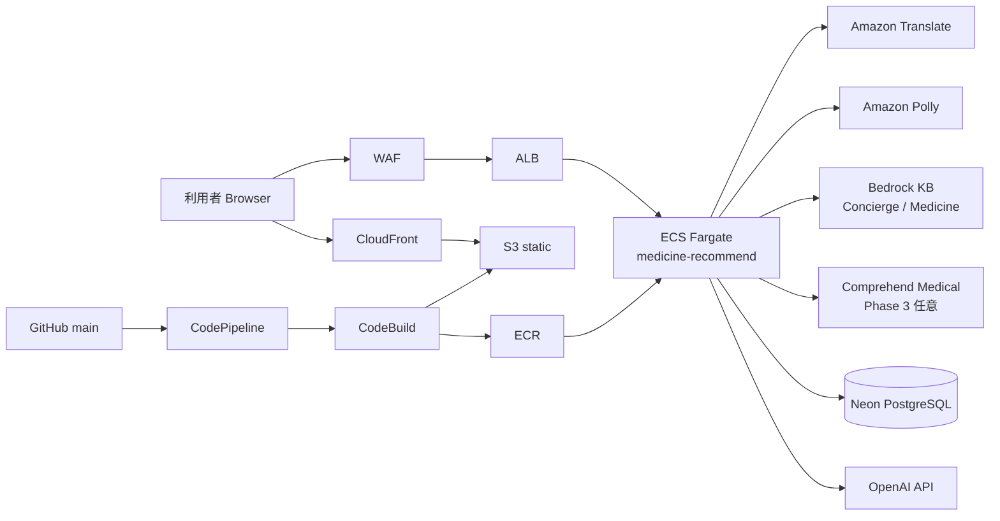

# AWS / AI 技術ストーリー — medicine-recommend ステージング

**対象 URL**: https://aws.medicine.yutok.dev  
**作成日**: 2026-08-01  
**発表者**: 川嶋宥翔

> **位置づけ**: 本番（GCP `medicine.yutok.dev`）は安定運用、AWS ステージングは **AWS ネイティブ機能の試験環境**。同一リポジトリ・同一 Docker イメージ。  
> **免責**: β版・医療機関ではない。診断・処方は行わない。

---

## なぜ AWS か

| 観点 | 内容 |
|------|------|
| **地域展開** | 北海道・東北のような広域・過疎地では、クラウド上のマネージドサービスで「相談入口」を低初期コストで立ち上げられる。自治体・薬局連携時もリージョン（`ap-northeast-1` 東京）で低レイテンシ。 |
| **マネージド** | Translate / Polly / Bedrock Managed KB / ECS Fargate により、運用者がインフラ詳細よりプロダクト改善に集中できる。 |
| **コスト試算** | AWS Budgets + Lambda 段階的アクションで月次予算超過時に ECS 縮小・停止（`docs/ops/AWS_BUDGET_STAGED_ACTIONS.md`）。学生・個人開発でも試験運用可能な設計。 |
| **セキュリティ** | WAF（Rate 2000/5min + OWASP CommonRuleSet）→ ALB → ECS。Secrets Manager で API キー注入。 |

---

## アーキテクチャ1枚図

### Mermaid（5分プレゼン用・簡略）

### 詳細図（リポジトリ正本）

- **推奨**: [`docs/medicine-recommend-aws-staging-complete.drawio`](../../medicine-recommend-aws-staging-complete.drawio) — 13 シート統合版
- **クロスクラウド比較**: [`docs/diagrams/aws-cross-cloud-overview.drawio`](../../diagrams/aws-cross-cloud-overview.drawio)
- **ドキュメント**: [`docs/ops/AWS_ARCHITECTURE_DIAGRAMS.md`](../../ops/AWS_ARCHITECTURE_DIAGRAMS.md)

---

## AI の使い方 — 役割分担

| レイヤ | 技術 | 役割 | 薬名決定 |
|--------|------|------|----------|
| **中核** | ルールベーススコアリング（`rule_based_recommendation.py` + CSV） | 症状辞書・効能・年齢・相互作用等を統合評価 | **ここで決定** |
| **NLU 補助** | 症状辞書 NLU + OpenAI（IntentRouter） | 入力分類・症状抽出の補助 | 決定しない |
| **Phase 3 任意** | Amazon Comprehend Medical | 医療テキストからエンティティ抽出 | 決定しない |
| **説明・FAQ** | OpenAI + Bedrock KB RAG | Concierge / Ask / Explanation | 決定しない |
| **多言語** | Amazon Translate（AWS）/ DeepL（GCP 本番） | 入出力翻訳 | — |
| **音声** | Amazon Polly（AWS）/ Google Cloud TTS（GCP） | 読み上げ | — |
| **Phase 4 任意** | Amazon Personalize | 表示順最適化 | 順序のみ |

**原則**: LLM は薬名を自由創作しない。PhysicalOrchestrator 経路のみが OTC 候補を返す。

正本: [`docs/public/アプリ概要.md`](../../public/アプリ概要.md)、[`config/aws_features.py`](../../config/aws_features.py)

---

## 本番との関係 — 意図的分離

| 項目 | GCP 本番 | AWS ステージング |
|------|----------|------------------|
| URL | medicine.yutok.dev | aws.medicine.yutok.dev |
| ホスティング | Cloud Run | ECS Express Gateway + Fargate |
| 翻訳 | DeepL | Amazon Translate |
| TTS | Google Cloud Text-to-Speech | Amazon Polly |
| Concierge RAG | Local RAG | Bedrock Managed KB `2CNAGQ2V4P` |
| Medicine RAG | Local RAG | Bedrock KB `30BCEJCJHA` |
| 静的 JS/CSS | アプリ同梱 | CloudFront + S3 |
| LINE | GCP のみ | 非対応 |
| DB | Neon（別インスタンス） | Neon（別インスタンス） |
| 共通 | 同一 Git / Docker イメージ / Cloudflare R2 画像 CDN | 同上 |

**Why 分離**: 本番の DeepL・Google TTS 安定性を保ちつつ、AWS ネイティブを安全に試験。自動フェイルオーバーはない（意図的）。

正本: [`docs/concierge/technical/01-cross-cloud-architecture.md`](../../concierge/technical/01-cross-cloud-architecture.md)

---

## AWS サービス一覧（ステージング・実装済み）

| サービス | Phase | 用途 |
|----------|-------|------|
| ECS Express Gateway + Fargate + ALB + WAF | 1 | アプリホスティング・セキュリティ |
| CloudFront + S3 | 1 | 静的アセット CDN |
| Amazon Translate | 2 | 多言語翻訳 |
| Amazon Polly | 2b | 音声読み上げ |
| Amazon Bedrock Knowledge Base | 3 | Concierge / Medicine RAG |
| Amazon Comprehend Medical | 3（任意） | 医療テキスト NLU 補助 |
| CodePipeline / CodeBuild / ECR | CI/CD | GitHub main 連携デプロイ |
| CloudWatch / AWS Budgets + Lambda | 運用 | ログ・コスト段階的停止 |
| ElastiCache Redis | **4（未本番）** | Translate / KB キャッシュ |
| Amazon Personalize | **4（未本番）** | 表示順最適化 |

> **禁止**: Phase 4 機能を「現在稼働中」とは言わない。デモ・プレゼンでは Phase 表記を正確に。

---

## 将来展望（Phase 4 以降）

| 方向 | 内容 |
|------|------|
| **自治体・薬局連携** | QR 設置・来店前相談の公式連携（β版一般公開後を想定） |
| **Amazon Personalize** | 症状・属性に応じた OTC 表示順の A/B 試験 |
| **ElastiCache** | Translate / Bedrock retrieve のレイテンシ・コスト削減 |
| **他地域展開** | 機能フラグのみで GCP / AWS を選択可能 — 北海道・東北以外への横展開 |
| **Comprehend Medical 本格化** | 症状エンティティ抽出精度向上（ルールベースとのハイブリッド維持） |

---

## 5分プレゼン用エレベーターピッチ

### 30秒版

> ドラッグストア勤務で感じた「高齢者の聴力差・外国人の言語の壁」を、チャット型 OTC **参考**相談ツールで補います。薬選びはルールベース、LLM は補助のみ。AWS ステージングでは Translate・Polly・Bedrock KB を統合し、北海道から福島まで共通のデジタル相談入口を実証しています。医師・薬剤師の代替ではなく、β版の試験運用です。

### 60秒版

> 少子高齢化とインバウンド増でセルフメディケーション需要は伸びていますが、秋田の高齢化率39.5%のように、過疎地では薬局に行けない・相談できない人が増えています。  
> 私が開発した medicine-recommend は、症状をチャットで入力すると一般用医薬品の**候補**と受診目安を返す β版です。薬名はルールベースで決め、AI の創作を抑えます。  
> 本番は GCP、デモの AWS 版では Amazon Translate・Polly・Bedrock KB・ECS Fargate を使い、多言語と音声読み上げを東京リージョンで動かしています。同一コードを機能フラグで切替えるので、他地域展開も容易です。  
> 医療機関・診断サービスではありません。重い症状は必ず受診を勧めます。

---

## 審査「プロダクト・テクノロジー」訴求チェックリスト

- [ ] ルールベース中心 + LLM 補助の役割分担を説明した
- [ ] AWS ネイティブ（Translate / Polly / Bedrock / ECS）をデモで見せる
- [ ] GCP 本番との意図的分離を1文で説明した
- [ ] Phase 4（Personalize / ElastiCache）は「将来」として触れた
- [ ] 未実装機能を「稼働中」と言っていない
- [ ] β版・免責を毎スライドまたは口頭で触れた

---

## 関連ドキュメント

| パス | 内容 |
|------|------|
| [AWS_ARCHITECTURE_DIAGRAMS.md](../../ops/AWS_ARCHITECTURE_DIAGRAMS.md) | 詳細 Mermaid・draw.io 索引 |
| [AWS_FEATURES_ROLLOUT.md](../../ops/AWS_FEATURES_ROLLOUT.md) | env ゲート一覧 |
| [AWS_BEDROCK_KB.md](../../ops/AWS_BEDROCK_KB.md) | Bedrock KB 運用 |
| [AWS_BUDGET_STAGED_ACTIONS.md](../../ops/AWS_BUDGET_STAGED_ACTIONS.md) | コスト管理 |
