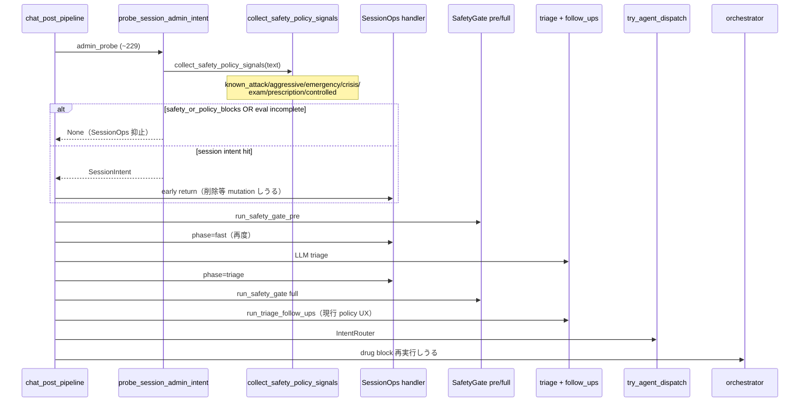

# Cycle R4 — A-3 修正版 D2 設計・反証（コード変更禁止）

- Date: 2026-09-22
- A-1: Rejected 確定 / A-2: 保留継続 / A-3: Conditional Continue
- 案 D（SessionOps 全面後置）: **不承認**
- 案 **D2**: 本サイクルで設計・反証
- runtime / H04 / commit / push / live: **禁止**

## 状態

| 項目 | 状態 |
| --- | --- |
| Gate A-code | 再審査待ち |
| Gate A-accuracy | Not Passed |
| Gate B | Hard No-Go |
| live | Blocked |
| product safety | 未合格 |
| human medical review（fallback 文言） | **未完了**（候補提示＋敵対レビューのみ） |

---

## 1. ADR — D vs D2

### Context

A-3 は `RouteDecision`（意図）と `PolicyDecision`（実行制約）を分離する。  
R3 案 D は「SessionOps 全体を full safety 後へ移動」し目標順序を満たすが、Supervisor により **不承認**。

現行は「SessionOps が無条件で Safety より先」ではない。  
`probe_session_admin_intent` は内部で `collect_safety_policy_signals` → `safety_or_policy_blocks_session_ops` を実行し、高リスク／policy／`evaluation_complete=False` では **None**（confirmed: `session_agent.py` 89–119）。

### Decision

| 案 | 判定 |
| --- | --- |
| D（全面後置） | **Reject** |
| **D2** | **設計採用候補** — preflight 陽性時だけ SessionOps を抑止し、純粋 SessionOps は早期実行可 |

### D2 処理順序（固定）

```text
1. Policy/Safety preflight detection  → immutable PreRouteSignals snapshot
2. 純粋 SessionOps（条件付き早期実行）
3. Safety pre/full、triage
4. typed PolicyDecision 解決（snapshot + triage 加算のみ）
5. Policy enforcement（mutation owner）
6. terminal → HTTP return
7. continue → 通常 routing / dispatch / orchestrator
8. Jev = 分類候補のみ（policy 判断に関与しない）
```

### Consequences

- PolicyDecision を RouteDecision.primary へ変換しない
- medical examination を Security へ載せない
- detector 同一ターン複数回実行を廃止（snapshot 一回化）
- true→false 解除禁止；false→true 安全側昇格のみ

---

## 2. 現行 sequence（正確・confirmed）



**評価上の誤りを避けること:**  
「SessionOps が常に Safety より先」ではない。preflight（probe 内）陽性なら SessionOps は走らない。  
ただし **pipeline 入口での独立 preflight 一回化は未実装**で、probe / eligibility / follow-ups が detector を再実行しうる。

---

## 3. immutable signal snapshot 契約

### 3.1 型（設計）

```text
TurnSignalSnapshot (frozen)
  signals: PreRouteSignals
  text_fingerprint: str          # sanitized 正規化ハッシュ
  collected_at_phase: "preflight"
  turn_id / correlation_id: str  # request-local
```

### 3.2 一回化

| 消費者 | 現行 | D2 |
| --- | --- | --- |
| SessionOps pure 判定 | probe 内で再 collect | **snapshot 参照のみ** |
| Policy resolve | follow-ups / triage 再検出 | snapshot + **加算 merge** |
| Jev eligibility | `collect_pre_route_signals` 再実行しうる | **同一 snapshot**（session_operation 含む完全版） |

`collect_safety_policy_signals` と `collect_pre_route_signals` の差は session_operation 付与のみ。  
D2 preflight は **一度だけ** `collect_pre_route_signals`（または safety+session_ops を明示パイプライン）し、結果を freeze。

### 3.3 Additive merge 規則（TOCTOU）

| 遷移 | 許可 |
| --- | --- |
| `False → True`（emergency / security / crisis / exam / prescription / controlled） | **許可**（安全側昇格） |
| `True → False`（上記いずれかの解除） | **禁止** |
| `evaluation_complete True → False` | **許可**（以降 fail-closed） |
| `False → True`（evaluation_complete の「回復」） | **禁止**（不完全を取り消さない） |
| `session_operation` 上書き | 加算のみ；None→intent 可、intent→別 intent は **より破壊的側を優先**（delete ≻ summarize ≻ status）または変更禁止（実装時に一方へ固定） |
| triage bag マージ | `_merge_bag` と同型の **OR 加算のみ** |

preflight と full enforcement の間で **別 detector 再計算で矛盾させない**。  
triage 由来は snapshot への加算ビュー `TurnSignalSnapshot.with_additive(triage_bag)` のみ。

---

## 4. 純粋 SessionOps 定義（早期実行許可）

早期 SessionOps を許可する **必要十分条件**:

```text
evaluation_complete == True
AND deterministic_high_risk == False
AND policy_block == False
AND session_operation_detected == True
```

| 禁止（早期実行しない） | 理由 |
| --- | --- |
| 混在発話（policy or high-risk + session ops） | policy/Safety 優先 |
| `evaluation_complete=False` | fail-closed |
| detector_errors 非空 | 同上 |
| unknown / 不完全 signal | 同上 |

陽性または incomplete のとき:

- SessionOps **実行しない**
- 削除・要約・状態取得などの **session mutation を行わない**
- full safety / policy enforcement へ継続

---

## 5. Mutation owner（kind 別完全列挙）

Policy enforcement を **唯一の mutation owner** とする。  
既存 full handler の mutation を単純複製しない（content-only adapter + enforce 適用）。

### 5.1 prescription（terminal / boundary_guidance）

| 項目 | 現行 follow-ups | D2 owner |
| --- | --- | --- |
| user message append | Yes | enforce 1 回 |
| bot message append | counseling bot | enforce 1 回 |
| inappropriate_requests | Yes | enforce 1 回 |
| blocked flag | なし | なし（処方は block ではなく guidance） |
| counseling_mode | start=True | enforce（prescription のみ） |
| illegal_drug_block | — | — |
| DB save | Yes | enforce 終端 1 回 |
| logging/metrics | counseling logs | policy_* + 既存 kind |
| 失敗時 | 例外時 fall-through | **safe_fallback**；部分 append したら rollback または未コミット応答（実装単位 D でトランザクション境界定義） |

### 5.2 controlled_or_illegal（terminal / block）

| 項目 | 現行 drug_block | D2 owner |
| --- | --- | --- |
| user append | `append_user` フラグ | enforce 1 回 |
| bot append | Yes | enforce 1 回 |
| inappropriate_requests | + `blocked: True` | enforce |
| blocked / illegal_drug_block | Yes | enforce |
| counseling_mode | False | 触らない |
| DB save | Yes | enforce 1 回 |
| logging | warning + kind | policy_* |
| 失敗時 | None / 例外 | safe_fallback |

### 5.3 medical_examination（terminal / boundary_guidance）

| 項目 | 現行 | D2 owner |
| --- | --- | --- |
| user append | 経路依存 | enforce で正規化（1 回） |
| bot append | boundary template | enforce |
| inappropriate_requests | Other 経路のみ；Physical ガードは無し | **enforce で統一して記録** |
| counseling_mode | False | 触らない |
| illegal_drug_block | — | — |
| DB save | 経路依存 | enforce 1 回 |
| 失敗時 | fall-through / recommend 継続リスク | safe_fallback |

### 5.4 terminal 後に走ってはならないもの

SessionOps mutation / 通常 dispatch / Jev API / medicine recommendation / follow-ups policy 枝 / orchestrator drug block / duplicate append

---

## 6. Request-local 排他設計

| 禁止 | 理由 |
| --- | --- |
| `session["_policy_enforced_turn"]` のみ | 次ターンへ漏れ、永続汚染 |
| 前ターン値で次ターン skip | 誤スキップ |

| 正本（設計） | 内容 |
| --- | --- |
| `RequestContext`（または pipeline ctx） | `turn_id`, `correlation_id`, `signal_snapshot`, `policy_enforced: PolicyKind\|None` |
| 任意の session 鏡 | `(turn_id, kind)` の組のみ；**読み取り時に turn_id 不一致なら無視** |
| 終端 | HTTP return で ctx 破棄；session 鏡は次ターン無効 |

---

## 7. Privacy / performance 反証（設計上の証明目標）

### 7.1 純粋な履歴削除

| 要件 | D2 設計証明 |
| --- | --- |
| triage/LLM/Jev へ送らない | pure SessionOps 早期 return → triage 未到達（現行 admin_probe 成功時と同型）。**要:** preflight が LLM を呼ばないこと（現行 `collect_safety_policy_signals` はローカル detector のみ — confirmed） |
| 不要な medical detector/API 増なし | snapshot **一回**；純 SessionOps でも preflight は走るが、**追加 LLM なし**。コスト増はローカル keyword 1 パスに限定 |
| 応答速度大幅悪化なし | probe 内再 collect を pipeline 一回化で **置換**するため、純削除は現状比 ±0〜微小。目標: p50 悪化を「ローカル collect 1 回分」以内と契約 |

### 7.2 policy 混在削除

| 要件 | D2 設計証明 |
| --- | --- |
| 削除 mutation が先に起きない | pure 条件不成立 → SessionOps 非実行（既存 probe 抑止と同型＋snapshot 共有） |
| policy terminal UX へ到達 | enforce が follow-ups より前または follow-ups policy 枝を置換；terminal で return |

---

## 8. safe_fallback 文言候補（未固定・医療敵対レビュー必須）

**却下（R3 仮案）:** 「相談継続不可・店舗/救急案内」汎用 notice — detector_error での救急誘導は過剰。

### 8.1 既存文言インベントリ（流用候補）

| ID | 出典 | 要旨 |
| --- | --- | --- |
| E1 | `build_system_error_status` | 一時的エラー／再試行／問題継続時は薬剤師 |
| E2 | orchestrator short-circuit | 一時的に自動処理完了不可／再試行 |
| E3 | `NOTICE_BY_CATEGORY["system_abuse"]` | 不正操作には答えられない／症状は自然文で |
| E4 | `NOTICE_BY_CATEGORY["illegal_drugs"]`（短） | 違法薬物相談不可／市販薬なら可 — **文脈限定** |
| E5 | 違法/規制 **長テンプレ** | 法的・健康警告 — **block UX 専用** |
| E6 | `generate_medical_examination_boundary_message` | 診察不可境界 — **exam 専用** |
| EM | medical emergency HTML | 救急誘導 — **detector_error に使用禁止** |

### 8.2 失敗モード別候補（固定前）

| fallback_reason | 候補 | 医療上の意味 | 緊急性誤認 | 処方/規制/診察適合 | 次アクション |
| --- | --- | --- | --- | --- | --- |
| detector_error | **E1**（第一候補） | システム判定不能；臨床判断不能を装わない | 低（救急非示唆） | 中立；薬種を断定しない | 再入力／時間をおく／薬剤師 |
| detector_error | E2 | 同上・やや短い | 低 | 中立 | 再試行 |
| adapter_error | **E1** | 応答組立失敗 | 低 | 中立 | 再試行 |
| incomplete_evaluation | **E1** または「内容を短く分けて再送」系（**新規文は未承認**） | 検査未完了の fail-closed | 低を維持 | 中立必須 | 分けて再送；削除は実行しない旨をログで保証 |
| unknown_kind | **E1** | 内部契約エラーをユーザーに薬理説明しない | 低 | 中立 | 再試行 |
| empty_content | **E1** / E2 | 空応答防止 | 低 | 中立 | 再試行 |

**使用禁止マッピング**

| reason | 禁止候補 | 理由 |
| --- | --- | --- |
| いずれか | EM（救急） | 過剰誘導 |
| detector_error 等 | E4/E5 | 薬物文脈の誤ラベル |
| detector_error 等 | E6 | 診察境界の誤ラベル |

### 8.3 敵対的医療レビュー（/medicine-recommendation-advisor 視点・AI）

役割: シニア薬剤師（OTC）として **文言の安全**を評価。製品安全承認ではない。

| 攻撃仮説 | 評価 |
| --- | --- |
| detector_error で救急案内 | **危険** — 真の危機でも曖昧化し、非危機では過剰受診／不安増。**禁止** |
| detector_error で違法薬物長文 | **危険** — 無関係ユーザーへの烙印・信頼毀損。**禁止** |
| detector_error で診察境界テンプレ | **不適** — 診察依頼とシステム故障の混同。**禁止** |
| E1 の「薬剤師に相談」 | **許容寄り** — 緊急性を上げず、市販薬相談チャネルへ戻す。危機併存は **上位 Safety/Crisis が先**に処理する前提（D2 順序） |
| incomplete で「もう一度」のみ | **許容** — ただし削除要求が混在していた場合、**削除未実行**を保証しないとユーザーが「消えた」と誤認。UX に「履歴は変更していません」を足すかは **人間医療レビュー＋プロダクト**で決定（AI は推奨: 足す） |
| 処方混在＋detector_error | E1 は処方拒否にも救急にもならない → **FN で処方 UX 未達**は残るが、誤って推奨・削除しない方が安全。**terminal 処方 UX への昇格は evaluation_complete 時のみ** |

**AI 結論:** 固定候補の第一位は **E1（system_error notice）**。救急・薬物・診察テンプレの流用は拒否。  
**人間医療レビュー前は製品安全承認と呼ばない。文言は未固定。**

---

## 9. 必須シーケンスケース（設計期待）

| # | ケース | 期待 |
| --- | --- | --- |
| 1 | 純粋な履歴削除 | preflight 完了・pure → 早期 SessionOps；triage/Jev 非送信；削除 UX |
| 2 | 処方＋履歴削除 | pure 不成立；削除 mutation なし；prescription terminal |
| 3 | 規制薬＋履歴削除 | 同上；drug block terminal |
| 4 | 診察＋履歴削除 | 同上；exam boundary；非 Security |
| 5 | crisis＋履歴削除 | high-risk；SessionOps なし；Crisis/Emergency |
| 6 | prompt injection＋履歴削除 | security_blocked；Security input block |
| 7 | detector exception＋履歴削除 | incomplete；SessionOps なし；safe_fallback(E1 候補)；削除なし |
| 8 | preflight 陰性 → triage で policy 陽性 | additive True 昇格；enforce terminal；true→false なし |
| 9 | terminal 後二重実行 | follow-ups/orch/recommend/Jev/SessionOps なし |
| 10 | 次ターン排他漏れ | request-local turn_id；前ターン鏡を無視 |

---

## 10. Implementation change units（最低分離）

| Unit | 内容 | 依存 |
| --- | --- | --- |
| **A** | signal snapshot 受け渡し（pipeline 一回 collect → ctx） | なし |
| **B** | policy 型・resolve（加算 merge） | A |
| **C** | content-only adapters | なし（並行可） |
| **D** | enforcement / mutation owner | B+C |
| **E** | legacy follow-ups / orch 排他（request-local） | D |
| **F** | test / observability | D+E |

SessionOps 早期条件の **明示化**は Unit A に含める（probe が snapshot を受け取る）。  
全面後置は行わない。

---

## 11. Rollback 単位

| 単位 | 戻し方 |
| --- | --- |
| A | snapshot 未使用；probe 内 collect に復帰 |
| B–D | flag OFF → 現行 follow-ups UX |
| E | 排他フラグ無効化で二重実行は戻るが動作は現行に近い |
| F | テストのみ |

A と D を同一 commit にしない（受け渡しと mutation の切り分け）。

---

## 12. R4 Go / Stop 判定

| 停止条件（R3 系） | D2 での判定 |
| --- | --- |
| adapter 安全到達不能 | **Go 条件付き** — content-only なら可 |
| mutation 分離不能 | **Go 条件付き** — enforce owner 強制 |
| terminal 正式契約なし | **Go 条件付き** — D2 enforce が契約点 |
| 二重実行 | **Go 条件付き** — request-local 排他必須 |
| fail-closed 文言定義不能 | **Stop for copy freeze** — 候補は提示済み；**人間医療レビュー＋固定**まで実装禁止 |
| D 全面後置必須 | **回避** — D2 で代替 |

### 総合

| 判定 | 内容 |
| --- | --- |
| **Design Go（R4）** | D2 アーキ・snapshot・pure SessionOps・排他・変更単位は設計完了 |
| **Implementation Stop** | 文言未固定・人間医療レビュー未完了・runtime 禁止継続 |
| **A-2 再比較** | D2 が Supervisor に Reject された場合のみ |

独立 residual（marker 差 / contained≠resolve / 処方 E2E）は **依然 Open**。H03/H05 Closed 根拠に含めない。

---

## 13. PDCA R4

| 段 | 内容 |
| --- | --- |
| Plan | D2 順序・snapshot・pure SessionOps・TOCTOU・排他・fallback |
| Do | 本設計文書のみ |
| Check | 現行 probe 内検査を正しく評価；D 全面後置は不使用；救急流用を敵対レビューで却下 |
| Act | Supervisor へ D2 Design Accept 可否・E1 文言固定の人間医療レビュー依頼を待つ。コード変更なし |

---

## 参照

- R3: `JEV_BR_H03_H05_OPTION_A3_R3_DESIGN_20260922.md`
- R2: `JEV_BR_H03_H05_OPTION_A1_R2_INVENTORY_20260922.md`
- 現行: `session_agent._session_admin_probe_blocked_by_safety`, `pre_route_signals.safety_or_policy_blocks_session_ops`
