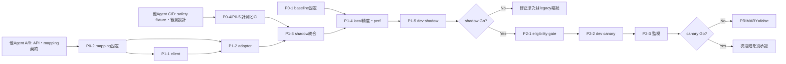

# Jev Phase 0–2 実行計画・リスク・ロールアウト

- 作成日: 2026-09-21
- 対象: Chat Pipeline v2 / IntentRouter
- 担当: Agent E（実行計画・リスク・ロールアウト）
- 対象範囲: Phase 0（基準固定・計測整備）→ Phase 1（dev shadow）→ Phase 2（dev primary canary）
- 対象外: 本番接続の実装、SessionOps の primary 化、Medicine QA focus 以降、回答生成、推薦ランキング本体

## 1. 結論と固定方針

Phase 0–2 は `jev:minimal` の IntentRouter adapter（Plan 1）だけを対象にする。Phase 1 では実行 route を一切変えず、Phase 2 でも `confidence >= 0.85` の低リスク route に限って dev canary を行う。Emergency / Security / medical_examination は Jev 単独で確定せず、既存 SafetyGate / deterministic gate と二重確認する。不一致・低信頼・timeout・API error は legacy を採用する。

2026-09-21 の repeat=3 評価を比較基準に固定する。

| Backend | Accuracy | Avg | P50 | P95 |
| --- | ---: | ---: | ---: | ---: |
| current | 30/30 (100%) | 1456.28 ms | 1112.62 ms | 3216.91 ms |
| `jev:minimal` | 30/30 (100%) | 536.78 ms | 532.54 ms | 594.15 ms |

基準差は avg 919.50 ms、P95 2622.76 ms の短縮である。ただし 10 シナリオは pilot set であり、dev canary の安全性を単独では保証しない。`jev:with_baseline_triage` は 10 ケース中 1 件失敗したため、Phase 0–2 の対象から除外する。

## 2. 前提、依存関係、相対サイズ

相対サイズは Agent 1名での実装・テスト・レビュー量の比較値で、工数確約ではない。

| ID | Phase | タスク | Size | 依存 | 完了条件 |
| --- | --- | --- | --- | --- | --- |
| P0-1 | 0 | baseline と評価コマンドの固定 | S | なし | repeat=3 の JSON/MD、fixture、model、実行条件を基準として記録 |
| P0-2 | 0 | RouteDecision / Jev answer mapping 契約の確定 | M | A/B の仕様成果 | primary/sub route、confidence、Noul override、未知値の扱いを表にする |
| P0-3 | 0 | feature flag と fail-open 契約の確定 | S | P0-2、運用設定方式 | default OFF、shadow/primary の排他・優先順位、即時切戻し手順を定義 |
| P0-4 | 0 | JSONL / pipeline_perf 観測契約の確定 | M | C/D の観測成果 | disagreement、FN、fallback、usage/cost、legacy saved calls が集計可能 |
| P0-5 | 0 | fixture 拡張と CI 判定仕様 | M | P0-2、安全ケース提供 | 10ケース + emergency/security/medical_examination が deterministic に判定可能 |
| P1-1 | 1 | Jev client 境界の実装・unit | M | P0-2、API 契約、dev secret | 3.5s timeout、429/5xx のみ最大1 retry、4xx/timeout retryなし |
| P1-2 | 1 | IntentRouter adapter と override の実装・unit | L | P0-2、P1-1 | `jev:minimal` state だけを RouteDecision に変換 |
| P1-3 | 1 | shadow 統合 | M | P0-3、P0-4、P1-2 | executed route は常に legacy、Jev は比較ログのみ |
| P1-4 | 1 | fixture CI / integration / perf 実行 | M | P0-5、P1-3 | 後述の精度・安全・速度ゲートを全通過 |
| P1-5 | 1 | dev shadow 観測・全差分レビュー | M | P1-4、dev key/flags/log sink | 直近150件と累積を集計、高リスク差分は全件レビュー |
| P2-1 | 2 | primary eligibility gate | M | P1-5 | confidence、低リスク、二重ゲート、不一致 legacy 優先を強制 |
| P2-2 | 2 | dev canary 対象選択・段階展開 | M | P2-1、canary 単位 | 小さい cohort から開始し、段階ごとに Go/No-Go 判定 |
| P2-3 | 2 | canary 中の legacy shadow / cost 計測 | M | P0-4、P2-2 | disagreement、fallback、saved calls、OpenAI cost 削減を継続観測 |
| P2-4 | 2 | rollback drill | S | P2-2、設定反映方式 | primary OFF で legacy へ復帰し、Jev 障害注入時にも本線継続 |



## 3. マイルストーン

### M0: 設計凍結（Phase 0 完了）

- [ ] adapter mode は `jev:minimal` のみ。
- [ ] state は `channel`、`user_input`、直近5 turn、許可済みの短い構造化メタ、固定 `app_context` のみ。
- [ ] baseline_triage_hint、識別子、不要 PII、RAG 全文を送らない。
- [ ] `JEV_API_KEY` を正とし、`TYPESAFE_API_KEY` は互換 fallback とするかを実装契約に明記。
- [ ] default は `JEV_ENABLED=false`、`JEV_INTENT_ROUTER_PRIMARY=false`。
- [ ] timeout/retry/fallback、mapping、未知 answer、ログ schema がレビュー済み。
- [ ] CI fixture の正解ラベルと高リスク分類の owner が確定。
- [ ] rollback 手順と設定反映時間が検証可能。

### M1: local 合格（Phase 1 実装後）

- [ ] unit、fixture CI、shadow integration、perf がすべて合格。
- [ ] 10ケース + safety fixture が 100%。
- [ ] Emergency / Security / medical_examination FN=0。
- [ ] Jev 障害時に legacy が実行される。
- [ ] shadow を有効にしても executed route / response が変わらない。
- [ ] JSONL に秘密値、不要 PII、生の会話全文、識別子が出ない。

### M2: dev shadow 合格（Phase 1 完了）

- [ ] 直近150件と累積の disagreement を併記。
- [ ] 全体 disagreement ≤0.5%。
- [ ] 高リスク disagreement は0を目標とし、発生分は全件レビュー済み。
- [ ] FN=0。1件でも疑義があれば No-Go。
- [ ] fallback reason が欠損なく分類できる。
- [ ] latency と usage/cost の集計が再現可能。

### M3: dev canary 合格（Phase 2 完了）

- [ ] `confidence >= 0.85` かつ低リスク route だけ Jev primary。
- [ ] 不一致時は legacy を採用。
- [ ] Emergency / Security / medical_examination は既存 gate を必ず通る。
- [ ] `dialogue.intent_router_llm` の OpenAI cost が基準比 ≥70% 削減。
- [ ] 精度ゲートを維持したうえで avg ≥900ms または P95 ≥2500ms の短縮を維持。
- [ ] fallback 急増、cost 逆転、ログ欠損がない。
- [ ] rollback drill が成功。
- [ ] staging / production への進行は自動で行わず、別の明示承認を待つ。

## 4. Plan 1 テスト計画

### 4.1 Unit

| 観点 | ケース | 合格条件 |
| --- | --- | --- |
| Choice mapping | 全 primary route、各 sub route、`none` | 期待する `RouteDecision` と完全一致 |
| confidence | 0、0.8499、0.85、1、欠損、非数、範囲外 | 0.85 未満・不正値は primary 不可、legacy fallback |
| Noul override | emergency/security/store/counseling の閾値境界・競合 | 高リスクを低リスクへ弱めない。競合は安全側または legacy |
| high-risk gate | Emergency / Security / medical_examination | Jev 単独確定が不可能 |
| state builder | 0/1/5/6 turn、長文、構造化メタ有無 | 直近5 turn、許可 field のみ。禁止 field が混入しない |
| malformed response | 欠損、未知 choice、schema違反、空 answer | 例外を本線へ漏らさず legacy fallback |
| transport | success、429、5xx、4xx、timeout、接続失敗 | 429/5xx のみ1 retry。timeout/4xx は retryなし |
| feature flags | disabled/shadow/primary の組合せ | default OFF。primary OFF なら executed route は legacy |
| cost math | input token、saved call 0/1、欠損 usage | 単価と単位が正しく、欠損は0扱いせず unknown として可視化 |

### 4.2 Fixture CI

- [ ] `tests/fixtures/jev_intent_router_eval_10.yaml` の10シナリオを Jev mock response と期待値で照合する。
- [ ] mock は API の raw response fixture とし、adapter mapping 自体を通す。
- [ ] Emergency、Security、medical_examination の陽性・陰性・曖昧境界を追加する。
- [ ] 症状相談 + 店舗相談、服薬相談 + prompt injection などの競合ケースを追加する。
- [ ] follow-up 用に履歴 0/1/5 turn の代表ケースを追加する。
- [ ] SessionOps は回帰確認するが、Jev primary 対象には含めない。
- [ ] fixture の変更は label owner のレビュー必須とし、失敗を期待値変更だけで解消しない。
- [ ] 外部 API を必須とする live test は通常 CI から分離し、mock CI を必須チェックにする。

CI の必須判定:

1. 全 fixture 100%。
2. 高リスク FN=0。
3. legacy path の既存 routing regression 低下なし。
4. shadow ON/OFF で executed route が同一。
5. fallback テストが全 transport failure を網羅。

### 4.3 Shadow JSONL integration

1 decision につき最低1 record とし、会話本文ではなく hash / 列挙値 / 数値を基本とする。

| Field | 用途 |
| --- | --- |
| `timestamp`, `environment`, `release_id` | 時系列・release 切り分け |
| `trace_hash` | 重複排除・追跡。生 session/user ID は記録しない |
| `mode`, `model`, `adapter_mode` | shadow/primary、model version、`minimal` の確認 |
| `legacy_decision`, `jev_decision`, `executed_decision` | 三者比較 |
| `jev_confidence`, `risk_flags`, `gate_result` | canary eligibility と安全監査 |
| `disagreement`, `disagreement_class` | primary/sub/safety 差分分類 |
| `fallback_reason`, `retry_count`, `latency_ms` | 可用性・性能監視 |
| `jev_input_tokens`, `jev_cost_estimate`, `legacy_saved_calls`, `openai_cost_saved_estimate_jpy` | cost 評価 |
| `label_source`, `review_status` | fixture/human review の追跡 |

- [ ] JSONL 書込み失敗はチャット本線を失敗させない。
- [ ] shadow call は legacy の executed decision を上書きしない。
- [ ] raw key、authorization header、不要 PII、RAG全文を出力しない。
- [ ] disagreement は `primary_route`、`sub_route`、`high_risk_signal`、`execution_effect` に分類する。
- [ ] 高リスク disagreement を抽出でき、human review 結果を追記・関連付けできる。
- [ ] retry 後の成功と最終 fallback を区別する。

### 4.4 Performance / cost

- [ ] local live 評価は `jev:minimal`、同じ fixture、同じ model、repeat=3 以上で比較する。
- [ ] local 検証用 timeout 15s と runtime timeout 3.5s を混同しない。
- [ ] cold/warm、retry 有無、cache 有無をレポートに明記する。
- [ ] avg / P50 / P95、input tokens、call 数、fallback 数を backend 別に出す。
- [ ] 精度合格後にのみ速度を Go 判定へ使う。
- [ ] 合格: avg ≥900ms または P95 ≥2500ms の短縮。
- [ ] canary 合格: `dialogue.intent_router_llm` の OpenAI cost ≥70% 削減。
- [ ] Jev cost は input `$0.042/MTok` で別計上し、総分類 cost の増減も併記する。

## 5. ロールアウト・ゲート条件チェックリスト

### Gate A: local 実装検証 → 精度検証

- [ ] M0 の設計凍結が完了。
- [ ] unit / mock CI / regression が green。
- [ ] flag default OFF で legacy と同じ挙動。
- [ ] 障害注入で全ケース legacy fallback。
- [ ] 禁止データが state とログに含まれない。

**No-Go:** 高リスク FN、legacy 回帰、例外漏れ、禁止データ混入、フラグ OFF で挙動差のいずれか1件。

### Gate B: 精度検証 → dev shadow

- [ ] 10ケース + safety fixture 100%。
- [ ] Emergency / Security / medical_examination FN=0。
- [ ] repeat 実行で非決定的な sub route 表記を正規化し、primary と safety signal を別評価。
- [ ] perf threshold を維持。
- [ ] dev `JEV_API_KEY`、ログ保存先、閲覧権限、保持期間が準備済み。

**No-Go:** 100% 未達、高リスク FN、model/version/fixture 不明、dev secret 未配備、観測不能。

### Gate C: dev shadow → dev canary

- [ ] shadow の直近150件と累積をレビュー。
- [ ] 全体 disagreement ≤0.5%。
- [ ] 高リスク disagreement は0を目標とし、発生時は全件原因確認と是正完了。
- [ ] fallback reason / usage / latency の欠損がない。
- [ ] model version pin の採否を決定。primary では pin を推奨。
- [ ] canary cohort の単位、開始比率、拡大条件、停止担当が確定。
- [ ] rollback drill 済み。

**No-Go:** FN疑義、未レビューの高リスク差分、disagreement超過、fallback急増、ログ欠損、rollback未検証。

### Gate D: dev canary → Phase 2 完了

- [ ] primary 対象は confidence ≥0.85 の低リスクのみ。
- [ ] 不一致時 legacy 優先、SessionOps は legacy fast-path。
- [ ] 高リスク FN=0、fixture 100%、disagreement ≤0.5% を維持。
- [ ] latency 条件と OpenAI cost ≥70% 削減を満たす。
- [ ] fallback率が shadow baseline の許容帯内。
- [ ] canary の全拡大段階で同じ判定を実施。

**No-Go / 即時停止:** 高リスク FN 1件、SafetyGate bypass、誤 route の利用者影響、fallback storm、分類総 cost の継続的逆転、Jev 障害が legacy 本線へ波及。

## 6. 監視指標とアラート

| 指標 | 定義 | 表示 | Gate / Alert |
| --- | --- | --- | --- |
| disagreement率 | `legacy_decision != jev_decision` / 比較可能件数 | 全体、route別、直近150、累積 | 目標 ≤0.5%。高リスクは別枠 |
| FN哨戒 | 正解/既存安全判定が high-risk なのに Jev が非 high-risk | Emergency / Security / medical_examination 別 | 1件で canary 即停止 |
| fallback率 | legacy fallback 件数 / Jev eligible 件数 | 全体、reason別、release別 | shadow baseline と比較。急増時停止 |
| timeout率 | Jev timeout / Jev call | P50/P95 latency と併記 | 急増時 primary OFF、原因調査 |
| retry率 | retry 発生 / Jev call | 429 / 5xx 別 | rate limit / provider 障害の早期検知 |
| Jev availability | 成功 response / Jev call | 5分・1時間・累積 | 低下時は primary OFF。legacy 継続を確認 |
| cost | Jev input tokens × 単価 + 残存 OpenAI cost | 1 decision、1 turn、日次 | OpenAI IntentRouter cost ≥70% 削減 |
| saved calls | primary により省略した `dialogue.intent_router_llm` call | route別・日次 | cost 推定との整合を確認 |
| latency | Jev と legacy の avg/P50/P95、および end-to-end | cold/warm、fallback別 | avg ≥900ms または P95 ≥2500ms 短縮 |

FN は実行 route だけでなく、Jev の `primary_route` と Noul safety signal の両方を監視する。ground truth が即時に得られない dev traffic では、既存 SafetyGate / deterministic gate の high-risk 判定を sentinel として自動抽出し、人手レビューで確定する。これは真の臨床ラベルの代替ではない。

fallback reason は少なくとも `disabled`、`not_eligible`、`low_confidence`、`disagreement`、`timeout`、`http_4xx`、`http_429_exhausted`、`http_5xx_exhausted`、`network_error`、`invalid_schema`、`safety_gate` に正規化する。

## 7. Rollback

### 7.1 結論

設計条件を満たせば、機能上の rollback は `JEV_INTENT_ROUTER_PRIMARY=false` だけで legacy 実行へ戻せる。provider 障害や広範な異常時は `JEV_ENABLED=false` も併用し、shadow call 自体を止める。ただし「フラグ OFF だけで戻る」は、次の条件が満たされる場合に限る。

- [ ] legacy IntentRouter のコード・設定・依存を削除していない。
- [ ] Jev primary 前も legacy decision を取得、または fallback 時に即取得できる。
- [ ] Jev が session / routing context に不可逆な書込みをしない。
- [ ] adapter は answer generation、推薦 ranking、SafetyGate を変更しない。
- [ ] flag の評価箇所が単一で、primary OFF が全 worker に反映される。
- [ ] flag 反映方式（動的反映か再起動/再deployか）と最大反映時間が判明している。
- [ ] Jev client 初期化失敗がアプリ起動失敗にならない。
- [ ] ログ sink 障害が本線を止めない。
- [ ] DB schema migration や state schema の破壊的変更を Phase 0–2 に含めない。

### 7.2 障害別手順

| 障害 | 即時操作 | 期待結果 | 事後確認 |
| --- | --- | --- | --- |
| 誤 route / FN疑義 | `JEV_INTENT_ROUTER_PRIMARY=false` | 全 decision を legacy 実行 | 対象 trace、SafetyGate、影響範囲を保存・レビュー |
| timeout / 5xx / 429 急増 | primary OFF。不要なら `JEV_ENABLED=false` | fallback storm と外部 call を停止 | legacy latency/capacity、queue、error率 |
| cost 急増 | primary OFF または shadow OFF | saved call と二重実行 cost を止める | usage 欠損、token増、retry増を確認 |
| JSONL 障害 | 観測書込みのみ停止、primary は安全判断により OFF | chat 本線継続 | 監査欠損期間を特定。観測復旧まで canary 再開不可 |
| model drift | primary OFF、pin 済み版または legacy へ | 未評価 model の実行停止 | fixture / shadow を再実行 |

### 7.3 Rollback drill

1. dev canary のテスト cohort で Jev primary を確認する。
2. timeout、invalid schema、5xx をそれぞれ注入し、legacy response が返ることを確認する。
3. `JEV_INTENT_ROUTER_PRIMARY=false` を反映し、全 worker の executed decision が legacy になった時刻を確認する。
4. `JEV_ENABLED=false` で Jev call 数が0になることを確認する。
5. 設定変更から完全反映までの時間と、反映中の混在判定を記録する。
6. legacy の error/latency/capacity が許容内であることを確認する。

## 8. リスク登録簿

| Risk | 影響 | 検知 | 予防 / 軽減 | Owner候補 |
| --- | --- | --- | --- | --- |
| 高リスク FN | 最重大 | FN sentinel + 全件レビュー | 二重ゲート、FN=0、即時停止 | routing/safety owner |
| fixture 偏り | 未知入力で精度低下 | dev disagreement、route別分布 | safety/競合/follow-up fixture 拡張 | eval owner |
| model drift | 同じ入力で結果変化 | model別指標、再評価 | primary 前 version pin | Jev integration owner |
| fallback storm | legacy 負荷・遅延増 | fallback/timeout/retry率 | retry制限、circuit breaker要否検討、primary OFF | platform owner |
| 二重実行 cost | shadow/canary 中の費用増 | Jev + OpenAI 総 cost | 観測期間・母数を限定 | observability owner |
| state 過多 / PII | privacy・精度・cost悪化 | schema test、log review | allowlist builder、直近5 turn、禁止 field test | security owner |
| ログ欠損 | Go判定不能 | record completeness | ログ異常時 canary停止 | observability owner |
| flag 反映遅延 | rollback 遅延 | worker別 release/flag 値 | 反映SLOとdrill | operations owner |
| legacy 撤去の早期化 | rollback不能 | dependency review | Phase 0–2 は legacy を維持 | routing owner |
| 全体P95への過期待 | 効果誤認 | end-to-end と classifier を分離 | 生成系は対象外と明記 | product/perf owner |

## 9. 仮説台帳

### H1: IntentRouter を Jev primary にすると精度を落とさず高速化できる

- **主張:** `jev:minimal` は legacy と同等の routing 精度を保ち、classifier latency を短縮できる。
- **根拠:** repeat=3 の pilot で双方30/30、avg 919.50ms、P95 2622.76ms の短縮。
- **検証方法:** fixture CI、拡張 safety set、dev shadow 150件、dev canary の legacy shadow 比較。
- **合格条件:** FN=0、fixture 100%、disagreement ≤0.5%、avg ≥900ms または P95 ≥2500ms 短縮。
- **失敗時の次手:** primary をOFFにし、差分クラスごとに state / question / mapping を修正。合格まで shadow のまま。

### H2: フラグ OFF だけで安全に legacy へ戻せる

- **主張:** Jev adapter が side-effect free で legacy を保持すれば、primary flag の無効化で機能 rollback できる。
- **根拠:** Jev は typed decision 境界のみで、回答生成・推薦・SafetyGate を変更しない設計。
- **検証方法:** timeout/invalid schema/5xx 注入と flag rollback drill。
- **合格条件:** 全 worker が定義した反映時間内に legacy へ復帰し、chat error増加なし。
- **失敗時の次手:** canary を開始せず、flag 評価位置、初期化、state mutation、設定配布を修正。

### H3: primary 化で OpenAI IntentRouter cost を70%以上削減できる

- **主張:** high-confidence 低リスク decision の Jev primary 化により、OpenAI IntentRouter call の大半を省略できる。
- **根拠:** Jev は1 callあたり input約1358 tokens、公式 input単価 `$0.042/MTok`。legacy classifier より低コストの評価結果がある。
- **検証方法:** saved calls と実請求相当の両方を canary cohort / 対照で比較。
- **合格条件:** `dialogue.intent_router_llm` OpenAI cost ≥70%削減、かつ分類総 cost が悪化しない。
- **失敗時の次手:** fallback / disagreement / eligibility の支配要因を分解し、精度を変えない範囲だけ対象を調整。目標未達なら legacy 継続。

## 10. 未解決質問

### 実装ブロッカー

1. TypeSafe API の正式な認証 header、request/response schema、error schema、usage field、model version 指定方法はどの契約を正とするか。評価スクリプトの実装を production contract とみなすには担当レビューが必要。
2. `RouteDecision` の canonical enum と Jev choice の完全な mapping、未知値、sub route の正規化、Noul override 閾値を誰が承認するか。
3. medical_examination の sentinel はどの既存 field / gate を正とし、FN の ground truth をどう付与するか。
4. dev の `JEV_API_KEY` 配備先、secret rotation、接続許可、責任者は誰か。
5. feature flag は実行時更新か deploy-time env か。全 worker 反映時間と rollback SLO はいくつか。
6. dev canary cohort は何で分割するか。識別子を Jev に送らず、安定割当する方法を決める必要がある。
7. JSONL / pipeline_perf の保存先、保持期間、閲覧権限、human review の owner は誰か。
8. primary 前に pin する Jev model version と、再評価・更新手順をどうするか。

### 後回し可（Phase 1 shadow 開始を妨げない）

1. production / staging の rollout 比率・日程。Phase 2 は dev canary まで。
2. Emergency false positive の正式上限。暫定 ≤2% は監視できるが、FN=0 が優先。
3. shadow の最終必要母数。初期判定は直近150件 + 累積で開始し、route別の件数不足を見て延長可能。
4. dashboard 製品と可視化レイアウト。まず JSONL と再現可能な集計でよい。
5. circuit breaker の自動化。Phase 2 では手動 primary OFF と fail-open を先に検証できる。
6. Medicine QA focus、triage fan-out、Store、follow-up、missing info への拡張。Phase 0–2 の Go 後に別計画とする。
7. end-to-end P95 の生成系最適化。Jev IntentRouter の成否とは分離する。

## 11. 他エージェントへの依頼メモ

### Agent A（API / client 想定）

- 正式 endpoint、auth、payload、response/error/usage schema、version pin 方法を提示してほしい。
- 3.5s timeout、429/5xx のみ最大1 retry、timeout/4xx retryなしを client 契約へ反映してほしい。
- client 初期化・API failure がアプリ起動や legacy path を止めないことを確認してほしい。

### Agent B（routing / mapping 想定）

- `RouteDecision` の canonical enum、sub route 正規化、unknown/malformed/low confidence の挙動を表で提示してほしい。
- Emergency / Security / medical_examination の二重ゲート位置と「不一致時 legacy 優先」を確認してほしい。
- SessionOps fast-path が Jev primary より前に維持されることを確認してほしい。

### Agent C（tests / evaluation 想定）

- 10ケースに加え、高リスクの陽性・陰性・曖昧・競合 fixture を追加する提案を出してほしい。
- medical_examination FN の label 方法と、非決定的 sub route の正規化規則を提示してほしい。
- mock CI と live eval を分離し、通常 CI が外部 API/key に依存しない構成を提案してほしい。

### Agent D（observability / security 想定）

- JSONL / pipeline_perf の field 名、PII redaction、保存期間、集計クエリを確定してほしい。
- disagreement、FN sentinel、fallback、retry、usage/cost、saved calls の集計例を提示してほしい。
- flag 配布方式、全 worker 反映確認、rollback SLO、ログ障害時の運用を確認してほしい。

## 12. 最終 Go / No-Go 判定票

| 判定項目 | 必須値 | 結果 | 証跡 |
| --- | --- | --- | --- |
| 10ケース + safety fixture | 100% | 未実施 | CI report |
| 高リスク FN | 0 | 未実施 | fixture + review log |
| Jev 単独高リスク確定 | 0 | 未実施 | unit/integration |
| shadow disagreement | ≤0.5% | 未実施 | 直近150 + 累積 JSONL 集計 |
| high-risk disagreement | 0目標、発生分全件review | 未実施 | review log |
| latency | avg ≥900ms または P95 ≥2500ms短縮 | pilot合格、統合後未実施 | perf report |
| OpenAI IntentRouter cost | ≥70%削減 | 未実施 | pipeline_perf / billing estimate |
| rollback drill | 成功 | 未実施 | drill log |
| 禁止データ | 0件 | 未実施 | schema/security review |

判定原則は精度優先とする。速度または cost が合格しても、安全・精度の必須項目が1つでも未達なら No-Go とする。

この判定票は、dev shadow / primary canary へ進むためのゲート充足状況を示す。現時点では未実施ゲートが残るため、本表だけを見ると総合判断が読み取りにくい。したがって、2026-09-21 時点の実施可否は次章の最終判定として明示する。

## 13. 最終判定（2026-09-21 実施）

本計画に対する最終判定は次のとおり。

**総合判定: Phase 1 local shadow 実装のみ Go。dev shadow / dev primary canary / staging / production は No-Go。**

理由:

1. `jev:minimal` は pilot 10シナリオ x 3回で 30/30、current と同等精度を示した。
2. latency は avg 919.50ms、P95 2622.76ms 短縮し、Plan 1 の速度条件を満たした。
3. ただし安全fixture、medical_examination、prescription / illegal / controlled、multi-intent、会話follow-up、transport failure、rollback drill が未実施。
4. `with_baseline_triage` は medicine comparison の sub-route を落としたため、Phase 0-2 の対象から除外する。
5. SessionOps は現行 fast-path の方が速いため primary 対象外。
6. token-cost 70%削減は primary 運用ログがないため未判定。shadow期間は二重実行になり、総分類費は一時的に増える。

| 項目 | 最終判定 | 実施可否 | 根拠 |
| --- | --- | --- | --- |
| Phase 0 設計凍結 | Conditional Go | 可 | 方針は固まったが、mapping表・state allowlist・log schema・fixture ownerの最終承認が必要 |
| Phase 1 local shadow 実装 | Go | 可 | default OFF、legacy返却固定、Jevを観測のみにすれば本線非干渉で実装可能 |
| Phase 1 local live再評価 | Conditional Go | 可 | API接続が安定する環境で、接続失敗と判定失敗を分離して実施 |
| dev shadow 有効化 | No-Go | 不可 | expanded fixture、live再評価、dev secret、log sink、rollback準備が未完 |
| dev primary canary | No-Go | 不可 | dev shadow 150件、disagreement、FN、fallback、cost削減が未計測 |
| staging / production | No-Go | 不可 | dev primary未完。別の明示承認が必要 |
| Medicine QA focus以降 | No-Go（計画のみ） | 不可 | Phase 1完了後に別計画として評価開始 |

実装着手する場合の最小スコープ:

- `JEV_ENABLED=false` / `JEV_INTENT_ROUTER_SHADOW=false` を既定値にした local-only 実装。
- Jev APIを呼ばない状態でも unit / mock integration が通ること。
- `resolve_route()` の戻り値と最終responseが shadow ON/OFF で変わらないこと。
- `tests/fixtures/jev_intent_router_safety_expanded.yaml` の初版を作り、高リスクFN=0を評価できること。

## 14. 詳細アーキテクチャ構成と高速化見込み

### 14.1 現行アーキテクチャ

```text
Client
  -> FastAPI main.py
  -> run_chat_post_pipeline()
      -> SafetyGate pre
      -> SessionOps fast-path
      -> rule-based triage or llm_triage.stage1/stage2
      -> Medicine QA eligibility / focus / side-effect early route
      -> resolve_route()
          -> deterministic gate
          -> legacy / unified IntentRouter
          -> dialogue.intent_router_llm when needed
          -> post-route guards
      -> try_agent_dispatch()
      -> confidence gate / ChatOrchestrator / legacy category fallback
      -> response generation / recommendation / QA / concierge / store
```

Jevで直接置換する対象は、回答生成・推薦ランキングではなく、有限集合の分類・判定レイヤーである。

### 14.2 Phase 1 local shadow アーキテクチャ

```text
resolve_route(user_text, session, sid)
  -> legacy_decision = resolve_route_unified_or_legacy(...)
  -> if JEV_ENABLED and JEV_INTENT_ROUTER_SHADOW:
        snapshot = state_allowlist(session, user_text)
        bounded_worker.submit(call_jev_and_log(snapshot, legacy_decision))
  -> return legacy_decision

background worker
  -> jev_client.call_systemone(timeout=3.5s, retry=429/5xx only once)
  -> jev_decisions.map_answers()
  -> jev_metrics.write_event(
       legacy_decision,
       jev_decision,
       executed_decision,
       matched.primary/sub/safety,
       latency,
       usage,
       fallback_reason
     )
```

Phase 1 の高速化:

- user-visible latency: 原則 0ms 改善。実行routeはlegacyのまま。
- background Jev latency: pilotでは約 536.78ms avg、594.15ms P95。
- cost: shadow期間はOpenAIを削らないため、Jev分だけ一時増。
- 目的: speedupではなく、primary化前の安全・精度・cost観測。

### 14.3 Phase 2 dev primary canary アーキテクチャ

```text
resolve_route(...)
  -> deterministic / SafetyGate signals
  -> if low-risk and not SessionOps and Jev high-confidence:
        jev_decision candidate
     else:
        legacy_decision
  -> if high-risk signal exists:
        existing gate wins or requires OR safety route
  -> if disagreement / low confidence / timeout / invalid schema:
        legacy_decision
  -> execute selected decision
  -> continue legacy shadow for comparison
```

Phase 2 の高速化:

- `dialogue.intent_router_llm` を省略できた対象turnで分類latencyを短縮。
- pilot bundleでは current avg 1456.28ms -> Jev avg 536.78ms、63.1%短縮。
- pilot P95では 3216.91ms -> 594.15ms、81.5%短縮。
- ただし全体P95は説明生成・Medicine QA生成などが残るため、同じ割合では短縮しない。

### 14.4 レイヤー別の高速化見込み

以下は実測値と仮説値を分ける。Jev実測は `013619` の `jev:minimal` avg 536.78ms / P95 594.15ms を基準にした概算であり、IntentRouter以外は未検証である。

| レイヤー | 現行値 | Jev後 | 高速化見込み | 判定 |
| --- | ---: | ---: | ---: | --- |
| IntentRouter pilot bundle | avg 1456.28ms / P95 3216.91ms | avg 536.78ms / P95 594.15ms | avg -919.50ms（63.1%）、P95 -2622.76ms（81.5%） | 実測済み、local shadow実装Go |
| `dialogue.intent_router_llm` 単体 | p50 1226ms / p95 1832ms | Jev約537-594ms想定 | p50 約52-56%、p95 約68-71%短縮見込み | Phase 2 primary候補 |
| `medicine_qa/focus_llm` | p50 1089ms / p95 1816ms | Jev約537-594ms想定 | p50 約51%、p95 約67%短縮見込み | Phase 1完了後の次候補 |
| `llm_triage.stage1` | p50 1473ms / p95 2590ms | Jev約537-594ms想定 | p50 約64%、p95 約77%短縮見込み | safety未証明、後段 |
| `llm_triage.stage2` | p50 1300ms / p95 2309ms | Jev約537-594ms想定 | p50 約59%、p95 約74%短縮見込み | stage1より先に検証候補 |
| `missing_info_service` | p50 2251ms / p95 3268ms | 一部Jev + template想定 | p50 約50-75%、p95 約60-80%短縮の余地 | 質問生成は置換しない |
| `conversation/followup_intent` | p50 1299ms / p95 1972ms | Jev約537-594ms想定 | p50 約59%、p95 約70%短縮見込み | state stale評価が先 |
| `dialogue.medicine_context_classifier` | p50 1308ms / p95 2378ms | Jev約537-594ms想定 | p50 約59%、p95 約75%短縮見込み | Medicine QA評価後 |
| Store専用分類 | 既存ログでは低頻度、単発約1341ms例 | JevまたはIntentRouter再利用 | call削減できれば最大1秒級 | 到達頻度未計測、後回し |
| 生成系 `explanation_generator` | p50 5993ms / p95 12637ms | Jev対象外 | 直接短縮なし | 別施策が必要 |
| 生成系 `medicine_response_builder` | p50 5805ms / p95 13446ms | Jev対象外 | 直接短縮なし | 別施策が必要 |

### 14.5 全体P95への影響

Jev導入で確実に狙うのは「classifier latency」と「OpenAI classifier cost」であり、回答生成の長いtailは残る。

現行ログ上の全体像:

- pipeline_perf P50: 約9942.57ms
- pipeline_perf P95: 約38064.09ms
- access analytics P50: 約16480.2ms
- access analytics P95: 約49616.1ms
- LLM calls / request avg: 3.04から4.58程度

したがって、IntentRouter単体で P95 を数秒縮められても、全体P95の主因が生成系にあるturnでは改善率は限定的である。一方、分類が連鎖しているturn、Security / Store / Emergency のようなrouting系turnでは体感速度とtail latencyを大きく改善できる可能性がある。

## 15. 図式化用 画像生成AIプロンプト

以下は、スライドまたはドキュメント用の図を画像生成AIに作成させるための指示文である。生成画像内の文字が崩れる場合に備え、主要ラベルは短く、図の外に表を添える前提にする。

### Prompt 1: 現行 vs Phase 1 shadow vs Phase 2 canary アーキテクチャ

```text
16:9の技術アーキテクチャ図を作成してください。白背景、医療系SaaSらしい清潔な配色、アクセントは青緑と濃紺、フラットなベクター図、過度な装飾なし。日本語ラベルを読みやすく配置。

タイトル: 「Jev IntentRouter 導入アーキテクチャ: Phase 0–2」

左から右に3つの縦レーンを描く:
1. 「現行」
2. 「Phase 1 Shadow」
3. 「Phase 2 Canary」

現行レーン:
Client → FastAPI → Chat Pipeline v2 → SafetyGate / SessionOps → llm_triage → resolve_route → IntentRouter LLM → Dispatcher → Response
IntentRouter LLMの横に「avg 1456ms / P95 3217ms」と小さく表示。

Phase 1 Shadowレーン:
Client → FastAPI → Chat Pipeline v2 → resolve_route
resolve_routeから太い実線で「Legacy decisionを返す」→ Dispatcher → Response
resolve_routeから点線で「Jev shadow worker」へ分岐。
Jev shadow worker内に「state allowlist」「Jev System One」「shadow log」を縦に配置。
注記: 「実行routeは変更しない」「user-visible speedupなし」「観測のみ」

Phase 2 Canaryレーン:
resolve_route → eligibility gate → 低リスク + high confidence → Jev decision → Dispatcher
別経路として timeout / low confidence / disagreement / high risk → Legacy fallback → Dispatcher
SafetyGateを上部に大きく描き、「Emergency / Security / medical_examination は二重ゲート」と表示。
Jev decisionの横に「avg 537ms / P95 594ms」「P95 -81.5%」を表示。

下部に凡例:
実線 = 実行経路
点線 = shadow観測
赤い盾 = safety gate
灰色 = legacy fallback

禁止事項:
実在企業ロゴを入れない。薬剤画像や患者画像を入れない。派手なグラデーション背景にしない。文字を小さくしすぎない。不要な説明文を増やさない。
```

### Prompt 2: 高速化ヒートマップ

```text
16:9のインフォグラフィックを作成してください。テーマは「Jevで高速化できる分類レイヤー」。白背景、表形式と横棒グラフの組み合わせ、青緑を改善、グレーを未検証、赤をNo-Goとして表現。

タイトル: 「Jev 高速化見込み: 実測と仮説」

上部に大きな数値カードを3つ:
1. 「IntentRouter pilot avg -63.1%」
2. 「IntentRouter pilot P95 -81.5%」
3. 「30/30 accuracy」

中央に横棒グラフを並べる:
- IntentRouter pilot bundle: current 1456ms → Jev 537ms, 実測, Go
- dialogue.intent_router_llm: p50 1226ms → Jev約537ms, 推定, Phase 2候補
- medicine_qa/focus_llm: p50 1089ms → Jev約537ms, 推定, 次候補
- llm_triage.stage2: p50 1300ms → Jev約537ms, 推定, safety評価必要
- llm_triage.stage1: p50 1473ms → Jev約537ms, 推定, high-risk注意
- explanation_generator: p50 5993ms, Jev対象外
- medicine_response_builder: p50 5805ms, Jev対象外

右側に注意ボックス:
「実測: IntentRouter pilotのみ」
「推定: Jev 537–594ms基準」
「生成系は別施策」
「精度優先: high-risk FN=0」

下部に小さく:
「Phase 1 shadowは観測のみ。user-visible speedupはPhase 2以降。」

禁止事項:
すべてをGoに見せない。推定値と実測値を同じ色にしない。細かい脚注を大量に入れない。人物写真を使わない。
```

### Prompt 3: Go / No-Go ロードマップ

```text
16:9のロードマップ図を作成してください。医療AIプロダクトの技術計画として、落ち着いた白背景、青緑・紺・アンバー・赤を使う。横方向のタイムラインで、Phase 0からPhase 4までを表示。

タイトル: 「Jev Rollout Gate: 精度優先の段階導入」

タイムライン:
Phase 0 「設計凍結」
- mapping
- state allowlist
- failure schema
- expanded fixture
判定: Conditional Go

Phase 1 Local 「Shadow実装」
- default OFF
- legacy不変
- bounded worker
- mock CI
判定: Go

Phase 1 Dev Shadow 「観測」
- 150 eligible decisions
- disagreement <= 0.5%
- high-risk FN=0
- log completeness
判定: 現時点 No-Go

Phase 2 Dev Canary 「低リスク primary」
- confidence >= 0.85
- SessionOps除外
- safety二重ゲート
- OpenAI cost -70%
判定: No-Go

Phase 3+ 「次ターゲット」
- Focus
- Eligibility
- Triage stage2
- Triage stage1
- Store
判定: 別計画

各Phaseをゲート型アイコンで区切る。No-Goは赤い停止アイコン、Goは青緑のチェック、未判定はアンバーの時計で表示。

下部に原則を大きく:
「速度・コストより精度」「Emergency / Security / medical_examination FN=0」「Jev単独で高リスク確定しない」

禁止事項:
本番投入済みのように見せない。production readyという表現を入れない。実在企業ロゴを使わない。人物・薬剤写真を使わない。
```

### Prompt 4: 詳細コンポーネント構成図

```text
16:9の詳細システム構成図を作成してください。白背景、技術ドキュメント風、コンポーネントを角丸の箱で配置。色は、既存システム=濃紺、Jev新規=青緑、観測ログ=紫、Safety=赤、設定=グレー。

タイトル: 「Phase 1 Local Shadow: コンポーネント構成」

左から右へ:
Client
→ FastAPI main.py
→ run_chat_post_pipeline()
→ resolve_route()

resolve_routeの中を拡大表示:
- resolve_route_unified_or_legacy()
- legacy_decision
- state_allowlist_builder
- bounded_shadow_scheduler

bounded_shadow_schedulerから下方向に点線:
→ jev_client.py
→ TypeSafe System One / Jev
→ jev_decisions.py
→ jev_metrics.py
→ jev_intent_router_shadow JSONL

resolve_routeから右方向の実線:
legacy_decision → dispatcher → response

Safety関連を上部に赤い帯で:
SafetyGate / deterministic gate / high-risk OR
注記: 「Jev陰性で既存陽性を解除しない」

設定ボックス:
JEV_ENABLED=false
JEV_INTENT_ROUTER_SHADOW=false
JEV_INTENT_ROUTER_PRIMARY=false
JEV_TIMEOUT_SEC=3.5

観測ボックス:
legacy_decision
jev_decision
executed_decision
matched.primary/sub/safety
latency
usage
fallback_reason

禁止事項:
Jevがdispatcherへ直接つながっているように描かない。Phase 1でprimary化しているように描かない。APIキーや秘密値を描かない。生の会話全文や個人情報を描かない。
```

### Prompt 5: プレゼン用1枚要約

```text
16:9のプレゼン1枚要約スライドを作成してください。白背景、左に結論、右に小さなアーキテクチャ図、下に高速化の数値カード。読みやすく、余白を広めに、医療AIの信頼性を感じるデザイン。

タイトル: 「Jev導入 最終判定: Local Shadow Go / Dev以降 No-Go」

左カラム:
大きく「Phase 1 local shadow: Go」
その下に3点:
- 実行routeはlegacyのまま
- Jevは観測のみ
- 高リスクFN=0を最優先

右カラム:
小さな流れ図:
resolve_route → legacy decision → dispatcher
resolve_route --点線--> Jev shadow → metrics
SafetyGateを赤い盾として上に配置。

下部の数値カード:
Accuracy: 30/30
Avg: 1456ms → 537ms
P95: 3217ms → 594ms
Cost: OpenAI -70%は未判定

右下にNo-Goボックス:
dev shadow
primary canary
staging / production

禁止事項:
本番導入済みと誤解される表現を使わない。薬や患者の写真を使わない。小さすぎる文字を入れない。実在ロゴを入れない。
```
