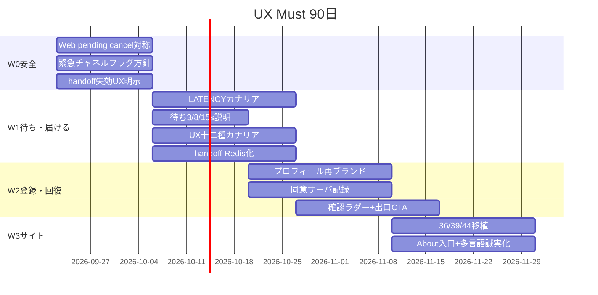

# 07 UX 施策ポートフォリオ & 90 日計画

**承認前提**: [01_EXECUTIVE_BRIEF.md](./01_EXECUTIVE_BRIEF.md)  
**PDCA 根拠**: [06_PDCA_12_CYCLES.md](./06_PDCA_12_CYCLES.md)

---

## 1. 生存ポートフォリオ（MoSCoW）

| 等級 | 施策 | テーマ |
|------|------|--------|
| **Must** | Web pending medical/crisis cancel を LINE 同等に | チャネル安全 |
| **Must** | Emergency 確認質問ラダー（低確信のみ）＋再入場 | 対話回復 |
| **Must** | handoff トークン永続化＋失効/再発行 UX | チャネル |
| **Must** | Physical p95&lt;15s（LATENCY カナリア or 候補上限）＋3/8/15s 待ち説明 | 待ち |
| **Must** | UX 十二種 / 緊急チャネル分割の本番カナリア | 届ける |
| **Must** | 「登録」→任意プロフィール再ブランド＋同意サーバ記録 | Web 登録 |
| **Must** | Counseling/SessionOps 出口 CTA（非危機時） | 対話回復 |
| **Must** | 多言語誠実化（翻訳 or 常時日本語ラベル） | サイト/信頼 |
| **Should** | プロト 36/39/44 選択移植 | サイト UI |
| **Should** | 0 件 UX の次アクション強化 | サイト UI |
| **Should** | a11y P0: `+N` 展開・モーダル trap・モバイル字縮小禁止・reduced-motion 連動・LINE 安全文 truncate 除外 | サイト UI |
| **Should** | Cookie `sid` httponly 方針見直し（登録 P0 付帯） | 登録/信頼 |
| **Should** | About 一般向け入口 1 画面／Chat↔About 双方向 | サイト |
| **Should** | チャネル差分の契約表＋非キオスク「当キオスク」回帰（B17/B18） | チャネル |
| **Should** | 店舗共有用のスクショ耐性要約カード（QR は Could） | チャネル |
| **Could** | LINE Login 任意紐づけ（登録オプション C） | 登録 |
| **Could** | explainable パネル（41）、checklist-first（45） | サイト |
| **Could** | 音声導線の強調 | a11y |
| **Won't 90日** | 必須会員、VH、方向 C 全面、プロト全移植、Safety 弱体化、キオスク専用 UI | — |

---

## 2. 90 日ロードマップ

### Week 0–2（W0）— 安全と信頼の穴を塞ぐ

| ID | タスク | 完了条件 |
|----|--------|----------|
| W0-1 | Web `_handle_web_delete` に medical/crisis priority cancel | テストで LINE 同等シナリオ緑 |
| W0-2 | `SAFETY_EMERGENCY_CHANNEL_SPLIT` 本番方針文書化＋カナリア計画 | 方針 MD 承認 |
| W0-3 | handoff 失効理由画面＋「LINE で再発行」導線 | E2E 手動 5 ケース |
| W0-4 | 薬剤師要請の常時「デモ/β」ラベル強化 | 文言レビュー |

### Week 3–6（W1）— 待ちを実測で殴る／改善を届ける

| ID | タスク | 完了条件 |
|----|--------|----------|
| W1-1 | `LATENCY_*` ALLOWLIST カナリア | Physical p95 比較レポート |
| W1-2 | 待ち UI 3s/8s/15s＋早期キャンセル | ペルソナ机上＋1 回録画レビュー |
| W1-3 | UX 十二種の本番カナリア | 回帰テスト＋差分ログ |
| W1-4 | handoff トークンを Redis/DB | マルチインスタンス想定テスト |

### Week 7–10（W2）— 登録（軽量）と回復 UX

| ID | タスク | 完了条件 |
|----|--------|----------|
| W2-1 | 「ユーザー情報登録」文言を「任意プロフィール」系へ | i18n 4 言語 |
| W2-2 | オンボーディング同意のサーバ記録 | DB カラム＋削除請求導線 |
| W2-3 | Emergency 確認ラダー（低確信） | fixture＋FP-harm 観測案 |
| W2-4 | Counseling/SessionOps 出口 CTA | 非危機時のみ表示のテスト |

### Week 11–13（W3）— サイト体験の選択強化

| ID | タスク | 完了条件 |
|----|--------|----------|
| W3-1 | プロト 36/39/44 を Sage 内移植 | スクロールバー規則遵守 |
| W3-2 | About トップに「30 秒で分かる」入口 | ja 優先、他言語追随 |
| W3-3 | 多言語誠実ラベル or 翻訳再開判定 | 方針どちらかを実装 |
| W3-4 | a11y Quick Wins パック | チェックリスト消化 |

---

## 3. KPI（測れない改善は却下）

| KPI | ベース | 90 日目標 |
|-----|--------|-----------|
| Physical e2e p95 | ≈24s | &lt;15s |
| handoff 成功率 | 未計測 | 計測開始＋失敗時再発行率 &gt;80% |
| Emergency FP 後の同一セッション再入場 | 未計測 | 計測開始 |
| 属性（年齢）完了率 | 未計測 | 計測＋任意化後も安全説明到達 |
| UX フラグ本番到達 | 十二種 OFF 寄り | カナリア→段階 ON |
| 「登録＝会員」誤解 | 定性 | β ヒア 5 名で誤解 0 を目指す |

---

## 4. テーマ別バックログ（アイデア歓迎枠）

### 4.1 チャネル

- LINE リッチメニューの「Web 詳細」失敗時コピー刷新
- Quick Reply「症状の相談に戻る」
- Flex 高齢者短縮版
- キオスクは方針決定まで UI 作らない

### 4.2 Web 登録

- 段階: 匿名 → 任意プロフィール →（将来）LINE Login →（将来）メール
- 家族代理モード（Could）
- データ削除のワンタップ（Must に近い Should）

### 4.3 サイト UI/UX

- 信頼: 「ルールで選ぶ」「診断しない」「出典」
- 待ち: 誠実な段階説明
- About: 専門家βと一般の二層入口
- 凍結: 方向 C、ボディマップ、テーマ 10 色

---

## 5. No-Go（再掲）

1. SafetyGate / crisis 感度下げ
2. 会員必須
3. VH で遅延隠蔽
4. 薬剤師実接続の偽装
5. プラポリ未改定の連絡先収集

---

## 6. 次アクション（人間の決断）

実装に入る前に確認してほしい 3 点:

1. **Physical KPI** を公式に &lt;15s に再合意するか、&lt;5s を残すか
2. **LINE Login** を 90 日 Could のままにするか、W2 に前倒しするか
3. **本番カナリア**の ALLOWLIST 対象（内部テスター ID）

承認後、W0-1 から実装チケット化可能。
