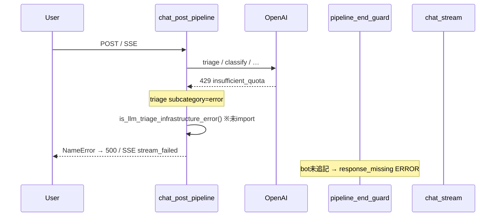

# Wave A — `infra_errors` 分析（local-dev）

**対象ログ**: `log/log/2026-06-30-9.md` / `-10.md` / `-11.md`（集約: `2026-06-30-dev-9-11.md`）  
**期間**: 2026-06-30 14:15:52 〜 17:41:22（JST 想定）  
**環境**: `local-dev`（Cloud Run revision なし — `deploy_revision.json` は空）  
**集計**: ERROR 735 / WARNING 868 / INFO 22,633（`metadata.json`）

---

## Executive Summary（最大5点）

- **OpenAI `insufficient_quota`（429）がセッション開始直後から約1時間以上継続**し、トリアージ・属性抽出・セキュリティ分類など広範な LLM 呼び出しが失敗。ログ9のみで `insufficient_quota` 言及 **881件**（集約パターン: トリアージ 145 + ChatGPT API 125）。
- **`is_llm_triage_infrastructure_error` の未 import（NameError）が二次障害**として 16:12〜17:15 に集中。HTTP 500（78件）と SSE 失敗（6件）を誘発し、429 向けに用意した `llm_unavailable` カード配信まで到達できないケースがあった。
- **DB セッションクリーンアップが 13回失敗**（`tuple index out of range`）。v2 テスト大量実行時の exclude リスト付き DELETE と `LIKE '%...%'` の psycopg2 エスケープ不備が疑われる。
- **`Pipeline end guard: response_missing` は計 122回**（ログ9:43 / 10:54 / 11:25）。429・NameError・ルート未処理のいずれかで bot 未追記のままパイプライン終了。fail-loud 設計どおり redirect は補完されず。
- **因果関係**: 429（根本原因）→ トリアージ `subcategory: error` → `mark_llm_infrastructure_degraded` 意図の分岐で NameError → 500/SSE 断 → end guard が `response_missing` を記録、という連鎖がログ上明確。

---

## 1. OpenAI 429 / `insufficient_quota`

| 項目 | 内容 |
|------|------|
| **深刻度** | 🔴 Critical（外部依存・テスト全体を止める） |
| **件数** | 集約 top_patterns: LLMトリアージ 145 + ChatGPT API 125 ≈ **270 ERROR 行**；生ログ9で `insufficient_quota` **881言及** |
| **時間帯** | **14:15:52** 初出 → **15:28:11** 頃まで継続（ログ9）。ログ10/11では同文字列ほぼなし（クォータ枯渇後は別エラーへ移行） |

### 証拠

```
14:15:52.964 ERROR attribute_extractor: ChatGPT API呼び出しエラー: Error code: 429 - {…'code': 'insufficient_quota'}
14:15:54.463 ERROR llm_triage: LLMトリアージエラー: Error code: 429 - {…'insufficient_quota'}
15:28:11.546 ERROR llm_triage: LLMトリアージエラー: Error code: 429 - {…'insufficient_quota'}
```

影響モジュール（ログ上）: `llm_triage`, `attribute_extractor`, `llm_security_check`, `concierge_agent`, `dialogue.intent_router_llm` 等。

### コード参照

- 429 判定・マーカー: `src/services/llm_unavailability.py` — `is_openai_infrastructure_error_text()`, `_INFRA_ERROR_MARKERS`
- トリアージ側ログ: `src/services/llm_triage.py` L747 付近
- 属性抽出: `src/core/attribute_extractor.py` L237 付近

### 観測された挙動

- 一部セッションでは `llm_unavailable` error カード（`sage_status` / `variant=error`）が **正常に追記**されている（例: sid `1782405712667296997550`, 14:33:59）。
- しかし並行して LLM リトライが続き、パイプライン遅延・トリアージ `subcategory: error` が大量発生。

### 推奨アクション

| 優先 | アクション | ファイル・運用ヒント |
|------|-----------|---------------------|
| P0 | OpenAI 課金・クォータ復旧、またはテスト用別キー / モック | 運用・`.env` |
| P1 | `insufficient_quota` 検知時に **セッション単位で LLM 呼び出し短絡**（既存 `mark_llm_infrastructure_degraded` をトリアージ直後に必ず実行） | `src/services/llm_unavailability.py`, `src/handlers/chat/chat_post_pipeline.py`, `src/services/llm_triage.py` |
| P2 | OpenAI SDK リトライ回数・並列 v2 テストのスロットル | `scripts/local_v2_chat_test_runner.py`, `config/llm_flags.py` |
| P3 | 429 率のアラート（local-dev でも `performance_metrics.jsonl` 連携） | `src/services/` ログ集計 |

---

## 2. `NameError: is_llm_triage_infrastructure_error`

| 項目 | 内容 |
|------|------|
| **深刻度** | 🔴 Critical（本番相当の 500 / SSE 切断） |
| **件数** | **78**（500 Internal Server Error + エラー詳細ログ + traceback 行の集約） |
| **時間帯** | **15:18:37**（SSE 初出）→ **16:12:47** 大量発生 → **17:15:37** まで継続 |

### 証拠（スタックトレース）

ログ時点の `chat_post_pipeline.py` L441:

```python
if ctx.triage_result and is_llm_triage_infrastructure_error(ctx.triage_result):
```

```
16:12:47.085 ERROR main: ❌ 500 Internal Server Error: name 'is_llm_triage_infrastructure_error' is not defined
  → chat_post_pipeline.py:441 in run_chat_post_pipeline
  → main.py:905 _post_chat_json_response → handle_chat_post
```

SSE でも同根:

```
15:18:37.905 ERROR chat_stream: SSE stream failed: name 'is_llm_triage_infrastructure_error' is not defined
  → chat_stream.py:295 → chat_post_pipeline.py:441
```

**直前ログ**（15:18:37）: `llm_unavailability: LLM unavailable error card appended` の直後に NameError でストリーム失敗 — **障害通知カード追加後にパイプラインがクラッシュ**。

### コード参照（現行ワークスペース）

- 関数定義: `src/services/llm_unavailability.py` L37 `is_llm_triage_infrastructure_error()`
- 呼び出し元（ログ時点）: `src/handlers/chat/chat_post_pipeline.py` L441 — **現行コードでは当該呼び出しは存在せず** `if is_agent_enabled():` に置換済み（import 追加ではなく呼び出し削除の状態）
- SSE ラッパ: `src/handlers/chat_stream.py` L331-337
- テスト: `tests/routing/test_llm_unavailability.py`

### 推奨アクション

| 優先 | アクション | ファイル |
|------|-----------|----------|
| P0 | インフラエラー分岐を復活させる場合は **必ず import** する: `from src.services.llm_unavailability import is_llm_triage_infrastructure_error, mark_llm_infrastructure_degraded` | `src/handlers/chat/chat_post_pipeline.py` |
| P0 | トリアージ `subcategory: error` + 429 reasoning のとき `mark_llm_infrastructure_degraded` を呼び、以降の orchestrator をスキップ | 同上 + `src/services/confidence_gate.py` |
| P1 | SSE/POST 共通の回帰テスト（429 モック → error カード + 200、NameError なし） | `tests/routing/test_llm_unavailability.py` |
| P2 | `chat_stream.py` の `stream_failed` 時に degraded セッションを persist | `src/handlers/chat_stream.py` L346-348 |

---

## 3. DB クリーンアップ `tuple index out of range`

| 項目 | 内容 |
|------|------|
| **深刻度** | 🟡 Medium（期限切れセッション削除失敗・ディスク肥大リスク） |
| **件数** | **13** |
| **時間帯** | **14:35:08〜09**（ログ9 ×3）、**16:04:31〜33**（ログ10 ×3）などバースト |

### 証拠

```
14:35:08.945 ERROR database: ❌ Failed to cleanup expired sessions: tuple index out of range
16:04:31.348 ERROR database: ❌ Failed to cleanup expired sessions: tuple index out of range
```

### 根因仮説（コードレビュー）

`cleanup_expired_sessions` は `exclude_session_ids` あり時にパラメータ付き `execute` を使用:

```1190:1198:src/services/database.py
            if exclude_list:
                placeholders = ','.join(['%s'] * len(exclude_list))
                delete_sql = f"""
                DELETE FROM sessions
                WHERE ({expire_clause})
                {v2_guard}
                AND session_id NOT IN ({placeholders});
                """
                cursor.execute(delete_sql, tuple(exclude_list))
```

`v2_guard` 内の `LIKE '%local-v2-chat-test%'` / `LIKE 'v2-test-%'` に含まれる **`%` が psycopg2 のプレースホルダと衝突**し、`exclude_list` のタプル長と合わず `tuple index out of range` になる典型パターン。v2 大量テストで `get_cleanup_exclude_session_ids()` が肥大化したタイミングと一致。

呼び出し元: `src/services/session_manager.py` L962-970（リクエスト毎の定期クリーンアップ）。

### 推奨アクション

| 優先 | アクション | ファイル |
|------|-----------|----------|
| P1 | `v2_guard` のリテラル `%` を `%%` にエスケープ、または `psycopg2.sql` コンポーザで組み立て | `src/services/database.py` L1180-1201 |
| P2 | `cleanup_expired_sessions` のユニットテスト（exclude あり + LIKE 句） | `tests/`（新規） |
| P3 | クリーンアップ失敗時も `session_manager` フォールバック経路の動作確認 | `src/services/session_manager.py` L980+ |

---

## 4. `Pipeline end guard: response_missing`

| 項目 | 内容 |
|------|------|
| **深刻度** | 🟡 Medium（ユーザー無応答；テスト失敗・UX 劣化） |
| **件数** | **122**（ログ9:43, 10:54, 11:25） |
| **時間帯** | **16:04:34** 頃から集中（v2 YAML シナリオ）、**17:01〜17:15** に sid `1782805521537902706377` で連続 |

### 証拠

```
16:04:34.081 ERROR chat_pipeline_end_guard: Pipeline end guard: response_missing sid=1782802994901853546128 user_input='熱と頭痛があります'
16:05:35.074 … user_input='発熱と咳'
17:07:48.866 … sid=1782805521537902706377 user_input='ユーザー: …カロナールAやトキワイブプロエースA…'
17:15:37.553 ERROR main: NameError is_llm_triage_infrastructure_error（同一 sid）
```

集約 JSON では重複メッセージが 1件カウントのエントリもあり（例: `頭痛い` 系 6 sid）。

### コード参照

```102:145:src/handlers/chat/chat_pipeline_end_guard.py
def finalize_pipeline_response(...):
    """応答返却直前に bot 追記有無を確認する。無応答時は fail-loud（redirect 補完しない）。"""
    ...
    if is_llm_infrastructure_degraded(session):
        ...  # degraded 時は error ログを出さず return
    logger.error("Pipeline end guard: response_missing sid=%s user_input=%r", ...)
    new_body["pipeline_end_guard"] = "missing"
```

### 解釈

| パターン | 想定原因 |
|----------|----------|
| 16:04〜16:11 の症状入力（発熱・頭痛等） | 429 で Physical ルートが bot を返せず、`llm_infrastructure_degraded` フラグ未設定 |
| 17:01〜 の GPT シミュレーション長文 | orchestrator / concierge が `handled=False` のまま終了、または NameError で中断 |
| degraded 設定済みセッション | guard は ERROR を出さない設計 — 本ログの多くは **degraded 未設定** |

### 推奨アクション

| 優先 | アクション | ファイル |
|------|-----------|----------|
| P1 | 429 / triage error 時に **必ず** `mark_llm_infrastructure_degraded`（§2 と一体） | `chat_post_pipeline.py`, `llm_triage.py` |
| P2 | `handled=False` の orchestrator 終端で concierge redirect または明示的 error カード | `src/handlers/chat_orchestrator.py`, `src/dialogue/dispatcher.py` |
| P3 | v2 テストで `pipeline_end_guard: missing` を fail 条件に | `scripts/local_v2_chat_test_runner.py` |

---

## 5. SSE ストリーム失敗

| 項目 | 内容 |
|------|------|
| **深刻度** | 🔴 High（ストリーミング UI で error イベントのみ） |
| **件数** | **6**（すべて NameError と同一メッセージ） |
| **時間帯** | **15:18:37** 〜 **15:27:44**（ログ9） |

### 証拠

```
15:18:37.905 ERROR chat_stream: SSE stream failed: name 'is_llm_triage_infrastructure_error' is not defined
```

クライアントには `error` イベント（`code: stream_failed`）が返る:

```331:337:src/handlers/chat_stream.py
    except Exception as e:
        logger.exception("SSE stream failed: %s", e)
        yield _sse_line("error", {"code": "stream_failed", "message": str(e), ...})
```

### 推奨アクション

§2 の NameError 修正が本質。加えて:

| 優先 | アクション | ファイル |
|------|-----------|----------|
| P2 | SSE 経路でも POST と同じ degraded ハンドリングを共有（`run_chat_post_pipeline` 一本化は既存） | `src/handlers/chat_stream.py` |
| P3 | `stream_failed` 時に degraded なら `llm_unavailable` プレビューを `client_preview` で送る | `src/handlers/chat_stream.py` L316-326 |

---

## 6. 副次シグナル（参考）

| シグナル | 件数 | 深刻度 | メモ |
|----------|------|--------|------|
| `unhashable type: 'dict'`（推奨フロー） | 11 | 🟡 | `chat_recommendation_flow` — 429 とは独立のデータ構造バグ疑い |
| HTTP 4xx/5xx 集計 | 0 | 🟢 | `errors_http.json` の構造化 HTTP ログは空（500 はテキスト ERROR として記録） |
| `_ProactorReadPipeTransport` callback | 1 | 🟢 | Windows ローカル固有ノイズの可能性 |

---

## タイムライン（因果の整理）



| 時刻 | イベント |
|------|----------|
| 14:15 | 429 開始（local v2 テスト本格化） |
| 14:35 | DB cleanup 失敗バースト |
| 15:18 | LLM unavailable カード追加成功 → 直後 SSE NameError |
| 16:04〜16:11 | response_missing 多発（症状シナリオ） |
| 16:12〜 | POST 500 NameError 多発 |
| 17:01〜17:15 | GPT シミュレーション sid で response_missing + 最終 500 |

---

## 修正優先度まとめ

| 順位 | 課題 | 深刻度 | 主担当ファイル |
|------|------|--------|----------------|
| 1 | OpenAI クォータ / テスト用キー | 🔴 | 運用 |
| 2 | `is_llm_triage_infrastructure_error` import と degraded 短絡 | 🔴 | `chat_post_pipeline.py`, `llm_unavailability.py` |
| 3 | DB cleanup `%%` エスケープ | 🟡 | `database.py` |
| 4 | response_missing 削減（degraded + ルート終端） | 🟡 | `chat_pipeline_end_guard.py`, `chat_orchestrator.py` |
| 5 | SSE error 時の degraded フォールバック | 🟡 | `chat_stream.py` |

---

*Draft generated for Wave A / group `infra_errors`. 根拠: `sections/errors_http.json`, `metadata.json`, `deploy_revision.json`, 生ログ `2026-06-30-9/10/11.md`.*
