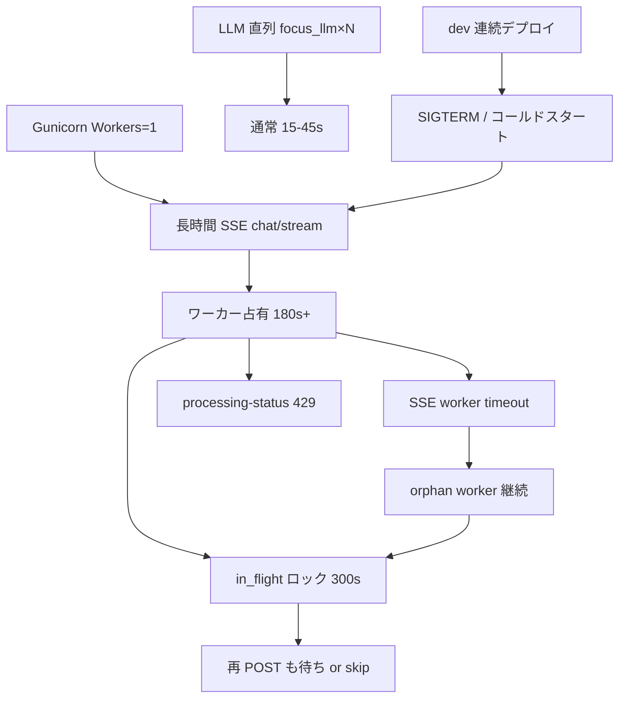

# GCP Log Analysis Report — 返信遅延調査

## メタデータ

| 項目 | 値 |
|------|-----|
| ソースファイル | `log/raw/downloaded-logs-20260726-20260728-20260728-044951.json` |
| 環境 (service) | **dev** (`medicine-recommend-dev`) |
| 期間 | 2026-07-26 06:08 UTC 〜 2026-07-28 04:49 UTC（約 46.7 時間） |
| エントリ数 | 36,910 |
| 主な revision | `00213-rnz`（27,054）、`00220-vt4`（1,307）、`00197-5cm`（1,517） |
| セッション数 | counseling 9 / trace-only 0 / chat_flow トレース 14 |
| 取得方法 | `prepare_gcp_log_analysis.py --since-last-local`（gcloud project 修正後） |

---

## エグゼクティブサマリー

直近 2 日間の dev ログで、返信遅延の主因は **2 層** に分かれる。

1. **🔴 致命的遅延（180〜351 秒）**: `POST /api/chat/stream` が SSE 180 秒タイムアウト上限に張り付く。6 件の `SSE chat worker timeout after 180s` を確認。パイプライン計測上は `safety_gate_done` まで ~9 秒で止まり、**残り 150〜340 秒はワーカー占有・待ち行列・orphan worker** が支配的。Gunicorn **Workers: 1** が head-of-line blocking を増幅。
2. **🟡 構造的遅延（15〜45 秒）**: LLM 直列（triage stage1+2、medicine_qa/focus_llm 複数回、safety_gate、Concierge/answer_stream）が累積。計測済み LLM は 1 ターン 6〜7 秒だが E2E は 15〜45 秒。
3. **🟡 輻輳 429（18 件）**: 長時間 SSE 実行中に `GET /api/processing-status` ポーリングが Cloud Run 同時接続上限で 429。UX 悪化の間接要因。
4. **🟡 dev 連続デプロイ（47 リビジョン / 46 時間）**: コールドスタート・SIGTERM による進行中ストリーム切断。
5. **ユーザー向け 5xx は 0 件**。遅延はタイムアウト・429 による体感劣化が中心。

---

## gcloud 設定修正（実施済み）

| 問題 | 修正 |
|------|------|
| `gcloud config get-value project` が **340042923793**（プロジェクト番号） | `gcloud config set project medicine-recommend` |
| スクリプトが番号をそのまま `--project` に渡していた | `src/analysis/gcp_log_export.py` の `resolve_project_id` で数字のみの値を `medicine-recommend` に正規化 |

---

## インフラ・エラー（infra_errors）

### HTTP 異常

| ステータス | 件数 | 主なパス |
|-----------|------|---------|
| **429** | **18** | `GET /api/processing-status`（9）、静的 JS/CSS（8）、`GET /`（1） |
| 404 | 2 | apple-touch-icon |
| 405 | 3 | `HEAD /` |
| 401 | 1 | `GET /api/main_sessions` |
| **5xx** | **0** | — |

### POST /api/chat/stream 遅延（🔴 critical）

| 指標 | 値 |
|------|-----|
| 件数 | 17 |
| 平均 | **69.1 s** |
| 中央値 | 25.4 s |
| p95 | **182.5 s** |
| 最大 | **182.8 s** |

**180 秒付近のリクエスト（SSE タイムアウト境界）:**

| 時刻 (UTC) | latency |
|-----------|---------|
| 2026-07-26 06:09:51 | 182.5 s |
| 2026-07-26 06:10:09 | 182.4 s |
| 2026-07-26 09:29:53 | 182.5 s |
| 2026-07-26 09:31:36 | 182.8 s |

### SSE worker 180s タイムアウト（6 件）

| 時刻 (UTC) | session_id |
|-----------|------------|
| 06:09:32 | `1785045987774595935322` |
| 06:10:45 | `1785046059668069683569` |
| 06:12:52 | `1785046191855438964793` |
| 06:13:11 | `1785046210068054838744` |
| 09:32:54 | `1785057159607653291042` |
| 09:34:37 | `1785058292428368289258` |

### デプロイ・リソース

- **47 リビジョン切替** / 46.7 時間（7/26 06:08〜10:50 に 17 回集中、平均 ~17 分間隔）
- Gunicorn **Workers: 1**（全期間）
- メモリ超過 1 件: 2026-07-26 09:39、`00205-xk4` で **517 MiB / 512 MiB 上限**

---

## 性能・コスト（performance_cost）

### PIPELINE_PERF（14 トレース、web のみ）

| 指標 | 値 |
|------|-----|
| 平均 total_ms | 77,840 ms |
| 中央値 | 19,505 ms |
| p95 | **338,327 ms** |
| 最大 | **351,778 ms** |

**最遅 3 トレース — 計測ギャップが決定的:**

| session_id | total_ms | safety_gate_done | 計測済み LLM | **未計測ギャップ** |
|------------|----------|------------------|-------------|-------------------|
| `1785058292428368289258` | **351,778** | ~9.1 s | ~2.9 s（triage×2） | **~342 s** |
| `1785057159607653291042` | **338,327** | ~9.2 s | ~3.4 s（triage×2） | **~329 s** |
| `1785205185643537553845` | **160,502** | ~15.6 s | ~6.8 s（triage+focus×2+answer） | **~145 s** |

→ ボトルネックの大半は **パイプライン計測外**（`safety_gate_done` 〜 `before_orchestrator` 間、または **ワーカー待ち・in_flight ロック・orphan worker**）。

**`safety_gate_done` 以降〜`before_orchestrator` 前の処理（計測なし）:**

- `run_triage_follow_ups` / `run_counseling_flow`
- `should_route_medicine_information_qa`（LLM 呼び出しあり）
- `infer_medicine_qa_focuses` → **`medicine_qa/focus_llm`（23 回 / 期間全体）**
- `try_qa_gate_concierge_response`

### LLM コスト（48 呼び出し / ¥2.48）

| path | 回数 | 備考 |
|------|------|------|
| **medicine_qa/focus_llm** | **23** | gpt-4o-mini、ターンあたり 1〜3 回 |
| llm_triage.stage1 | 7 | |
| llm_triage.stage2 | 4 | |
| medicine_response_builder.answer_stream | 3 | gpt-5.4 |
| dialogue.intent_router_llm | 3 | |

---

## 統合・外部連携（integrations）

**結論: DB・LINE は遅延原因ではない。**

| コンポーネント | 状態 | 遅延への寄与 |
|---------------|------|-------------|
| **Neon PostgreSQL** | 接続失敗 0 件、`session_db_read` 中央値 **7.8 ms** | **なし**（最大 351s リクエストでも DB 寄与 <0.1%） |
| **LINE Webhook** | HTTP **0 件**（本期間は Web のみ） | **なし** |
| **SSE / Cloud Run** | 180s タイムアウト 6 件、429×18、OOM 1 件 | **主因** |

SSL 切断 5 回はすべて即時 reconnect 成功。`after_get_session_db` 中央値 361 ms は許容範囲。

---

## 会話品質（conversation_quality）

### セッション総合評価（9 セッション）

| session_id | turns | grade | 最遅 E2E | 主な論点 |
|------------|------:|-------|---------:|---------|
| `1785057159607653291042` | 7 | **acceptable_with_issues** | **338 s** | Turn7 画像 fast path 329s 未計測、SSE timeout |
| `1785058292428368289258` | 2 | good | **352 s** | 画像リトライ、342s 計測空白 |
| `1785205185643537553845` | 6 | good | **160 s** | 比較QA 139s 空白、off-topic で focus_llm×10 |
| `1785075195430764131055` | 1 | good | **78 s** | Physical 推奨、focus_llm×8 + explain_batch |
| `1785045987774595935322` | 1 | good | 16 s | architecture 質問（起動直後 SSE timeout 別ログ） |
| `1785058927087582422001` | 2 | good | 12 s | 画像成功（改善例） |
| `1785046932452832237424` | 2 | good | — | **session_id 混線**（Turn2 応答空） |
| `1785046946908234934393` | 2 | good | 1.6 s | mrcdev トークン → system_error |
| `1785057141702808759270` | 2 | good | 1.2 s | 同上（再試行） |

**grade 分布:** good 8 / acceptable_with_issues 1 / heuristic_mismatch 1 件

### 遅延パターン分類（9/14 trace ≥8s）

| パターン | 代表 | total_ms | 主因 |
|----------|------|---------:|------|
| A. safety_gate 支配 | 挨拶 | 22 s | focus_llm 7回 + safety 12s |
| B. concierge + shadow | AWS/GCP | 16–45 s | safety + concierge_build |
| C. 通常 QA | 画像（成功） | 12–15 s | triage stage1+2 |
| D. **safety 後空白** | 画像リトライ | **352 s** | LLM 2回のみ、342s 未計測 |
| E. **answer 遅延** | 医薬品比較 | **160 s** | focus_llm 後 ~139s 未計測 |
| F. rule_based Physical | 喉痛 | **78 s** | scoring 13s + explain 15s + focus_llm×8 |
| G. missing_info QA | フォローアップ | 30 s | rb_missing_info 14s + focus_llm×6 |

### intent_mismatches

- **heuristic:** `1785057159607653291042`「やあこんにちは」— `greeting_to_non_greeting`（false positive 疑い）
- **shadow gate:** 画像3回で triage=`Other` vs shadow=`Physical/medicine_qa`（4回目セッションで解消）

---

## セッション別サマリ（Wave B）

### `1785057159607653291042` — [Session 1785057159607653291042](30cfcb0d-d9e7-497b-b381-6bb32515ff81)

**338s ハング（Turn 7 — 3 回目「ロキソニンとイブの画像見せて」）**

| 区間 | 時間 | 内容 |
|------|------|------|
| 計測済み | ~9 s | triage + safety_gate まで |
| LLM | ~3.4 s | triage stage1/2 のみ |
| **未計測ギャップ** | **~329 s（97%）** | `safety_gate_done` 以降、マーカー・LLM なし |

**経路の違い（Turn 6 vs Turn 7）:**

| ターン | E2E | answer_stream | focus_llm | 結果 |
|--------|-----|---------------|-----------|------|
| Turn 6（2 回目画像） | 15 s | **あり** | あり | Noimage プレースホルダー |
| Turn 7（3 回目画像） | **338 s** | **なし** | **なし** | CDN 画像 URL 成功 |

→ Turn 7 は **製品画像 fast path**（LLM 省略）と推定。`handle_medicine_information_qa` → `chat_with_medicine_context` 内の同期処理（品目解決・CSV・chat executor 競合）で滞留。**同一入力の並行セッション `1785058292428368289258` も 351,778 ms** と同型。

- 09:32:54 SSE 180s タイムアウト
- 09:35:32 にようやく画像付き応答（ユーザー体感 ~5.5 分）

### `1785058292428368289258` — [Session 1785058292428368289258](aeccb4ef-75c6-4bef-8025-30c1037eddb9)

**351s ハング（同一入力の並行 POST — Turn 2）**

| 項目 | 値 |
|------|-----|
| `total_ms` | **351,778 ms**（POST 09:31:37 → 応答 09:37:29） |
| `safety_gate_done` | 9,110 ms |
| **ギャップ** | **約 342 秒（97%）** |
| LLM | triage stage1/2 のみ（~2.9s）、focus_llm なし |

**二層構造:**
1. **計測上** — breakdown は `safety_gate_done` で打ち止め（`mark_pipeline_step` 未実装区間）
2. **実際** — 09:31:46 頃 gate 通過後、**09:37:29 まで約 6 分 HTTP 未応答**

**環境要因（機能ロジックより有力）:**
- **並行 POST**: 旧セッション `1785057159607653291042` が 09:29:54 開始・338s で完了（同一入力）
- **インスタンス飽和**: 09:33:36 静的アセット大量 **429**、09:34:37 SSE 180s タイムアウト
- **対照**: 09:42 再試行（`1785058927087582422001`）は **12 秒**で CDN 画像成功 → fast path 自体は正常

→ 製品画像 QA は LLM 省略の fast path（通常数秒）。351s は **executor/インスタンス混雑 + 重複 POST** が主因。

### `1785205185643537553845` — [Session 1785205185643537553845](961a1bf4-1dbb-4c8c-b700-38557a7849d7)

| ターン | 入力 | E2E | 主因 |
|--------|------|-----|------|
| 1 | ロキソニンとイブの違いは？ | **160 s** | focus_llm 後 ~139s 未計測（RAG/製品解決ブロック疑い） |
| 2 | GithubとGitlabの違いは？ | 45 s | off-topic なのに focus_llm×4 + safety 18s |
| 3 | このサービスはどっちなの？ | 30 s | rb_missing_info 14.7s + focus_llm×6 |

### `1785075195430764131055` — [Session 1785075195430764131055](053bd948-5b7c-4a3b-b4c1-2eace3147819)

- 「喉が痛いです。」→ Physical/sore_throat、推奨 3 品は妥当（CSV 照合済み）
- E2E **77.8 s**: focus_llm×8 + explain_batch 15s + safety 16s

### その他 5 セッション — [Batch remaining sessions](9a0732fd-f729-424b-b6d2-cdd4ad4c924a)

| session | 要点 |
|---------|------|
| `1785045987774595935322` | AWS/GCP architecture 正常、同一 sid で 06:09 SSE timeout |
| `1785046932452832237424` | Turn2 応答空 — **session_id 混線**（`178504598…` に routing） |
| `1785046946908234934393` | mrcdev トークン → system_error（~1.6s、LLM 未使用） |
| `1785057141702808759270` | 同上再試行（~1.2s） |
| `1785058927087582422001` | 画像成功 12.3s（同日早朝 Noimage セッションの改善例） |

---

## 遅延因果モデル

---

## 推奨アクション（優先順）

| 優先 | アクション | 対象 | 期待効果 |
|------|-----------|------|---------|
| **P0** | SSE 180s タイムアウト時に `end_chat_job()` 解放 | `chat_stream.py` | 再試行可能化 |
| **P0** | orphan worker に最大待機 + キャンセル | `chat_stream.py` | 340s 占有防止 |
| **P0** | Gunicorn workers ≥ 2（dev 含む） | Cloud Run / `start.sh` | head-of-line blocking 解消 |
| **P1** | `safety_gate_done` 〜 `before_orchestrator` に `mark_pipeline_step` 追加 | `chat_post_pipeline.py` | ハング箇所特定 |
| **P1** | `medicine_qa/focus_llm` 呼び出し回数削減（バッチ化・キャッシュ） | `medicine_qa_eligibility.py` | -3〜6 s/ターン |
| **P1** | 429 時 processing-status 指数バックオフ | `processing_status.js` | 輻輳 storm 抑制 |
| **P1** | off-topic 時の `focus_llm` スキップ | `medicine_qa_eligibility.py` | Turn2/3 で 10 回無駄呼び出し防止 |
| **P1** | 画像 fast path（`handle_medicine_information_qa`）に計測マーカー + タイムアウト | `medicine_context_handlers.py` | 329s 空白の正体特定 |
| **P2** | dev デプロイ頻度制限 + memory 768MiB+ | Cloud Build / Cloud Run | OOM・コールドスタート削減 |
| **P2** | triage stage2 条件付きスキップ | `llm_triage.py` | -1〜2 s/ターン |
| **P2** | session_id 混線調査（`178504693…`） | session_manager / SSE sink | 応答空バグ |

---

## 参照

### 最終レポート（本ファイル）

`log/analysis/2026-07-28_downloaded-logs-20260726-20260728-slow-response.md`

### Wave A ドラフト

- [Infra errors](5146e529-11c6-4ca4-bf1b-5f58081c567f) → `draft_infra_errors.md`
- [Performance cost](98bbbb5f-e0d8-450a-92db-0fb679754dc7) → `draft_performance_cost.md`
- [Conversation quality](84a5c74a-6bca-478e-9e42-f49c5585e117) → `draft_conversation_quality.md`
- [Integrations](62544373-9ccb-4fec-88af-d0f64ae32ff9) → `draft_integrations.md`

### Wave B セッション別ドラフト

- `draft_session_1785057159607653291042.md` — [Session 1785057159607653291042](30cfcb0d-d9e7-497b-b381-6bb32515ff81)
- `draft_session_1785058292428368289258.md` — [Session 1785058292428368289258](aeccb4ef-75c6-4bef-8025-30c1037eddb9)
- `draft_session_1785205185643537553845.md` — [Session 1785205185643537553845](961a1bf4-1dbb-4c8c-b700-38557a7849d7)
- `draft_session_1785075195430764131055.md` — [Session analysis](053bd948-5b7c-4a3b-b4c1-2eace3147819)
- `draft_session_1785045987774595935322.md` 他 4 件 — [Batch sessions](9a0732fd-f729-424b-b6d2-cdd4ad4c924a)
- `sessions/*.md` — CLI 生成 transcript

### 解析データ

`log/analysis/downloaded-logs-20260726-20260728-20260728-044951/`
