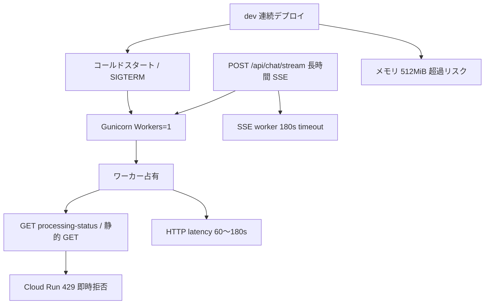

# Wave A — infra_errors 分析（応答遅延・429・デプロイ）

## メタデータ

| 項目 | 値 |
|------|-----|
| 環境 | **dev** (`medicine-recommend-dev`) |
| 期間 | 2026-07-26 06:08 UTC 〜 2026-07-28 04:49 UTC（約 46.7 時間） |
| ログ件数 | 36,910 |
| リビジョン数 | 20（うち主要: `00213-rnz` 27,054 / `00197-5cm` 1,517 / `00220-vt4` 1,307） |
| 重大度 | ERROR 1 / WARNING 24 / NOTICE 23 / その他 INFO 等 |

**データソース:** `metadata.json`, `sections/errors_http.json`, `sections/deploy_revision.json`（補助: `pipeline_perf.json`, `misc_signals.json`）

---

## エグゼクティブサマリ（最大 5 項目）

- **`POST /api/chat/stream` が極端に遅い（17 件: 平均 69.1 s / 最大 182.8 s / p95 182.5 s）。** Gunicorn **Workers: 1** のため、長時間 SSE が同一インスタンス上の他リクエストをブロックしている可能性が高い。
- **HTTP 429 は 18 件（4xx/5xx 合計 24 件の 75%）。** 大半は `GET /api/processing-status`（9 件）と静的 JS/CSS（8 件）。レイテンシ 0 s → **Cloud Run の同時接続上限超過**（アプリ内 rate limit ではない）と整合。
- **429 は 2 つのクラスタに集中:** (1) 2026-07-26 09:33 UTC — リビジョン `00205-xk4` 上でページ初期ロードの静的 GET が一斉 429、(2) 2026-07-28 02:20 UTC — `00220-vt4` 上で processing-status ポーリング連打 + `GET /` 429。**いずれも長時間 chat/stream 実行中と時間帯が重なる。**
- **デプロイロールアウトが密集:** 約 47 回のリビジョン切替。7/26 06:08〜10:50 UTC だけで 17 リビジョン（平均 ~17 分間隔）。Worker SIGTERM・Gunicorn 再起動・コールドスタートが infra ログを増幅。
- **付随リスク:** メモリ上限 512 MiB 超過 1 件（`00205-xk4`、429 クラスタ直後）。起動直後に SSE worker 180 s タイムアウト 4 件。ユーザー向け 5xx は **0 件**。

---

## 詳細所見

### 1. `POST /api/chat/stream` の応答遅延 — 🔴 critical（dev 体験）

**概要:** Cloud Run リクエストログ上、5 s 以上かかった chat/stream は 17 件。中央値 25.4 s に対し平均 69.1 s と右に長い尾があり、p95 が 182.5 s（≒ 180 s タイムアウト境界）。

| 指標 | 値 |
|------|-----|
| count | 17 |
| avg | **69.099 s** |
| median | 25.422 s |
| max | **182.795 s** |
| p95 | 182.522 s |

**エビデンス:**
- `sections/errors_http.json` → `slow_endpoints_ge_5s.POST /api/chat/stream`
- `misc_signals.json` → `SSE chat worker timeout after 180s` が 4 件（2026-07-26 06:09〜06:13 UTC、起動直後）
- Gunicorn 設定ログ: **`Workers: 1`**, `UvicornWorker`, `Timeout: 300s`

**パイプライン計測とのギャップ（インフラ寄りの解釈）:**
- `pipeline_perf.json` 最遅行では `safety_gate_done` が ~9 s 時点で計測終了しているのに `total_ms` が 338,000〜351,000 ms（~5.6 分）のレコードあり。
- 計測済み LLM 合計は数秒〜数十秒程度 → **ボトルネックの大半はパイプライン外（ワーカー待ち・同時実行制約・SSE 保持時間）** と見なせる。
- セッション単位の深掘りは本稿の対象外。集約として「長 tail はワーカー占有と相関」と記載。

**ユーザー影響:**
- チャット 1 件が最大 ~3 分近く HTTP 接続を占有 → 同一インスタンスの他 API・静的配信が遅延または 429。
- 180 s タイムアウト到達時は `SSE stream ended before worker completed` でクライアント側ストリームが先に終了するリスク。

**推奨アクション:**
1. dev でも **Gunicorn workers ≥ 2** または Cloud Run **concurrency=1 + max-instances 調整** で SSE と軽量 GET を分離検討
2. `processing-status` ポーリング間隔のバックオフ（429 時の指数バックオフ）をフロント側で強化
3. 180 s worker timeout と Cloud Run リクエスト timeout の整合確認（必要なら SSE 用と API 用でインスタンス分割）

---

### 2. HTTP 429（同時接続・輻輳） — 🟡 warning

**概要:** 429 は 18 件。いずれも `latency_s: 0.0` — 即時拒否パターン。

| パス | 429 件数 | 備考 |
|------|---------|------|
| `GET /api/processing-status` | 9 | フロントの処理状況ポーリング |
| `GET /static/js/*.js`, `GET /static/css/sage_terrace.css` | 8 | ページ初期ロード burst |
| `GET /` | 1 | ルート HTML |

**時系列クラスタ:**

| 時刻 (UTC) | リビジョン | 内容 |
|------------|-----------|------|
| 2026-07-26 09:33:36 | `medicine-recommend-dev-00205-xk4` | 静的 CSS/JS 8 リクエストが同一秒内に 429 |
| 2026-07-28 02:20:32〜02:21:39 | `medicine-recommend-dev-00220-vt4` | processing-status 9 連続 + `/` 1 件 |

**因果の整理（429 ↔ 遅延 chat/stream）:**
- 7/28 02:20 UTC 前後は `POST /api/chat/stream` が max 182 s 級の遅延区間（`00220-vt4` デプロイ後 ~10 時間）。
- processing-status は chat 処理中に高頻度ポーリングされる設計 → **長時間 SSE がワーカーを占有 → Cloud Run が追加リクエストを 429** という輻輳シナリオと一致。
- 7/26 09:33 の静的 429 は、同時間帯に `00205-xk4` へデプロイ直後かつ chat 負荷・メモリ圧力（後述）と近接。

**その他 4xx（429 以外）— 低優先:**
- 401 × 1: `GET /api/main_sessions`（管理 API 未認証・想定内）
- 404 × 2: `apple-touch-icon*.png`
- 405 × 3: `HEAD /`（ヘルス/プローブ系ノイズ）

**推奨アクション:**
1. Cloud Run コンソールで **max concurrency / max instances** と実測同時接続を照合
2. chat/stream 実行中の processing-status ポーリングレート上限（429 時バックオフ）
3. 静的アセットは CDN または Cloud Run とは別経路配信でインスタンス負荷を下げる（dev は優先度低）

---

### 3. デプロイロールアウトの密集 — 🟡 warning

**概要:** `revision_timeline` に **47 エントリ**（同一リビジョンの commit_sha null 行含む）。46.7 時間で実質 **20 リビジョン** がログに残存。

**7/26（集中デプロイ日）— UTC:**

| 開始 | 終了（安定化） | リビジョン範囲 | 間隔感 |
|------|----------------|---------------|--------|
| 06:08 | 10:50 | `00197-5cm` → `00213-rnz` | **~17 分/リビジョン** × 17 回 |
| 10:50 以降 | 7/27 10:44 | `00213-rnz` 固定 | ~24 h 安定（ログ 73%） |

**7/27〜7/28:**

| 時刻 (UTC) | リビジョン | commit_sha（先頭 8 桁） |
|------------|-----------|------------------------|
| 10:44 | `00214-qhz` | `0fd85935` |
| 10:55 | `00215-z7h` | `516cf5de` |
| 11:17 | `00216-kg9` | `8736bdb8` |
| 11:32 | `00217-2rb` | `7e3325d1` |
| 11:53 | `00218-9bv` | `cec79d9d` |
| 12:37 | `00219-zwg` | `19bcb8e9` |
| 16:09 | `00220-vt4` | `91ead571` |

**ロールアウト副作用（ログ上確認）:**
- Gunicorn 再起動ログがデプロイ直後に毎回出力（`🚀 Starting Gunicorn… Workers: 1`）
- `Worker (pid:N) was sent SIGTERM!` — 旧リビジョン停止時の**正常ノイズ**だが、進行中 SSE を切断しうる
- 7/26 06:09〜06:13 に **SSE 180 s タイムアウト 4 件** — 初回リビジョン `00197-5cm` 起動直後のコールドスタート＋ワーカー競合疑い

**ユーザー影響の切り分け:**
- HTTP 5xx は 0 件 → ロールアウト自体が直接 503 を量産した形跡は薄い
- ただし **デプロイ中の in-flight chat/stream 中断・再試行・ポーリング burst** が 429 / 遅延体感を悪化させる間接要因

**推奨アクション:**
1. dev CI の **連続デプロイ抑制**（前リビジョン Ready 確認、最小間隔、同一 commit の再デプロイ skip）
2. 検証バッチ中は `--min-instances=1` でコールドスタートを減らす
3. ロールアウト前後 5 分の chat/stream p95 / 429 件数を Cloud Monitoring ダッシュボード化

---

### 4. メモリ上限超過（512 MiB） — 🟡 warning

**概要:** 期間中 ERROR 1 件。

| 時刻 (UTC) | リビジョン | メッセージ |
|------------|-----------|-----------|
| 2026-07-26 09:39:54 | `medicine-recommend-dev-00205-xk4` | Memory limit of 512 MiB exceeded with **517 MiB** used |

**文脈:**
- 9 分前（09:33）に同一リビジョンで静的アセット 429 クラスタ
- `00205-xk4` は 09:28 デプロイ、`00206-6kv` へ 09:41 に切替 — **メモリ超過直後に次リビジョンへロール**

**推奨アクション:**
1. dev の Cloud Run memory を **768 MiB〜1 GiB** に一時引上げし再発監視
2. 429 / 長時間 SSE 集中時の RSS ピークを計測（OOM 前兆の相関確認）

---

### 5. その他 HTTP・インフラシグナル — 🟢 info

| 項目 | 結果 |
|------|------|
| ユーザー向け 5xx | **0 件** |
| `GET /api/processing-status` 遅延 | 958 件中 max 64.2 s（avg 0.51 s）— 429 非該当時も tail が長い |
| `GET /` 遅延 | max 21.5 s（49 件中）— コールドスタート/輻輳の tail |
| OpenAI API 429 | 本 HTTP ログ範囲では **ユーザー向け 429 として未検出**（LLM quota 系は別ログ） |

---

## 遅延要因の統合モデル

**優先度付き根本原因（インフラ視点）:**

1. **単一ワーカー + 長時間 SSE** — chat/stream と軽量 API の head-of-line blocking
2. **processing-status 高頻度ポーリング** — 占有中に 429 を誘発し UX 悪化
3. **dev 連続デプロイ** — コールドスタート・進行中ストリーム切断・観測ノイズ
4. **512 MiB メモリ** — ピーク時の余裕不足（1 件確認）

---

## 推奨アクション（優先順）

| 優先度 | アクション | 期待効果 |
|--------|-----------|---------|
| P0 | Gunicorn workers 増 / SSE と API の実行分離設計 | chat/stream 平均・p95 短縮、429 削減 |
| P0 | 429 時 processing-status バックオフ | 輻輳時のリトライ storm 抑制 |
| P1 | dev デプロイ頻度制限 + min-instances | コールドスタート tail 削減 |
| P1 | Cloud Run memory 768MiB+ | OOM / 再起動ループ回避 |
| P2 | 静的アセット配信分離 | 初期ロード 429 回避 |
| P2 | ロールアウト前後 SLO 監視（stream p95, 429 count） | 回 regressions の早期検知 |

---

## 参照ファイル

- `log/analysis/downloaded-logs-20260726-20260728-20260728-044951/metadata.json`
- `log/analysis/downloaded-logs-20260726-20260728-20260728-044951/sections/errors_http.json`
- `log/analysis/downloaded-logs-20260726-20260728-20260728-044951/sections/deploy_revision.json`
- `log/analysis/downloaded-logs-20260726-20260728-20260728-044951/sections/pipeline_perf.json`（集計参考）
- `log/analysis/downloaded-logs-20260726-20260728-20260728-044951/sections/misc_signals.json`（Gunicorn / SSE timeout）
