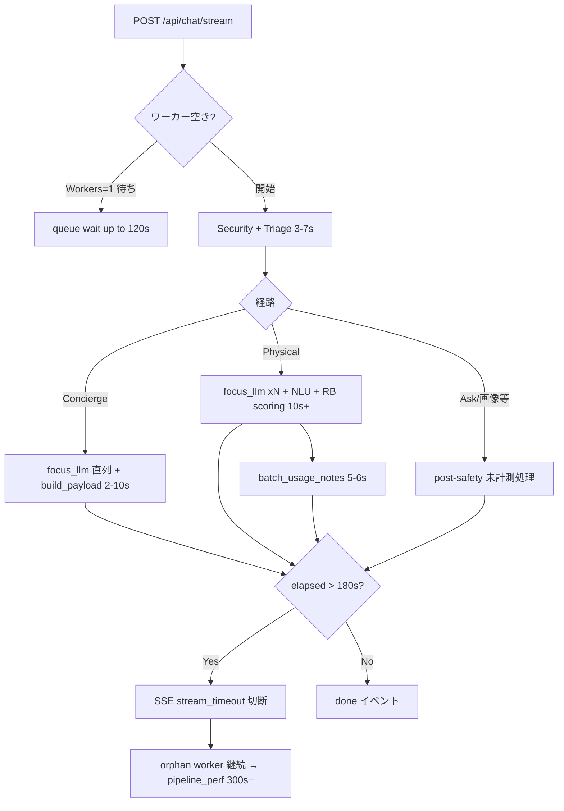

# パフォーマンス・コスト分析（dev: 2026-07-26 〜 2026-07-28）

## メタデータ

| 項目 | 値 |
|------|-----|
| 環境 | **dev** (`medicine-recommend-dev`) |
| 期間 | 2026-07-26 06:08 UTC 〜 2026-07-28 04:49 UTC（約 46 時間） |
| ログ件数 | 36,910 |
| パイプライン計測トレース | **14**（Web のみ） |
| セッション数 | 9（counseling 9 / trace-only 0） |
| LLM 呼び出し | 48 回 / 合計 **¥2.48** / 合計レイテンシ 73,614 ms |
| 主要リビジョン | `medicine-recommend-dev-00213-rnz`（27,054）、`00197-5cm`（1,517） |
| Gunicorn | **Workers: 1**（単一ワーカー） |

---

## エグゼクティブサマリ

- **🔴 応答遅延の主因は「180 秒 SSE 上限」と「計測マーカー間の未計測待ち」**。`POST /api/chat/stream` の **p95 = 182.5 秒**（max 182.8 秒）で、`CHAT_STREAM_TIMEOUT_SEC=180` の天井に張り付いている。パイプライン p95 は **338 秒**だが、最遅 2 件は LLM 合計 ~3 秒・`safety_gate_done` ~9 秒で止まり、**残り ~340 秒は計測空白** → SSE タイムアウト後もワーカーが orphan 継続した可能性が高い。
- **🔴 2026-07-26 06:09〜06:13 に SSE 180 秒タイムアウト 4 件**（再起動前の旧インスタンス）。いずれも `SSE stream ended before worker completed` が続発。同一ワーカー（Workers: 1）での処理詰まりが疑われる。
- **🟡 Physical 推奨 1 件（78 秒）は LLM 12 回・25.5 秒 + rule-based 説明 15 秒**。`medicine_qa/focus_llm` が **9 回直列**（1 回 7.3 秒の外れ値含む）し、`explanation_generator.batch_usage_notes`（gpt-5.4, 5.8 秒）が explain フェーズの中心。
- **🟡 毎ターン固定コスト: triage stage1+2 約 3 秒**（gpt-5.4-mini, prompt ~3,100 tokens × 2）。11 回中 stage1=7 / stage2=4。`llm_triage.py` は Other カテゴリで stage2 を追加実行する設計。
- **🟡 インフラ副次要因**: 429 レート制限 18 件（processing-status / 静的 JS）、512 MiB メモリ OOM 1 件（07-26 09:39）。遅延の直接原因というより、高負荷時の可用性リスク。

---

## 1. HTTP / SSE レイテンシ（ユーザー体感に直結）

### POST /api/chat/stream

| 指標 | 値 |
|------|-----|
| 件数 | 17 |
| min / median / avg / **p95** / max | 1.3 s / **25.4 s** / 69.1 s / **182.5 s** / 182.8 s |

**解釈:** p95 が 180 秒設定値付近 = 遅いリクエストの多くが **SSE タイムアウトで打ち切られている**。中央値 25 秒は許容域だが、尾部が極端に長い（二峰性）。

### SSE 180 秒タイムアウト（ログ実績）

| 時刻 (UTC) | session_id | 備考 |
|------------|------------|------|
| 2026-07-26 06:09:32 | `1785045987774595935322` | 再起動前インスタンス |
| 2026-07-26 06:10:45 | `1785046059668069683569` | 同上 |
| 2026-07-26 06:12:52 | `1785046191855438964793` | 同上 |
| 2026-07-26 06:13:11 | `1785046210068054838744` | 同上 |

いずれも ERROR `SSE chat worker timeout after 180s` + WARNING `SSE stream ended before worker completed`。

**コード参照:** `src/handlers/chat_stream.py`

```43:44:src/handlers/chat_stream.py
_STREAM_TIMEOUT_SEC = float(os.getenv("CHAT_STREAM_TIMEOUT_SEC", "180"))
_QUEUE_WAIT_SEC = float(os.getenv("CHAT_STREAM_QUEUE_WAIT_SEC", "120"))
```

ワーカー開始後 `_STREAM_TIMEOUT_SEC` 経過で SSE は `stream_timeout` エラーイベントを返して **ストリームを終了**するが、executor 上の `_run_chat_post` は orphan として走り続ける（L463–464 の warning）。そのため **HTTP/SSE 上の 180 秒**と **pipeline_perf の total_ms（最大 351 秒）**が乖離する。

---

## 2. パイプライン全体（pipeline_perf.json）

### 集計（Web 14 件）

| 指標 | total_ms | security_phase_ms | triage_wait_after_security_ms |
|------|----------|-------------------|--------------------------------|
| min | 1,184 | 6.9 | 0.5 |
| median | **19,505** | 638 | 181 |
| avg | 77,840 | 1,020 | 676 |
| **p95** | **338,327** | 3,728 | 4,939 |
| max | 351,778 | — | — |

### 経路別フェーズ分解（代表例）

#### A. 通常 Concierge（15〜22 秒）

例: greeting 22.4 秒（`1785057159607653291042`）

| フェーズ | 差分 ms | 内容 |
|----------|---------|------|
| セッション DB + セットアップ | ~295 + ~317 | `after_get_session_db` / `before_llm_setup` |
| セキュリティ | ~810 | `before_security` → `after_security` |
| **Triage (stage1+2)** | ~6,570 | `before_triage` → `after_triage`（LLM ~3.4 s + 待ち） |
| **Safety gate 以降〜Orchestrator 手前** | ~5,576 | `after_triage` → `safety_gate_done`（focus_llm 等） |
| **Orchestrator 待ち** | ~5,596 | `safety_gate_done` → `before_orchestrator` |
| Concierge payload | ~1,854 | `concierge_build_payload`（LLM ~1.3 s） |

**Why slow:** LLM 合計 8.2 秒に対し、**マーカー間の非 LLM 待ちが ~11 秒**（safety_gate 前後・orchestrator 手前）。focus_llm の直列呼び出しと、単一ワーカー上の他ジョブ待ちが重なる。

#### B. Physical 推奨（77.8 秒）

例: 「喉が痛いです。」（`1785075195430764131055`）

| フェーズ | 差分 ms | 内容 |
|----------|---------|------|
| 初期（〜triage 完了） | 6,600 | triage stage1 2.1 s |
| Triage 後〜safety_gate | **16,252** | focus_llm ×5（うち 1 回 **7.3 s**）+ missing_info 2.4 s |
| safety_gate〜NLU 開始 | **6,130** | 計測空白 |
| NLU batch | 3,869 | |
| RB scoring | 9,688 | |
| **RB explain batch** | **15,283** | `batch_usage_notes` 5.8 s（gpt-5.4, 588 completion tokens） |
| personalized_advice | 2,553 | 1.6 s LLM |

**Why slow:** LLM 12 回・25.5 秒に加え、**focus_llm の多回直列**（23/48 呼び出しがこの path）と **explain バッチ**が rule-based 後半を占有。explain は `src/core/explanation_generator.py` の `_fetch_batch_usage_notes_text` → `path="explanation_generator.batch_usage_notes"`（max_tokens 600–900、リトライあり）。

#### C. 極端外れ値（338〜351 秒）— SSE 天井 + 計測空白

| session | total_ms | LLM 合計 | safety_gate_done | 計測空白（推定） |
|---------|----------|----------|------------------|------------------|
| `1785057159607653291042` | 338,327 | 3.4 s (triage×2) | 9,156 ms | **~329 s** |
| `1785058292428368289258` | 351,778 | 2.9 s (triage×2) | 9,110 ms | **~343 s** |

共通点: 入力「ロキソニンとイブの画像見せて」、triage Other、`safety_gate_done` 以降の breakdown **マーカーなし**。SSE は ~180 s で切れるが pipeline_perf は完了時刻まで計測 → **orphan ワーカーの長時間ブロック**（画像取得・外部 I/O・ワーカーキュー待ち等）が最も plausible。

同メッセージの正常系比較: triage Ask/medication_identification では **12.3 秒**で完了（stage1 のみ 1.5 s）— 経路選択と post-safety 処理の差が決定的。

#### D. Ask 経路の長時間（160 秒）

「ロキソニンとイブの違いは？」— total **160,502 ms**、LLM 6.8 s、`safety_gate_done` 15,614 ms 以降 **~145 秒が未計測**。最後の LLM（`answer_stream` 2.1 s）から `log_ts` まで ~2 分の空白。SSE 180 s 制限と整合。

---

## 3. LLM レイテンシ・コスト（llm_cost.json）

### 全体

| 指標 | 値 |
|------|-----|
| 呼び出し数 | 48 |
| 総コスト | **¥2.48** |
| 総レイテンシ | 73,614 ms（平均 **1.53 s/呼び出し**） |
| モデル | gpt-4o-mini **25** / gpt-5.4-mini **19** / gpt-5.4 **4** |

### パス別（呼び出し数）

| path | 回数 | レイテンシ傾向 | コスト寄与 |
|------|------|----------------|------------|
| `medicine_qa/focus_llm` | **23** (48%) | 0.6–1.3 s（外れ 7.3 s ×1） | 低単価だが**回数で時間積算** |
| `llm_triage.stage1` | 7 | 1.4–2.1 s | ~¥0.10/回 |
| `llm_triage.stage2` | 4 | 1.3–1.6 s | ~¥0.10/回 |
| `explanation_generator.batch_usage_notes` | 1 | **5.8 s** | **¥0.26/回**（最高単価） |
| `concierge_agent.meta_architecture` | 2 | 1.5–1.8 s | ~¥0.12–0.16/回 |
| `medicine_response_builder.chat_context.answer_stream` | 3 | 1.4–2.1 s | gpt-5.4 |

### セッション別コスト TOP

| session_id | cost_jpy | 備考 |
|------------|----------|------|
| `1785057159607653291042` | ¥0.84 | 多ターン + 外れ値 338 s 含む |
| `1785205185643537553845` | ¥0.67 | Ask + Concierge 混在 |
| `1785075195430764131055` | ¥0.49 | Physical 推奨 12 LLM |

### Triage 設計と遅延の関係

`src/services/llm_triage.py` は **stage1（カテゴリ）→ Other なら stage2（詳細 subcategory）** の直列 2 段（または `is_triage_single_call_enabled()` 時は統合 1 回）。本ログでは stage1+2 合計 **~2.9–3.4 秒/ターン**がベースライン。prompt ~3,100 tokens と履歴圧縮ブロックが毎回載るため、短い greeting でも省略されにくい。

---

## 4. インフラ・可用性シグナル

| シグナル | 件数 / 内容 | パフォーマンスへの影響 |
|----------|-------------|------------------------|
| SSE 180 s timeout | 4（07-26 朝） | **ユーザー体感の硬い上限** |
| HTTP 429 | 18（processing-status 9, 静的 JS 8） | ポーリング・フロント資源取得失敗。処理中 UI の劣化 |
| Memory OOM | 1（512 MiB → 517 MiB, 07-26 09:39） | リビジョン `00205-xk4` 期。ワーカー再起動 → 一時的な遅延・タイムアウト誘発 |
| Gunicorn Workers | **1** | 同時 SSE + 重い RB 推奨でキュー待ち。`_QUEUE_WAIT_SEC=120` も関連 |

---

## 5. なぜ遅いか — 因果の整理



**優先度付き根本原因:**

1. **SSE 180 秒上限** — p95 が設定値に一致。長い Physical / 画像 / 未計測 I/O 経路はクライアント側で必ずタイムアウト体験。
2. **単一ワーカー + 直列 LLM** — focus_llm 23 回、triage 毎ターン 2 段。同一 executor で重いジョブが背中合わせ。
3. **計測空白フェーズ** — safety_gate 以降でマーカー不足。ボトルネック特定が困難なまま 100 秒超の待ちが発生。
4. **Physical explain バッチ** — gpt-5.4 / 5.8 s / ¥0.26。スコアリング後半の決定的コスト（1 サンプルのみだが構造上再現性高）。
5. **副次: 429 / OOM** — 07-26 午後の負荷ピーク時に悪化要因。

---

## 6. 推奨アクション（優先順）

| 優先 | アクション | 期待効果 |
|------|------------|----------|
| P0 | **post-safety 〜 orchestrator 間に pipeline マーカー追加**（画像 Ask / store gate 等）。338 s 級の空白を可視化 | 根本原因特定 |
| P0 | **180 s 超え見込み経路の早期 SSE 配信**（カード先行・部分応答）または `CHAT_STREAM_TIMEOUT_SEC` と Cloud Run request timeout の整合見直し | p95 体感改善 |
| P1 | **`medicine_qa/focus_llm` のバッチ化・回数削減**（同一ターン内 5–9 回 → 1–2 回） | Physical/Concierge で 5–15 s 短縮 |
| P1 | **Workers 増（≥2）または chat executor 分離** | キュー待ち・SSE 連鎖タイムアウト緩和 |
| P2 | `is_triage_single_call_enabled()` の dev 有効化検証 — stage1+2 → 1 回 | triage ~1.5 s 短縮/ターン |
| P2 | explain: `batch_usage_notes` モデル downgrade / defer / max_tokens 調整（`explanation_generator.py`） | RB 後半 3–6 s |
| P2 | メモリ 512→768 MiB、429 閾値見直し（processing-status ポーリング間隔） | OOM・429 回避 |

---

## 7. 品質メトリクス（参考）

`quality_metrics.json`: 9 セッション中 8 good / 1 acceptable_with_issues。heuristic mismatch 1（greeting_to_non_greeting）。**品質問題より待ち時間がユーザー体験の主要課題**。

---

## 付録: データソース

- `sections/pipeline_perf.json` — 14 traces
- `sections/llm_cost.json` — 48 calls
- `sections/errors_http.json` — chat/stream p95, 429
- `sections/misc_signals.json` — SSE timeout, Gunicorn
- `metadata.json`, `quality_metrics.json`

---

*Draft generated for log bundle `downloaded-logs-20260726-20260728-20260728-044951`. 個別セッションの会話内容評価は本稿の scope 外。*
