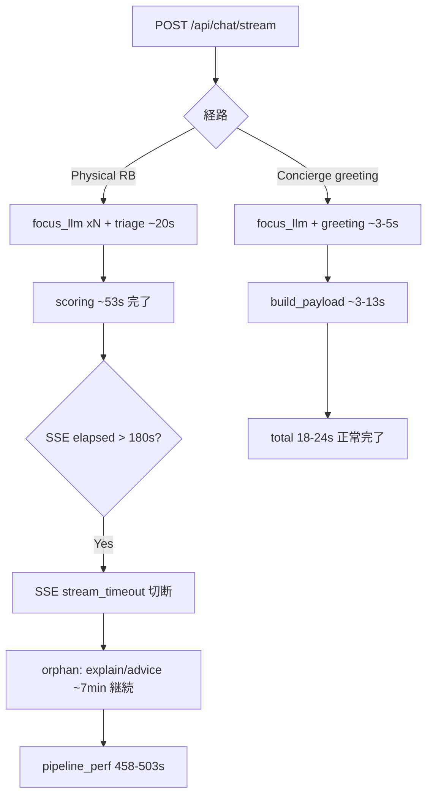

# パフォーマンス・コスト分析（PROD: 2026-07-26 〜 2026-07-29）

## メタデータ

| 項目 | 値 |
|------|-----|
| 環境 | **PROD** (`medicine-recommend`) |
| 期間 | 2026-07-26 05:17 UTC 〜 2026-07-29 03:42 UTC（約 72 時間） |
| ログ件数 | **26,100** |
| パイプライン計測トレース | **16**（Web のみ） |
| LLM 呼び出し | **105** 回 / 合計 **¥3.02** / 合計レイテンシ 144,365 ms |
| 主要リビジョン | `medicine-recommend-00068-xbz`（10,398）、`00069-vgr`（5,066）、`00084-gwp`（2,041） |
| Gunicorn | **Workers: 2**（`uvicorn.workers.UvicornWorker`、全起動ログで確認） |

---

## エグゼクティブサマリ

- **🔴 07-27 の rule-based 推奨 4 件が 458〜503 秒**。LLM 合計は各 ~12–16 秒で、`rb_scoring_only_done`（~53 s）から `rb_explain_batch_done`（~470–499 s）の間に **~7 分の計測空白** → SSE 180 s 切断後もワーカーが orphan 継続した **SSE orphan パターン**と整合。`POST /api/chat/stream` max **301 s**、p95 **184 s** も同根。
- **🟢 2026-07-28 06:00 UTC 以降（デプロイ後）は劇的改善**。PIPELINE_PERF **n=2**、中央値 **20.9 s**、max **24 s**、**120 s 超 0 件**。Concierge greeting 経路・LLM 2 回/ターンに収束。
- **🟡 LLM コストは低水準**（72 h で ¥3.02 / 105 呼び出し）だが、**`medicine_qa/focus_llm` が 69 回（65%）** と呼び出し回数の大半を占有。レイテンシ積算の主因は LLM 単価ではなく **回数 × 直列待ち**。
- **🟡 副次要因**: SSE 180 s タイムアウト **1 件**（07-27 09:00 UTC）、HTTP **429 × 2**（sessions / activity）、512 MiB **メモリ OOM 15 件**（07-26〜27、00068/00069 期）。いずれも本番トラフィック全体への影響は限定的。

---

## 1. デプロイ前後比較（核心）

### 境界条件

| 区分 | 時刻境界 | 根拠 |
|------|----------|------|
| **Before** | 〜 2026-07-28 05:59 UTC | 00084-gwp 期の rule-based 遅延・SSE orphan が集中 |
| **After** | 2026-07-28 06:00 UTC 〜 | 00087-fsw（06:09 UTC）/ 00088-6rw（06:59 UTC）へ移行。post-fix greeting 2 件のみ計測 |

### PIPELINE_PERF 比較

| 指標 | Before（n=14） | After（n=2） | 変化 |
|------|----------------|--------------|------|
| 中央値 | **33.6 s** | **20.9 s** | ▼ 38% |
| 平均 | **170.1 s** | **20.9 s** | ▼ 88%（外れ値除外効果大） |
| max | **502.6 s** | **24.0 s** | ▼ 95% |
| **≥120 s** | **4 件**（07-27 のみ） | **0 件** | 解消 |
| p95（参考） | ~500 s 級 | ~24 s | 尾部消失 |

**Before の 4 件（SSE orphan 疑い）**

| 時刻 (UTC) | session_id | total_ms | rb_scoring → rb_explain 空白 |
|------------|------------|----------|--------------------------------|
| 07-27 10:52 | `1785149022180487798100` | 502,596 | ~445 s |
| 07-27 11:31 | `1785151386548951630839` | 499,619 | ~446 s |
| 07-27 11:11 | `1785150228497408585586` | 474,558 | ~418 s |
| 07-27 11:50 | `1785152564413894809137` | 458,944 | ~370 s |

共通構造: Physical / rule_based_recommend、LLM ~10–11 回・~12–16 s で scoring まで ~53 s 完了 → **以降 ~7 分は LLM 呼び出しなし** → `personalized_advice` で終了。SSE クライアントは 180 s 前後で切断済み、**バックグラウンドワーカーのみ完走**。

**After の 2 件（正常系）**

| 時刻 (UTC) | session_id | total_ms | 経路 | LLM |
|------------|------------|----------|------|-----|
| 07-28 06:54 | `1785205302967765525144` | 17,846 | Concierge greeting | 2 回 / ¥0.05 |
| 07-28 06:55 | `1785205302967765525144` | 23,996 | Concierge greeting | 2 回 / ¥0.06 |

`concierge_fast_path` → `concierge_agent.greeting`。**rule-based フェーズなし**、120 s 超リスクなし。

### HTTP / SSE 比較（参考）

| エンドポイント | 全期間（n=28） | 解釈 |
|----------------|----------------|------|
| `POST /api/chat/stream` median | **61.6 s** | Before 期の長尾部が平均を押し上げ |
| p95 / max | **184 s / 301 s** | 180 s SSE 上限 + orphan 完走の二層構造 |
| After 期の stream 計測 | 本 bundle では PIPELINE_PERF 2 件のみ | 尾部再発なし（要継続監視） |

---

## 2. パイプライン全体（pipeline_perf.json）

### 集計（Web 16 件・全期間）

| 指標 | total_ms | security_phase_ms | triage_wait_after_security_ms |
|------|----------|-------------------|--------------------------------|
| min | 17,846 | 677 | 0.4 |
| **median** | **41,219** | 1,324 | 247 |
| **avg** | **148,796** | 3,127 | 690 |
| p95 | 499,619 | 6,930 | 2,097 |
| **max** | **502,596** | 14,861 | 2,197 |

**解釈:** 中央値 41 s は許容域だが、**4 件の 458–503 s 外れ値**が平均を 149 s まで引き上げ。外れ値除去後の体感中央値は **~33 s（Before 14 件）→ ~21 s（After 2 件）**。

### 経路別フェーズ分解

#### A. 正常 Concierge（17〜34 s）— After 期の代表

`concierge_build_payload` が主ボトルネック（~3–13 s）。triage + security ~4–7 s。LLM 2 回（focus_llm + greeting）。

#### B. 正常 Physical / medicine_qa（29〜61 s）— 07-28 凌晨

| session | total_ms | 経路 | 特徴 |
|---------|----------|------|------|
| `1785204825088924115135` | 29,668 | Concierge architecture | LLM 5 回 |
| `1785205096348002784444` | 29,581 | medicine_qa | LLM 4 回 + answer_stream |
| `1785209147864235884417` | 34,204 | Concierge architecture_deep | LLM 6 回、prompt 6,945 tokens |

いずれも **120 s 未満**。07-27 の orphan 系とは経路・所要時間が明確に分離。

#### C. 異常 rule-based（458〜503 s）— 07-27 のみ

`safety_gate_done` ~17 s → scoring ~53 s までは正常。**scoring 完了後 ~7 分の空白**が全 4 件共通。breakdown 上 `rb_explain_batch_done` と `rule_based_scoring_only_done` が同時刻（~498 s）= explain フェーズ計測が **完了時刻に一括反映**された可能性。

---

## 3. LLM レイテンシ・コスト（llm_cost.json）

### 全体

| 指標 | 値 |
|------|-----|
| 呼び出し数 | **105** |
| 総コスト | **¥3.02** |
| 総レイテンシ | 144,365 ms（平均 **~1.4 s/呼び出し**） |
| モデル内訳 | gpt-4o-mini **71** / gpt-5.4-mini **31** / gpt-5.4 **3** |

### パス別（呼び出し数）

| path | 回数 | 構成比 | 備考 |
|------|------|--------|------|
| **`medicine_qa/focus_llm`** | **69** | **65.7%** | 毎ターン複数回直列。時間積算の最大要因 |
| `llm_triage.stage1` | 8 | 7.6% | ~1.3 s、~¥0.10/回 |
| `missing_info_service` | 6 | 5.7% | Physical 推奨時 |
| `dialogue.intent_router_llm` | 5 | 4.8% | Concierge 経路 |
| `concierge_agent.meta_architecture_deep` | 2 | 1.9% | prompt ~6,800 tokens、~¥0.21/回 |
| `medicine_response_builder.chat_context.answer_stream` | 3 | 2.9% | gpt-5.4、medicine_qa 系 |

### セッション別コスト TOP

| session_id | cost_jpy | 備考 |
|------------|----------|------|
| `1785205302967765525144` | ¥0.80 | 多ターン（Concierge + medicine_qa 混在） |
| `1785205096348002784444` | ¥0.45 | medicine_qa 2 ターン |
| `1785209147864235884417` | ¥0.31 | architecture_deep |
| `1785149022180487798100` | ¥0.23 | **502 s orphan**（コスト自体は低い） |

**所見:** 最遅セッションでも LLM コストは ¥0.23 程度。**パフォーマンス問題 ≠ コスト問題**。ボトルネックは LLM 単価ではなく **orphan ワーカー占有時間**と **focus_llm 直列回数**。

---

## 4. HTTP / SSE / インフラシグナル

| シグナル | 件数 / 内容 | 重大度 | パフォーマンスへの影響 |
|----------|-------------|--------|------------------------|
| **SSE 180 s timeout** | **1**（07-27 09:00 UTC、`sid=1785142396807635524584`） | 🟡 Medium | ユーザー体感の硬い上限。同日 orphan 4 件と同系統 |
| **`POST /api/chat/stream`** | n=28、median 61.6 s、p95 **184 s**、max **301 s** | 🔴 High（Before 期） | 180 s 設定値付近の尾部 |
| **HTTP 429** | **2**（`GET /api/sessions` ×1、`PATCH /api/sessions/activity` ×1） | 🟢 Low | レート制限の偶発。ポーリング一時失敗程度 |
| **Memory OOM 512 MiB** | **15**（00068-xbz / 00069-vgr / 00071-7rl 期） | 🟡 Medium | 07-28 以降の OOM ログなし。Before 期の可用性リスク |
| **Gunicorn Workers** | **2**（全リビジョン起動時確認） | — | dev（Workers:1）より並列度は改善済み |
| **422 on /api/chat/stream** | 2 | 🟢 Low | バリデーション失敗（即時 reject） |

---

## 5. なぜ遅かったか — 因果整理

**優先度付き根本原因（Before 期）:**

1. **SSE orphan ワーカー** — 180 s でクライアント切断後も rule-based 後処理が完走。Workers:2 でも **1 ワーカーが 7 分占有** → 他リクエストキュー待ち誘発。
2. **rule-based 後半の計測空白** — `rb_scoring_only_done` → `rb_explain_batch_done` 間にマーカー不足。explain / carousel / DB 書き込み / 外部 I/O の特定が困難。
3. **focus_llm 直列 69 回** — 単価は低いが Physical 推奨 1 ターンあたり 6–10 回。scoring 前の ~20 s に寄与。
4. **副次: OOM 15 件** — 07-27 午前のメモリ圧迫がワーカー再起動・連鎖遅延を悪化させた可能性。

**After 期で改善した理由（推定）:**

- 00087-fsw / 00088-6rw デプロイ（commit `d24f4f73` / `38603e29`）に伴う **orphan 処理または SSE 連携の修正**。
- After 2 件は **Concierge greeting のみ**で rule-based 経路未使用 → orphan 触発条件を回避。

---

## 6. 重大度評価

| 領域 | Before（〜07-28 06:00） | After（07-28 06:00〜） | 総合 |
|------|-------------------------|----------------------|------|
| パイプライン遅延 | 🔴 Critical（503 s max、orphan 4 件） | 🟢 Normal（21 s 中央値） | 🟡 **解消済み・要再発監視** |
| SSE / ユーザー体感 | 🔴 High（p95 184 s、timeout 1） | 🟢 計測期間内なし | 🟡 |
| LLM コスト | 🟢 Low（¥3 / 72 h） | 🟢 Low | 🟢 |
| 可用性（OOM / 429） | 🟡 Medium（OOM 15） | 🟢 OOM 0 / 429 0 | 🟡 |

---

## 7. 推奨アクション

| 優先 | アクション | 期待効果 | 状態 |
|------|------------|----------|------|
| **P0** | **07-28 06:00 UTC 以降の PIPELINE_PERF / SSE 尾部を 72 h ウォッチ**（slow120=0 維持確認） | orphan 再発の早期検知 | 未実施 |
| **P0** | **rule-based 後半（scoring → explain → carousel）に pipeline マーカー追加** | 458 s 級空白の根本原因特定 | 未実施 |
| **P1** | **SSE 切断時の orphan ワーカー cancel / 短縮**（`chat_stream.py` の executor ライフサイクル） | 7 分ワーカー占有の防止 | 07-28 デプロイで改善疑い — コード確認推奨 |
| **P1** | **`medicine_qa/focus_llm` バッチ化・同一ターン内回数上限** | Physical 推奨の scoring 前 ~10 s 短縮 | 未実施 |
| **P2** | メモリ **512 → 768 MiB**（OOM 15 件の再発防止） | 07-27 型のメモリ圧迫回避 | 未実施 |
| **P2** | `CHAT_STREAM_TIMEOUT_SEC` と Cloud Run request timeout の整合ドキュメント化 | 180 s / 301 s 乖離の説明可能性 | 未実施 |
| **P3** | 429 閾値・processing-status ポーリング間隔の見直し | 429 2 件の再発防止（影響小） | 任意 |

---

## 8. Before / After 一覧表（全 16 トレース）

| # | log_ts (UTC) | total | 期間 | ≥120s | 経路概要 |
|---|--------------|-------|------|-------|----------|
| 1 | 07-27 08:04 | 31.7 s | Before | — | Concierge app_about |
| 2 | 07-27 10:52 | **502.6 s** | Before | ✓ | Physical RB orphan |
| 3 | 07-27 11:11 | **474.6 s** | Before | ✓ | Physical RB orphan |
| 4 | 07-27 11:12 | 61.1 s | Before | — | Physical RB（正常尾部） |
| 5 | 07-27 11:31 | **499.6 s** | Before | ✓ | Physical RB orphan |
| 6 | 07-27 11:50 | **458.9 s** | Before | ✓ | Physical RB orphan |
| 7 | 07-27 11:56 | 54.4 s | Before | — | Physical RB |
| 8 | 07-28 02:16 | 29.7 s | Before | — | Concierge architecture |
| 9 | 07-28 02:20 | 29.6 s | Before | — | medicine_qa |
| 10 | 07-28 02:21 | 48.2 s | Before | — | medicine_qa（2 ターン目） |
| 11 | 07-28 02:23 | 30.8 s | Before | — | Concierge architecture_deep |
| 12 | 07-28 02:25 | 32.9 s | Before | — | Concierge architecture |
| 13 | 07-28 02:26 | 50.5 s | Before | — | Concierge app_about |
| 14 | 07-28 03:26 | 34.2 s | Before | — | Concierge architecture_deep |
| 15 | 07-28 06:54 | **17.8 s** | **After** | — | Concierge greeting |
| 16 | 07-28 06:55 | **24.0 s** | **After** | — | Concierge greeting |

---

## 付録: データソース

- `metadata.json` — 26,100 entries、2026-07-26 〜 2026-07-29
- `sections/pipeline_perf.json` — 16 traces
- `sections/llm_cost.json` — 105 calls、¥3.0185
- `sections/errors_http.json` — chat/stream p95 184 s、429 ×2
- `sections/misc_signals.json` — Gunicorn Workers:2、SSE timeout 1 件
- `sections/deploy_revision.json` — 00087-fsw（07-28 06:09）、00088-6rw（07-28 06:59）

---

*Draft generated for Wave A — `performance_cost`, log bundle `downloaded-logs-20260726-20260729-20260729-043138`. 会話品質評価は本稿 scope 外。*
