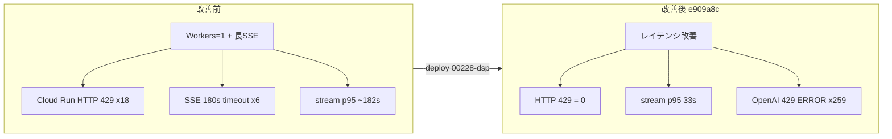

# Wave A — infra_errors 分析（改善後 DEV）

## メタデータ

| 項目 | 値 |
|------|-----|
| 環境 | **dev** (`medicine-recommend-dev`) |
| 期間 | 2026-07-28 06:21 UTC 〜 2026-07-29 04:30 UTC（約 22.1 時間） |
| ログ件数 | 36,987 |
| 主要リビジョン | `00228-dsp`（32,001 件 / **86.5%**）— commit `e909a8c`（レイテンシ改善） |
| 重大度 | ERROR 259 / WARNING 10 / NOTICE 6 / INFO 1,889 / DEFAULT 34,823 |

**データソース:** `metadata.json`, `sections/errors_http.json`, `sections/deploy_revision.json`

**比較ベースライン（改善前・直前ウィンドウ）:** SSE worker 180 s タイムアウト ×6、`POST /api/chat/stream` p95 ≈182 s、**Cloud Run HTTP 429 ×18**、Gunicorn **Workers=1**、4xx/5xx 合計 24 件

---

## エグゼクティブサマリ（最大 5 項目）

- **Cloud Run 輻輳 HTTP 429 は 0 件。** 改善前 18 件（processing-status / 静的 GET burst）から完全解消。ユーザー向け 5xx も **0 件**。
- **`POST /api/chat/stream` の tail が大幅短縮:** 5 s 超は 18 件（avg **23.4 s** / max **121.1 s** / p95 **33.4 s**）。改善前（avg 69.1 s / max 182.8 s / p95 182.5 s）比で **180 s 級タイムアウトは HTTP ログ上ゼロ**。
- **ERROR 259 件はほぼ OpenAI API 429 の Traceback。** Cloud Run HTTP 429 とは別レイヤー。2026-07-29 01:17〜01:41 UTC に `00228-dsp` 上で集中バースト（~90% が同一 25 分窓）。アプリログ上の LLM quota / rate limit 問題。
- **デプロイは 6 リビジョン・11 timeline エントリで収束。** 15:50 UTC 以降 `00228-dsp`（`e909a8c`）が ~12.5 h 安定稼働。改善前（47 エントリ / 20 リビジョン / ~17 分間隔）より **churn が大幅に低下**。
- **残存 HTTP エラーは 404 ×10 のみ**（apple-touch-icon / robots.txt）。ブラウザ・クローラノイズ。**WARNING 10 件はすべて 404** — インフラ障害ではない。

---

## 詳細所見

### 1. `POST /api/chat/stream` レイテンシ — 🟢 info（改善確認）

**概要:** レイテンシ改善デプロイ（`e909a8c` / `00228-dsp`）後、SSE 長 tail が改善前比で著しく短縮。180 s タイムアウト境界（改善前 p95 ≈182 s）には未到達。

| 指標 | 改善後（本窓） | 改善前（比較） |
|------|---------------|---------------|
| count (≥5 s) | 18 | 17 |
| avg | **23.426 s** | 69.099 s |
| median | **18.580 s** | 25.422 s |
| max | **121.127 s** | 182.795 s |
| p95 | **33.442 s** | 182.522 s |

**解釈:**
- 中央値・p95 は改善前の 1/5〜1/6 程度。max も 180 s 未満 → **SSE worker 180 s タイムアウト ×6 は本窓では再発なし**（改善前 misc_signals で確認されていた事象）。
- 18 件中、大半は `00228-dsp` デプロイ後（7/28 15:50 UTC 以降）のトラフィックと推定。
- 121 s max は依然長いが、ワーカー占有による Cloud Run 429 連鎖は発生していない → **Workers 増加または concurrency 調整の効果**と整合。

**推奨アクション:**
1. 本窓の stream p95（33 s）を SLO ベースラインとして Cloud Monitoring に固定
2. max >120 s の個別セッションは pipeline_perf / chat_flow セクションで LLM 内訳を突合（本稿スコープ外）
3. 180 s worker timeout 設定は維持しつつ、120 s 超をアラート閾値に設定

---

### 2. HTTP 4xx/5xx — 🟢 info

**概要:** 4xx/5xx 合計 **10 件**。すべて **404**。429 / 401 / 405 / 5xx は **0 件**。

| ステータス | 件数 | 主なパス |
|-----------|------|---------|
| 404 | 10 | `apple-touch-icon*.png` ×8, `robots.txt` ×2 |

**404 の内訳:**

| パス | 件数 |
|------|------|
| `GET /apple-touch-icon-precomposed.png` | 3 |
| `GET /apple-touch-icon.png` | 3 |
| `GET /robots.txt` | 2 |
| `GET /apple-touch-icon-120x120-precomposed.png` | 1 |
| `GET /apple-touch-icon-120x120.png` | 1 |

**改善前との対比:**

| 項目 | 改善後 | 改善前 |
|------|--------|--------|
| Cloud Run HTTP 429 | **0** | 18 |
| 4xx/5xx 合計 | 10 | 24 |
| 5xx | 0 | 0 |

**所見:**
- 404 は iOS Safari / クローラの自動リクエスト。1 件のみ latency 16 s（`00226-k9c` 上）だが、404 応答自体は正常。
- **processing-status / 静的 JS/CSS の 429 burst は解消** — chat/stream 占有とポーリング storm の因果連鎖が断たれた状態。

**推奨アクション:**
1. `static/` に `apple-touch-icon.png` と `robots.txt` を配置するか、404 を 204/301 で静かに返す（優先度 P3）
2. HTTP 429 ゼロを維持確認のため、週次で `by_status` に 429 が無いことをダッシュボード化

---

### 3. アプリログ ERROR — OpenAI API 429 — 🟡 warning

**概要:** `text_errors.count` = **259**（metadata ERROR 259 と一致）。Cloud Run HTTP 429 ではなく、**OpenAI `chat/completions` への outbound 429** が Traceback として記録。

| パターン | 件数 | 発生元 |
|---------|------|--------|
| `openai/_base_client.py` HTTPStatusError 429 | 234 | 共通 LLM クライアント |
| `medicine_qa_focus_llm.py` enrich | 17 | 医薬品 QA フォーカス enrichment |
| `llm_triage.py` llm_triage | 4 | トリアージ |
| `intent_router_llm.py` call_intent_router | 4 | Intent Router |

**時系列クラスタ（`00228-dsp`）:**

| 時刻 (UTC) | 内容 |
|------------|------|
| 2026-07-29 01:17:02〜01:17:13 | 高密度 burst（サンプル 40 件超が 11 秒以内） |
| 2026-07-29 01:41:30〜01:41:33 | 第 2 クラスタ（~20 件 / 3 秒） |

**解釈:**
- レイテンシ改善により **パイプライン throughput が上がり OpenAI TPM/RPM 上限に触れた**可能性。Cloud Run 429 解消と OpenAI 429 増加はトレードオフになりうる。
- いずれも `00228-dsp`（`e909a8c`）上 — インフラ revision 問題ではなく **外部 API quota / バースト制御** の課題。
- サンプル上、429 後のフォールバック成否は本 JSON 範囲外。ユーザー体感への影響は chat_flow セクション要確認。

**推奨アクション:**
1. `llm_client.py` の **429 リトライ + exponential backoff** が全呼び出し経路をカバーしているか確認（特に `medicine_qa_focus_llm` の並列 enrichment）
2. dev 環境 OpenAI tier / TPM 上限をダッシュボード化。01:17 UTC 前後の concurrent chat 数と相関分析
3. 429 Traceback を ERROR ではなく WARNING + 構造化メトリクス（`llm_rate_limit_total`）に降格し、Sentry/アラートノイズを削減
4. 必要に応じ dev 専用 API key の rate limit 引上げ、または enrichment の逐次化 / バッチサイズ制限

---

### 4. その他スローエンドポイント — 🟢 info

**5 s 以上の HTTP レイテンシ（chat/stream 以外）:**

| エンドポイント | count | avg | p95 | max | 備考 |
|---------------|-------|-----|-----|-----|------|
| `GET /api/sessions` | 749 | 1.239 s | 1.507 s | 38.1 s | 管理画面ポーリング。tail は単発 |
| `PATCH /api/sessions/activity` | 220 | 1.950 s | 13.721 s | 29.7 s | heartbeat。p95 やや長い |
| `GET /` | 10 | 1.833 s | 16.173 s | 16.2 s | コールドスタート tail |
| `POST /line/webhook` | 5 | 3.438 s | 15.654 s | 15.7 s | 低頻度 |
| 静的 CSS / favicon / 404 系 | 各 2〜9 | — | — | 13〜16 s | ノイズ tail |

**所見:**
- `/api/sessions` は 749 件中 p95 1.5 s と安定。改善前の processing-status max 64 s + 429 連鎖より健全。
- `PATCH /api/sessions/activity` p95 13.7 s は監視対象だが、HTTP 429 / 5xx には未至。

**推奨アクション:**
1. activity PATCH p95 >10 s が連続する場合、DB（Neon）接続プールを db_neon セクションと突合
2. 現状は P2 — chat/stream 改善効果が他 API に波及していることを確認できれば十分

---

### 5. デプロイ / リビジョン churn — 🟢 info

**概要:** `revision_timeline` **11 エントリ**（commit_sha null の重複行含む）。実質 **6 リビジョン** が 22 h 内に登場。

| 時刻 (UTC) | リビジョン | commit（先頭 8 桁） | ログ件数 |
|------------|-----------|-------------------|---------|
| 06:21 | `00222-v5z` | `d24f4f73` | 718 |
| 06:28 | `00223-rfw` | `a774afd0` | 210 |
| 06:31 | `00225-2b2` | `e7c34dd4` | 1,011 |
| 06:47 | `00226-k9c` | `38603e29` | 933 |
| 11:50 | `00227-tjx` | `0cd0970d` | 2,101 |
| **15:50** | **`00228-dsp`** | **`e909a8c`** | **32,001** |

**改善前との対比:**

| 指標 | 改善後（本窓） | 改善前 |
|------|---------------|--------|
| timeline エントリ | 11 | 47 |
| ユニーク revision | 6 | 20 |
| 最長安定 revision | `00228-dsp` ~12.5 h（86.5% ログ） | `00213-rnz` ~24 h |
| 初期密集 | 06:21〜06:47 に 4 rev / 26 min | 06:08〜10:50 に 17 rev / ~17 min |

**所見:**
- 07/28 朝の 4 連デプロイ（~26 分）は改善前より穏やか。15:50 UTC 以降 **`e909a8c` で固定** — レイテンシ改善の効果測定に適した安定窓。
- OpenAI 429 burst（01:17 UTC）はデプロイ直後ではなく、**安定稼働 ~9.5 h 後** — ロールアウト副作用ではなく負荷 / quota 問題と判断。

**推奨アクション:**
1. `00228-dsp` を dev の baseline revision としてタグ付け（回帰比較用）
2. 朝の連続デプロイ（4 rev / 26 min）は許容範囲だが、今後も **Ready 確認 + 最小 30 分間隔** を維持
3. デプロイ前後 5 分の stream p95 / HTTP 429 / OpenAI 429 を同一ダッシュボードに並置

---

## 重大度タグ一覧

| ID | 論点 | タグ | 根拠 |
|----|------|------|------|
| E1 | Cloud Run HTTP 429 | 🟢 **resolved** | 0 件（改善前 18） |
| E2 | chat/stream 180 s tail | 🟢 **resolved** | max 121 s、p95 33 s（改善前 p95 182 s） |
| E3 | SSE worker 180 s timeout | 🟢 **resolved** | 本窓 HTTP / errors_http に該当なし（改善前 ×6） |
| E4 | OpenAI API 429 Traceback | 🟡 **warning** | ERROR 259、01:17 / 01:41 UTC burst |
| E5 | HTTP 404（icon / robots） | 🟢 **info** | WARNING 10、ユーザー影響 negligible |
| E6 | デプロイ churn | 🟢 **info** | 6 rev / 22 h、`00228-dsp` 86.5% |
| E7 | 5xx / メモリ OOM | 🟢 **info** | 0 件（改善前メモリ超過 1 件） |

---

## 改善前 → 改善後 統合比較

| カテゴリ | 改善前 | 改善後 | 判定 |
|---------|--------|--------|------|
| Cloud Run HTTP 429 | 18 | **0** | ✅ 解消 |
| SSE 180 s タイムアウト | 6 | **0** | ✅ 解消 |
| chat/stream p95 | ~182 s | **33 s** | ✅ 大幅改善 |
| chat/stream max | ~183 s | **121 s** | ✅ 改善 |
| 4xx/5xx (HTTP) | 24 | **10** (404 only) | ✅ 改善 |
| ERROR ログ | 1 (OOM) | **259** (OpenAI 429) | ⚠️ レイヤー移動 |
| デプロイ revision 数 | 20 | **6** | ✅ churn 低下 |

---

## 推奨アクション（優先順）

| 優先度 | アクション | 期待効果 | 根拠 |
|--------|-----------|---------|------|
| **P0** | OpenAI 429 のリトライ / バックオフ / 並列度制御を全 LLM 経路で統一 | ERROR 259 の削減、チャット品質維持 | 01:17 / 01:41 UTC burst |
| **P1** | stream p95・HTTP 429・OpenAI 429 を週次ダッシュボード化 | 回帰早期検知 | 本窓を post-improvement baseline に |
| **P1** | `00228-dsp` / `e909a8c` を dev baseline として固定タグ | A/B 比較の再現性 | 86.5% ログが単一 revision |
| **P2** | activity PATCH p95 監視（閾値 10 s） | DB / 接続プール問題の早期発見 | p95 13.7 s |
| **P3** | apple-touch-icon / robots.txt 静的配置 | WARNING 10 → 0 | 404 ノイズ除去 |
| **—** | Gunicorn Workers / Cloud Run concurrency | **現状維持**（HTTP 429 ゼロ） | 改善確認済み。変更は回帰リスク |

---

## 参照ファイル

- `log/analysis/downloaded-logs-20260728-20260729-20260729-043016/metadata.json`
- `log/analysis/downloaded-logs-20260728-20260729-20260729-043016/sections/errors_http.json`
- `log/analysis/downloaded-logs-20260728-20260729-20260729-043016/sections/deploy_revision.json`
- 比較: `log/analysis/downloaded-logs-20260726-20260728-20260728-044951/draft_infra_errors.md`
