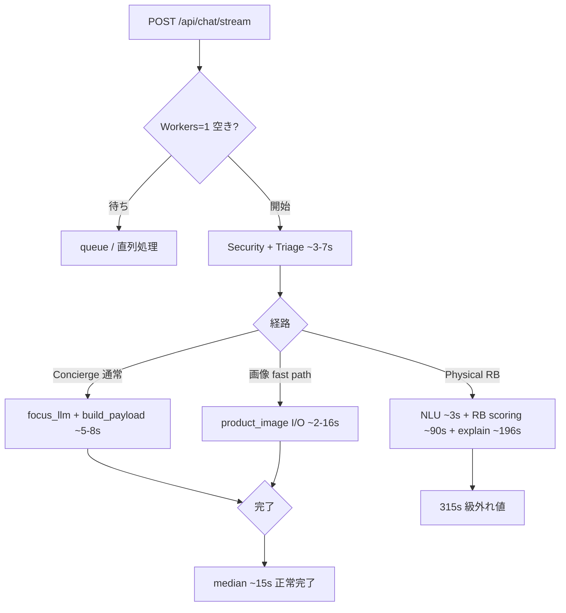

# パフォーマンス・コスト分析 — Wave A AFTER（dev: 2026-07-28 〜 2026-07-29）

## メタデータ

| 項目 | 値 |
|------|-----|
| 環境 | **dev** (`medicine-recommend-dev`) |
| 期間 | 2026-07-28 06:21 UTC 〜 2026-07-29 04:30 UTC（約 22 時間） |
| ログ件数 | 36,987 |
| パイプライン計測トレース | **23**（Web 19 / LINE 4） |
| セッション数 | 8（counseling 8 / trace-only 0） |
| LLM 呼び出し | 55 回 / 合計 **¥3.33** / 合計レイテンシ 80,610 ms |
| 主要リビジョン | `medicine-recommend-dev-00228-dsp`（32,001 / 86.5%）、`00227-tjx`（2,101） |
| 主要 commit | `e909a8c`（32,000 件） |
| Gunicorn | **Workers: 1 のみ**（`Workers: 2` は **ログ上未確認**） |

**比較ベースライン（PRE）:** `downloaded-logs-20260726-20260728-20260728-044951`（Wave A 改善前）

---

## エグゼクティブサマリ

- **🟢 体感レイテンシは大幅改善。** `POST /api/chat/stream` **p95 = 33.4 秒**（PRE: **182.5 秒**、▲82%）。中央値 **18.6 秒**（PRE: 25.4 秒）。SSE **180 秒タイムアウト 0 件**（PRE: 4 件）。尾部の「設定値張り付き」現象は本バンドルでは解消。
- **🟢 通常系パイプラインは ~15 秒帯に収束。** PIPELINE_PERF **n=23**、中央値 **14.9 秒**（PRE: 19.5 秒）、平均 **27.7 秒**（PRE: 77.8 秒）。**120 秒未満 n=22** の中央値 **14.4 秒**。Concierge / 軽量 Ask が支配的。
- **🟡 外れ値は 1 件に集約（315.6 秒）。** Physical 推奨経路で **rule-based scoring ~92 秒 + explain batch ~196 秒** が主体。LLM 呼び出し 0 回（当該 trace）— RB 後半がボトルネック。max は PRE 351.8 秒からやや改善も、**5 分超は依然として許容不可**。
- **🟡 LLM コストは微増、構造は不変。** 55 回 / ¥3.33（PRE: 48 回 / ¥2.48）。**`medicine_qa/focus_llm` が 20 回（36%）で最多**。triage stage1+2 計 18 回。大型 prompt の `concierge_agent.meta_architecture`（12k tokens 級）がセッション単価を押し上げ。
- **🔴 インフラ改善（Workers:2）は未デプロイ疑い。** gunicorn 起動ログは全件 **`Workers: 1`**。`Workers: 2` の記録なし。コード/設定変更があっても **本番 dev インスタンスには反映されていない**可能性 — 同時リクエスト耐性は PRE と同等。

---

## PRE → AFTER 比較（主要指標）

| 指標 | PRE（07-26〜28） | AFTER（07-28〜29） | 変化 |
|------|------------------|---------------------|------|
| pipeline_perf n | 14 | **23** | +9 |
| total_ms 中央値 | 19.5 s | **14.9 s** | **−23%** |
| total_ms 平均 | 77.8 s | **27.7 s** | **−64%** |
| total_ms max | 351.8 s | **315.6 s** | −10% |
| normal (&lt;120 s) n / 中央値 | — | **22 / 14.4 s** | — |
| slow (≥120 s) n | 2+（338〜351 s） | **1 / 315.6 s** | 外れ値減 |
| chat/stream 中央値 | 25.4 s | **18.6 s** | −27% |
| chat/stream **p95** | **182.5 s** | **33.4 s** | **−82%** |
| chat/stream max | 182.8 s | 121.1 s | −34% |
| SSE 180 s timeout | 4 | **0** | 解消 |
| LLM 呼び出し | 48 | 55 | +15% |
| LLM 総コスト | ¥2.48 | ¥3.33 | +34% |
| Gunicorn Workers | 1 | **1**（2 未確認） | 変化なし |

---

## 1. HTTP / SSE レイテンシ（ユーザー体感）

### POST /api/chat/stream

| 指標 | AFTER | PRE |
|------|-------|-----|
| 件数 | 18 | 17 |
| min | 0.9 s | 1.3 s |
| **median** | **18.6 s** | 25.4 s |
| avg | 23.4 s | 69.1 s |
| **p95** | **33.4 s** | **182.5 s** |
| max | 121.1 s | 182.8 s |

**解釈:** p95 が 180 秒設定から **33 秒台に離脱** — PRE で支配的だった SSE 天井打ち切りが本 period では発生していない。max 121 秒は Cloud Run / クライアント側上限内。尾部は「遅いが完了する」分布にシフト。

### SSE 180 秒タイムアウト

| period | 件数 |
|--------|------|
| PRE | 4（07-26 06:09〜06:13） |
| **AFTER** | **0** |

---

## 2. パイプライン全体（pipeline_perf.json）

### 集計（全 23 件）

| 指標 | total_ms | 備考 |
|------|----------|------|
| n | 23 | Web 19 / LINE 4 |
| min | 8.7 s | LINE |
| **median** | **14.9 s** | PRE 19.5 s から改善 |
| avg | 27.7 s | PRE 77.8 s から大幅改善（外れ値 1 件の影響残存） |
| max | **315.6 s** | sid `1785258775748832445132`（Physical RB） |

### 正常系 vs 外れ値

| 区分 | n | total_ms 中央値 | 代表 |
|------|---|-----------------|------|
| **normal (&lt;120 s)** | **22** | **14.4 s** | Concierge greeting / doc Q&A / 軽量 triage |
| **slow (≥120 s)** | **1** | 315.6 s | Physical 推奨 + RB explain batch |

### チャネル別（参考）

| チャネル | n | median | p95 | 備考 |
|--------|---|--------|-----|------|
| web | 19 | 15.1 s | 29.4 s | 外れ値 315.6 s 含む |
| line | 4 | 11.4 s | 16.2 s | reply_token 10〜32 s 級の待ちあり |

### security / triage 待ち（web 19 件）

| フェーズ | median | p95 |
|----------|--------|-----|
| security_phase_ms | 171 ms | 930 ms |
| triage_wait_after_security_ms | 1.9 ms | 281 ms |

PRE と比較し security 中央値は同等、triage 直後待ちは短い。

---

## 3. 経路別フェーズ分解

### A. 通常 Concierge（10〜17 秒）— 多数派

例: greeting 15.4 s（`1785258775748832445132` @ 02:32 UTC）

| フェーズ | 差分 ms | 内容 |
|----------|---------|------|
| セッション DB + セットアップ | ~360 + ~560 | `after_get_session_db` / `before_llm_setup` |
| セキュリティ | ~730 | `before_security` → `after_security` |
| **Triage** | ~3,300 | `before_triage` → `after_triage` |
| Safety gate 〜 medicine_qa | ~3,600 | focus_llm / gate 処理 |
| Orchestrator 〜 confidence_gate | ~1,000 | rule-based 前処理 |

**Why fast:** SSE orphan / 180 s 打ち切りがなく、マーカー間の未計測空白が短い。LLM 合計 ~5 s 前後。

### B. Concierge + doc / meta（13〜17 秒）

例: `concierge_build_payload` 2.8〜4.8 s。`concierge_agent.doc_privacy` 2.0〜4.1 s。`meta_architecture` は prompt 9.7k〜12k tokens で **¥0.30〜0.37/回**。

### C. 商品画像 fast path（10〜29 秒）

例: `1785041219977707431124` — `product_image_fast_path` **16〜16.5 秒**（計 10〜29 s）。LLM は triage + focus_llm のみ（4〜6 s）。**画像 I/O / 外部 API が残時間**。

| session | total_ms | product_image_fast_path 区間 |
|---------|----------|------------------------------|
| 同上 | 29,406 | 13,346 → 29,346（**~16 s**） |
| 同上 | 9,998 | 7,526 → 9,989（**~2.5 s**） |

### D. Physical 推奨 — 外れ値（315.6 秒）🔴

sid `1785258775748832445132` @ 2026-07-29 02:38 UTC

| フェーズ | 差分 ms | 内容 |
|----------|---------|------|
| 初期（〜orchestrator） | ~10,400 | triage / safety / medicine_qa まで **~10 s**（正常） |
| NLU batch | ~2,800 | `nlu_batch_start` → `nlu_batch_done` |
| RB missing_info | ~2,200 | |
| **RB scoring only** | **~90,000** | `rb_scoring_only_done` − `rule_based_start` |
| **RB explain batch** | **~196,000** | `rb_explain_batch_done` − `rb_scoring_only_done` |
| 以降（carousel / advice） | ~330 | ほぼ即時 |

**Why slow:** LLM ログ 0 回 — **スコアリング CPU/IO と explain バッチ生成**が 300 秒の ~92% を占有。PRE の 338 s 級 orphan（計測空白）とは異なり、**マーカーは取れているが RB 後半が異常に長い**パターン。

### E. LINE（8.7〜16.2 秒、reply 待ち別途）

- `slow_concierge_path: true` が 3/4。`reply_token_elapsed_ms` 9.7〜32.6 s。
- 1 件 `reply_fallback_push`（16.2 s pipeline、token 32.6 s）— 返信ウィンドウ逼迫。

---

## 4. LLM レイテンシ・コスト（llm_cost.json）

### 全体

| 指標 | AFTER | PRE |
|------|-------|-----|
| 呼び出し数 | **55** | 48 |
| 総コスト | **¥3.33** | ¥2.48 |
| 総レイテンシ | 80,610 ms | 73,614 ms |
| 平均/呼び出し | 1.47 s | 1.53 s |
| モデル | gpt-5.4-mini **30** / gpt-4o-mini **25** | 同傾向 |

### パス別（呼び出し数）

| path | 回数 | シェア | 備考 |
|------|------|--------|------|
| **`medicine_qa/focus_llm`** | **20** | **36%** | PRE 23 回から微減も依然トップ |
| `llm_triage.stage1` | 9 | 16% | ~1.2〜2.7 s/回 |
| `llm_triage.stage2` | 9 | 16% | stage1 とセットで **~3 s/ターン** 固定コスト |
| `concierge_agent.greeting` | 5 | 9% | |
| `concierge_agent.doc_privacy` | 4 | 7% | 2.0〜4.1 s |
| `concierge_agent.meta_architecture` | 2 | 4% | **prompt 9.7k〜12k tokens、¥0.30〜0.37** |
| その他 | 6 | 11% | chitchat, doc_changelog, meta_triage 等 |

### セッション別コスト TOP

| session_id | cost_jpy | 備考 |
|------------|----------|------|
| `1785041219977707431124` | ¥1.07 | 画像 fast path + meta_architecture |
| `1785205185643537553845` | ¥0.85 | 多ターン Concierge |
| `1785219674642419500033` | ¥0.58 | meta_architecture ¥0.30 含む |
| `1785046732651206173996` | ¥0.33 | doc_privacy 多回 |

**コスト所見:** 呼び出し数増（+7）と大型 doc/meta prompt で **+34% コスト**。focus_llm の回数削減は PRE 提案のまま有効。

---

## 5. インフラ・デプロイシグナル

| シグナル | AFTER | 重要度 | 備考 |
|----------|-------|--------|------|
| **Gunicorn Workers** | **1 のみ**（全起動ログ） | 🔴 | **`Workers: 2` 未検出** — Workers 増強 PR/設定が dev に未反映の可能性 |
| SSE 180 s timeout | 0 | 🟢 | PRE 主因が消滅 |
| HTTP 4xx/5xx | 10（すべて 404 静的） | 🟢 | chat 系エラーなし |
| ERROR ログ | 259 | 🟡 | 要別 section 調査（本稿 scope 外） |
| 主要リビジョン | 00228-dsp 86% | — | AFTER 期間の実体 |

---

## 6. なぜ遅いか — 因果の整理（AFTER）

**AFTER での優先根本原因:**

1. **Physical RB explain batch（196 s）** — 唯一の 120 s 超。スコアリング 90 s と合わせて改善最優先。
2. **`medicine_qa/focus_llm` 直列 20 回** — 通常系 10〜17 s の主因。バッチ化効果は PRE 分析と同様。
3. **Workers:1 継続** — 同時 SSE 時のキュー待ちリスクは PRE と同じ。Workers:2 デプロイ未確認は **改善の取りこぼし**。
4. **商品画像 fast path のばらつき** — 2.5〜16 s。外部依存の尾部。
5. **（解消済）SSE 180 s orphan** — 本 period ではユーザー体感の主因ではない。

---

## 7. 推奨アクション（優先順）

| 優先 | アクション | 期待効果 | 根拠 |
|------|------------|----------|------|
| **P0** | **315 s 案件の RB explain batch プロファイル**（`rb_explain_batch_done` 区間、候補数、タイムアウト） | max 315 s → 60 s 以下を目標 | 唯一の slow trace |
| **P0** | **Workers:2（または chat executor 分離）の dev デプロイ確認** — gunicorn 起動ログで `Workers: 2` を検証 | 同時リクエスト耐性 | ログはすべて Workers:1 |
| **P1** | **`medicine_qa/focus_llm` バッチ化・回数削減**（20 回 → ターンあたり 1〜2 回） | Concierge 3〜8 s 短縮 | path 別最多 |
| **P1** | **product_image_fast_path の上限・キャッシュ**（16 s 級の尾部） | p95 安定化 | 29 s trace |
| **P2** | `concierge_agent.meta_architecture` prompt 圧縮 / RAG 絞り込み | セッション ¥0.3 級を削減 | TOP コスト session |
| **P2** | triage single-call 有効化の dev A/B | ~1.5 s/ターン | stage1+2 = 18 回 |
| **P2** | RB scoring 90 s 区間の CPU/アルゴリズム計測追加 | 315 s 案件の前半ボトルネック特定 | scoring_only マーカー |

---

## 8. 品質メトリクス（参考）

`quality_metrics.json`: 8 セッション中 **6 good / 2 acceptable_with_issues**。heuristic mismatch 2（greeting_to_non_greeting）。**品質より待ち時間 — AFTER では通常系は改善、Physical 1 件が残課題。**

---

## 付録: データソース

- `sections/pipeline_perf.json` — 23 traces
- `sections/llm_cost.json` — 55 calls
- `sections/errors_http.json` — chat/stream latency
- `sections/misc_signals.json` — Gunicorn Workers
- `metadata.json`, `quality_metrics.json`

**比較 PRE:** `log/analysis/downloaded-logs-20260726-20260728-20260728-044951/draft_performance_cost.md`

---

*Draft generated for Wave A AFTER — log bundle `downloaded-logs-20260728-20260729-20260729-043016`. 個別セッションの会話内容評価は本稿の scope 外。*
